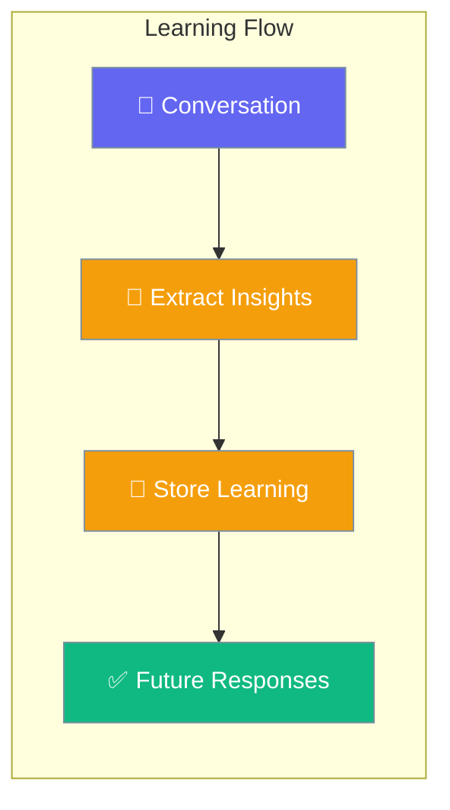
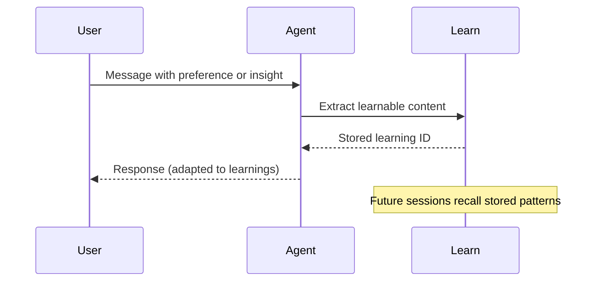
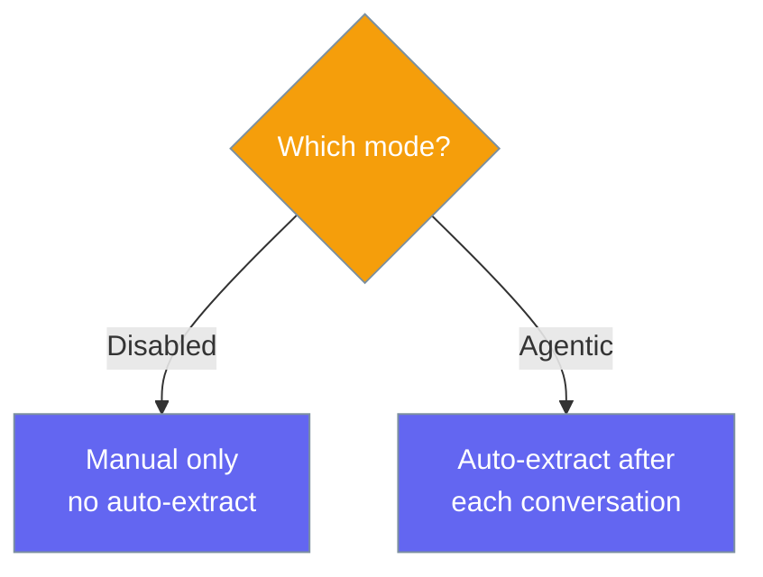

Learn lets agents extract and remember insights from each conversation, so they get smarter over time without retraining.

```python
from praisonaiagents import Agent

agent = Agent(
    name="Assistant",
    instructions="You are a helpful personal assistant.",
    learn=True,
)

agent.start("I prefer concise bullet-point summaries, not long paragraphs.")
```



## Quick Start

<Steps>
<Step title="Simple Usage">
```python
from praisonaiagents import Agent

agent = Agent(instructions="You are a helpful assistant.", learn=True)
agent.start("Remember that I always want answers under 3 sentences.")
```
</Step>

<Step title="With Configuration">
```python
from praisonaiagents import Agent, LearnConfig

agent = Agent(
    instructions="You are a helpful assistant.",
    learn=LearnConfig(
        persona=True,
        insights=True,
        patterns=True,
        mode="agentic",
    ),
)
agent.start("I work in finance and need data-focused answers.")
```
</Step>

<Step title="With Database Backend">
```python
from praisonaiagents import Agent, LearnConfig

agent = Agent(
    instructions="You are a helpful assistant.",
    learn=LearnConfig(
        backend="sqlite",
        db_url="sqlite:///learn.db",
        mode="agentic",
    ),
)
agent.start("My team prefers Python over JavaScript for all scripts.")
```
</Step>
</Steps>

---

## How It Works



| Phase | What happens |
|---|---|
| 1. Conversation | User interacts with the agent normally |
| 2. Extract | Agent identifies persona, insights, and patterns |
| 3. Store | Learnings saved to the configured backend |
| 4. Apply | Future responses adapt based on stored learnings |

---

## Learning Modes



<Note>
`mode="propose"` is defined in the SDK but not yet implemented — it behaves the same as `disabled` until the approval workflow is added. Do not use it in production.
</Note>

---

## Configuration Options

<Card icon="code" href="/docs/sdk/reference/python/LearnConfig">
  Full list of options, types, and defaults — `LearnConfig`
</Card>

| Option | Type | Default | Description |
|---|---|---|---|
| `persona` | `bool` | `True` | Capture user preferences and profile |
| `insights` | `bool` | `True` | Store observations and learnings |
| `thread` | `bool` | `True` | Track session/conversation context |
| `patterns` | `bool` | `False` | Reusable knowledge patterns |
| `decisions` | `bool` | `False` | Decision logging |
| `feedback` | `bool` | `False` | Outcome signals |
| `improvements` | `bool` | `False` | Self-improvement proposals |
| `mode` | `str` | `"disabled"` | `"disabled"` or `"agentic"` |
| `scope` | `str` | `"private"` | `"private"` or `"shared"` |
| `backend` | `str` | `"file"` | `"file"`, `"sqlite"`, `"redis"`, `"mongodb"` |
| `db_url` | `str \| None` | `None` | Database connection URL |
| `store_path` | `str \| None` | `None` | Custom file storage path |
| `max_entries` | `int` | `0` | Per-store cap (0 = unbounded) |
| `retention_days` | `int` | `0` | Archive stale entries after N days (0 = never) |
| `llm` | `str \| None` | `None` | LLM for extracting learnings |
| `nudge_interval` | `int` | `0` | Nudge every N turns (0 = disabled) |

---

## Common Patterns

### Pattern 1 — Persona learning for personalized responses
```python
from praisonaiagents import Agent, LearnConfig

agent = Agent(
    instructions="You are a writing assistant.",
    learn=LearnConfig(persona=True, insights=True, mode="agentic"),
)
response = agent.start("I prefer formal British English in all my documents.")
print(response)
```

### Pattern 2 — Shared patterns across agents
```python
from praisonaiagents import Agent, LearnConfig

agent = Agent(
    instructions="You are a team knowledge assistant.",
    learn=LearnConfig(
        patterns=True,
        scope="shared",
        backend="sqlite",
        db_url="sqlite:///team.db",
    ),
)
agent.start("Our team always uses PEP 8 for Python code style.")
```

---

## Best Practices

<AccordionGroup>
<Accordion title="Start with defaults">
`learn=True` enables persona, insights, and thread tracking — the most useful learnings for most agents. Add patterns and decisions only when you need cross-session knowledge reuse.
</Accordion>

<Accordion title="Use agentic mode for hands-off learning">
Set `mode="agentic"` to have the agent automatically extract and store learnings after each conversation without any extra code. This is the recommended approach for production agents.
</Accordion>

<Accordion title="Choose the right backend">
Use `backend="file"` (default) for single-agent prototypes. Switch to `backend="sqlite"` for persistent single-server deployments, or `backend="redis"` for multi-instance setups.
</Accordion>

<Accordion title="Scope private vs shared">
Keep `scope="private"` (default) when learnings are user-specific. Set `scope="shared"` only when you want all agents in your system to benefit from the same learned knowledge.
</Accordion>
</AccordionGroup>

---

## Related

<CardGroup cols={2}>
<Card icon="brain" href="/docs/features/memory">
  Memory — session and conversation memory management
</Card>
<Card icon="puzzle-piece" href="/docs/features/skills">
  Skills — extend agents with reusable capability modules
</Card>
</CardGroup>
