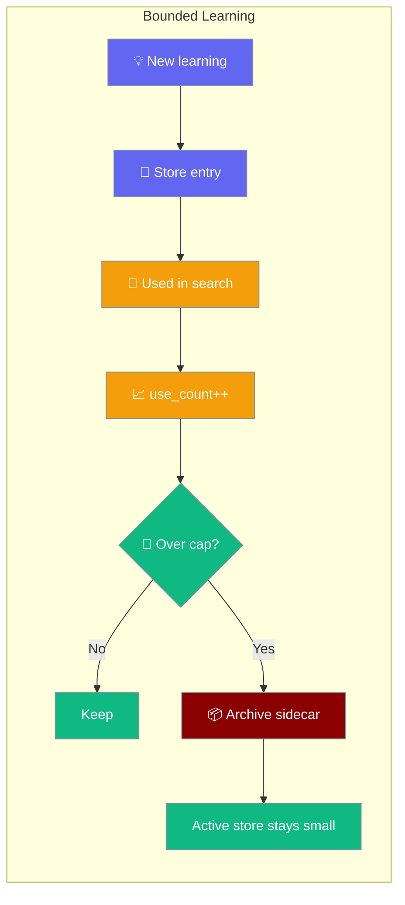

Keep continuous-learning stores healthy by capping size and expiring stale entries — automatically, without any LLM judgement.

```python
from praisonaiagents import Agent, LearnConfig

agent = Agent(
    name="Assistant",
    instructions="Adapts without unbounded memory growth",
    learn=LearnConfig(persona=True, max_entries=1000, retention_days=90),
)
agent.start("Remember I prefer bullet points")
```

The user keeps teaching the agent; old or excess learnings archive automatically so search stays fast.



## Quick Start

<Steps>
<Step title="Enable with a cap">

Set `max_entries` to limit how many learnings each store retains:

```python
from praisonaiagents import Agent, LearnConfig

agent = Agent(
    name="Assistant",
    instructions="Adapts to user preferences",
    learn=LearnConfig(
        persona=True,
        max_entries=1000,    # Keep at most 1000 entries per store
        retention_days=90,   # Mark entries older than 90 days as stale
    ),
)

agent.start("Help me plan my day")
```

</Step>

<Step title="Run a manual prune">

Call `prune()` on the learn manager for one-off cleanup:

```python
from praisonaiagents import Agent, LearnConfig

agent = Agent(
    learn=LearnConfig(max_entries=1000, retention_days=90)
)

# Returns evicted count per store
evicted = agent.memory.learn().prune()
print(f"Pruned: {evicted}")
# e.g. {"persona": 12, "insights": 3}
```

</Step>
</Steps>

---

## How It Works

Usage telemetry is observed automatically — every `search()` and `list_all()` call increments `use_count` and updates `last_used` on returned entries. No extra configuration needed.

| What triggers pruning | When |
|-----------------------|------|
| On write | Every time an entry is added when `max_entries > 0` and the cap is exceeded |
| On `prune()` call | Manually, for one-off cleanup of a long-running agent |
| Time-based | Entries older than `retention_days` with no recent use are eligible |

**Eviction scoring:** entries are ranked by `use_count` ascending, then `created_at` ascending. The least-used, oldest entries are evicted first — the most valuable, recently accessed learnings always survive.

**Archival:** evicted entries are appended to a per-store `.archive.json` sidecar (e.g., `persona.archive.json`) in the same directory as the active store file. The archive is append-only JSON — nothing is permanently hard-deleted.

---

## Configuration Options

Full reference on `max_entries` and `retention_days` is in the [LearnConfig reference](/docs/configuration/learn-config).

```python
from praisonaiagents import LearnConfig

LearnConfig(
    max_entries=0,      # 0 = unbounded (default)
    retention_days=0,   # 0 = never expires (default)
)
```

<Note>
Both fields default to `0` (unbounded). Existing agents are completely unaffected unless you opt in by setting a non-zero value.
</Note>

---

## Best Practices

<AccordionGroup>
<Accordion title="Most users: leave the defaults">
If your agent runs for short sessions or handles a limited number of users, the defaults (`max_entries=0`, `retention_days=0`) are fine. Stores only grow with real interactions and stay small naturally.
</Accordion>

<Accordion title="Long-running gateway agents: cap the stores">
Agents that run 24/7 and talk to many users can accumulate thousands of entries over time. Set `max_entries=1000` to keep store files small and keep search fast. Pruning runs automatically on every write — no cron job needed.

```python
learn=LearnConfig(
    persona=True,
    insights=True,
    max_entries=1000,
)
```
</Accordion>

<Accordion title="Compliance requirements: use retention_days">
For data minimization requirements (GDPR, SOC 2, etc.), set `retention_days` to make stale entries eligible for pruning. Pair with `max_entries` so pruning triggers automatically on write rather than requiring a manual call.

```python
learn=LearnConfig(
    persona=True,
    max_entries=500,
    retention_days=30,  # 30-day data retention policy
)
```
</Accordion>

<Accordion title="Restoring from the archive sidecar">
Evicted entries are never permanently deleted. The `.archive.json` sidecar (same directory as the store file) is an append-only JSON array. Open it to audit or restore evicted entries.

Archive file location example:
```
~/.praison/learn/private/default/persona.archive.json
```
</Accordion>
</AccordionGroup>

---

## Related

<CardGroup cols={2}>
<Card title="LearnConfig reference" icon="graduation-cap" href="/docs/configuration/learn-config">
  Full configuration options for continuous learning
</Card>
<Card title="Checkpoints" icon="flag" href="/docs/features/checkpoints">
  Save and restore agent state across runs
</Card>
</CardGroup>
