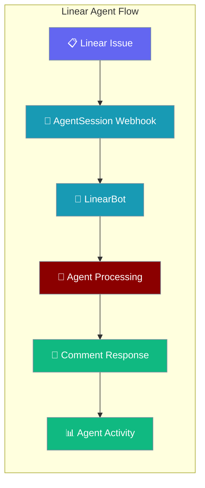
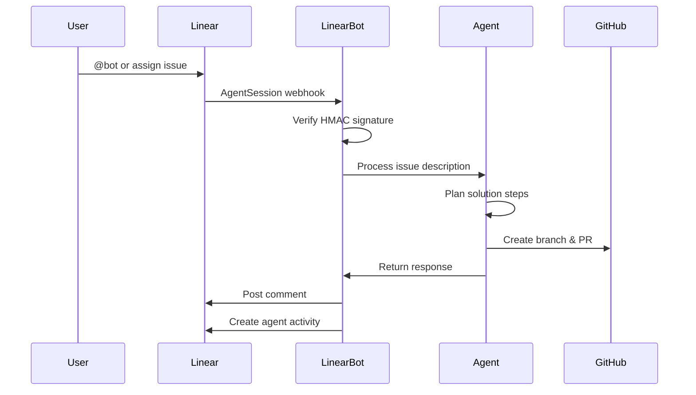

Connect your AI agent to Linear so it acts on issue mentions and assignments — replying with comments, updating issues, and emitting agent activities.



## Quick Start

<Tabs>
<Tab title="CLI">
<Steps>
<Step title="Set Environment Variables">
```bash
export LINEAR_OAUTH_TOKEN="your-linear-oauth-token"
export LINEAR_WEBHOOK_SECRET="your-webhook-secret"
```
</Step>

<Step title="Start Linear Bot">
```bash
praisonai bot linear --token $LINEAR_OAUTH_TOKEN --signing-secret $LINEAR_WEBHOOK_SECRET
```
</Step>

<Step title="Configure Linear Webhook">
Configure your Linear webhook to point to `http://your-host:8080/webhook` with `AgentSession`, `Comment`, and `Issue` events enabled.
</Step>
</Steps>
</Tab>

<Tab title="YAML">
<Steps>
<Step title="Create Bot Configuration">
```yaml
# linear-bot.yaml
platform: linear
token: ${LINEAR_OAUTH_TOKEN}
signing_secret: ${LINEAR_WEBHOOK_SECRET}
webhook_port: 8080

agent:
  name: "PraisonAI Coder"
  instructions: |
    You are an autonomous coding agent integrated with Linear.
    
    When you are mentioned or assigned an issue:
    1. Analyze the issue description and requirements
    2. Break down complex tasks into smaller steps
    3. Use available tools to implement solutions
    4. Update the issue with progress comments
    5. Create GitHub pull requests when code changes are needed
  llm: gpt-4o-mini
  tools:
    - linear_search_issues
    - linear_get_issue
    - linear_add_comment
    - linear_update_issue
    - linear_list_teams
    - linear_list_issue_states
    - github_create_branch
    - github_commit_and_push
    - github_create_pull_request
    - read_file
    - write_file
  memory: true
  auto_approve_tools: true
```
</Step>

<Step title="Start from Configuration">
```bash
praisonai bot start --config linear-bot.yaml
```
</Step>
</Steps>
</Tab>

<Tab title="Python SDK">
<Steps>
<Step title="Create Agent with Linear Tools">
```python
from praisonaiagents import Agent
from praisonai.bots import LinearBot

agent = Agent(
    name="PraisonAI Coder",
    instructions="""
    You are an autonomous coding agent integrated with Linear.
    
    When you are mentioned or assigned an issue:
    1. Analyze the issue description and requirements
    2. Break down complex tasks into smaller steps
    3. Use available tools to implement solutions
    4. Update the issue with progress comments
    5. Create GitHub pull requests when code changes are needed
    """,
    llm="gpt-4o-mini",
    tools=[
        "linear_search_issues",
        "linear_get_issue", 
        "linear_add_comment",
        "linear_update_issue",
        "linear_list_teams",
        "linear_list_issue_states",
        "github_create_branch",
        "github_commit_and_push",
        "read_file",
        "write_file"
    ],
    memory=True,
    auto_approve_tools=True,
)
```
</Step>

<Step title="Start Linear Bot">
```python
import asyncio

bot = LinearBot(
    token="your-linear-oauth-token",
    signing_secret="your-webhook-secret", 
    agent=agent,
    webhook_port=8080,
)

async def main():
    await bot.start()

asyncio.run(main())
```
</Step>
</Steps>
</Tab>
</Tabs>

---

## Linear Setup

<Steps>
<Step title="Create OAuth App or API Key">
In Linear, go to Settings → API → Create OAuth App or Personal API Key. OAuth tokens require `Bearer` prefix; API keys are sent raw.
</Step>

<Step title="Configure Webhook">
Set up a webhook pointing to `https://your-host:8080/webhook` with these events:
- **AgentSession** (for mentions/assignments)
- **Comment** (for comment threads) 
- **Issue** (for issue updates)
</Step>

<Step title="Copy Signing Secret">
Save the webhook signing secret for HMAC-SHA256 verification and 60-second replay protection.
</Step>
</Steps>

---

## How It Works



| Step | Description |
|------|-------------|
| **Webhook Reception** | Linear sends AgentSession webhook when bot is mentioned or assigned |
| **Signature Verification** | HMAC-SHA256 signature check with 60-second timestamp validation |
| **Issue Processing** | Agent analyzes issue title, description, and requirements |
| **Tool Execution** | Agent uses Linear and GitHub tools to implement solutions |
| **Response Delivery** | Bot posts comments back to Linear with progress updates |

---

## User Interaction Flow

Alice assigns issue ENG-42 "Add user authentication to API" to the bot. The bot:

1. **Receives webhook** → AgentSession event triggers the bot
2. **Analyzes issue** → Reads title, description, and acceptance criteria  
3. **Plans implementation** → Breaks down into authentication middleware, tests, docs
4. **Posts status comment** → "Working on authentication implementation..."
5. **Executes solution** → Creates GitHub branch, writes code, adds tests
6. **Updates Linear** → Comments with PR link and implementation summary
7. **Creates activity** → Records bot response in Linear's agent activity log

---

## OAuth vs API Key Authentication

| Auth Type | Header Format | Use Case |
|-----------|---------------|----------|
| **OAuth Token** | `Authorization: Bearer <token>` | Team integrations, shared bots |
| **Personal API Key** | `Authorization: <key>` (raw) | Individual developer bots |

<Note>
OAuth tokens take precedence. If `LINEAR_OAUTH_TOKEN` is set, `LINEAR_API_KEY` is ignored.
</Note>

---

## Configuration Options

| Option | Type | Default | Description |
|--------|------|---------|-------------|
| `token` | `str` | `""` | Linear OAuth token or API key |
| `agent` | `Agent` | `None` | Agent instance to handle messages |
| `config` | `BotConfig` | Auto-created | Bot configuration object |
| `signing_secret` | `str` | `""` | Webhook HMAC verification secret |
| `webhook_port` | `int` | `8080` | Port for webhook HTTP server |
| `webhook_path` | `str` | `"/webhook"` | Path for webhook endpoint |

For complete bot configuration options, see the [messaging bots documentation](/docs/features/messaging-bots).

---

## Built-in Commands

The Linear bot includes these slash commands:

| Command | Description |
|---------|-------------|
| `/status` | Show bot status, uptime, and Linear connection info |
| `/new` | Reset conversation session and start fresh |
| `/help` | Display available commands and bot capabilities |

---

## Webhook Security

<Warning>
Always set `LINEAR_WEBHOOK_SECRET` for production deployments. Missing secrets cause inbound webhooks to be **rejected with HTTP 401** (fail-closed). Set `PRAISONAI_INSECURE_WEBHOOKS=true` only for local development.
</Warning>

The bot implements Linear's recommended security measures:
- **HMAC-SHA256 signature verification** using webhook secret via the [shared verifier](/docs/features/webhook-verification)
- **60-second replay protection** via timestamp validation
- **HTTPS enforcement** recommended for production webhooks

---

## Linear Tools

The following Linear tools work with the bot for comprehensive issue management:

| Tool | Description |
|------|-------------|
| `linear_search_issues` | Search Linear issues by text, status, or team |
| `linear_get_issue` | Get detailed issue information by ID |
| `linear_add_comment` | Add comments to Linear issues |
| `linear_update_issue` | Update issue status, assignee, or properties |
| `linear_list_teams` | List all teams in the Linear workspace |
| `linear_list_issue_states` | Get available issue states for workflow |

<Tip>
See the complete [Linear tools documentation](/docs/tools/external/linear) for detailed usage examples.
</Tip>

---

## Common Patterns

<AccordionGroup>
<Accordion title="Read-Only Triage Bot">
Perfect for issue categorization and initial analysis without modifications:

```python
agent = Agent(
    name="Triage Assistant",
    instructions="Analyze incoming issues and provide initial categorization",
    tools=["linear_search_issues", "linear_add_comment"],
    auto_approve_tools=True
)
```
</Accordion>

<Accordion title="Full Coder Bot with GitHub Integration">
Complete development workflow from Linear issues to GitHub pull requests:

```python
agent = Agent(
    name="PraisonAI Coder", 
    instructions="Implement solutions for Linear issues",
    tools=[
        "linear_search_issues", "linear_get_issue", "linear_add_comment",
        "linear_update_issue", "github_create_branch", "github_commit_and_push",
        "github_create_pull_request", "read_file", "write_file", "execute_command"
    ],
    memory=True,
    web_search=True
)
```
</Accordion>

<Accordion title="Gateway Multi-Bot Setup">
YAML configuration for gateway deployment:

```yaml
platform: linear
channels:
  - name: "engineering"
    token: ${LINEAR_ENG_TOKEN}
    signing_secret: ${LINEAR_ENG_SECRET}
  - name: "design" 
    token: ${LINEAR_DESIGN_TOKEN}
    signing_secret: ${LINEAR_DESIGN_SECRET}
```
</Accordion>
</AccordionGroup>

---

## Best Practices

<AccordionGroup>
<Accordion title="Always Configure Webhook Secrets">
Set `LINEAR_WEBHOOK_SECRET` to the signing secret from your Linear webhook settings. Without it, **all webhooks are rejected with HTTP 401** (fail-closed). For local dev only, use `PRAISONAI_INSECURE_WEBHOOKS=true` as a temporary bypass. See [Webhook Verification](/docs/features/webhook-verification) for details.
</Accordion>

<Accordion title="Scope OAuth Tokens Appropriately">
Grant minimum required permissions. For read-only bots, use tokens with limited scopes. For coding bots, ensure write access to issues and comments.
</Accordion>

<Accordion title="Use HTTPS in Production">
Deploy webhook endpoints behind HTTPS reverse proxies. Never expose HTTP webhook endpoints to the internet.
</Accordion>

<Accordion title="Rotate Secrets Regularly">
Implement secret rotation for both OAuth tokens and webhook secrets. Update Linear webhook configurations when rotating.
</Accordion>
</AccordionGroup>

---

## Related

<CardGroup cols={2}>
<Card title="Messaging Bots" icon="comments" href="/docs/features/messaging-bots">
  Platform support and bot protocols
</Card>
<Card title="Webhook Verification" icon="shield-check" href="/docs/features/webhook-verification">
  Fail-closed HMAC signature verification
</Card>
<Card title="Linear Tools" icon="wrench" href="/docs/tools/external/linear">
  Complete Linear API tool reference
</Card>
<Card title="CLI Bot Command" icon="terminal" href="/docs/cli/bot">
  Command-line bot management
</Card>
</CardGroup>