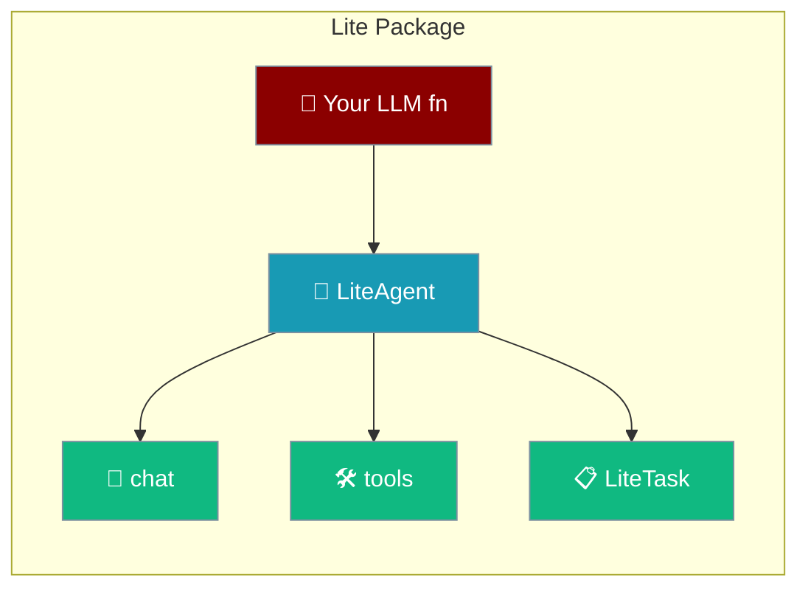
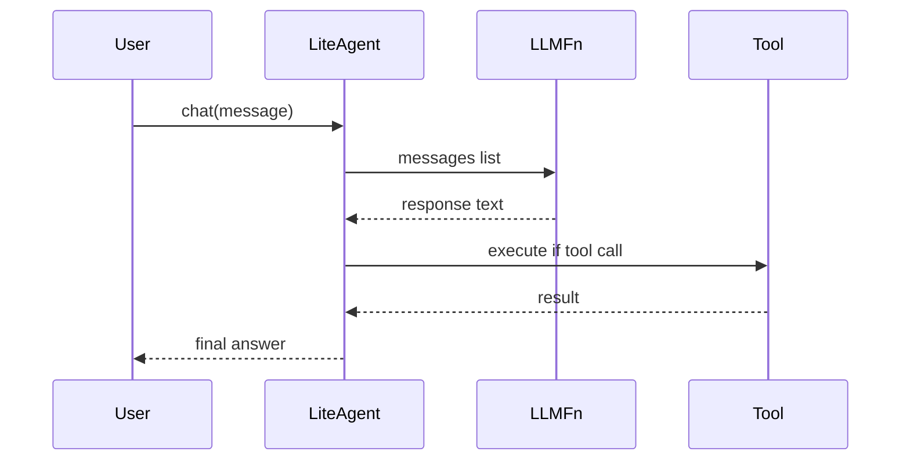

The `praisonaiagents.lite` subpackage provides a minimal agent framework that lets you bring your own LLM client. It has no dependency on `litellm` and uses minimal memory.

## Quick Start

<Steps>
<Step title="Install and create a LiteAgent">
```bash
pip install praisonaiagents>=0.5.0
```

```python
from praisonaiagents.lite import LiteAgent, create_openai_llm_fn

llm_fn = create_openai_llm_fn(model="gpt-4o-mini")
agent = LiteAgent(
    name="MyAgent",
    llm_fn=llm_fn,
    instructions="You are a helpful assistant."
)
```
</Step>

<Step title="Chat and use tools">
```python
response = agent.chat("Hello!")
print(response)

print(agent.chat_history)
agent.clear_history()
```
</Step>
</Steps>

---

## How It Works



## Components

### LiteAgent

The main agent class with thread-safe chat history:

```python
from praisonaiagents.lite import LiteAgent

agent = LiteAgent(
    name="MyAgent",
    llm_fn=my_llm_function,
    instructions="System instructions",
    tools=[my_tool]  # Optional tools
)

# Chat
response = agent.chat("Hello")

# Access chat history (thread-safe)
print(agent.chat_history)

# Clear history
agent.clear_history()
```

### Custom LLM Functions

Bring your own LLM by providing a function that takes messages and returns a string:

```python
def my_custom_llm(messages):
    """
    Args:
        messages: List of dicts with 'role' and 'content'
    Returns:
        str: The assistant's response
    """
    # Your LLM implementation here
    return "Response from my LLM"

agent = LiteAgent(name="Agent", llm_fn=my_custom_llm)
```

### Built-in LLM Adapters

#### OpenAI Adapter

```python
from praisonaiagents.lite import create_openai_llm_fn

# Requires OPENAI_API_KEY environment variable
llm_fn = create_openai_llm_fn(
    model="gpt-4o-mini",
    temperature=0.7,
    max_tokens=1000
)
```

#### Anthropic Adapter

```python
from praisonaiagents.lite import create_anthropic_llm_fn

# Requires ANTHROPIC_API_KEY environment variable
llm_fn = create_anthropic_llm_fn(
    model="claude-3-5-sonnet-20241022",
    max_tokens=1000
)
```

### Tools

Define tools using the `@tool` decorator:

```python
from praisonaiagents.lite import LiteAgent, tool

@tool
def add_numbers(a: int, b: int) -> int:
    """Add two numbers together."""
    return a + b

@tool
def get_weather(city: str) -> str:
    """Get the weather for a city."""
    return f"Weather in {city}: Sunny, 72°F"

agent = LiteAgent(
    name="ToolAgent",
    llm_fn=llm_fn,
    tools=[add_numbers, get_weather]
)

# Execute tools directly
result = agent.execute_tool("add_numbers", a=5, b=3)
print(result.output)  # 8
print(result.success)  # True
```

### LiteTask

For structured task execution:

```python
from praisonaiagents.lite import LiteAgent, LiteTask

agent = LiteAgent(name="Worker", llm_fn=llm_fn)

task = LiteTask(
    description="Summarize the following text",
    agent=agent,
    expected_output="A brief summary"
)

result = task.execute(context="Long text to summarize...")
print(result)
```

## Thread Safety

LiteAgent uses locks for thread-safe operations:

```python
import threading
from praisonaiagents.lite import LiteAgent

agent = LiteAgent(name="ThreadSafe", llm_fn=llm_fn)

def worker(prompt):
    response = agent.chat(prompt)
    print(f"Response: {response}")

# Safe to use from multiple threads
threads = [
    threading.Thread(target=worker, args=(f"Question {i}",))
    for i in range(5)
]

for t in threads:
    t.start()
for t in threads:
    t.join()
```

## Memory Efficiency

The lite package uses significantly less memory than the full package:

| Package | Memory Usage |
|---------|--------------|
| praisonaiagents (full) | ~93MB |
| praisonaiagents.lite | ~5MB |

## When to Use Lite

| Situation | Use |
|-----------|-----|
| Own LLM client, minimal deps, memory-critical | Lite package |
| Multi-provider, memory, knowledge, advanced features | Full package |

---

## Best Practices

<AccordionGroup>
<Accordion title="Provide a typed LLM function">
Your `llm_fn` must accept `messages: list[dict]` and return `str`. Use the built-in adapters when possible.
</Accordion>

<Accordion title="Use @tool decorator for tools">
```python
from praisonaiagents.lite import tool

@tool
def add(a: int, b: int) -> int:
    """Add two numbers."""
    return a + b
```
</Accordion>

<Accordion title="Call clear_history() between sessions">
The lite agent keeps chat history in memory. Call `clear_history()` between independent conversations to prevent context bleed.
</Accordion>

<Accordion title="Use LiteTask for structured execution">
`LiteTask` wraps an agent with a description and expected output, making it easy to compose multi-step pipelines without the full `Agents` framework.
</Accordion>
</AccordionGroup>

---

## Related

<CardGroup cols={2}>
<Card title="Lazy Imports" icon="bolt" href="/features/lazy-imports">
  How praisonaiagents achieves 18ms import time
</Card>
<Card title="Performance Benchmarks" icon="gauge-high" href="/features/performance-benchmarks">
  Benchmark scripts and CI integration
</Card>
</CardGroup>
