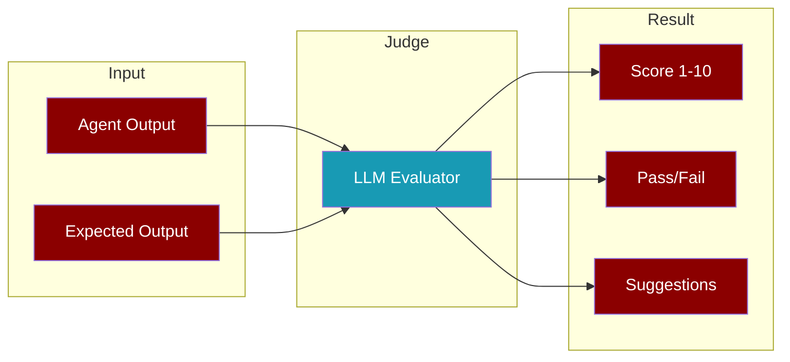

Use an LLM to evaluate and score agent outputs for accuracy, quality, and custom criteria.



<CardGroup cols={2}>
  <Card title="Accuracy Mode" icon="bullseye">
    Compare output against expected result
  </Card>
  <Card title="Criteria Mode" icon="list-check">
    Evaluate against custom criteria
  </Card>
  <Card title="Recipe Mode" icon="utensils">
    Evaluate workflow execution traces
  </Card>
  <Card title="Extensible" icon="puzzle-piece">
    Register custom judge types
  </Card>
</CardGroup>

## Quick Start

<Tabs>
  <Tab title="Python">
```python
from praisonaiagents.eval import Judge

# Simple accuracy check
result = Judge().run(output="4", expected="4", input="What is 2+2?")
print(f"Score: {result.score}/10, Passed: {result.passed}")
```
  </Tab>
  <Tab title="TypeScript">
```typescript
import { Judge } from 'praisonai';

// Simple accuracy check
const result = await new Judge().run({
  output: "4",
  expected: "4", 
  input: "What is 2+2?"
});
console.log(`Score: ${result.score}/10, Passed: ${result.passed}`);
```
  </Tab>
  <Tab title="CLI">
```bash
# Judge with expected output
praisonai eval judge --input "The answer is 4" --expected "4"

# Judge with criteria
praisonai eval judge --input "Hello, how can I help?" --criteria "Response is helpful"
```
  </Tab>
</Tabs>

## Evaluation Modes

### Accuracy Evaluation

Compare agent output against an expected result:

<Tabs>
  <Tab title="Python">
```python
from praisonaiagents.eval import Judge

judge = Judge()
result = judge.run(
    output="Python is a high-level programming language",
    expected="Python is a programming language",
    input="What is Python?"
)

print(f"Score: {result.score}/10")
print(f"Reasoning: {result.reasoning}")
```
  </Tab>
  <Tab title="TypeScript">
```typescript
import { Judge } from 'praisonai';

const judge = new Judge();
const result = await judge.run({
  output: "Python is a high-level programming language",
  expected: "Python is a programming language",
  input: "What is Python?"
});

console.log(`Score: ${result.score}/10`);
console.log(`Reasoning: ${result.reasoning}`);
```
  </Tab>
</Tabs>

### Criteria Evaluation

Evaluate output against custom criteria:

<Tabs>
  <Tab title="Python">
```python
from praisonaiagents.eval import Judge

judge = Judge(criteria="Response is helpful, accurate, and concise")
result = judge.run(output="Hello! I'm here to help you with any questions.")

if result.passed:
    print("✅ Output meets criteria")
else:
    print("❌ Output needs improvement")
    for suggestion in result.suggestions:
        print(f"  • {suggestion}")
```
  </Tab>
  <Tab title="TypeScript">
```typescript
import { Judge } from 'praisonai';

const judge = new Judge({ 
  criteria: "Response is helpful, accurate, and concise" 
});
const result = await judge.run({
  output: "Hello! I'm here to help you with any questions."
});

if (result.passed) {
  console.log("✅ Output meets criteria");
} else {
  console.log("❌ Output needs improvement");
  result.suggestions.forEach(s => console.log(`  • ${s}`));
}
```
  </Tab>
</Tabs>

### Recipe/Workflow Evaluation

Evaluate multi-agent workflow execution:

<Tabs>
  <Tab title="Python">
```python
from praisonaiagents.eval import RecipeJudge

judge = RecipeJudge(mode="context")  # or "memory", "knowledge"
result = judge.run(
    output="Final workflow output...",
    expected="Complete analysis with citations"
)
```
  </Tab>
  <Tab title="TypeScript">
```typescript
import { RecipeJudge } from 'praisonai';

const judge = new RecipeJudge({ mode: "context" });
const result = await judge.run({
  output: "Final workflow output...",
  expected: "Complete analysis with citations"
});
```
  </Tab>
</Tabs>

## Configuration

### JudgeConfig

<ParamField path="model" type="string" default="gpt-4o-mini">
  LLM model to use for evaluation
</ParamField>

<ParamField path="temperature" type="number" default="0.1">
  Temperature for consistent scoring (lower = more consistent)
</ParamField>

<ParamField path="maxTokens" type="number" default="500">
  Maximum tokens for LLM response
</ParamField>

<ParamField path="threshold" type="number" default="7.0">
  Score threshold for passing (1-10 scale)
</ParamField>

<ParamField path="criteria" type="string">
  Custom evaluation criteria
</ParamField>

<Tabs>
  <Tab title="Python">
```python
from praisonaiagents.eval import Judge, JudgeConfig

config = JudgeConfig(
    model="gpt-4o",
    temperature=0.0,
    threshold=8.0,
    criteria="Response must be technically accurate"
)

judge = Judge(config=config)
```
  </Tab>
  <Tab title="TypeScript">
```typescript
import { Judge, JudgeConfig } from 'praisonai';

const config: JudgeConfig = {
  model: "gpt-4o",
  temperature: 0.0,
  threshold: 8.0,
  criteria: "Response must be technically accurate"
};

const judge = new Judge({ config });
```
  </Tab>
</Tabs>

## JudgeResult

The result object contains:

| Field | Type | Description |
|-------|------|-------------|
| `score` | number | Quality score (1-10) |
| `passed` | boolean | Whether score >= threshold |
| `reasoning` | string | Explanation for the score |
| `output` | string | The judged output |
| `expected` | string? | Expected output (if provided) |
| `criteria` | string? | Criteria used (if provided) |
| `suggestions` | string[] | Improvement suggestions |
| `timestamp` | number | When evaluation occurred |

## Judge with Agent

Evaluate an agent's response directly:

<Tabs>
  <Tab title="Python">
```python
from praisonaiagents import Agent
from praisonaiagents.eval import Judge

agent = Agent(
    name="Math Helper",
    instructions="You solve math problems"
)

judge = Judge()
result = judge.run(
    agent=agent,
    input="What is 15 * 7?",
    expected="105"
)

print(f"Agent scored: {result.score}/10")
```
  </Tab>
  <Tab title="TypeScript">
```typescript
import { Agent, Judge } from 'praisonai';

const agent = new Agent({
  name: "Math Helper",
  instructions: "You solve math problems"
});

const judge = new Judge();
const result = await judge.run({
  agent,
  input: "What is 15 * 7?",
  expected: "105"
});

console.log(`Agent scored: ${result.score}/10`);
```
  </Tab>
</Tabs>

## Custom Judges

### Register Custom Judge

<Tabs>
  <Tab title="Python">
```python
from praisonaiagents.eval import Judge, add_judge, get_judge, list_judges

class CodeQualityJudge(Judge):
    """Judge for evaluating code quality."""
    
    def __init__(self, **kwargs):
        super().__init__(
            criteria="Code is clean, efficient, and well-documented",
            **kwargs
        )

# Register
add_judge("code_quality", CodeQualityJudge)

# Use
JudgeClass = get_judge("code_quality")
judge = JudgeClass()

# List all judges
print(list_judges())  # ['accuracy', 'criteria', 'recipe', 'code_quality']
```
  </Tab>
  <Tab title="TypeScript">
```typescript
import { Judge, addJudge, getJudge, listJudges } from 'praisonai';

class CodeQualityJudge extends Judge {
  constructor(options = {}) {
    super({
      ...options,
      criteria: "Code is clean, efficient, and well-documented"
    });
  }
}

// Register
addJudge("code_quality", CodeQualityJudge);

// Use
const JudgeClass = getJudge("code_quality");
const judge = new JudgeClass();

// List all judges
console.log(listJudges()); // ['accuracy', 'criteria', 'recipe', 'code_quality']
```
  </Tab>
</Tabs>

## Domain-Agnostic Evaluation

Use `JudgeCriteriaConfig` for any domain:

<Tabs>
  <Tab title="Python">
```python
from praisonaiagents.eval import Judge, JudgeCriteriaConfig

# Water flow optimization
config = JudgeCriteriaConfig(
    name="water_flow",
    description="Evaluate water flow optimization",
    prompt_template="""Evaluate the water flow configuration:
{output}

Score based on:
- Flow rate efficiency
- Pressure optimization  
- Resource conservation

SCORE: [1-10]
REASONING: [explanation]
SUGGESTIONS: [improvements]""",
    scoring_dimensions=["flow_rate", "pressure", "efficiency"],
    threshold=7.0
)

judge = Judge(criteria_config=config)
result = judge.run(output="Flow rate: 50L/min, Pressure: 2.5 bar")
```
  </Tab>
  <Tab title="TypeScript">
```typescript
import { Judge, JudgeCriteriaConfig } from 'praisonai';

const config: JudgeCriteriaConfig = {
  name: "water_flow",
  description: "Evaluate water flow optimization",
  promptTemplate: `Evaluate the water flow configuration:
{output}

Score based on:
- Flow rate efficiency
- Pressure optimization
- Resource conservation

SCORE: [1-10]
REASONING: [explanation]
SUGGESTIONS: [improvements]`,
  scoringDimensions: ["flow_rate", "pressure", "efficiency"],
  threshold: 7.0
};

const judge = new Judge({ criteriaConfig: config });
const result = await judge.run({ 
  output: "Flow rate: 50L/min, Pressure: 2.5 bar" 
});
```
  </Tab>
</Tabs>

## Async Evaluation

<Tabs>
  <Tab title="Python">
```python
import asyncio
from praisonaiagents.eval import Judge

async def evaluate_outputs():
    judge = Judge(criteria="Response is helpful")
    
    outputs = [
        "Hello! How can I help?",
        "I don't know.",
        "Let me help you with that!"
    ]
    
    results = await asyncio.gather(*[
        judge.run_async(output=output)
        for output in outputs
    ])
    
    for output, result in zip(outputs, results):
        print(f"{output[:30]}... → {result.score}/10")

asyncio.run(evaluate_outputs())
```
  </Tab>
  <Tab title="TypeScript">
```typescript
import { Judge } from 'praisonai';

async function evaluateOutputs() {
  const judge = new Judge({ criteria: "Response is helpful" });
  
  const outputs = [
    "Hello! How can I help?",
    "I don't know.",
    "Let me help you with that!"
  ];
  
  const results = await Promise.all(
    outputs.map(output => judge.runAsync({ output }))
  );
  
  outputs.forEach((output, i) => {
    console.log(`${output.slice(0, 30)}... → ${results[i].score}/10`);
  });
}

evaluateOutputs();
```
  </Tab>
</Tabs>

## CLI Reference

```bash
# Basic judge
praisonai eval judge --input "Output to evaluate"

# With expected output (accuracy mode)
praisonai eval judge --input "4" --expected "4"

# With criteria
praisonai eval judge --input "Hello!" --criteria "Response is friendly"

# Custom threshold
praisonai eval judge --input "Test" --threshold 8.0

# JSON output
praisonai eval judge --input "Test" --json

# Custom model
praisonai eval judge --input "Test" --model gpt-4o
```

## Best Practices

<AccordionGroup>
  <Accordion title="Use Low Temperature">
    Set `temperature: 0.1` or lower for consistent scoring across evaluations.
  </Accordion>
  
  <Accordion title="Define Clear Criteria">
    Be specific about what constitutes a good output. Vague criteria lead to inconsistent scores.
  </Accordion>
  
  <Accordion title="Set Appropriate Thresholds">
    - **7.0**: Standard quality bar
    - **8.0**: High quality requirement
    - **6.0**: Lenient evaluation
  </Accordion>
  
  <Accordion title="Review Suggestions">
    The `suggestions` array provides actionable improvements. Use them to iterate on agent prompts.
  </Accordion>
</AccordionGroup>

## Related

<CardGroup cols={2}>
  <Card title="Evaluation Framework" icon="chart-line" href="/features/evaluation">
    Complete evaluation suite
  </Card>
  <Card title="Agent Testing" icon="flask" href="/guides/testing">
    Test your agents
  </Card>
</CardGroup>
