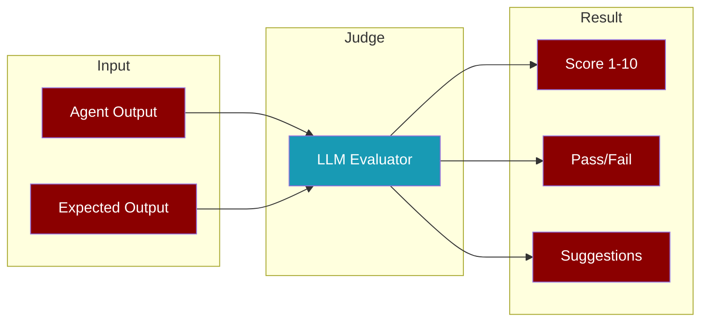

Use an LLM to evaluate and score agent outputs for accuracy, quality, and custom criteria.


```mermaid
flowchart LR
    subgraph Input
        A[Agent Output]:::agent
        B[Expected Output]:::agent
    end
    
    subgraph Judge
        C[LLM Evaluator]:::tool
    end
    
    subgraph Result
        D[Score 1-10]:::agent
        E[Pass/Fail]:::agent
        F[Suggestions]:::agent
    end
    
    A --> C
    B --> C
    C --> D
    C --> E
    C --> F
    
    classDef agent fill:#8B0000,color:#fff
    classDef tool fill:#189AB4,color:#fff
```

<CardGroup cols={2}>
  <Card title="Accuracy Mode" icon="bullseye">
    Compare output against expected result
  </Card>
  <Card title="Criteria Mode" icon="list-check">
    Evaluate against custom criteria
  </Card>
  <Card title="Recipe Mode" icon="utensils">
    Evaluate workflow execution traces
  </Card>
  <Card title="Extensible" icon="puzzle-piece">
    Register custom judge types
  </Card>
</CardGroup>

## Quick Start


<Steps>
<Step title="Simple Usage">
<Tabs>
  <Tab title="Python">
```python
from praisonaiagents.eval import Judge

# Simple accuracy check
result = Judge().run(output="4", expected="4", input="What is 2+2?")
print(f"Score: {result.score}/10, Passed: {result.passed}")
```
</Step>

<Step title="With Configuration">
</Tab>
  <Tab title="TypeScript">
```typescript
import { Judge } from 'praisonai';

// Simple accuracy check
const result = await new Judge().run({
  output: "4",
  expected: "4", 
  input: "What is 2+2?"
});
console.log(`Score: ${result.score}/10, Passed: ${result.passed}`);
```
  </Tab>
  <Tab title="CLI">
```bash
# Judge with expected output
praisonai eval judge --input "The answer is 4" --expected "4"

# Judge with criteria
praisonai eval judge --input "Hello, how can I help?" --criteria "Response is helpful"
```
  </Tab>
</Tabs>
</Step>
</Steps>


## Best Practices

<AccordionGroup>
  <Accordion title="Start simple">
    Enable the feature with a single parameter before adding configuration. Verify it works, then layer in options.
  </Accordion>
  <Accordion title="Use environment variables for secrets">
    Never hardcode API keys or tokens. Use `os.getenv("KEY_NAME")` to read from environment variables.
  </Accordion>
  <Accordion title="Test with minimal examples first">
    Copy the Quick Start example, run it, then extend it. This confirms your environment is set up correctly.
  </Accordion>
  <Accordion title="Check the logs">
    Set `verbose=True` on your agent to see detailed execution logs when debugging unexpected behavior.
  </Accordion>
</AccordionGroup>

