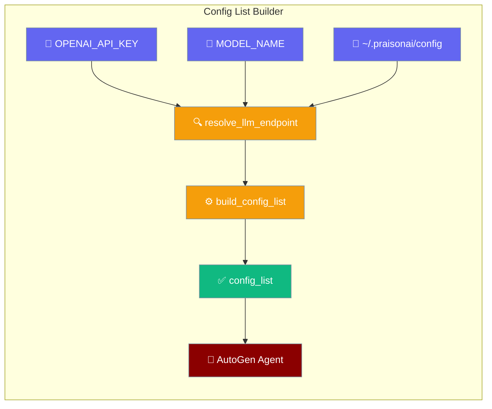
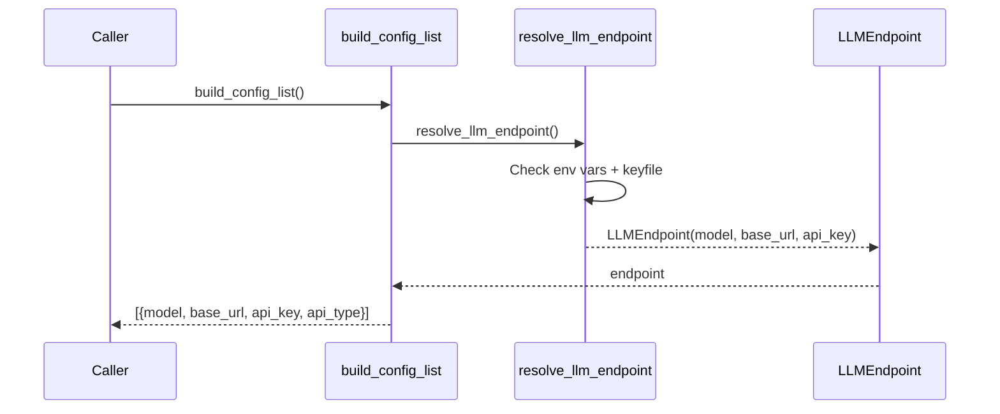

`build_config_list()` returns the `[{model, base_url, api_key, api_type}]` shape AutoGen expects, using the same env/keyfile resolution the CLI already performs.

```python
from praisonaiagents import Agent
from praisonai_code.llm.config import build_config_list

config_list = build_config_list()
agent = Agent(name="autogen-bridge", llm=config_list[0]["model"])
agent.start("Summarise today's stand-up notes.")
```

The user starts an agent; PraisonAI resolves keys and models into an AutoGen-ready `config_list` first.



## Quick Start

<Steps>
<Step title="Standalone import">
Set `OPENAI_API_KEY` in your environment, then:

```python
from praisonaiagents import Agent
from praisonai_code.llm.config import build_config_list

config_list = build_config_list()
# → [{'model': 'gpt-4o-mini', 'base_url': 'https://api.openai.com/v1',
#     'api_key': 'sk-...', 'api_type': 'openai'}]
```
</Step>

<Step title="Agent-centric usage with AutoGen">
Use `build_config_list()` inside a PraisonAI agent flow that bridges to an AutoGen adapter:

```python
from praisonaiagents import Agent
from praisonai_code.llm.config import build_config_list

def autogen_task():
    config_list = build_config_list()
    return f"AutoGen config ready: model={config_list[0]['model']}"

agent = Agent(
    name="AutoGen Bridge",
    instructions="Bridge PraisonAI agents to the AutoGen ecosystem.",
    tools=[autogen_task],
)

agent.start("Build the AutoGen config and report the resolved model.")
```
</Step>
</Steps>

---

## How It Works



---

## Return Shape

| Key | Source |
|-----|--------|
| `model` | `LLMEndpoint.model` — resolved from `MODEL_NAME`, `OPENAI_MODEL_NAME`, or provider default |
| `base_url` | `LLMEndpoint.base_url` — resolved from `OPENAI_BASE_URL`, `OPENAI_API_BASE`, or provider default |
| `api_key` | `LLMEndpoint.api_key` — resolved from provider-specific env var or stored credentials |
| `api_type` | Always `"openai"` (AutoGen convention) — omitted when `include_api_type=False` |

---

## Parameters

| Parameter | Type | Default | Description |
|-----------|------|---------|-------------|
| `include_api_type` | `bool` | `True` | Set `False` to match callers that historically omit AutoGen's `api_type` field |

```python
from praisonai_code.llm.config import build_config_list

# Without api_type field
config = build_config_list(include_api_type=False)
# → [{'model': 'gpt-4o-mini', 'base_url': '...', 'api_key': '...'}]
```

---

<Note>
The legacy import `from praisonai.llm.config import build_config_list` still works — it resolves to the same function object via a `sys.modules` shim. You do not need to migrate existing code. The unit test `test_c5_backward_compat.py::test_module_identity` asserts `praisonai.llm.config is praisonai_code.llm.config`.
</Note>

---

## Best Practices

<AccordionGroup>
<Accordion title="Set the provider env var before calling">
Resolution is done at call time — set `OPENAI_API_KEY` (or the provider-appropriate env var like `ANTHROPIC_API_KEY`) before calling `build_config_list()`.

```python
import os
os.environ["MODEL_NAME"] = "anthropic/claude-3-5-sonnet-latest"
os.environ["ANTHROPIC_API_KEY"] = "sk-ant-..."

from praisonai_code.llm.config import build_config_list
config = build_config_list()
```
</Accordion>

<Accordion title="Cache the result in hot loops">
If you build many AutoGen agents in a hot loop, cache the result — the endpoint resolver reads disk (`~/.praisonai/config`, honours `PRAISONAI_HOME`) on every call:

```python
from praisonai_code.llm.config import build_config_list

_cached_config = None

def get_config():
    global _cached_config
    if _cached_config is None:
        _cached_config = build_config_list()
    return _cached_config
```
</Accordion>

<Accordion title="Prefer resolve_llm_endpoint() for non-AutoGen consumers">
For non-AutoGen consumers, prefer `resolve_llm_endpoint()` directly and avoid the `api_type` field — it returns a typed `LLMEndpoint` dataclass with `model`, `base_url`, and `api_key` fields:

```python
from praisonai_code.llm.env import resolve_llm_endpoint

ep = resolve_llm_endpoint()
print(ep.model, ep.base_url)
```
</Accordion>
</AccordionGroup>

---

## Related

<CardGroup cols={2}>
  <Card title="LLM Endpoint Config" icon="plug" href="/docs/features/llm-endpoint-config">
    Endpoint precedence rules and provider routing
  </Card>
  <Card title="Model Catalogue" icon="microchip" href="/docs/features/models-cli">
    Choose the model that goes into the config_list
  </Card>
  <Card title="Standalone LLM Modules" icon="plug" href="/docs/features/standalone-llm-modules">
    All four LLM modules available in praisonai-code
  </Card>
  <Card title="PraisonAI Code CLI" icon="terminal" href="/docs/features/praisonai-code-cli">
    The standalone runtime these modules power
  </Card>
</CardGroup>
