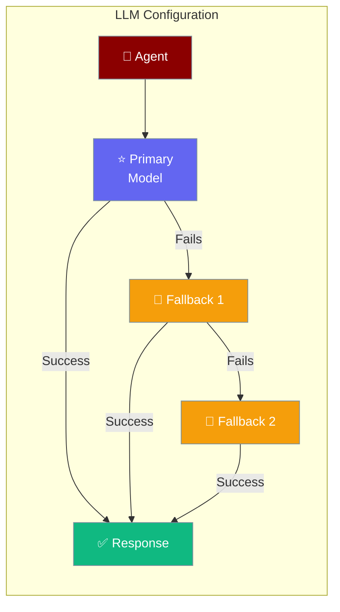
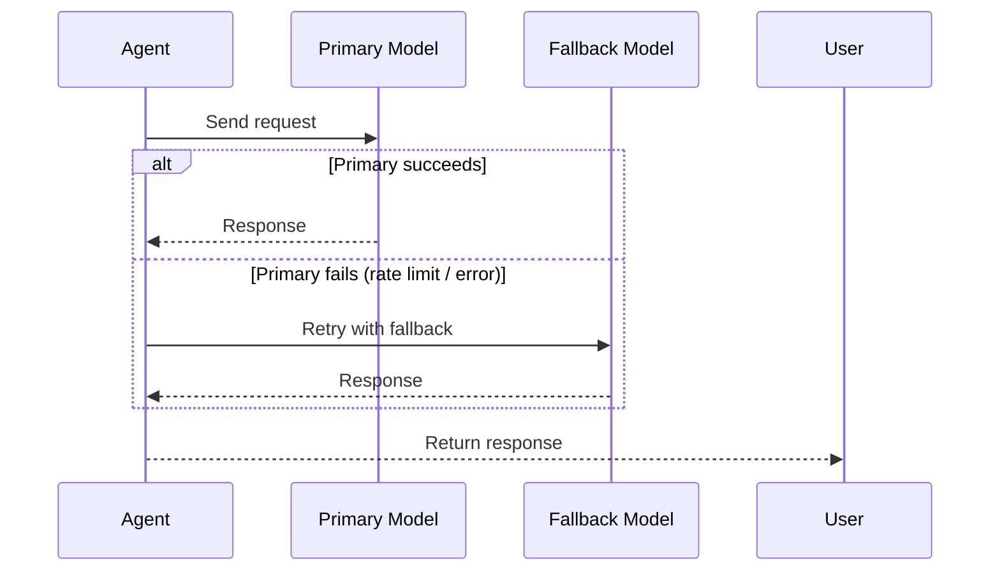

Set your agent's model, API endpoint, and fallback chain — all in one place.

```python
from praisonaiagents import Agent, LLMConfig

agent = Agent(
    name="Assistant",
    instructions="You are a helpful assistant.",
    llm_config=LLMConfig(
        model="gpt-4o",
        fallback_models=["claude-3-5-sonnet-20241022", "gpt-4o-mini"],
    )
)

result = agent.start("Explain quantum computing simply")
print(result)
```



## Quick Start

<Steps>
<Step title="Primary Model Only">
Set just the model to get started:

```python
from praisonaiagents import Agent, LLMConfig

agent = Agent(
    name="Assistant",
    instructions="You are a helpful assistant.",
    llm_config=LLMConfig(model="gpt-4o")
)

agent.start("What is the speed of light?")
```
</Step>

<Step title="With Fallback Chain">
Add fallback models for reliability — if the primary fails, the agent automatically tries the next:

```python
from praisonaiagents import Agent, LLMConfig

agent = Agent(
    name="ResilientAssistant",
    instructions="You are a helpful assistant.",
    llm_config=LLMConfig(
        model="gpt-4o",
        fallback_models=["claude-3-5-sonnet-20241022", "gpt-4o-mini"],
    )
)

agent.start("Summarize the latest AI research trends")
```
</Step>
</Steps>

---

## How It Works



---

## Configuration Options

<Card title="LLMConfig SDK Reference" icon="code" href="/docs/sdk/reference/python/classes/LLMConfig">
  Full parameter reference for LLMConfig
</Card>

| Option | Type | Default | Description |
|--------|------|---------|-------------|
| `model` | `str` | *(required)* | Primary model to use |
| `fallback_models` | `list[str] \| None` | `None` | Ordered fallback models |
| `base_url` | `str \| None` | `None` | API endpoint override |
| `api_key` | `str \| None` | `None` | API key (defaults to env vars) |
| `auth` | `dict \| None` | `None` | Additional auth headers |

---

## Common Patterns

**LiteLLM provider prefix:**

```python
from praisonaiagents import Agent, LLMConfig

agent = Agent(
    name="MultiProviderAgent",
    instructions="You are a helpful assistant.",
    llm_config=LLMConfig(
        model="anthropic/claude-3-5-sonnet-20241022",
        fallback_models=["openai/gpt-4o", "openai/gpt-4o-mini"],
    )
)
```

**Custom endpoint with authentication:**

```python
from praisonaiagents import Agent, LLMConfig

agent = Agent(
    name="PrivateModelAgent",
    instructions="You are a helpful assistant.",
    llm_config=LLMConfig(
        model="my-custom-model",
        base_url="https://my-llm-gateway.example.com/v1",
        api_key="sk-my-private-key",
        auth={"X-Organization-ID": "org-123"},
    )
)
```

**Self-hosted model via Ollama:**

```python
from praisonaiagents import Agent, LLMConfig

agent = Agent(
    name="LocalAgent",
    instructions="You are a helpful assistant.",
    llm_config=LLMConfig(
        model="ollama/llama3.2",
        base_url="http://localhost:11434",
    )
)
```

---

## Best Practices

<AccordionGroup>
<Accordion title="Always add at least one fallback model">
Even one fallback prevents your agent from failing completely during rate limits or outages. Use a smaller, cheaper model as the fallback — it costs less and is often available when the primary isn't.
</Accordion>

<Accordion title="Use environment variables for API keys">
Never hardcode `api_key` in your code. Leave it as `None` and set `OPENAI_API_KEY`, `ANTHROPIC_API_KEY`, etc. in your environment instead. `LLMConfig` picks them up automatically via LiteLLM.
</Accordion>

<Accordion title="Use LiteLLM prefixes for multi-provider setups">
Prefix models with the provider name (`anthropic/`, `openai/`, `ollama/`) to avoid ambiguity when using multiple providers in a fallback chain.
</Accordion>

<Accordion title="Test your fallback chain">
Deliberately trigger a failure (e.g., invalid primary model name) and verify your fallback fires correctly before going to production.
</Accordion>
</AccordionGroup>

---

## Related

<CardGroup cols={2}>
<Card title="LLM Gateways" icon="plug" href="/docs/features/llm-gateways">
  Route requests through a unified LLM gateway
</Card>
<Card title="LLM Endpoint Config" icon="settings" href="/docs/features/llm-endpoint-config">
  Fine-tune endpoint parameters per model
</Card>
<Card title="LLM Error Classification" icon="triangle-alert" href="/docs/features/llm-error-classification">
  How errors trigger fallback in the chain
</Card>
<Card title="Failover" icon="shield" href="/docs/features/failover">
  Automatic failover strategies for reliability
</Card>
</CardGroup>
