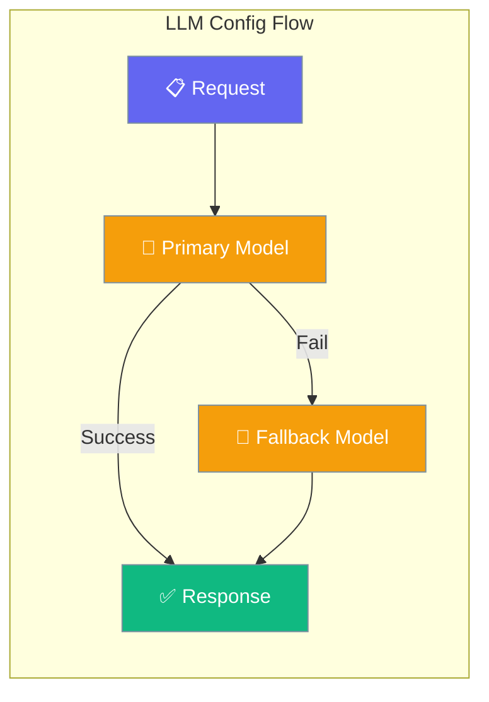
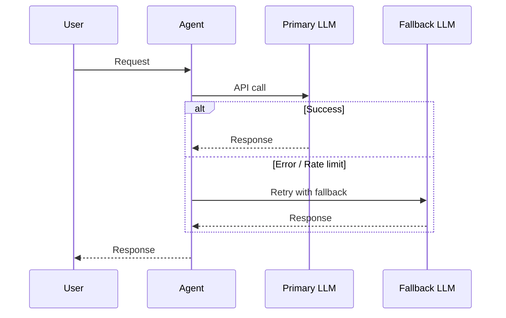

LLM Config lets you set the model, API endpoint, and fallback chain so your agent always has a working model.

```python
from praisonaiagents import Agent, LLMConfig

agent = Agent(
    name="Assistant",
    instructions="You are a helpful assistant.",
    llm_config=LLMConfig(
        model="gpt-4o",
        fallback_models=["gpt-4o-mini"],
    ),
)

agent.start("What is the latest research in quantum computing?")
```



## Quick Start

<Steps>
<Step title="Simple Usage">
```python
from praisonaiagents import Agent, LLMConfig

agent = Agent(
    instructions="You are a helpful assistant.",
    llm_config=LLMConfig(model="gpt-4o"),
)
agent.start("Explain quantum entanglement in simple terms.")
```
</Step>

<Step title="With Fallback Chain">
```python
from praisonaiagents import Agent, LLMConfig

agent = Agent(
    instructions="You are a helpful assistant.",
    llm_config=LLMConfig(
        model="gpt-4o",
        fallback_models=["claude-3-5-sonnet-20241022", "gpt-4o-mini"],
    ),
)
agent.start("Summarize today's top AI research papers.")
```
</Step>

<Step title="With LiteLLM Provider Prefix">
```python
from praisonaiagents import Agent, LLMConfig

agent = Agent(
    instructions="You are a helpful assistant.",
    llm_config=LLMConfig(
        model="anthropic/claude-3-5-sonnet-20241022",
        fallback_models=["openai/gpt-4o", "openai/gpt-4o-mini"],
    ),
)
agent.start("Write a technical blog post about microservices.")
```
</Step>
</Steps>

---

## How It Works



| Phase | What happens |
|---|---|
| 1. Primary | Agent calls the configured `model` first |
| 2. Fallback | On failure, tries each model in `fallback_models` in order |
| 3. Response | First successful response is returned |

---

## Configuration Options

<Card icon="code" href="/docs/sdk/reference/python/LLMConfig">
  Full list of options, types, and defaults — `LLMConfig`
</Card>

| Option | Type | Default | Description |
|---|---|---|---|
| `model` | `str` | required | Primary model name (e.g. `"gpt-4o"`) |
| `fallback_models` | `list[str] \| None` | `None` | Ordered list of fallback models |
| `base_url` | `str \| None` | `None` | Custom API endpoint URL |
| `api_key` | `str \| None` | `None` | API key (defaults to env variables) |
| `auth` | `dict \| None` | `None` | Additional authentication headers |

---

## Common Patterns

### Pattern 1 — Self-hosted model via custom endpoint
```python
from praisonaiagents import Agent, LLMConfig

agent = Agent(
    instructions="You are a helpful assistant.",
    llm_config=LLMConfig(
        model="llama3.2",
        base_url="http://localhost:11434/v1",
        api_key="ollama",
    ),
)
response = agent.start("What is the capital of France?")
print(response)
```

### Pattern 2 — Multi-provider fallback for resilience
```python
from praisonaiagents import Agent, LLMConfig

agent = Agent(
    instructions="You are a reliable assistant for critical tasks.",
    llm_config=LLMConfig(
        model="openai/gpt-4o",
        fallback_models=[
            "anthropic/claude-3-5-sonnet-20241022",
            "openai/gpt-4o-mini",
        ],
    ),
)
agent.start("Generate a business continuity plan for our e-commerce platform.")
```

---

## Best Practices

<AccordionGroup>
<Accordion title="Use LiteLLM prefixes for clarity">
Prefix model names with the provider (e.g., `"anthropic/claude-3-5-sonnet-20241022"`) for unambiguous routing and to ensure LiteLLM picks the right provider when names overlap.
</Accordion>

<Accordion title="Order fallbacks by cost">
Put cheaper, faster models at the end of `fallback_models`. Your primary model handles most requests; fallbacks only activate on failure, so it's fine to fall back to a smaller model.
</Accordion>

<Accordion title="Store API keys in environment variables">
Don't set `api_key` directly in code. Set `OPENAI_API_KEY`, `ANTHROPIC_API_KEY`, etc. as environment variables. The SDK picks them up automatically.
</Accordion>
</AccordionGroup>

---

## Related

<CardGroup cols={2}>
<Card icon="play" href="/docs/features/execution">
  Execution — control iteration limits and budget
</Card>
<Card icon="wrench" href="/docs/features/tool-config">
  Tool Config — configure tool execution behavior
</Card>
</CardGroup>
