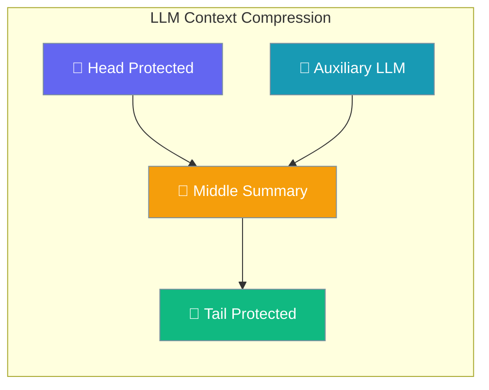
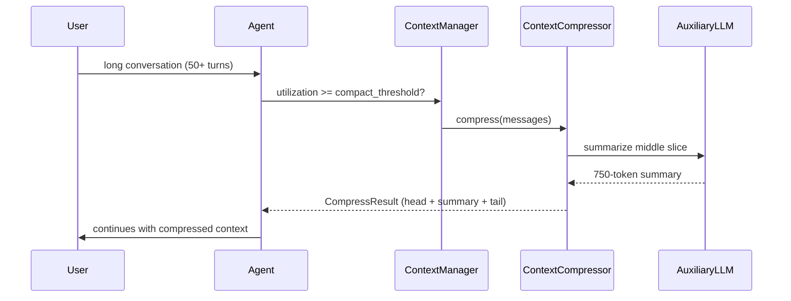

LLM Context Compression intelligently summarizes long conversation history while preserving the system prompt and recent context, with session lineage for traceability.



## Quick Start

<Steps>
<Step title="Simplest — enable via Agent">
```python
from praisonaiagents import Agent, ManagerConfig

agent = Agent(
    name="Researcher",
    instructions="Research topics in depth across many turns.",
    context=ManagerConfig(
        auto_compact=True,
        compact_threshold=0.8,
        strategy="summarize",  # uses LLM compression when available
        llm_summarize=True,
    ),
)

agent.start("Walk me through the entire history of AI safety research...")
```
</Step>

<Step title="Full control with LLMContextCompressorOptimizer">
```python
from praisonaiagents.context.optimizer import LLMContextCompressorOptimizer

optimizer = LLMContextCompressorOptimizer(
    llm_client=agent.llm,                # reuse the agent's LLM
    auxiliary_model="gpt-4o-mini",       # cheaper model for summarization
    protect_last_n_tokens=20_000,
    summary_target_tokens=750,
    enable_session_tracking=True,
)

optimized_messages, result = optimizer.optimize(messages, target_tokens=8_000)
print(f"Saved {result.tokens_saved} tokens — strategy: {result.strategy_used}")
```
</Step>
</Steps>

---

## How It Works



| Phase | What happens |
|-------|--------------|
| Head protect | System prompt + first turns kept verbatim |
| Tail protect | Last `protect_last_n_tokens` kept verbatim |
| Middle compress | LLM call produces a `summary_target_tokens` summary |
| Session record | `CompressionSession` appended with parent/child link |

---

## Configuration Options

| Option | Type | Default | Description |
|--------|------|---------|-------------|
| `llm_client` | LLM client | `None` | Provider used for summarization (uses deterministic fallback if `None`) |
| `auxiliary_model` | `str` | `"gpt-4o-mini"` | Model used for the summarization call (often a cheaper model than the agent's main LLM) |
| `protect_last_n_tokens` | `int` | `20_000` | Tokens to preserve at the tail (recent context) |
| `summary_target_tokens` | `int` | `750` | Target tokens for the middle summary |
| `enable_session_tracking` | `bool` | `True` | Append `CompressionSession` entries for traceability |
| `use_accurate_tokenizer` | `bool` | `True` | Use model-specific tokenizer; falls back to heuristic on import failure |

<Note>
The `LLMContextCompressorOptimizer` is exposed as `LLM_CONTEXT_COMPRESSOR_OPTIMIZER` and is **not** in `OPTIMIZER_REGISTRY` — users must instantiate it directly with an `llm_client`.
</Note>

---

## Session Lineage

Track compression history and audit trails across repeated compactions:

```python
# Access session history
compressor = ContextCompressor(llm=agent.llm)
result = await compressor.compress(messages)

# View compression sessions
for session in compressor.get_session_history():
    print(f"Session {session.session_id[:8]}: {session.original_tokens} → {session.compressed_tokens}")

# Chain sessions across compactions
next_result = await compressor.compress(
    result.messages,
    parent_session_id=result.session_id  # maintain audit trail
)
```

**CompressionSession shape:**
- `session_id`: Unique identifier for this compression
- `parent_session_id`: ID of previous compression for lineage
- `created_at`: Timestamp
- `original_message_count` / `compressed_message_count`: Message counts
- `original_tokens` / `compressed_tokens`: Token counts
- `summary_text`: The LLM-generated summary content

---

## CompressResult

| Field | Type | Description |
|-------|------|-------------|
| `messages` | `List[Dict[str, Any]]` | Compressed message list (head + summary + tail) |
| `tokens_saved` | `int` | Number of tokens removed |
| `original_tokens` | `int` | Token count before compression |
| `final_tokens` | `int` | Token count after compression |
| `compression_ratio` | `float` | Final tokens / original tokens |
| `session_id` | `Optional[str]` | ID of this compression session |
| `parent_session_id` | `Optional[str]` | ID of parent compression session |
| `summary_token_count` | `int` | Tokens used by the summary |
| `head_preserved_count` | `int` | Number of head messages preserved |
| `tail_preserved_count` | `int` | Number of tail messages preserved |
| `middle_compressed_count` | `int` | Number of middle messages compressed |
| `compression_efficiency` | `float` | Percentage of tokens saved (property) |

---

## Common Patterns

**Use a cheap auxiliary model:**
```python
optimizer = LLMContextCompressorOptimizer(
    llm_client=agent.llm,           # Main agent uses gpt-4o
    auxiliary_model="gpt-4o-mini",  # Compression uses cheaper model
)
```

**Tune for tool-heavy loops:**
```python
# Preserve more recent context when tools are frequently used
optimizer = LLMContextCompressorOptimizer(
    protect_last_n_tokens=30_000,  # Keep more recent tool results
    summary_target_tokens=1000,    # Slightly longer summaries
)
```

**Chain sessions across compactions:**
```python
result1 = await compressor.compress(messages)
result2 = await compressor.compress(
    result1.messages,
    parent_session_id=result1.session_id  # maintain lineage
)
```

---

## Best Practices

<AccordionGroup>

<Accordion title="Always set auxiliary_model to a smaller/cheaper model">
Use a cost-effective model like `gpt-4o-mini` for summarization while your main agent runs on `gpt-4o` or similar. This reduces costs without significantly impacting summary quality.
</Accordion>

<Accordion title="Don't set summary_target_tokens too low">
Keep `summary_target_tokens` at least 500 tokens. Summaries lose critical context below this threshold, leading to poor conversation continuity.
</Accordion>

<Accordion title="Enable accurate tokenization in production">
Set `use_accurate_tokenizer=True` for production deployments. This provides more accurate token budget calculations and better compression efficiency.
</Accordion>

<Accordion title="Inspect compression_efficiency for monitoring">
Monitor `result.compression_efficiency` to detect ineffective compactions. Values below 20% may indicate the conversation doesn't benefit from compression.
</Accordion>

</AccordionGroup>

---

## Related

<CardGroup cols={2}>
<Card title="Intelligent Compaction" icon="list-check" href="/features/intelligent-conversation-compaction">
  Structured conversation summaries with topic/goal tracking
</Card>
<Card title="Context Optimizer" icon="settings" href="/features/context-optimizer">
  Overview of all optimization strategies including LLM compression
</Card>
<Card title="Context Strategies" icon="flow-arrow" href="/features/context-strategies">
  Choosing the right optimization approach for your use case
</Card>
<Card title="Context Management" icon="database" href="/features/context-management">
  Complete guide to context window management features
</Card>
</CardGroup>