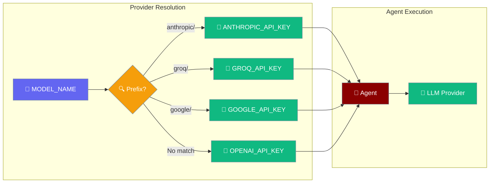
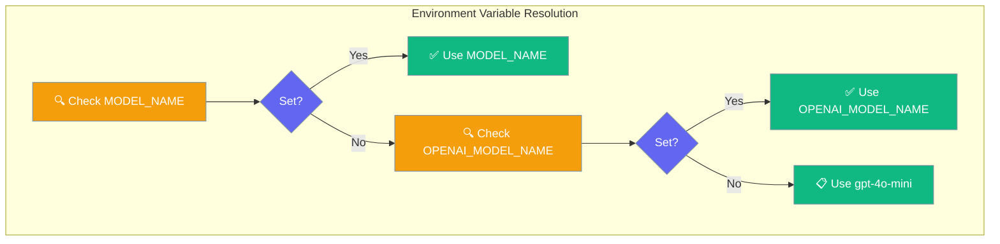
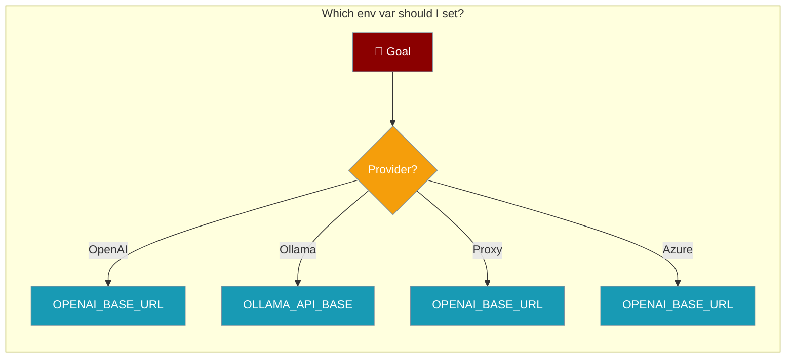
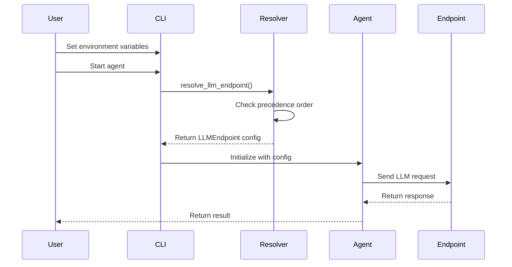

Configure where your agents send LLM requests using environment variables, with automatic provider-specific routing for major LLM providers.



## Quick Start

<Steps>
<Step title="Use OpenAI (default)">
Set your OpenAI API key and create an agent:

```python
import os
from praisonaiagents import Agent

os.environ["OPENAI_API_KEY"] = "your-api-key"

agent = Agent(
    name="Research Assistant",
    instructions="You are a helpful research assistant"
)

result = agent.start("Explain quantum computing in simple terms")
```
</Step>

<Step title="Use Anthropic directly">
No base URL needed - automatic provider routing:

```python
import os
from praisonaiagents import Agent

os.environ["MODEL_NAME"] = "anthropic/claude-3-5-sonnet"
os.environ["ANTHROPIC_API_KEY"] = "your-anthropic-key"

agent = Agent(
    name="Claude Assistant",
    instructions="You are Claude, an AI assistant"
)

result = agent.start("What makes you different from other AI models?")
```
</Step>

<Step title="Use Groq for fast inference">
High-speed inference with automatic routing:

```python
import os
from praisonaiagents import Agent

os.environ["MODEL_NAME"] = "groq/llama3-70b"
os.environ["GROQ_API_KEY"] = "your-groq-key"

agent = Agent(
    name="Fast Assistant",
    instructions="You are a speed-optimized assistant"
)

result = agent.start("Generate a quick summary of machine learning")
```
</Step>

<Step title="Use Google Gemini">
Access Google's latest models directly:

```python
import os
from praisonaiagents import Agent

os.environ["MODEL_NAME"] = "google/gemini-1.5-pro"
os.environ["GOOGLE_API_KEY"] = "your-google-key"

agent = Agent(
    name="Gemini Assistant",
    instructions="You are powered by Google Gemini"
)

result = agent.start("Analyze this complex dataset")
```
</Step>
</Steps>

---

## How It Works





---

## Provider-specific defaults

If you set `MODEL_NAME=anthropic/claude-3-5-sonnet`, you do not need to set `OPENAI_BASE_URL` — the right base URL is picked automatically.

| Model prefix | API key env var | Default base URL |
|--------------|-----------------|------------------|
| `anthropic/` | `ANTHROPIC_API_KEY` | `https://api.anthropic.com/v1` |
| `google/` | `GOOGLE_API_KEY` | `https://generativelanguage.googleapis.com/v1beta` |
| `gemini/` | `GEMINI_API_KEY` | `https://generativelanguage.googleapis.com/v1beta` |
| `groq/` | `GROQ_API_KEY` | `https://api.groq.com/openai/v1` |
| `cohere/` | `COHERE_API_KEY` | `https://api.cohere.ai/v1` |
| `openrouter/` | `OPENROUTER_API_KEY` | `https://openrouter.ai/api/v1` |
| `ollama/` | `OLLAMA_API_KEY` | `http://localhost:11434/v1` |
| _no prefix match_ | `OPENAI_API_KEY` | `https://api.openai.com/v1` |

<Warning>
Provider keys do not cross-fallback. If you use `anthropic/claude-3-5-sonnet` and only `OPENAI_API_KEY` is set, the call has no credentials. This is a security fix, not a bug — it prevents accidental credential exposure.
</Warning>

---

## Environment Variables

| Variable | Purpose | Precedence |
|----------|---------|------------|
| `MODEL_NAME` | Model name (highest priority) | 1 |
| `OPENAI_MODEL_NAME` | Model name (legacy compat) | 2 |
| `OPENAI_BASE_URL` | LLM endpoint URL (highest priority) | 1 |
| `OPENAI_API_BASE` | LLM endpoint URL (legacy compat) | 2 |
| `OLLAMA_API_BASE` | Ollama endpoint URL | 3 |
| `ANTHROPIC_API_KEY` | Anthropic API key (for `anthropic/*` models) | — |
| `GOOGLE_API_KEY` | Google API key (for `google/*` models) | — |
| `GEMINI_API_KEY` | Gemini API key (for `gemini/*` models) | — |
| `GROQ_API_KEY` | Groq API key (for `groq/*` models) | — |
| `COHERE_API_KEY` | Cohere API key (for `cohere/*` models) | — |
| `OPENROUTER_API_KEY` | OpenRouter API key (for `openrouter/*` models) | — |
| `OLLAMA_API_KEY` | Ollama API key (for `ollama/*` models) | — |
| `OPENAI_API_KEY` | OpenAI API key (for OpenAI models and fallback) | — |

### Defaults

| Setting | Default Value |
|---------|---------------|
| Model | `gpt-4o-mini` |
| Base URL | Provider-specific or `https://api.openai.com/v1` |
| API Key | `None` |

---

## Common Patterns

### Run against Ollama

<Tabs>
<Tab title="bash">
```bash
export OPENAI_BASE_URL="http://localhost:11434/v1"
export MODEL_NAME="llama3"
python your_agent.py
```
</Tab>
<Tab title="python">
```python
import os
from praisonaiagents import Agent

# Configure Ollama
os.environ["OPENAI_BASE_URL"] = "http://localhost:11434/v1"
os.environ["MODEL_NAME"] = "llama3"

agent = Agent(
    name="Ollama Assistant",
    instructions="You are running on Ollama"
)

result = agent.start("Explain the benefits of local AI")
```
</Tab>
</Tabs>

### Run against a corporate OpenAI proxy

<Tabs>
<Tab title="bash">
```bash
export OPENAI_BASE_URL="https://corporate-proxy.company.com/v1"
export OPENAI_API_KEY="your-corporate-key"
export MODEL_NAME="gpt-4"
python your_agent.py
```
</Tab>
<Tab title="python">
```python
import os
from praisonaiagents import Agent

# Configure corporate proxy
os.environ["OPENAI_BASE_URL"] = "https://corporate-proxy.company.com/v1"
os.environ["OPENAI_API_KEY"] = "your-corporate-key"
os.environ["MODEL_NAME"] = "gpt-4"

agent = Agent(
    name="Corporate Assistant",
    instructions="You are using a corporate OpenAI proxy"
)

result = agent.start("Generate a business report")
```
</Tab>
</Tabs>

### Use Anthropic directly

<Tabs>
<Tab title="bash">
```bash
export MODEL_NAME="anthropic/claude-3-5-sonnet"
export ANTHROPIC_API_KEY="your-anthropic-key"
python your_agent.py
```
</Tab>
<Tab title="python">
```python
import os
from praisonaiagents import Agent

os.environ["MODEL_NAME"] = "anthropic/claude-3-5-sonnet"
os.environ["ANTHROPIC_API_KEY"] = "your-anthropic-key"

agent = Agent(
    name="Anthropic Assistant",
    instructions="You are powered by Claude"
)

result = agent.start("Write a thoughtful analysis")
```
</Tab>
</Tabs>

### Use Groq for speed

<Tabs>
<Tab title="bash">
```bash
export MODEL_NAME="groq/llama3-70b"
export GROQ_API_KEY="your-groq-key"
python your_agent.py
```
</Tab>
<Tab title="python">
```python
import os
from praisonaiagents import Agent

os.environ["MODEL_NAME"] = "groq/llama3-70b"
os.environ["GROQ_API_KEY"] = "your-groq-key"

agent = Agent(
    name="Speed Assistant",
    instructions="You provide fast responses"
)

result = agent.start("Quick summary of quantum physics")
```
</Tab>
</Tabs>

### Use Google Gemini

<Tabs>
<Tab title="bash">
```bash
export MODEL_NAME="google/gemini-1.5-pro"
export GOOGLE_API_KEY="your-google-key"
python your_agent.py
```
</Tab>
<Tab title="python">
```python
import os
from praisonaiagents import Agent

os.environ["MODEL_NAME"] = "google/gemini-1.5-pro"
os.environ["GOOGLE_API_KEY"] = "your-google-key"

agent = Agent(
    name="Gemini Assistant",
    instructions="You are powered by Google Gemini"
)

result = agent.start("Analyze this complex problem")
```
</Tab>
</Tabs>

### Use Azure OpenAI / Bedrock via LiteLLM

<Tabs>
<Tab title="bash">
```bash
export OPENAI_BASE_URL="https://your-litellm-proxy/v1"
export OPENAI_API_KEY="your-litellm-key"
export MODEL_NAME="azure/gpt-4"
python your_agent.py
```
</Tab>
<Tab title="python">
```python
import os
from praisonaiagents import Agent

# Configure LiteLLM for Azure
os.environ["OPENAI_BASE_URL"] = "https://your-litellm-proxy/v1"
os.environ["OPENAI_API_KEY"] = "your-litellm-key"
os.environ["MODEL_NAME"] = "azure/gpt-4"

agent = Agent(
    name="Azure Assistant",
    instructions="You are using Azure OpenAI via LiteLLM"
)

result = agent.start("Analyze this data")
```
</Tab>
</Tabs>

---

## User Interaction Flow



---

## Best Practices

<AccordionGroup>
<Accordion title="Set OPENAI_BASE_URL, not OPENAI_API_BASE">
`OPENAI_BASE_URL` is the standard OpenAI SDK environment variable and has the highest precedence. Use this for all new configurations rather than the legacy `OPENAI_API_BASE`.
</Accordion>

<Accordion title="Empty string ≠ unset">
An empty string value is skipped during resolution, and the next variable in precedence order is tried. To disable a variable, unset it completely rather than setting it to an empty string.

```bash
# This skips OPENAI_BASE_URL and tries OPENAI_API_BASE
export OPENAI_BASE_URL=""
export OPENAI_API_BASE="https://proxy.com/v1"

# This uses OPENAI_BASE_URL
unset OPENAI_BASE_URL
export OPENAI_API_BASE="https://proxy.com/v1"
```
</Accordion>

<Accordion title="Use .env files for local dev">
Create a `.env` file in your project root for local development:

```bash
# .env
OPENAI_BASE_URL=http://localhost:11434/v1
MODEL_NAME=llama3
# OPENAI_API_KEY not needed for Ollama
```

Load it in your Python code:
```python
from dotenv import load_dotenv
load_dotenv()

from praisonaiagents import Agent
# Environment variables are now loaded
```
</Accordion>

<Accordion title="Realtime/WebSocket endpoints">
For realtime features, WebSocket URLs are auto-derived from HTTP URLs. The system automatically:
- Converts `https://` to `wss://` 
- Strips `/v1` suffix to avoid `/v1/v1/realtime`
- Appends the appropriate realtime path

You only need to set `OPENAI_BASE_URL` - the realtime endpoint is handled automatically.
</Accordion>
</AccordionGroup>

---

## Related

<CardGroup cols={2}>
<Card title="LLM Configuration" icon="cog" href="/docs/configuration/llm-config">
  Complete LLM configuration options
</Card>
<Card title="Models" icon="brain" href="/docs/models">
  Supported models and providers
</Card>
</CardGroup>

### Provider Pages

<CardGroup cols={3}>
<Card title="Anthropic" icon="robot" href="/docs/models/anthropic">
  Claude models and configuration
</Card>
<Card title="Groq" icon="zap" href="/docs/models/groq">
  High-speed inference setup
</Card>
<Card title="Google" icon="brain" href="/docs/models/google">
  Gemini models and API access
</Card>
<Card title="Cohere" icon="text" href="/docs/models/cohere">
  Language model configuration
</Card>
<Card title="OpenRouter" icon="route" href="/docs/models/openrouter">
  Multi-provider router setup
</Card>
<Card title="Ollama" icon="server" href="/docs/models/ollama">
  Local model deployment
</Card>
</CardGroup>