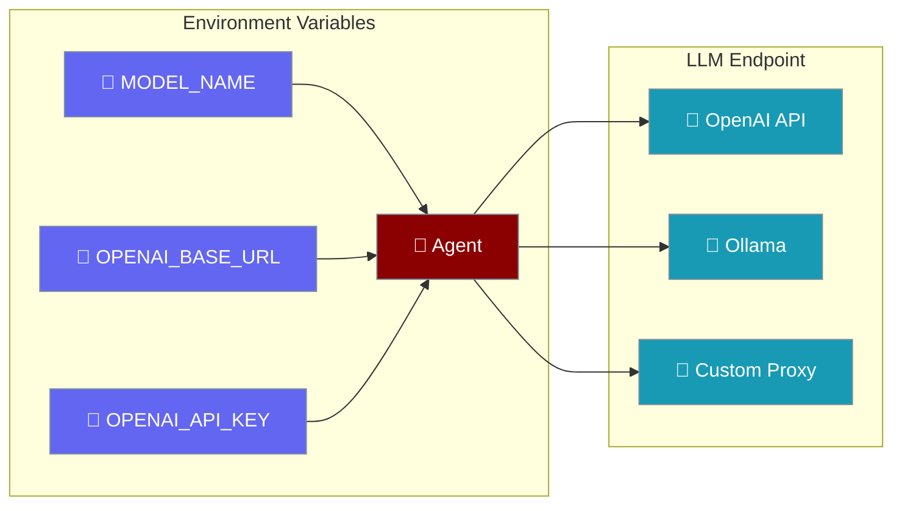
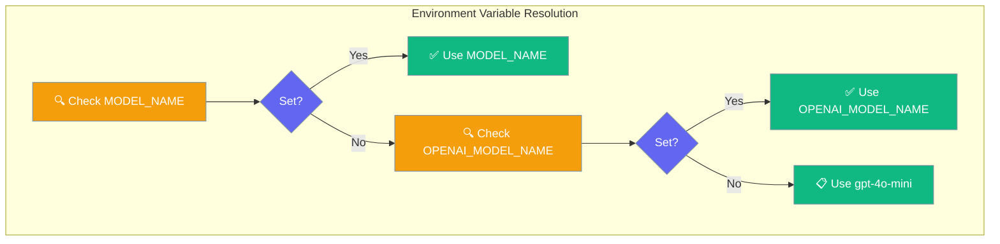
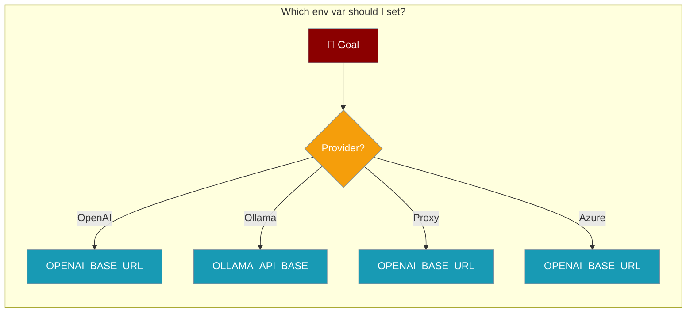
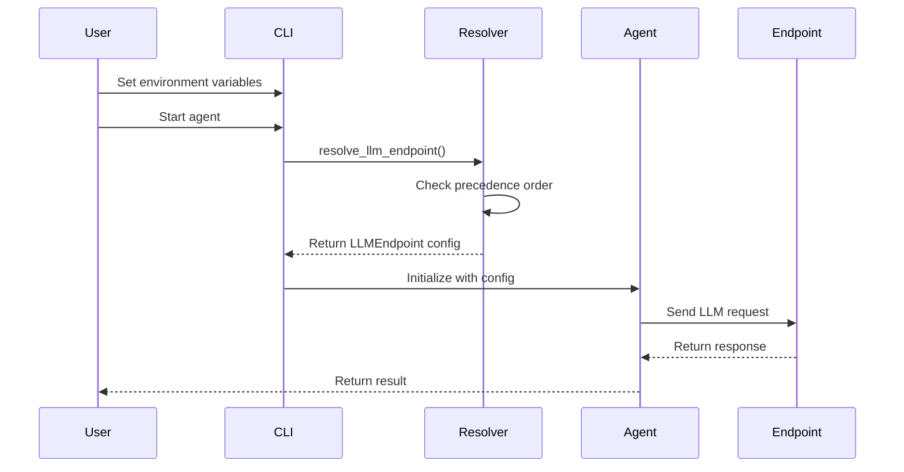

Configure where your agents send LLM requests using environment variables.



## Quick Start

<Steps>
<Step title="Use OpenAI (default)">
Set your OpenAI API key and create an agent:

```python
import os
from praisonaiagents import Agent

os.environ["OPENAI_API_KEY"] = "your-api-key"

agent = Agent(
    name="Research Assistant",
    instructions="You are a helpful research assistant"
)

result = agent.start("Explain quantum computing in simple terms")
```
</Step>

<Step title="Use Ollama locally">
Point to your local Ollama instance:

```python
import os
from praisonaiagents import Agent

os.environ["OPENAI_BASE_URL"] = "http://localhost:11434/v1"
os.environ["MODEL_NAME"] = "llama3"

agent = Agent(
    name="Local Assistant",
    instructions="You are a helpful assistant running locally"
)

result = agent.start("What are the benefits of local LLMs?")
```
</Step>

<Step title="Use a custom proxy / LiteLLM">
Configure any OpenAI-compatible proxy:

```python
import os
from praisonaiagents import Agent

os.environ["OPENAI_BASE_URL"] = "https://your-proxy/v1"
os.environ["OPENAI_API_KEY"] = "your-proxy-key"
os.environ["MODEL_NAME"] = "claude-3-sonnet"

agent = Agent(
    name="Proxy Assistant",
    instructions="You are an assistant using a proxy endpoint"
)

result = agent.start("Compare different AI models")
```
</Step>
</Steps>

---

## How It Works





---

## Environment Variables

| Variable | Purpose | Precedence |
|----------|---------|------------|
| `OPENAI_BASE_URL` | LLM endpoint URL (highest priority) | 1 |
| `OPENAI_API_BASE` | LLM endpoint URL (legacy compat) | 2 |
| `OLLAMA_API_BASE` | Ollama endpoint URL | 3 |
| `MODEL_NAME` | Model name (highest priority) | 1 |
| `OPENAI_MODEL_NAME` | Model name (legacy compat) | 2 |
| `OPENAI_API_KEY` | API key (no fallback) | — |

### Defaults

| Setting | Default Value |
|---------|---------------|
| Model | `gpt-4o-mini` |
| Base URL | `https://api.openai.com/v1` |
| API Key | `None` |

---

## Common Patterns

### Run against Ollama

<Tabs>
<Tab title="bash">
```bash
export OPENAI_BASE_URL="http://localhost:11434/v1"
export MODEL_NAME="llama3"
python your_agent.py
```
</Tab>
<Tab title="python">
```python
import os
from praisonaiagents import Agent

# Configure Ollama
os.environ["OPENAI_BASE_URL"] = "http://localhost:11434/v1"
os.environ["MODEL_NAME"] = "llama3"

agent = Agent(
    name="Ollama Assistant",
    instructions="You are running on Ollama"
)

result = agent.start("Explain the benefits of local AI")
```
</Tab>
</Tabs>

### Run against a corporate OpenAI proxy

<Tabs>
<Tab title="bash">
```bash
export OPENAI_BASE_URL="https://corporate-proxy.company.com/v1"
export OPENAI_API_KEY="your-corporate-key"
export MODEL_NAME="gpt-4"
python your_agent.py
```
</Tab>
<Tab title="python">
```python
import os
from praisonaiagents import Agent

# Configure corporate proxy
os.environ["OPENAI_BASE_URL"] = "https://corporate-proxy.company.com/v1"
os.environ["OPENAI_API_KEY"] = "your-corporate-key"
os.environ["MODEL_NAME"] = "gpt-4"

agent = Agent(
    name="Corporate Assistant",
    instructions="You are using a corporate OpenAI proxy"
)

result = agent.start("Generate a business report")
```
</Tab>
</Tabs>

### Use Azure OpenAI / Bedrock via LiteLLM

<Tabs>
<Tab title="bash">
```bash
export OPENAI_BASE_URL="https://your-litellm-proxy/v1"
export OPENAI_API_KEY="your-litellm-key"
export MODEL_NAME="azure/gpt-4"
python your_agent.py
```
</Tab>
<Tab title="python">
```python
import os
from praisonaiagents import Agent

# Configure LiteLLM for Azure
os.environ["OPENAI_BASE_URL"] = "https://your-litellm-proxy/v1"
os.environ["OPENAI_API_KEY"] = "your-litellm-key"
os.environ["MODEL_NAME"] = "azure/gpt-4"

agent = Agent(
    name="Azure Assistant",
    instructions="You are using Azure OpenAI via LiteLLM"
)

result = agent.start("Analyze this data")
```
</Tab>
</Tabs>

---

## User Interaction Flow



---

## Best Practices

<AccordionGroup>
<Accordion title="Set OPENAI_BASE_URL, not OPENAI_API_BASE">
`OPENAI_BASE_URL` is the standard OpenAI SDK environment variable and has the highest precedence. Use this for all new configurations rather than the legacy `OPENAI_API_BASE`.
</Accordion>

<Accordion title="Empty string ≠ unset">
An empty string value is skipped during resolution, and the next variable in precedence order is tried. To disable a variable, unset it completely rather than setting it to an empty string.

```bash
# This skips OPENAI_BASE_URL and tries OPENAI_API_BASE
export OPENAI_BASE_URL=""
export OPENAI_API_BASE="https://proxy.com/v1"

# This uses OPENAI_BASE_URL
unset OPENAI_BASE_URL
export OPENAI_API_BASE="https://proxy.com/v1"
```
</Accordion>

<Accordion title="Use .env files for local dev">
Create a `.env` file in your project root for local development:

```bash
# .env
OPENAI_BASE_URL=http://localhost:11434/v1
MODEL_NAME=llama3
# OPENAI_API_KEY not needed for Ollama
```

Load it in your Python code:
```python
from dotenv import load_dotenv
load_dotenv()

from praisonaiagents import Agent
# Environment variables are now loaded
```
</Accordion>

<Accordion title="Realtime/WebSocket endpoints">
For realtime features, WebSocket URLs are auto-derived from HTTP URLs. The system automatically:
- Converts `https://` to `wss://` 
- Strips `/v1` suffix to avoid `/v1/v1/realtime`
- Appends the appropriate realtime path

You only need to set `OPENAI_BASE_URL` - the realtime endpoint is handled automatically.
</Accordion>
</AccordionGroup>

---

## Related

<CardGroup cols={2}>
<Card title="LLM Configuration" icon="cog" href="/docs/configuration/llm-config">
  Complete LLM configuration options
</Card>
<Card title="Models" icon="brain" href="/docs/models">
  Supported models and providers
</Card>
</CardGroup>