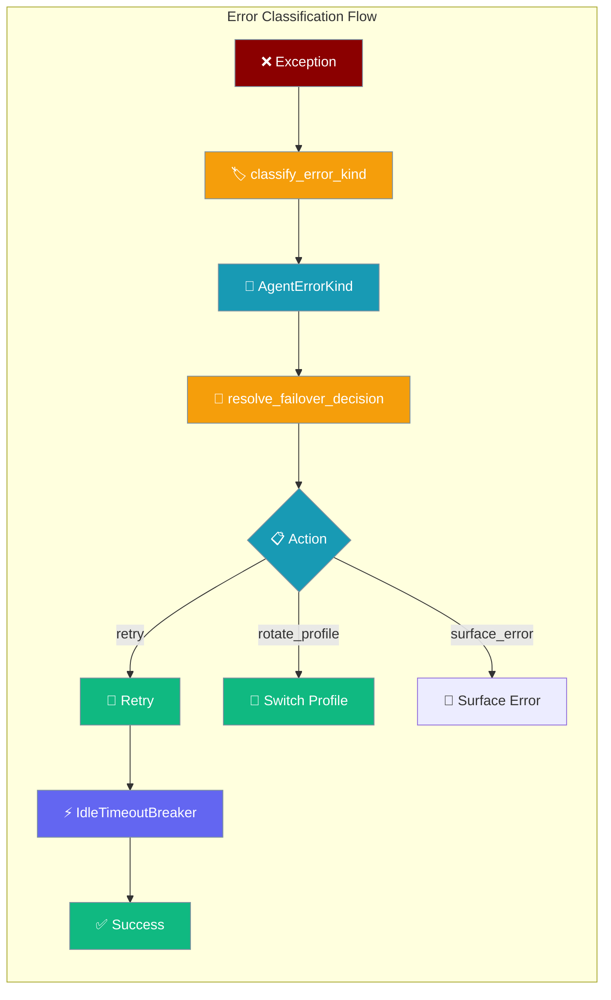
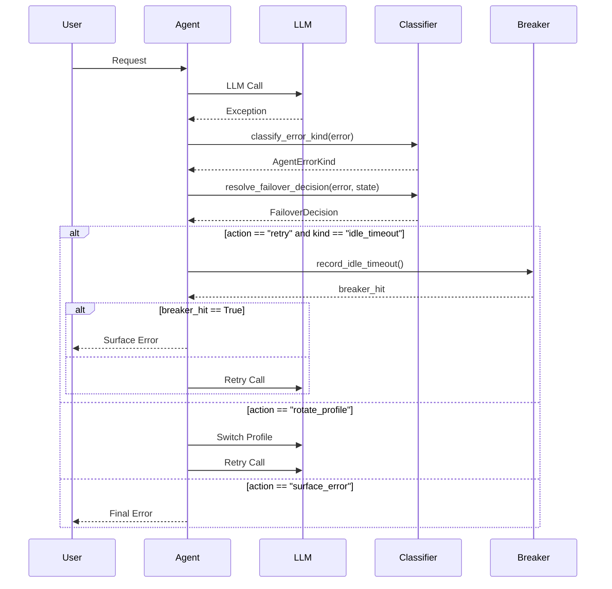
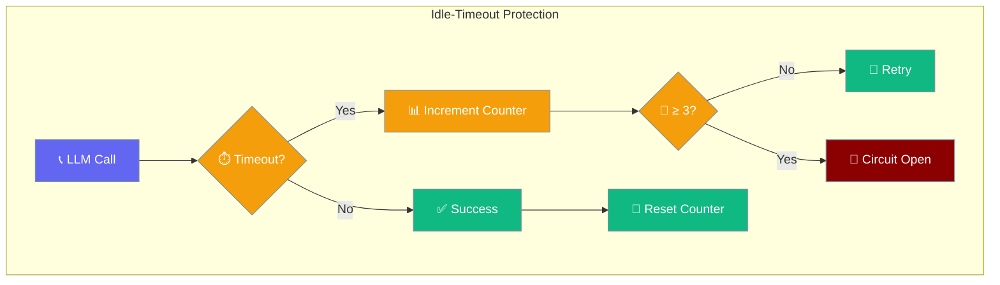
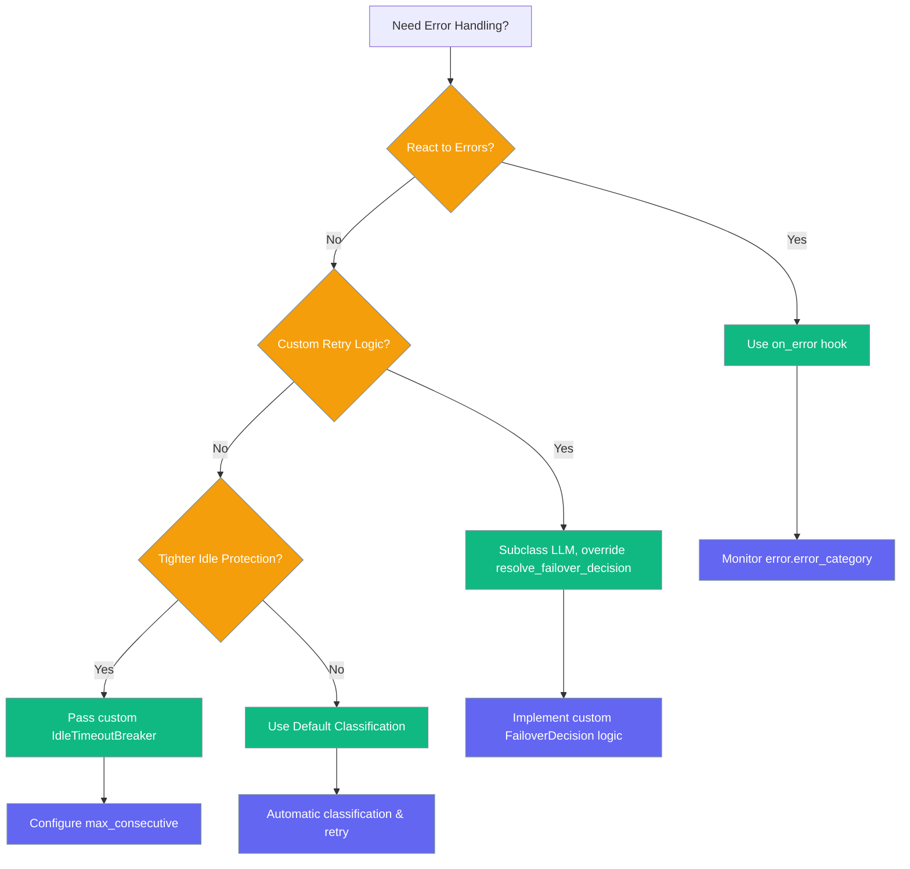

PraisonAI classifies every LLM failure into one of 11 typed categories so retries, failovers, and circuit breakers can react correctly without parsing error strings.

```python
from praisonaiagents import Agent

agent = Agent(
    name="Smart Agent",
    instructions="Process user requests with automatic error handling",
)
result = agent.start("Generate a summary")
```

The user sends a prompt; transient LLM errors trigger retries or profile rotation instead of opaque failures.

<Note>
The underlying classifier now prefers exception type and HTTP status code over message text, so `AgentErrorKind` decisions stay stable across providers whose messages don't include the expected keywords (e.g. a `429` without the word "rate"). See [Structured LLM Errors](/docs/features/structured-llm-errors#how-errors-are-classified) for the classification order.
</Note>



## Quick Start

<Steps>
<Step title="Simple Usage">
Error classification happens automatically when using agents:

```python
from praisonaiagents import Agent

agent = Agent(
    name="Smart Agent",
    instructions="Process user requests with automatic error handling"
)

# Classification happens transparently
result = agent.start("Generate a summary")
```
</Step>

<Step title="Read Error Category">
Access the typed error category in error hooks:

```python
from praisonaiagents import Agent
from praisonaiagents.errors import AgentErrorKind

def handle_error(error):
    # Access typed error category instead of parsing strings
    if error.error_category == "billing":
        print("💳 Quota exceeded - contact billing")
    elif error.error_category == "rate_limit":
        print("⏸️ Rate limited - will auto-retry")
    elif error.error_category == "auth_permanent":
        print("🔑 Invalid API key - check configuration")

agent = Agent(
    name="Smart Agent",
    instructions="Handle requests with error monitoring",
    on_error=handle_error
)
```
</Step>

<Step title="Custom Idle-Timeout Protection">
Tune the idle-timeout circuit breaker for different scenarios:

```python
from praisonaiagents import Agent
from praisonaiagents.errors import IdleTimeoutBreaker
from praisonaiagents.llm import LLM

# Custom breaker for slow self-hosted models
breaker = IdleTimeoutBreaker(max_consecutive=5)

llm = LLM(
    model="self-hosted/slow-model",
    idle_timeout_breaker=breaker,
    max_iter=15
)

agent = Agent(
    name="Patient Agent", 
    instructions="Work with slow models",
    llm=llm
)
```
</Step>
</Steps>

---

## How It Works



The classification system converts every LLM exception into a structured `FailoverDecision` that tells retry logic exactly what to do.

Classification (`is_retryable`, `should_fallback_model`) is consulted from every turn shape — non-streaming, streaming, tool-iteration, reflection, sync and async — so an `LLMError` category maps to the same retry/failover decision regardless of how the turn is being executed.

---

## Error Categories

All LLM failures are classified into these 11 typed categories:

| Kind | Triggers (examples) | Default Action | Retryable |
|------|-------------------|----------------|-----------|
| `auth` | `unauthorized`, `api key`, `authentication failed` | `rotate_profile` (if failover enabled) | Yes |
| `auth_permanent` | `invalid api key`, `incorrect api key` | `surface_error` | No |
| `rate_limit` | `rate limit`, `429`, `resource_exhausted` | `retry` (with parsed/exponential backoff, max 60s) | Yes |
| `overloaded` | `503`, `502`, `500`, `service unavailable` | `retry` (2s→4s→8s, capped at 30s) | Yes |
| `context_overflow` | `maximum context length`, `context window is too long` | `surface_error` | No |
| `idle_timeout` | `timeout`, `timed out`, `deadline exceeded` | `retry` until breaker hits 3, then `surface_error` | Yes (until breaker) |
| `billing` | `insufficient quota`, `quota exceeded`, `payment required` | `surface_error` | No |
| `model_not_found` | `model not found`, `unknown model` | `surface_error` | No |
| `empty_response` | `empty response`, `json decode error` | `retry` (limited) | Limited |
| `format_error` | `validation error`, `invalid json`, `schema error` | `surface_error` | No |
| `unknown` | anything else | `retry` for attempt ≤ 2, then `surface_error` | Limited |

As of PR #1898, billing errors are explicitly added to the non-retryable list and are classified **before** rate-limit (so `quota exceeded` no longer double-matches as a rate-limit error). This means a quota-exhausted call now surfaces immediately instead of retrying with backoff.

## Classification Ordering

The order of checks in `classify_error_kind` matters: billing is checked before rate-limit so phrases like `quota exceeded` route to `billing` (non-retryable) instead of `rate_limit` (retryable). Auth is checked before billing so `auth_permanent` takes precedence on invalid API keys.

## FailoverDecision Structure

Every classification produces a `FailoverDecision` with these fields:

| Field | Type | Description |
|-------|------|-------------|
| `action` | `"retry"` \| `"rotate_profile"` \| `"surface_error"` | What action to take |
| `reason` | `AgentErrorKind` | The classified error type |
| `backoff_ms` | `int` | Milliseconds to wait before retry (0 = immediate) |
| `is_retryable` | `bool` | Whether this error is worth retrying |

## Idle-Timeout Circuit Breaker

The idle-timeout circuit breaker is **separate** from the [per-tool circuit breaker](/features/tool-circuit-breaker). It protects against LLM provider stalls:



- **Default**: Stops after 3 consecutive `idle_timeout` failures
- **Auto-resets**: On any successful LLM call
- **Only triggered by**: `idle_timeout` error kind (not other timeouts)

## Choosing Between Options



## Common Patterns

### Log Every Classified Failure

```python
from praisonaiagents import Agent
from praisonaiagents import LLMError

def error_logger(error: LLMError):
    print(f"⚠️ LLM {error.error_category}: {error.message}")
    
    # Route specific error types
    if error.error_category == "billing":
        # Alert ops team
        send_alert("billing", error.message)
    elif error.error_category == "auth_permanent":
        # Alert dev team
        send_alert("config", error.message)

agent = Agent(
    name="Monitored Agent",
    instructions="Track all LLM failures",
    on_error=error_logger
)
```

### Custom Breaker for Slow Models

```python
from praisonaiagents import Agent
from praisonaiagents.errors import IdleTimeoutBreaker
from praisonaiagents.llm import LLM

# More patient with self-hosted models
slow_model_breaker = IdleTimeoutBreaker(max_consecutive=8)

agent = Agent(
    name="Self-Hosted Agent",
    llm=LLM(
        model="ollama/custom-model",
        idle_timeout_breaker=slow_model_breaker,
        timeout=120  # 2 minute timeout
    )
)
```

### Gate Alerts by Error Type

```python
from praisonaiagents import Agent

def smart_alerting(error):
    # Only alert on errors that need human intervention
    alert_worthy = [
        "auth_permanent", "model_not_found", 
        "context_overflow", "billing"
    ]
    
    if error.error_category in alert_worthy:
        send_slack_alert(f"🚨 {error.error_category}: {error.message}")
    else:
        # Just log retryable errors
        logger.info(f"Retryable {error.error_category} - auto-handling")

agent = Agent(
    name="Smart Alerting Agent",
    instructions="Only alert on actionable errors",
    on_error=smart_alerting
)
```

## Legacy Migration

<Note>
The old `error_category` string values still work but emit a `DeprecationWarning`. Update to the new typed categories for cleaner code.
</Note>

| Old `error_category` | New `AgentErrorKind` | Migration |
|---------------------|---------------------|-----------|
| `"tool"` | `"unknown"` | Update error classification logic |
| `"llm"` | `"unknown"` | More specific classification available |
| `"budget"` | `"billing"` | Direct replacement |
| `"validation"` | `"format_error"` | Direct replacement |
| `"network"` | `"unknown"` | Use specific network error kinds |
| `"handoff"` | `"unknown"` | Agent handoff errors are separate |

Example migration:

```python
# OLD (deprecated - emits warning)
if error.error_category == "budget":
    handle_budget_error()

# NEW (recommended)  
if error.error_category == "billing":
    handle_billing_error()
```

### Migrating from `_classify_error_and_should_retry`

If you previously subclassed `LLM` to override `_classify_error_and_should_retry`, that method now emits a `DeprecationWarning` and delegates to `resolve_failover_decision`. Override `resolve_failover_decision` directly instead — it returns a typed `FailoverDecision` instead of a `(category, retry, delay)` tuple.

```python
# OLD (deprecated)
from praisonaiagents import LLM

class MyLLM(LLM):
    def _classify_error_and_should_retry(self, error, attempt=1):
        return "rate_limit", True, 5.0

# NEW
from praisonaiagents import LLM
from praisonaiagents.errors import FailoverDecision

class MyLLM(LLM):
    def resolve_failover_decision(self, error, attempt_state):
        return FailoverDecision(
            action="retry", reason="rate_limit",
            backoff_ms=5000, is_retryable=True,
        )
```

## Best Practices

<AccordionGroup>
<Accordion title="Treat Permanent Errors as Config Issues">
Errors classified as `auth_permanent`, `model_not_found`, and `context_overflow` indicate configuration problems, not transient failures. Set up monitoring to catch these during development.

```python
permanent_errors = ["auth_permanent", "model_not_found", "format_error"]
if error.error_category in permanent_errors:
    # Log as config issue, not service degradation
    config_logger.error(f"Config issue: {error.error_category}")
```
</Accordion>

<Accordion title="Tune Circuit Breaker by Model Speed">
Fast cloud models can use the default `max_consecutive=3`. Slow self-hosted models should increase this to avoid premature circuit breaking.

```python
# Fast cloud model (default)
fast_breaker = IdleTimeoutBreaker()  # max_consecutive=3

# Slow self-hosted model  
slow_breaker = IdleTimeoutBreaker(max_consecutive=8)
```
</Accordion>

<Accordion title="Use Typed Categories Over String Matching">
Instead of parsing error messages, use the typed `error_category` field for reliable error handling.

```python
# AVOID: String parsing
if "quota" in str(exception):
    handle_quota()

# PREFER: Typed classification
if error.error_category == "billing":
    handle_billing_issue()
```
</Accordion>

<Accordion title="Pair with Model Failover for Cross-Provider Resilience">
Combine error classification with [Model Failover](/features/failover) to automatically switch providers on `auth` errors.

```python
from praisonaiagents import FailoverManager

failover = FailoverManager([
    AuthProfile(provider="openai", api_key="..."),
    AuthProfile(provider="anthropic", api_key="...")
])

agent = Agent(
    name="Resilient Agent",
    llm={"model": "gpt-4o", "failover_manager": failover}
)
# Auth errors will automatically rotate to Anthropic
```
</Accordion>
</AccordionGroup>

---

## Related

<CardGroup cols={2}>
<Card title="Structured LLM Errors" icon="circle-alert" href="/docs/features/structured-llm-errors">
  Foundation error handling with LLMError structure
</Card>
<Card title="Model Failover" icon="arrows-rotate" href="/docs/features/failover">
  Cross-provider failover with FailoverManager
</Card>
<Card title="Tool Circuit Breaker" icon="plug-circle-bolt" href="/docs/features/tool-circuit-breaker">
  Per-tool circuit breaking for tool execution
</Card>
<Card title="Execution Config" icon="gear" href="/docs/configuration/execution-config">
  Configure max_iter and other execution parameters
</Card>
</CardGroup>