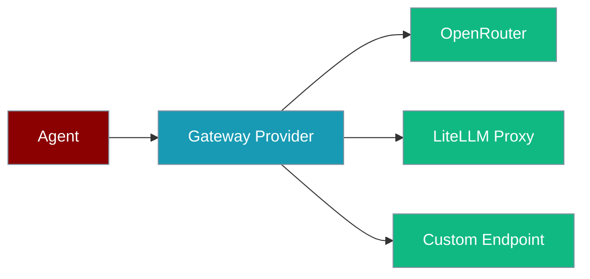
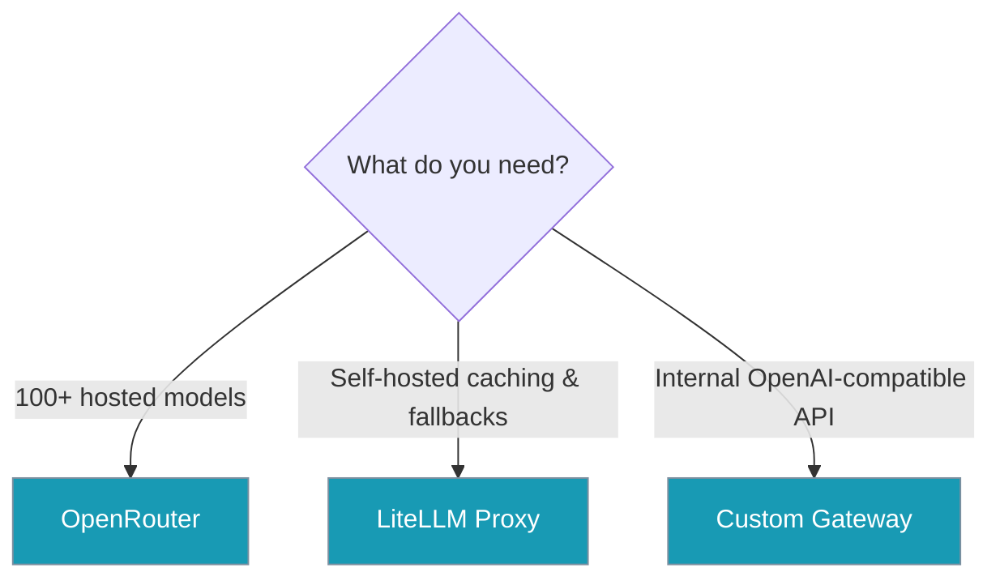
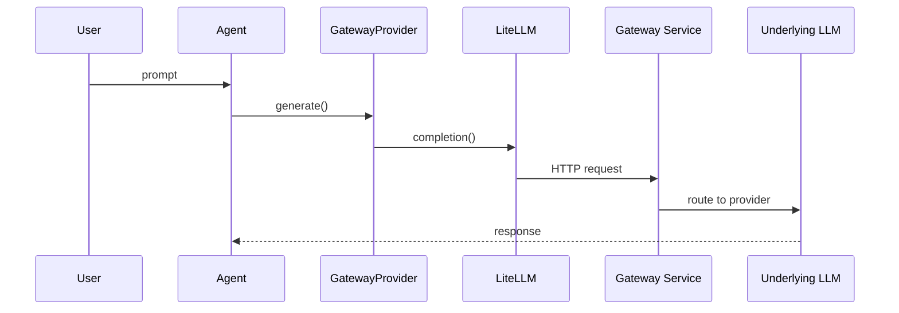

Route agent LLM calls through OpenRouter, LiteLLM Proxy, or a custom OpenAI-compatible gateway — no manual registration required.

```python
import os
from praisonaiagents import Agent

if not os.getenv("OPENROUTER_API_KEY"):
    raise EnvironmentError("Set OPENROUTER_API_KEY in your environment")

agent = Agent(
    name="assistant",
    llm="openrouter/anthropic/claude-3.5-sonnet",
)
agent.start("Hello!")
```

The user picks a gateway-backed model string; the agent routes the request through the gateway to the underlying provider.



## Quick Start

<Steps>

<Step title="OpenRouter — one line">

```python
import os
from praisonaiagents import Agent

if not os.getenv("OPENROUTER_API_KEY"):
    raise EnvironmentError("Set OPENROUTER_API_KEY in your environment")

agent = Agent(
    name="assistant",
    llm="openrouter/anthropic/claude-3.5-sonnet",
)
agent.start("Hello!")
```

Gateway providers auto-register on import — no `register_gateway_providers()` call needed.

</Step>

<Step title="LiteLLM Proxy">

```python
import os
from praisonaiagents import Agent

os.environ["LITELLM_PROXY_BASE_URL"] = "http://localhost:4000"
if not os.getenv("LITELLM_PROXY_API_KEY"):
    raise EnvironmentError("Set LITELLM_PROXY_API_KEY in your environment")

agent = Agent(
    name="assistant",
    llm="litellm-proxy/gpt-4",
)
agent.start("Hello!")
```

</Step>

<Step title="Custom gateway (advanced)">

```python
import os
from praisonai.llm import create_llm_provider
from praisonaiagents import Agent

provider = create_llm_provider({
    "name": "custom-gateway",
    "model_id": "my-model",
    "config": {
        "base_url": "https://api.example.com/v1",
        "api_key": os.getenv("CUSTOM_GATEWAY_API_KEY", ""),
    },
})
agent = Agent(name="assistant", llm=provider)
agent.start("Hello!")
```

</Step>

</Steps>

---

## Choose Your Gateway



| Need | Gateway | Example `llm` |
|------|---------|---------------|
| Hosted access to 100+ models | OpenRouter | `openrouter/anthropic/claude-3.5-sonnet` or `or/gpt-4` |
| Self-hosted caching, fallback, load balancing | LiteLLM Proxy | `litellm-proxy/gpt-4` |
| Internal OpenAI-compatible endpoint | Custom Gateway | `custom-gateway/my-model` with `base_url` in config |

---

## How It Works



---

## Provider Reference

### OpenRouter

| Option | Type | Default | Description |
|--------|------|---------|-------------|
| `api_key` | `str` | `$OPENROUTER_API_KEY` | OpenRouter API key |
| `base_url` | `str` | `https://openrouter.ai/api/v1` | API endpoint |
| `extra_headers` | `dict` | — | e.g. `X-Title`, `HTTP-Referer` for app ranking |

Aliases: `openrouter`, `or`. Model IDs are prefixed with `openrouter/` automatically unless already prefixed.

### LiteLLM Proxy

| Option | Type | Default | Description |
|--------|------|---------|-------------|
| `api_key` | `str` | `$LITELLM_PROXY_API_KEY` | Proxy API key |
| `base_url` | `str` | `$LITELLM_PROXY_BASE_URL` or `http://localhost:4000` | Proxy URL |
| `extra_headers` | `dict` | — | Custom auth or routing headers |

Aliases: `litellm-proxy`, `llm-proxy`, `litellm-gateway`. Model IDs are passed through unchanged.

### Custom Gateway

| Option | Type | Default | Description |
|--------|------|---------|-------------|
| `base_url` | `str` | **required** | OpenAI-compatible endpoint — raises `ValueError` if missing |
| `api_key` | `str` | — | Optional API key |
| `extra_headers` | `dict` | — | Custom headers |

Aliases: `custom-gateway`, `gateway`, `custom`.

Explicit `config["api_key"]` overrides environment variables at init time.

---

## Common Patterns

**Multi-agent, different gateways:**

```python
from praisonaiagents import Agent

researcher = Agent(name="researcher", llm="openrouter/anthropic/claude-3.5-sonnet")
writer = Agent(name="writer", llm="litellm-proxy/gpt-4o-mini")
```

**OpenRouter attribution headers:**

```python
from praisonai.llm import OpenRouterProvider
from praisonaiagents import Agent

provider = OpenRouterProvider("gpt-4", config={
    "extra_headers": {"X-Title": "My App", "HTTP-Referer": "https://myapp.com"},
})
agent = Agent(name="assistant", llm=provider)
```

**Shorthand alias:**

```python
agent = Agent(name="assistant", llm="or/gpt-4")  # same as openrouter/gpt-4
```

---

## Developer Flow


---

## Best Practices

<AccordionGroup>

<Accordion title="Prefer environment variables">
Set `OPENROUTER_API_KEY` or `LITELLM_PROXY_API_KEY` instead of hardcoding keys in config.
</Accordion>

<Accordion title="OpenRouter for experimentation">
Quick access to 100+ models with one API key — ideal for prototyping.
</Accordion>

<Accordion title="LiteLLM Proxy for production">
Self-hosted caching, observability, and fallback routing suit production workloads.
</Accordion>

<Accordion title="Custom Gateway for compliance">
Use `CustomGatewayProvider` when traffic must stay on an internal OpenAI-compatible proxy.
</Accordion>

<Accordion title="extra_headers for attribution">
OpenRouter uses `X-Title` and `HTTP-Referer` for app ranking and routing hints.
</Accordion>

</AccordionGroup>

---

## Related

<CardGroup cols={2}>
  <Card title="OpenRouter" icon="router" href="/docs/models/openrouter">
    OpenRouter model strings and env vars
  </Card>
  <Card title="LiteLLM Proxy" icon="server" href="/docs/models/litellm-proxy">
    Self-hosted proxy setup
  </Card>
  <Card title="LLM Endpoint Config" icon="plug" href="/docs/features/llm-endpoint-config">
    Environment-based endpoint configuration
  </Card>
  <Card title="Custom Provider" icon="code" href="/docs/models/custom-provider">
    Register custom LLM providers
  </Card>
</CardGroup>
