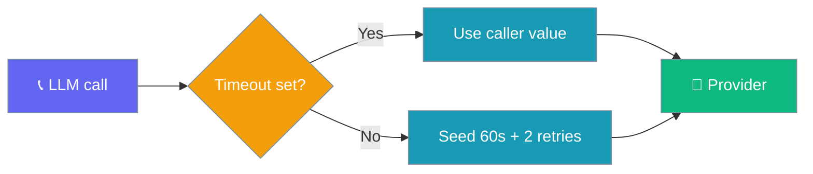

Every sync and async model call is bounded by a default timeout and a couple of retries — tunable with one env var, overridable per call.



## Quick Start

<Steps>
<Step title="Raise the timeout for a slow provider">
Set one env var — every call now waits up to 120 seconds before giving up.

```bash
export PRAISONAI_LLM_TIMEOUT=120
```

```python
from praisonaiagents import Agent

agent = Agent(name="Analyst", instructions="Answer carefully")
agent.start("Summarise the attached report.")
```
</Step>

<Step title="Override per call">
An explicit per-call `timeout` always wins over the env default.

```python
from praisonaiagents import Agent

agent = Agent(
    name="Analyst",
    instructions="Answer carefully",
    llm={"model": "gpt-4o", "timeout": 30},
)
```
</Step>
</Steps>

---

## How It Works

Each call seeds a default `timeout` and `num_retries` only if the caller didn't already set them — explicit values win (`setdefault` semantics).

| Setting | Default | Source |
|---------|---------|--------|
| `timeout` | `60.0` seconds | `PRAISONAI_LLM_TIMEOUT` env var, else `60.0` |
| `num_retries` | `2` | Fixed bounded retry count |

The defaults apply to registry providers (OpenAI, Anthropic, Google, …) and gateway providers (OpenRouter, LiteLLM-Proxy, Custom).

---

## Configuration Options

| Env var | Default | Description |
|---------|---------|-------------|
| `PRAISONAI_LLM_TIMEOUT` | `60` | Seconds before an LLM call times out. Applied to every sync/async call that didn't set `timeout` |

| Per-call override | How | Wins over |
|-------------------|-----|-----------|
| `timeout` | `Agent(llm={"model": "...", "timeout": 30})` | The env default and the built-in 60s |
| `num_retries` | Pass `num_retries=` through the same `llm` dict | The built-in `2` |

<Note>
An invalid `PRAISONAI_LLM_TIMEOUT` (e.g. `abc`) safely falls back to `60` seconds and logs a warning — a bad value never breaks a run.
</Note>

---

## Best Practices

<AccordionGroup>
<Accordion title="Raise the timeout, don't remove it">
A large `PRAISONAI_LLM_TIMEOUT` still bounds a stuck provider. Prefer `120` or `180` for slow local models over an unbounded wait.
</Accordion>

<Accordion title="Override per call for one slow model">
Keep a low global default and raise `timeout` only for the specific agent that needs it — the per-call value wins.

```python
agent = Agent(name="LocalLLM", llm={"model": "ollama/llama3", "timeout": 180})
```
</Accordion>

<Accordion title="Retries are bounded on purpose">
The default `num_retries=2` recovers from transient blips without amplifying a real outage into a retry storm. Raise it only when a provider is known-flaky.
</Accordion>
</AccordionGroup>

---

## Related

<CardGroup cols={2}>
<Card title="Models" icon="microchip" href="/models">
  Configure providers and model names
</Card>
<Card title="Tool Timeout" icon="stopwatch" href="/features/tool-timeout">
  Bound tool execution the same way
</Card>
</CardGroup>
