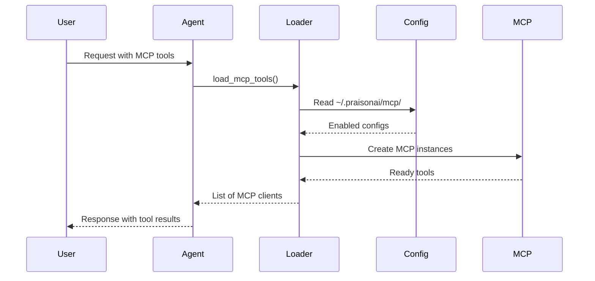
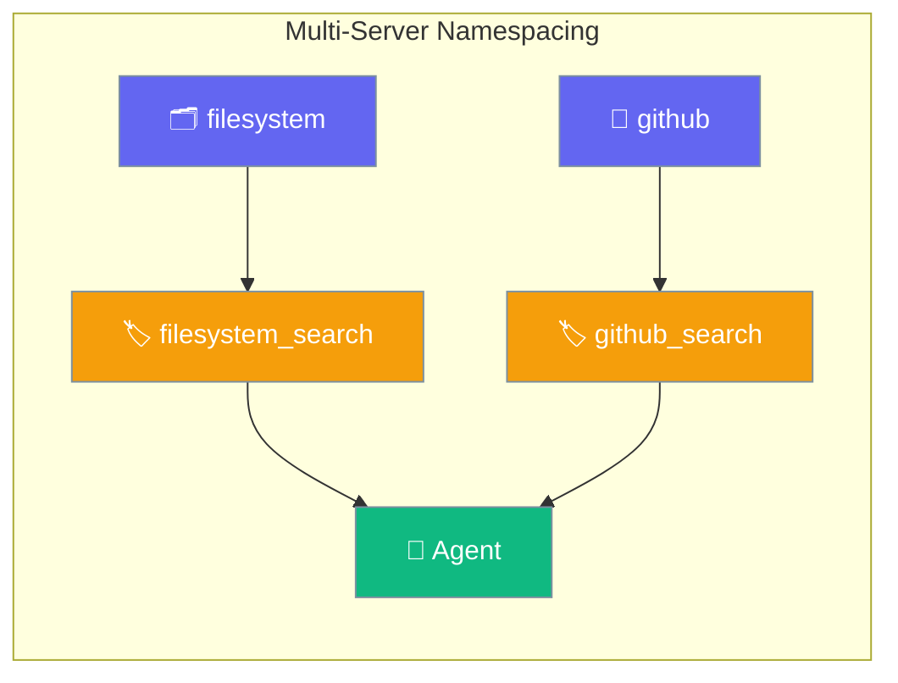

Load MCP tools from your configured servers with a single function call, following the agent-centric design principles.

```python
from praisonaiagents import Agent
from praisonaiagents.mcp import load_mcp_tools

agent = Agent(name="assistant", tools=load_mcp_tools())
agent.start("List files in /tmp")
```

The user asks a question; the agent calls MCP tools loaded from your JSON/TOML server config.

```mermaid
graph LR
    subgraph "MCP Tool Loading"
        Config[📋 JSON/TOML Config] --> Load[🔄 load_mcp_tools()]
        Load --> Tools[🧰 MCP Tools]
        Tools --> Agent[🤖 Agent]
    end
    
    classDef config fill:#6366F1,stroke:#7C90A0,color:#fff
    classDef process fill:#F59E0B,stroke:#7C90A0,color:#fff  
    classDef output fill:#10B981,stroke:#7C90A0,color:#fff
    
    class Config config
    class Load process
    class Tools,Agent output
```

## Quick Start

<Steps>
<Step title="Load All Enabled Servers">
Wire all enabled MCP servers from your configuration:
```python
from praisonaiagents import Agent
from praisonaiagents.mcp import load_mcp_tools

agent = Agent(name="assistant", tools=load_mcp_tools())
agent.start("List files in /tmp")
```
</Step>

<Step title="Load Specific Servers">
Load only the servers you need by name:
```python
from praisonaiagents import Agent
from praisonaiagents.mcp import load_mcp_tools

tools = load_mcp_tools(["filesystem", "github"])
agent = Agent(name="coder", tools=tools)
agent.start("Read the README file and create a GitHub issue")
```
</Step>
</Steps>

---

## How It Works



The loader bridges configuration and agent setup by:

1. **Reading configs** from `~/.praisonai/mcp/` directory
2. **Filtering** by enabled status and optional name selection  
3. **Converting** each config to an MCP client instance
4. **Returning** ready-to-use tool instances

---

## Configuration Options

| Parameter | Type | Default | Description |
|-----------|------|---------|-------------|
| `names` | `List[str]` | `None` | Specific config names to load (None = all enabled) |
| `configs` | `List[MCPConfig]` | `None` | Optional injected configs from wrapper TOML loader |
| `prefix_tools` | `bool` | `True` | When multiple servers load, namespace each server's tools as `<server_name>_<tool_name>` (e.g. `filesystem_read_file`). Single-server loads keep bare names. |

---

## Multi-Server Namespacing

Load two servers that both expose a `search` tool — each is namespaced automatically, so nothing shadows anything.

```python
from praisonaiagents import Agent
from praisonaiagents.mcp import load_mcp_tools

agent = Agent(
    name="engineer",
    instructions="You have filesystem and GitHub tools.",
    tools=load_mcp_tools(names=["filesystem", "github"]),
)

# The model sees `filesystem_search` and `github_search` — no collision.
agent.start("Find the auth module in the repo and list any recent GitHub issues about it.")
```



Dispatch still routes to each server's original tool name — only the name the model sees changes.

| Scenario | Before | After |
|----------|--------|-------|
| Load `filesystem` + `github`, both expose `search` | Silent collision, one shadows the other | `filesystem_search`, `github_search` — both callable |
| Two servers sanitize to the same prefix | Silent shadow | `ValueError` at load time |

<Note>
Single-server loads keep **bare** tool names for backward compatibility — `load_mcp_tools(["filesystem"])` still emits `read_file`, not `filesystem_read_file`.
</Note>

---

## Prefixing a Single Server

Namespace one server's tools yourself with `with_tool_prefix()` when passing `MCP` instances directly.

```python
from praisonaiagents import Agent
from praisonaiagents.mcp import MCP

fs = MCP("npx -y @modelcontextprotocol/server-filesystem /tmp").with_tool_prefix("fs")
gh = MCP("npx -y @modelcontextprotocol/server-github").with_tool_prefix("gh")

agent = Agent(
    name="engineer",
    instructions="Work across filesystem and GitHub.",
    tools=[fs, gh],
)
# Model sees `fs_read_file`, `gh_search_issues`, etc.
```

`with_tool_prefix()` returns the same instance, so calls chain fluently. It sanitizes the prefix to `[0-9A-Za-z_]` (non-alphanumerics collapse to `_`, leading/trailing `_` stripped) and raises `ValueError` if the sanitized prefix is empty.

---

## Filtering a Single Server

Restrict a server's tools with `apply_tool_filters()` — `allowed_tools` wins over `disabled_tools` when both are set.

```python
from praisonaiagents import Agent
from praisonaiagents.mcp import MCP

fs = MCP("npx -y @modelcontextprotocol/server-filesystem /tmp") \
    .apply_tool_filters(disabled_tools=["delete_file"])

agent = Agent(name="safe-editor", tools=[fs])
```

Like `with_tool_prefix()`, this returns the same instance for fluent chaining.

---

## Common Patterns

### Load All Enabled Servers

The simplest approach - load everything that's enabled:

```python
from praisonaiagents import Agent
from praisonaiagents.mcp import load_mcp_tools

agent = Agent(
    name="multi-tool-assistant",
    instructions="Help with various tasks using available tools",
    tools=load_mcp_tools()
)
```

### Load Specific Servers

Target specific capabilities for focused agents:

```python
from praisonaiagents import Agent
from praisonaiagents.mcp import load_mcp_tools

# File operations only
file_agent = Agent(
    name="file-assistant", 
    tools=load_mcp_tools(["filesystem"])
)

# Development tools
dev_agent = Agent(
    name="dev-assistant",
    tools=load_mcp_tools(["filesystem", "github", "postgres"])
)
```

### Inject Configs from TOML

Advanced usage with wrapper TOML loading:

```python
from praisonaiagents import Agent
from praisonaiagents.mcp import load_mcp_tools
from praisonai.cli.configuration import get_config_loader

# Load from wrapper TOML config
loader = get_config_loader()
config = loader.load()
toml_configs = [MCPConfig(...) for server in config.mcp.servers]

# Use injected configs
tools = load_mcp_tools(configs=toml_configs)
agent = Agent(name="toml-configured", tools=tools)
```

---

## Best Practices

<AccordionGroup>
<Accordion title="Configure Once, Use Everywhere">
Set up your MCP servers once using `praisonai mcp create`, then any agent can pick them up automatically via `load_mcp_tools()`. This follows the "configure once, use everywhere" principle.
</Accordion>

<Accordion title="Filter by Purpose">
Use specific server names rather than loading everything. A file processing agent only needs `["filesystem"]`, while a development agent might need `["filesystem", "github", "postgres"]`.
</Accordion>

<Accordion title="Handle Missing Configs Gracefully">
The loader silently skips disabled or missing configs. Always check that your expected servers are enabled with `praisonai mcp list`.
</Accordion>

<Accordion title="Automatic Collision Handling">
Multi-server loads auto-prefix each server's tools as `<server_name>_<tool_name>`, so overlapping names (like two `search` tools) never shadow each other. If two server names sanitize to the same prefix (e.g. `"file-system"` and `"file system"` both become `file_system`), the loader raises a clear `ValueError` instead of silently dropping a tool. Set `prefix_tools=False` only when you need bare names and accept the collision risk.
</Accordion>
</AccordionGroup>

---

## Related

<CardGroup cols={2}>
<Card title="MCP Tool Filtering" icon="filter" href="/docs/features/mcp-tool-filtering">
  Restrict which MCP tools an agent can see and call
</Card>
<Card title="MCP CLI" icon="terminal" href="/docs/cli/mcp">
  Configure and manage MCP servers from the command line
</Card>
</CardGroup>