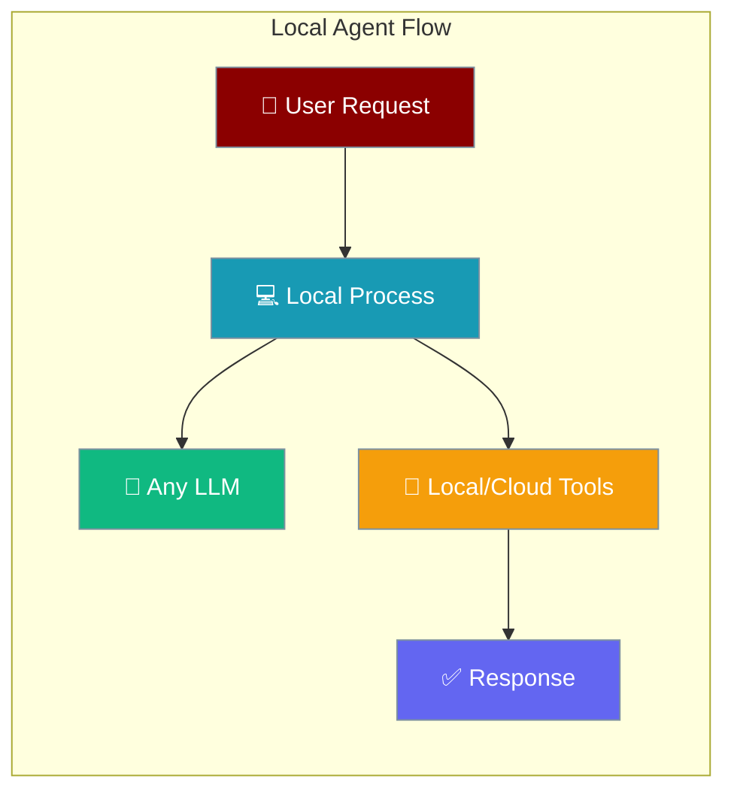
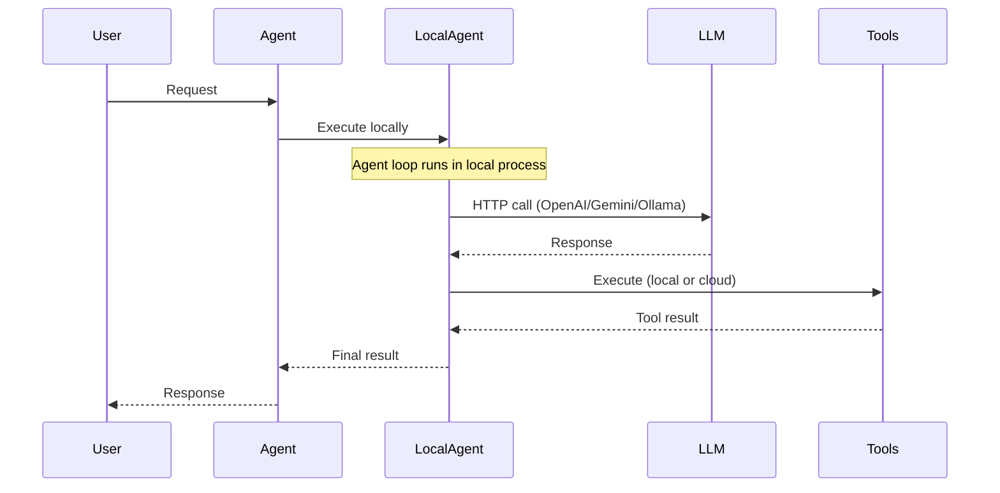
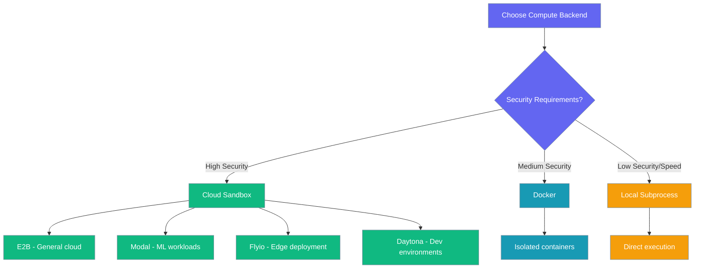

LocalAgent runs the agent execution loop locally in your process, supporting any LLM via litellm routing and optional cloud compute for tool sandboxing.



## Quick Start

<Steps>
<Step title="Simplest Usage">
Create a local agent with minimal configuration:

```python
from praisonai import LocalAgent, LocalAgentConfig
from praisonaiagents import Agent

local = LocalAgent(
    config=LocalAgentConfig(
        model="gpt-4o-mini"
    )
)

agent = Agent(name="assistant", backend=local)
result = agent.start("Explain quantum computing in simple terms")
```
</Step>

<Step title="With Cloud Compute Sandbox">
Use cloud compute for secure tool execution:

```python
from praisonai import LocalAgent, LocalAgentConfig
from praisonaiagents import Agent

local = LocalAgent(
    compute="e2b",  # Cloud sandbox for tools
    config=LocalAgentConfig(
        model="gpt-4o-mini",
        tools=["execute_command", "read_file", "write_file"]
    )
)

agent = Agent(name="coder", backend=local)
result = agent.start("Create a Python script that analyzes a CSV file")
```
</Step>
</Steps>

---

## How It Works



| Component | Location | Purpose |
|-----------|----------|---------|
| **Agent Loop** | Local Process | Complete execution control |
| **LLM** | External API | Any provider via litellm routing |
| **Tools** | Local or Cloud | Configurable execution environment |
| **Session State** | Local Memory | Process-managed state |

---

## Choosing an LLM

<Tabs>
<Tab title="OpenAI">
Use OpenAI models with API key authentication:

```python
from praisonai import LocalAgent, LocalAgentConfig
import os

os.environ["OPENAI_API_KEY"] = "your-key-here"

local = LocalAgent(
    config=LocalAgentConfig(
        model="gpt-4o"  # or "gpt-4o-mini", "gpt-3.5-turbo"
    )
)
```
</Tab>

<Tab title="Gemini">
Use Google's Gemini models:

```python
from praisonai import LocalAgent, LocalAgentConfig
import os

os.environ["GOOGLE_API_KEY"] = "your-key-here"

local = LocalAgent(
    config=LocalAgentConfig(
        model="gemini/gemini-2.0-flash"  # litellm prefix required
    )
)
```
</Tab>

<Tab title="Ollama">
Use local Ollama models:

```python
from praisonai import LocalAgent, LocalAgentConfig

# Requires Ollama running locally
local = LocalAgent(
    config=LocalAgentConfig(
        model="ollama/llama3"  # litellm prefix required
    )
)
```
</Tab>

<Tab title="Anthropic">
Use Claude models via API:

```python
from praisonai import LocalAgent, LocalAgentConfig
import os

os.environ["ANTHROPIC_API_KEY"] = "your-key-here"

local = LocalAgent(
    config=LocalAgentConfig(
        model="claude-3-5-sonnet-latest"
    )
)
```
</Tab>

<Tab title="Custom">
Use any litellm-supported provider:

```python
from praisonai import LocalAgent, LocalAgentConfig

local = LocalAgent(
    config=LocalAgentConfig(
        model="azure/gpt-4o"  # Azure OpenAI
        # model="groq/llama3-70b-8192"  # Groq
        # model="together_ai/meta-llama/Llama-2-70b-chat-hf"  # Together AI
    )
)
```
</Tab>
</Tabs>

---

## Choosing a Compute Backend

<Tabs>
<Tab title="None (Local)">
Execute tools in local subprocess (fastest, least secure):

```python
from praisonai import LocalAgent, LocalAgentConfig

local = LocalAgent(
    # No compute parameter = local subprocess
    config=LocalAgentConfig(
        model="gpt-4o-mini",
        tools=["execute_command", "read_file", "write_file"]
    )
)
```
</Tab>

<Tab title="Docker">
Execute tools in Docker containers:

```python
from praisonai import LocalAgent, LocalAgentConfig

local = LocalAgent(
    compute="docker",
    config=LocalAgentConfig(
        model="gpt-4o-mini",
        tools=["execute_command", "read_file", "write_file"]
    )
)
```
</Tab>

<Tab title="E2B">
Execute tools in E2B cloud sandboxes:

```python
from praisonai import LocalAgent, LocalAgentConfig
import os

os.environ["E2B_API_KEY"] = "your-e2b-key"

local = LocalAgent(
    compute="e2b",
    config=LocalAgentConfig(
        model="gpt-4o-mini",
        tools=["execute_command", "read_file", "write_file"]
    )
)
```
</Tab>

<Tab title="Modal">
Execute tools on Modal cloud compute:

```python
from praisonai import LocalAgent, LocalAgentConfig
import os

os.environ["MODAL_TOKEN"] = "your-modal-token"

local = LocalAgent(
    compute="modal",
    config=LocalAgentConfig(
        model="gpt-4o-mini",
        tools=["execute_command", "read_file", "write_file"]
    )
)
```
</Tab>

<Tab title="Flyio">
Execute tools on Fly.io infrastructure:

```python
from praisonai import LocalAgent, LocalAgentConfig
import os

os.environ["FLY_API_TOKEN"] = "your-fly-token"

local = LocalAgent(
    compute="flyio",
    config=LocalAgentConfig(
        model="gpt-4o-mini",
        tools=["execute_command", "read_file", "write_file"]
    )
)
```
</Tab>

<Tab title="Daytona">
Execute tools in Daytona development environments:

```python
from praisonai import LocalAgent, LocalAgentConfig
import os

os.environ["DAYTONA_API_KEY"] = "your-daytona-key"

local = LocalAgent(
    compute="daytona",
    config=LocalAgentConfig(
        model="gpt-4o-mini",
        tools=["execute_command", "read_file", "write_file"]
    )
)
```
</Tab>
</Tabs>

### Compute Selection Guide



---

## Configuration Options

<Card title="LocalAgent API Reference" icon="code" href="/docs/sdk/reference/typescript/classes/LocalAgent">
  Complete LocalAgent configuration options
</Card>

<Card title="LocalAgentConfig Reference" icon="code" href="/docs/sdk/reference/typescript/classes/LocalAgentConfig">
  Configuration object parameters
</Card>

| Option | Type | Default | Description |
|--------|------|---------|-------------|
| `model` | `str` | Required | LLM model (supports litellm prefixes) |
| `system` | `str` | `"You are a helpful assistant."` | System prompt |
| `tools` | `List[str]` | `[]` | Available tool names |
| `packages` | `Dict` | `None` | Package dependencies for compute |
| `host_packages_ok` | `bool` | `False` | Allow host package installation |

---

## Common Patterns

### Switching LLMs

Change LLM providers without touching other code:

```python
from praisonai import LocalAgent, LocalAgentConfig
from praisonaiagents import Agent

# Start with OpenAI
config = LocalAgentConfig(
    model="gpt-4o-mini",
    system="You are a helpful coding assistant."
)

# Switch to Gemini
config.model = "gemini/gemini-2.0-flash"

# Switch to Ollama
config.model = "ollama/llama3"

# Same agent setup works with any model
local = LocalAgent(config=config)
agent = Agent(name="coder", backend=local)
```

### Tool Execution

Configure tools for different execution environments:

```python
from praisonai import LocalAgent, LocalAgentConfig

# Local execution (fast, less secure)
local_tools = LocalAgent(
    config=LocalAgentConfig(
        model="gpt-4o-mini",
        tools=["read_file", "write_file", "execute_command"]
    )
)

# Cloud execution (slower, more secure)
cloud_tools = LocalAgent(
    compute="e2b",
    config=LocalAgentConfig(
        model="gpt-4o-mini", 
        tools=["read_file", "write_file", "execute_command"]
    )
)
```

### Multi-turn Conversations

Maintain conversation state locally:

```python
from praisonai import LocalAgent, LocalAgentConfig
from praisonaiagents import Agent

local = LocalAgent(
    config=LocalAgentConfig(
        model="gpt-4o-mini",
        system="You are a helpful assistant with memory."
    )
)

agent = Agent(name="assistant", backend=local)

# First turn
agent.start("My name is Alice")

# Second turn - state maintained in local process
response = agent.start("What's my name?")
# Response: "Your name is Alice"
```

### Usage Tracking

Monitor local agent resource usage:

```python
# After execution
session_info = local.retrieve_session()
print(f"Input tokens: {session_info['usage']['input_tokens']}")
print(f"Output tokens: {session_info['usage']['output_tokens']}")

# List sessions
sessions = local.list_sessions()
for session in sessions:
    print(f"Session: {session['id']}")
```

---

## Migrating from ManagedAgent

Update deprecated factory patterns to use the new canonical classes:

| Old | New |
|-----|-----|
| `ManagedAgent(provider="openai", config=LocalManagedConfig(model="gpt-4o"))` | `LocalAgent(config=LocalAgentConfig(model="gpt-4o"))` |
| `ManagedAgent(provider="ollama", config=LocalManagedConfig(model="llama3"))` | `LocalAgent(config=LocalAgentConfig(model="ollama/llama3"))` |
| `ManagedAgent(provider="gemini", config=LocalManagedConfig(...))` | `LocalAgent(config=LocalAgentConfig(model="gemini/gemini-2.0-flash"))` |
| `ManagedAgent(provider="e2b", config=LocalManagedConfig(...))` | `LocalAgent(compute="e2b", config=LocalAgentConfig(...))` |
| `ManagedAgent(provider="modal", config=LocalManagedConfig(...))` | `LocalAgent(compute="modal", config=LocalAgentConfig(...))` |
| `ManagedAgent(provider="local", config=LocalManagedConfig(...))` | `LocalAgent(config=LocalAgentConfig(...))` |

---

## Best Practices

<AccordionGroup>
<Accordion title="Compute Backend Selection">
Choose compute backends based on your trust and security requirements:
- Use local subprocess for development and trusted environments
- Use Docker for moderate isolation with good performance
- Use cloud providers (E2B, Modal) for maximum security and isolation
- Match compute choice to your specific use case (Modal for ML, Flyio for edge)
</Accordion>

<Accordion title="Model Selection with Litellm">
Use litellm prefixes correctly for different providers:
- Always include provider prefix for Gemini: `gemini/gemini-2.0-flash`
- Always include provider prefix for Ollama: `ollama/llama3`
- OpenAI models can omit prefix: `gpt-4o` or `openai/gpt-4o`
- Test model availability before production deployment
</Accordion>

<Accordion title="Preferred LocalAgent Usage">
Use the new canonical LocalAgent class instead of the deprecated factory:
- Avoid the `provider=` parameter entirely on LocalAgent constructors
- Use `config.model=` to specify LLM models with appropriate litellm prefixes
- Use `compute=` to specify sandboxing backends separately from LLM choice
- This provides cleaner separation of concerns and better maintainability
</Accordion>

<Accordion title="Environment Variables">
Properly configure API keys and credentials:
- Set LLM provider keys (`OPENAI_API_KEY`, `GOOGLE_API_KEY`, etc.)
- Set compute provider keys (`E2B_API_KEY`, `MODAL_TOKEN`, etc.)
- Use environment variable management tools for production deployments
- Test authentication before deploying to avoid runtime failures
</Accordion>
</AccordionGroup>

---

## Related

<CardGroup cols={2}>
<Card title="Hosted Agent" icon="cloud" href="/docs/features/hosted-agent">
  Run entire agent loops on Anthropic's managed runtime
</Card>

<Card title="Sandbox" icon="shield" href="/docs/features/sandbox">
  Tool execution sandboxing options
</Card>

<Card title="ManagedAgent Persistence" icon="database" href="/docs/features/managed-agent-persistence">
  Database integration patterns
</Card>

<Card title="Session Info" icon="info" href="/docs/features/managed-agents-session-info">
  Session metadata and usage tracking
</Card>
</CardGroup>