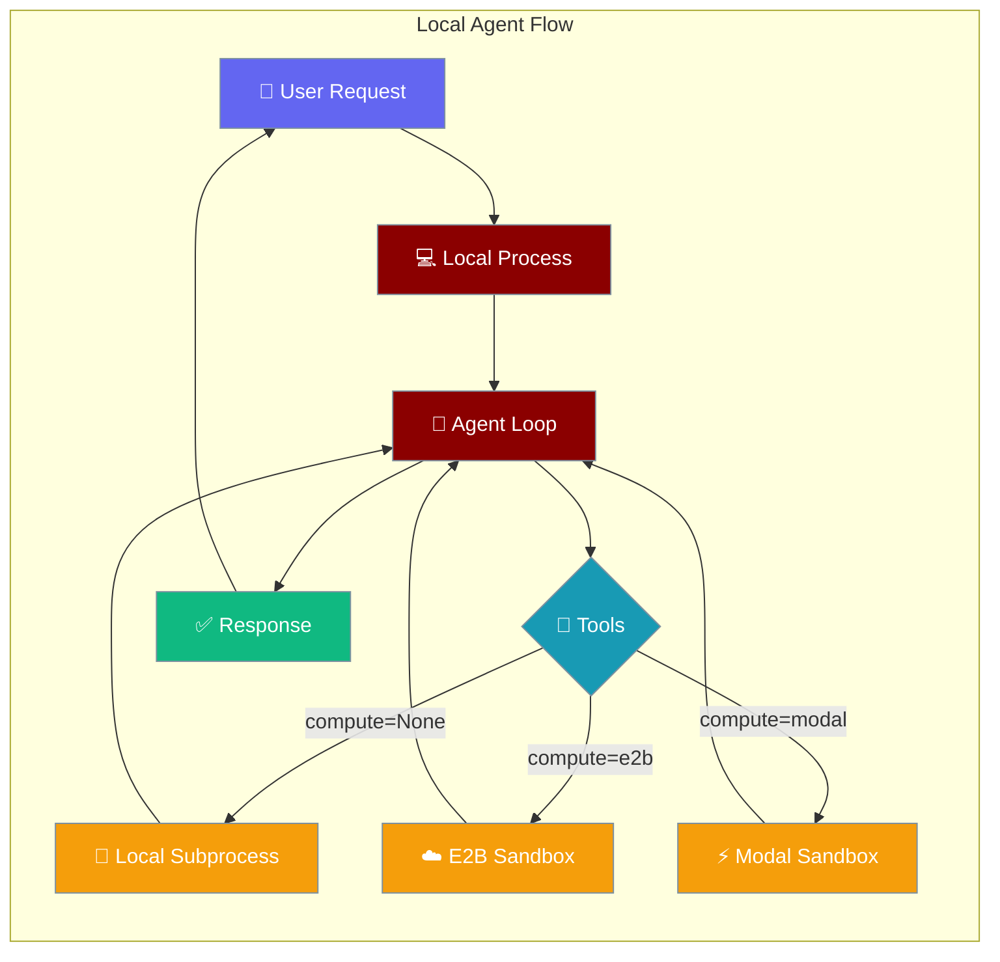
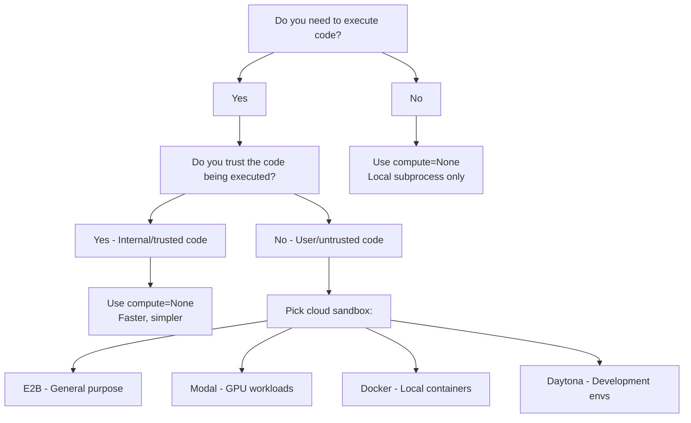
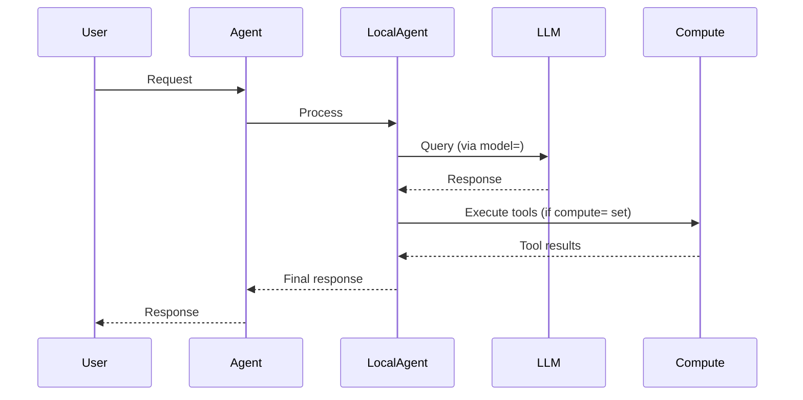

Local Agent runs the agent loop in your process and lets you pick any LLM via `model=`, with optional cloud `compute=` for sandboxing tool execution.



## Quick Start

<Steps>
<Step title="Simplest Local Agent">
```python
from praisonaiagents import Agent
from praisonai import LocalAgent, LocalAgentConfig

agent = Agent(
    name="assistant",
    backend=LocalAgent(
        config=LocalAgentConfig(model="gpt-4o-mini"),
    ),
)

agent.start("What is 2+2?")
```
</Step>

<Step title="With Cloud Compute Sandbox">
```python
from praisonaiagents import Agent
from praisonai import LocalAgent, LocalAgentConfig

agent = Agent(
    name="assistant",
    backend=LocalAgent(
        compute="e2b",  # Sandbox tools in E2B cloud
        config=LocalAgentConfig(
            model="gpt-4o-mini",
            system="You are a coding assistant.",
        ),
    ),
)

agent.start("Write a Python script to calculate fibonacci numbers")
```
</Step>

<Step title="With Different LLMs">
```python
# Gemini
agent = Agent(
    name="gemini-assistant", 
    backend=LocalAgent(
        config=LocalAgentConfig(model="gemini/gemini-2.0-flash"),
    ),
)

# Ollama
agent = Agent(
    name="ollama-assistant",
    backend=LocalAgent(
        config=LocalAgentConfig(model="ollama/llama3.2"),
    ),
)
```
</Step>
</Steps>

---

## Should I Set compute=?



---

## How It Works



The agent loop runs in your local process. LLM choice is made via `config.model=`. Tools can run locally or in cloud sandbox depending on `compute=` setting.

---

## Configuration Options

| Option | Type | Default | Description |
|--------|------|---------|-------------|
| `name` | `str` | `"Agent"` | Agent name |
| `model` | `str` | `"gpt-4o"` | LLM model to use |
| `system` | `str` | Default system prompt | System prompt |
| `tools` | `List[str]` | Default tools | List of tool names |
| `max_turns` | `int` | `25` | Maximum conversation turns |
| `metadata` | `Dict[str, Any]` | `{}` | Additional metadata |
| `working_dir` | `str` | `""` | Working directory for tools |
| `env` | `Dict[str, str]` | `{}` | Environment variables |
| `packages` | `Dict[str, List[str]]` | `None` | Package dependencies |
| `networking` | `Dict[str, Any]` | `{"type": "unrestricted"}` | Network access configuration |
| `host_packages_ok` | `bool` | `False` | Allow installing packages on host |
| `session_title` | `str` | `"PraisonAI local session"` | Session title |
| `on_tool_confirmation` | `Callable` | `None` | Tool confirmation callback |
| `on_custom_tool` | `Callable` | `None` | Custom tool callback |

<Warning>
`LocalAgent(provider=...)` is deprecated and emits a `DeprecationWarning`. LLM choice goes in `config.model=`, sandbox choice goes in `compute=`. No `provider=` overload.
</Warning>

---

## Common Patterns

### Per-LLM Examples

**OpenAI:**
```python
LocalAgent(config=LocalAgentConfig(model="gpt-4o-mini"))
```

**Gemini:**
```python
LocalAgent(config=LocalAgentConfig(model="gemini/gemini-2.0-flash"))
```

**Ollama:**
```python
LocalAgent(config=LocalAgentConfig(model="ollama/llama3.2"))
```

**Anthropic via litellm:**
```python
LocalAgent(config=LocalAgentConfig(model="anthropic/claude-3-5-sonnet-latest"))
```

### Per Compute Backend

**E2B Sandbox:**
```python
LocalAgent(
    compute="e2b",
    config=LocalAgentConfig(model="gpt-4o-mini"),
)
```

**Modal Sandbox:**
```python
LocalAgent(
    compute="modal", 
    config=LocalAgentConfig(model="gpt-4o-mini"),
)
```

**Docker Sandbox:**
```python
LocalAgent(
    compute="docker",
    config=LocalAgentConfig(model="gpt-4o-mini"),
)
```

**No Sandbox (Local):**
```python
LocalAgent(
    compute=None,  # or omit compute= entirely
    config=LocalAgentConfig(model="gpt-4o-mini"),
)
```

### Security Configuration

```python
# Development mode - allow host package installation
LocalAgent(
    config=LocalAgentConfig(
        model="gpt-4o-mini",
        host_packages_ok=True,  # ONLY for development
    ),
)

# Production mode - strict sandboxing
LocalAgent(
    compute="e2b",
    config=LocalAgentConfig(
        model="gpt-4o-mini",
        host_packages_ok=False,  # Default
    ),
)
```

### Custom Tools

```python
def custom_tool_handler(tool_name, tool_input):
    if tool_name == "weather":
        return f"Weather in {tool_input}: Sunny, 72°F"
    return None

LocalAgent(
    config=LocalAgentConfig(
        model="gpt-4o-mini",
        on_custom_tool=custom_tool_handler,
    ),
)
```

---

## Best Practices

<AccordionGroup>
<Accordion title="Choose compute=None for Development">
For rapid development and trusted code:
```python
LocalAgent(config=LocalAgentConfig(model="gpt-4o-mini"))
```
Fastest execution, no sandbox overhead.
</Accordion>

<Accordion title="Use Cloud Sandbox for Production">
For untrusted code or production deployments:
```python
LocalAgent(
    compute="e2b",  # or "modal", "docker"
    config=LocalAgentConfig(model="gpt-4o-mini"),
)
```
Provides isolation and security.
</Accordion>

<Accordion title="Never Set host_packages_ok=True in Production">
This allows package installation on your host system:
```python
# ❌ DANGEROUS in production
host_packages_ok=True

# ✅ SAFE - use cloud sandbox instead
compute="e2b"
```
Only enable `host_packages_ok=True` for development environments you control.
</Accordion>

<Accordion title="LLM Selection Guidelines">
- `gpt-4o-mini` - Fast and cost-effective for most tasks
- `gpt-4o` - More capable reasoning for complex tasks
- `gemini/gemini-2.0-flash` - Google's fast multimodal model
- `ollama/llama3.2` - Local/private inference
- `anthropic/claude-3-5-sonnet-latest` - Via litellm routing
</Accordion>
</AccordionGroup>

---

## Related

<CardGroup cols={2}>
<Card title="Hosted Agent" icon="cloud" href="/docs/features/hosted-agent">
  Cloud-managed runtimes with Anthropic
</Card>
<Card title="Managed Agents" icon="cog" href="/docs/concepts/managed-agents">
  Overview of managed agent backends
</Card>
<Card title="E2B Compute" icon="cube" href="/docs/concepts/managed-agents-e2b">
  E2B sandbox configuration
</Card>
<Card title="Tools" icon="wrench" href="/docs/concepts/tools">
  Available tools and configurations
</Card>
</CardGroup>