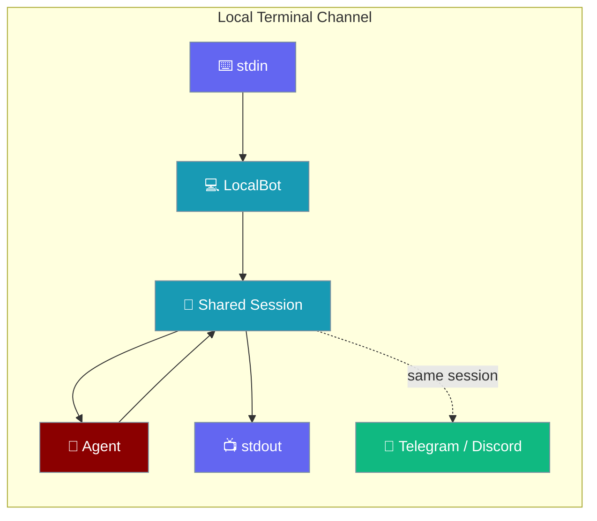
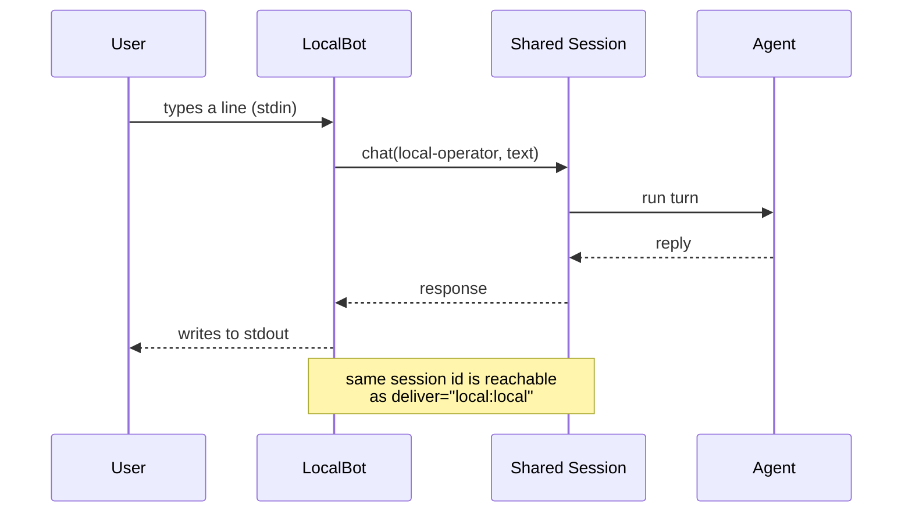
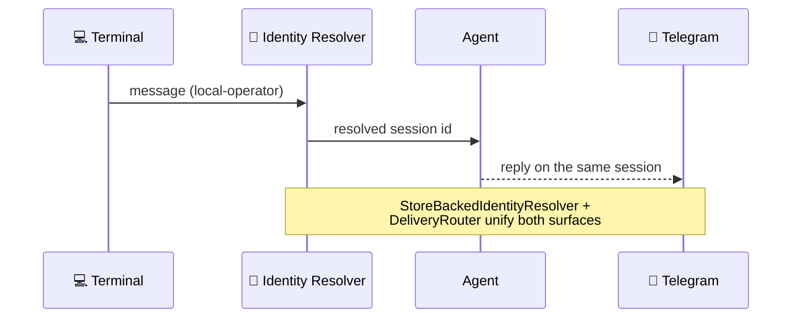

The local channel lets you talk to your gateway agent from your own terminal — the same live session your Telegram or Discord users reach.



## Quick Start

<Steps>
<Step title="Chat in two lines">

The local channel is owner-trusted — no token, no webhook, no setup.

```python
from praisonaiagents import Agent
from praisonai_bot.bots import BotOS

agent = Agent(name="assistant", instructions="Be helpful")
BotOS(agent=agent, platforms=["local"]).run()
```

</Step>

<Step title="Custom prompt">

Set your own input prompt in Python or `gateway.yaml`.

```python
from praisonaiagents import Agent
from praisonai_bot.bots import BotOS

agent = Agent(name="assistant", instructions="Be helpful")
BotOS(agent=agent, platforms={"local": {"prompt": ">>> "}}).run()
```

```yaml
# gateway.yaml
channels:
  local:
    prompt: ">>> "
```

</Step>

<Step title="Terminal + remote in one process">

One process, two surfaces, one shared session — chat locally while Telegram users reach the same agent.

```yaml
# gateway.yaml
channels:
  local: {}
  telegram: { token: "${TELEGRAM_BOT_TOKEN}" }
agents:
  assistant:
    instructions: "You are a helpful assistant."
```

```bash
praisonai-bot gateway start
```

</Step>
</Steps>

---

## User Interaction

Type a line, get a reply. `Ctrl-D` exits cleanly; built-in commands start with `/`.

```
$ praisonai-bot gateway start
Local channel reading from stdin (Ctrl-D to exit; /stop cancels the current run)
you> hi
Hello! How can I help?
you> /status
Bot: assistant · channel: local · uptime: 12s · running
you> /new
Session reset. Send a message to start a new conversation.
you> ^D
Local channel stopped
$
```

---

## How It Works

Each line of stdin becomes one agent turn through the shared `BotSessionManager`, and the reply is written to stdout.



The read loop runs on a dedicated daemon thread so other channels keep running while it waits for input.

### When does it exit?

| Signal | Behaviour |
|--------|-----------|
| `Ctrl-D` / EOF | Clean end of the terminal session |
| `/stop` | Cancels the *current* agent run, keeps the read loop alive |
| `/new` | Resets the local session; next line starts a new conversation |
| Blank line | Ignored |

---

## Built-in Commands

| Command | Description |
|---------|-------------|
| `/status` | Show bot status and info (agent, uptime, running) |
| `/new` | Reset conversation session |
| `/help` | Show the help message (including any custom commands) |
| `/stop` | Cancel the current agent run |

---

## Configuration Options

The local channel is token-free and declares a single config field.

| Option | Type | Default | Description |
|--------|------|---------|-------------|
| `prompt` | `str` | `"you> "` | Terminal input prompt |

Constructor kwargs on `LocalBot`: `token=""` (unused, kept for parity), `agent`, `config`, `prompt`.

<CardGroup cols={2}>
<Card icon="code" href="/sdk/reference/python/classes/LocalBot">
  Python adapter class
</Card>
<Card icon="list" href="/sdk/reference/python/classes/PlatformCapabilities">
  The capability flags a local channel declares
</Card>
</CardGroup>

---

## Capabilities

The local channel declares a TTY-honest capability set so shared engines degrade correctly.

| Capability | Value | Why |
|------------|-------|-----|
| `supports_edit` | `False` | A printed TTY line is not edited in place; streaming falls back to plain appends |
| `supports_typing` | `False` | No "typing…" indicator in a terminal |
| `needs_rate_limit` | `False` | No provider quota to respect |
| `accepts_webhooks` | `False` | Pull-based, not push |
| `supports_media` | `False` | Text only |

The channel's `system_prompt_hint` tells the agent about these constraints: *"You are replying in a local terminal: keep replies plain text; there is no markdown rendering, no message editing and no rate limit."*

<Card icon="sliders" href="/features/bot-platform-capabilities">
  How capabilities drive uniform chunking, streaming, and rate limiting
</Card>

---

## Trust Model

The local operator is owner-trusted: it bypasses pairing and allowlists because it's your own machine — which is why no token is needed. Remote channels, by contrast, require pairing before a stranger can talk to your agent.

The terminal maps to a stable `local-operator` user id and `local` chat id, so it resolves to one durable session across restarts.

---

## Cross-Channel Continuity

A message begun in the terminal continues on a remote platform under one resolved session id via the shared identity resolver and delivery router.



<CardGroup cols={2}>
<Card icon="link" href="/features/gateway-session-continuity">
  Gateway Session Continuity
</Card>
<Card icon="arrow-left-right" href="/features/cross-platform-mirror">
  Cross-Platform Mirror
</Card>
</CardGroup>

### `deliver="local"` — routing outbound to the terminal

Any scheduled job, hook, or agent tool that emits `deliver="local:local"` writes to the terminal exactly like `deliver="telegram:12345"` writes to Telegram.

```python
await botos._delivery_router.deliver("local:local", "proactive-ping")
```

<CardGroup cols={2}>
<Card icon="paper-plane" href="/features/proactive-delivery">
  Proactive Delivery
</Card>
<Card icon="clock" href="/features/scheduler-delivery">
  Scheduler Delivery
</Card>
</CardGroup>

---

## Common Patterns

1. **Dev / smoke-test** a gateway agent before wiring any remote channel.
2. **Single-user personal agent** on your own box — no bot registration.
3. **Start-here, continue-there** — chat locally at your desk, keep the same session going from your phone via Telegram.
4. **Proactive terminal notice** — a scheduled job that pings `deliver="local:local"` prints straight into the operator's terminal.

---

## Best Practices

<AccordionGroup>

<Accordion title="Prefer gateway start for cross-channel continuity">
`praisonai-bot gateway start` joins the gateway's live multiplexed session, identity resolver, and delivery router. `praisonai chat` runs a *separate* process with a *separate* session and does not.
</Accordion>

<Accordion title="Use /new to reset — not restart">
Resetting the session is cheaper than restarting the process, and any other running channels stay live.
</Accordion>

<Accordion title="Keep replies plain text in local-only agents">
A TTY has no markdown rendering. If you also serve remote channels from the same agent, the `system_prompt_hint` already tells the agent this.
</Accordion>

<Accordion title="Ctrl-D is the clean way to exit">
The read loop is intentionally not supervised (`supervised_inbound = False`), so EOF ends cleanly and the process exits without a reconnect storm.
</Accordion>

</AccordionGroup>

---

## Related

<CardGroup cols={2}>
<Card title="Gateway & Control Plane" icon="network-wired" href="/gateway">
  The gateway the local channel joins
</Card>
<Card title="Channels Gateway" icon="comments" href="/features/channels-gateway">
  Connect agents to every built-in channel
</Card>
<Card title="Multi-Channel Bots" icon="users" href="/features/multi-channel-bots">
  Run local + remote channels together
</Card>
<Card title="Bot Chat Commands" icon="terminal" href="/features/bot-commands">
  `/status`, `/new`, `/help`, `/stop`
</Card>
</CardGroup>
