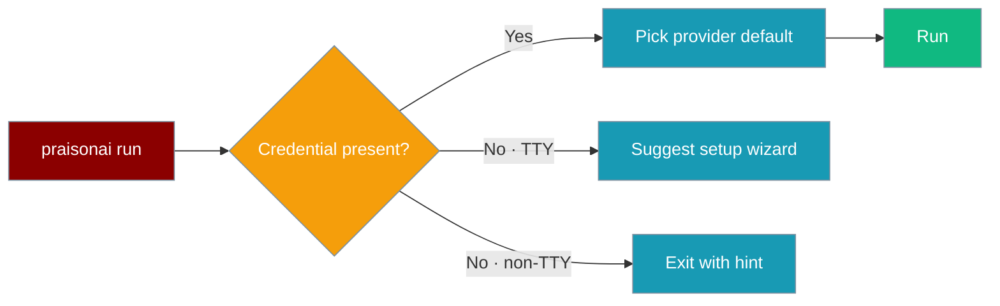
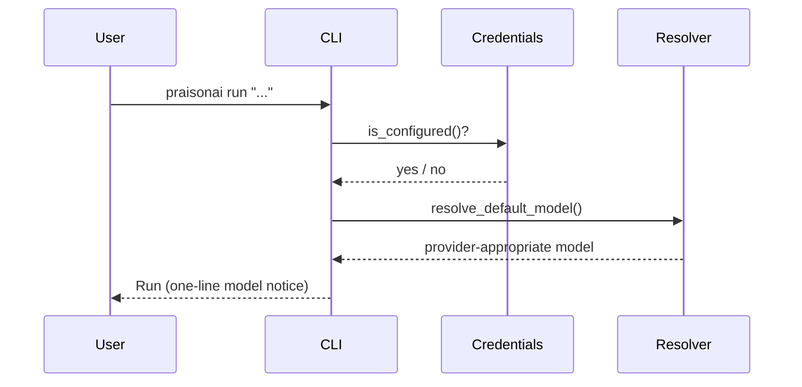

The terminal CLI picks a sensible default model from whichever provider credential is present, so `praisonai run "..."` works without passing `--model`.

```python
from praisonaiagents import Agent

agent = Agent(name="local-first", instructions="Answer clearly and briefly.")
agent.start("Explain black holes to a 5-year-old")
```



## Quick Start

<Steps>
<Step title="Point at a local model (optional)">
Run an OpenAI-compatible endpoint such as Ollama, then export its host.

```bash
ollama pull llama3.2 && ollama serve
export OLLAMA_HOST=http://127.0.0.1:11434
```
</Step>

<Step title="Run with no --model">
The CLI resolves a provider-appropriate default from your environment.

```bash
praisonai run "Explain black holes to a 5-year-old"
```
</Step>

<Step title="Override the endpoint (optional)">
Point at any OpenAI-compatible server without editing config.

```bash
export OPENAI_BASE_URL=http://localhost:11434/v1
praisonai run "Summarise today's news"
```
</Step>
</Steps>

---

## How It Works

The CLI checks for a credential, then resolves a default model before running.



`is_configured()` treats a run as ready when any provider key is set (env var or stored credential). `resolve_default_model()` then chooses the model, persisting only user-chosen models for next time.

---

## Detection Order

The default model follows a fixed precedence.

| Priority | Signal | Behaviour |
|----------|--------|-----------|
| 1 | Explicit `--model` / config / YAML | Wins; persisted as the recent model |
| 2 | Recent model (`~/.praison/state/model.json`) | Reused from the last user-chosen run |
| 3 | `MODEL_NAME` / `OPENAI_MODEL_NAME` | Honoured for backward compatibility |
| 4 | Provider credential present | Provider-appropriate default inferred |
| 5 | None of the above | `gpt-4o-mini` fallback |

Provider-inferred default models per credential:

| Credential env var | Default model |
|--------------------|---------------|
| `OPENAI_API_KEY` | `gpt-4o-mini` |
| `ANTHROPIC_API_KEY` | `anthropic/claude-3-5-sonnet-latest` |
| `GEMINI_API_KEY` | `gemini/gemini-1.5-flash` |
| `GOOGLE_API_KEY` | `google/gemini-1.5-flash` |
| `GROQ_API_KEY` | `groq/llama-3.3-70b-versatile` |
| `COHERE_API_KEY` | `cohere/command-r` |
| `OPENROUTER_API_KEY` | `openrouter/openai/gpt-4o-mini` |
| `OLLAMA_HOST` | `ollama/llama3.2` |

When a provider-inferred default is used, the CLI prints one transparency line, for example:
`No model set; using ollama/llama3.2 because OLLAMA_HOST is present.`

---

## Credential Gate

The run behaves differently when no credential is found, depending on whether the terminal is interactive.

| Condition | Behaviour |
|-----------|-----------|
| No credential, interactive TTY | Offers the `praisonai setup` wizard, then continues |
| No credential, non-TTY / CI / JSON mode | Prints `No API key configured. Run: praisonai setup` and exits `1` |

<Warning>
CI and non-interactive runs still fail fast without a credential. Set a provider key (or `OLLAMA_HOST`) in the environment before running headless.
</Warning>

---

## Endpoint Environment Variables

Point the CLI at any OpenAI-compatible endpoint without editing config files.

| Variable | Purpose |
|----------|---------|
| `OPENAI_BASE_URL` | Base URL for OpenAI-compatible endpoints (checked first) |
| `OPENAI_API_BASE` | Alternate base-URL variable |
| `OLLAMA_API_BASE` | Base URL for a local Ollama server |
| `OLLAMA_HOST` | Marks Ollama as available; infers `ollama/llama3.2` |
| `MODEL_NAME` / `OPENAI_MODEL_NAME` | Force a specific default model |

---

## Best Practices

<AccordionGroup>
<Accordion title="Prefer a local model for prototyping">
Set `OLLAMA_HOST` and let the CLI infer `ollama/llama3.2`. No cloud key or cost while you iterate.
</Accordion>

<Accordion title="Fall back to cloud with one env var">
Set a provider key like `OPENAI_API_KEY`. The next run picks that provider's default automatically.
</Accordion>

<Accordion title="Pin a model to skip inference">
Pass `--model` or set `MODEL_NAME`. Both win over inference and the explicit value is remembered for later runs.
</Accordion>

<Accordion title="Keep CI deterministic">
Export a real credential in CI. Non-interactive runs never prompt and exit `1` when nothing is configured.
</Accordion>
</AccordionGroup>

---

## Related

<CardGroup cols={2}>
<Card title="Setup" icon="key" href="/docs/cli/setup">
Interactive wizard for storing provider credentials.
</Card>
<Card title="Models" icon="database" href="/docs/models">
Supported providers and model identifiers.
</Card>
</CardGroup>
