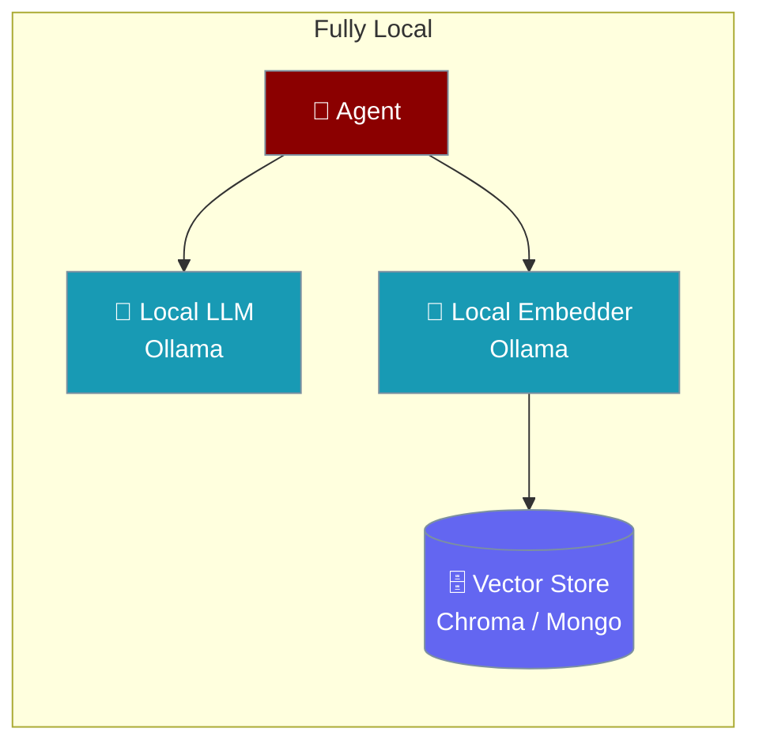
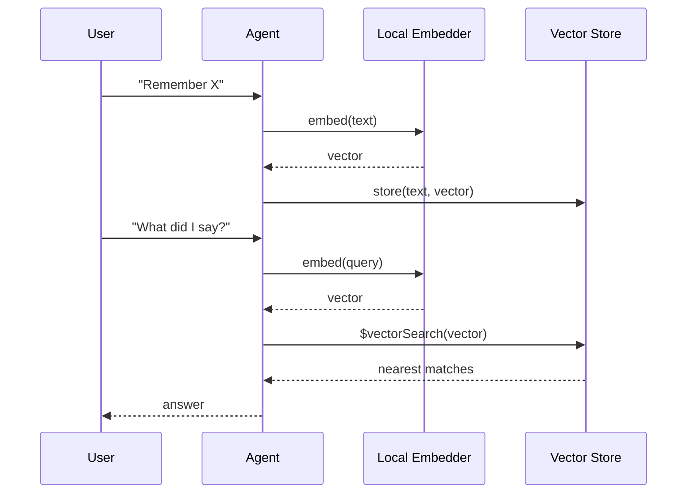
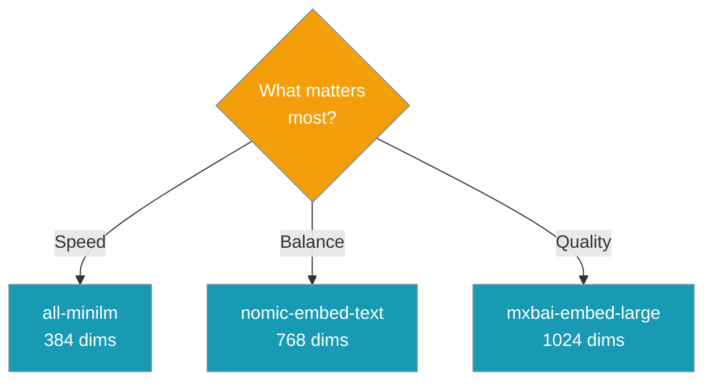

Keep both memory and knowledge on your own machine — a local LLM answers, a local Ollama embedder builds the vectors, and a local vector store holds them.

<Warning>
**Fixed in PraisonAI PR [#4870](https://github.com/MervinPraison/PraisonAI/pull/4870).** Before this fix, `Agent(llm="local", knowledge=[...])` routed chat to your local server **but embeddings to OpenAI** — silently sending your documents and queries off the machine with a `200` back. If you deployed a local agent before this release without hand-configuring the embedder block below, treat the vector store as compromised and re-index from a fresh store.
</Warning>



## Auto-selection with `llm="local"`

Since PR #4870, `Agent(llm="local", memory=..., knowledge=[...])` auto-configures a local embedder — no embedder block needed.

```python
from praisonaiagents import Agent

agent = Agent(
    instructions="Answer from the handbook",
    llm="local",
    knowledge=["handbook.pdf"],
)
agent.start("What's the refund policy?")
```

The agent:

1. Resolves a running local server (Ollama, llama.cpp, LM Studio, vLLM).
2. Picks an embedding-capable model from the server's listing (preferring `nomic-embed-text`, then `mxbai-embed-large`, `bge-m3`, `snowflake-arctic-embed`, `all-minilm`). Fourteen locally-served embedders now carry measured dimensions — see [Vector store is now sized correctly](#vector-store-is-now-sized-correctly).
3. Sets the embedder to point at the same local server.

Pin a specific embedder with `PRAISONAI_LOCAL_EMBED_MODEL=<name>` (accepts a bare name like `all-minilm` or the tagged id `all-minilm:latest`).

If the local server serves **no** embedding model, the agent logs a warning and does not silently fall back to a remote provider — pull one (`ollama pull nomic-embed-text`) or configure the block manually below.

```mermaid
sequenceDiagram
    participant Agent
    participant Resolver as local resolver
    participant Server as local server
    participant Store as vector store

    Agent->>Resolver: llm="local", knowledge=[...]
    Resolver->>Server: list models
    Server-->>Resolver: models[]
    alt embedding model present
        Resolver-->>Agent: pick nomic-embed-text
        Agent->>Server: embed(chunks)
        Server-->>Agent: vectors
        Agent->>Store: write
    else no embedder available
        Resolver-->>Agent: warn: no local embedder
        Note over Agent: does NOT silently fall back to OpenAI
    end

    classDef agent fill:#8B0000,stroke:#7C90A0,color:#fff
    classDef process fill:#189AB4,stroke:#7C90A0,color:#fff
    classDef success fill:#10B981,stroke:#7C90A0,color:#fff
    classDef warn fill:#F59E0B,stroke:#7C90A0,color:#fff

    class Agent agent
    class Resolver,Server process
    class Store success
```

An explicitly configured embedder always wins — auto-selection only fills a gap.

---

## Quick Start

<Steps>
<Step title="Pull the embedder">

```bash
ollama pull nomic-embed-text
```

</Step>

<Step title="Local memory">

The `embedder` block below is only needed when the LLM is **not** `"local"`, or when you want to override the auto-selected model.

```python
from praisonaiagents import Agent

agent = Agent(
    name="assistant",
    instructions="Remember facts across sessions.",
    memory={
        "provider": "mongodb",
        "config": {
            "connection_string": "mongodb://localhost:27017/",
            "database": "praisonai",
            "use_vector_search": True,
            "embedder": {
                "provider": "ollama",
                "config": {"model": "nomic-embed-text"},
            },
        },
    },
)
agent.start("Remember that my favourite colour is teal")
```

</Step>

<Step title="Add local knowledge">

The `embedder` block below is only needed when the LLM is **not** `"local"`, or when you want to override the auto-selected model.

```python
from praisonaiagents import Knowledge

kb = Knowledge(config={
    "vector_store": {
        "provider": "mongodb",
        "config": {
            "connection_string": "mongodb://localhost:27017/",
            "database": "praisonai",
            "collection": "handbook",
        },
    },
    "embedder": {
        "provider": "ollama",
        "config": {"model": "nomic-embed-text"},
    },
})

kb.add("Refunds are processed within 14 days.")
kb.search("refund window")
```

</Step>
</Steps>

<Note>
Install the MongoDB extra first: `pip install "praisonaiagents[mongodb]"`. Chroma is the default local vector store and needs no extra service.
</Note>

---

## How It Works

The same `embedder` block drives memory and knowledge — embed, store, and query all stay on your machine.



The SDK now sizes the vector index at the model's real dimension — `nomic-embed-text` is 768, not the 1536 default it was silently written as before [PR #4802](https://github.com/MervinPraison/PraisonAI/pull/4802).

---

## Vector store is now sized correctly

Since [PR #4924](https://github.com/MervinPraison/PraisonAI/pull/4924), the local embedder config carries `embedding_dims` all the way to the vector store — sourced from the running server first (via `/api/show`), then from PraisonAI's dimension table, and **omitted rather than guessed** when unknown.

A guessed width is worse than none: an index built at the wrong width either rejects every write or silently returns stale nearest neighbours. Before the fix, a store built for `bge-m3` (1024) was silently sized at 1536 — every write to a fresh Chroma collection failed.

Measured widths for locally-served embedders:

| Embedder | Width |
|---|---|
| `nomic-embed-text` | 768 |
| `mxbai-embed-large` | 1024 |
| `all-minilm` | 384 |
| `bge-m3`, `bge-large` | 1024 |
| `bge-base`, `paraphrase-multilingual` | 768 |
| `bge-small`, `granite-embedding` | 384 |
| `snowflake-arctic-embed`, `snowflake-arctic-embed2` | 1024 |
| `qwen3-embedding` | 1024 |

The mem0 provider config for a local embedder now carries `embedding_dims` alongside `model`:

```python
embedder = {
    "provider": "ollama",
    "config": {"model": "bge-m3", "embedding_dims": 1024},
}
```

When the probe supplies a width, PraisonAI uses it; when it doesn't, the table fills the gap; when the model is unknown, the field is omitted so the store infers the width from the first vector — never the 1536 default.

---

## Choosing a Local Embedder

Pick by what matters most: speed, balance, or quality.



| Model | Dimensions | Best for |
|-------|------------|----------|
| `all-minilm` | 384 | Fastest, smallest footprint |
| `nomic-embed-text` | 768 | Balanced default |
| `mxbai-embed-large` | 1024 | Highest quality |

---

## Common Patterns

Local memory with a local LLM:

```python
from praisonaiagents import Agent

agent = Agent(
    name="assistant",
    llm="ollama/llama3.2",
    memory={
        "provider": "mongodb",
        "config": {
            "connection_string": "mongodb://localhost:27017/",
            "database": "praisonai",
            "use_vector_search": True,
            "embedder": {"provider": "ollama", "config": {"model": "nomic-embed-text"}},
        },
    },
)
agent.start("Remember I prefer metric units")
```

Local knowledge with the `Knowledge` class:

```python
from praisonaiagents import Knowledge

kb = Knowledge(config={
    "vector_store": {
        "provider": "mongodb",
        "config": {
            "connection_string": "mongodb://localhost:27017/",
            "database": "praisonai",
            "collection": "handbook",
        },
    },
    "embedder": {"provider": "ollama", "config": {"model": "nomic-embed-text"}},
})
kb.add("Onboarding takes three steps: sign in, verify email, join a team.")
kb.search("onboarding steps")
```

Both together — one local LLM for memory, one local embedder for knowledge:

```python
from praisonaiagents import Agent, Knowledge

local_embedder = {"provider": "ollama", "config": {"model": "nomic-embed-text"}}

kb = Knowledge(config={
    "vector_store": {
        "provider": "mongodb",
        "config": {
            "connection_string": "mongodb://localhost:27017/",
            "database": "praisonai",
            "collection": "handbook",
        },
    },
    "embedder": local_embedder,
})
kb.add("Support hours are 9-5 UTC.")

agent = Agent(
    name="assistant",
    llm="ollama/llama3.2",
    memory={
        "provider": "mongodb",
        "config": {
            "connection_string": "mongodb://localhost:27017/",
            "database": "praisonai",
            "use_vector_search": True,
            "embedder": local_embedder,
        },
    },
)
agent.start("What did we agree on last session?")
```

---

## Best Practices

<AccordionGroup>
<Accordion title="Re-create the vector index when you change the embedder">
Atlas vector indexes are built for a fixed dimension. Moving from `text-embedding-3-small` (1536) to `nomic-embed-text` (768) means dropping and re-creating `vector_index` at the new size — otherwise writes succeed but searches error or return nothing.
</Accordion>

<Accordion title="Pull the embedder before running">
The first embed call fails cold if the model isn't downloaded. Run `ollama pull nomic-embed-text` before starting the agent.
</Accordion>

<Accordion title="Set api_base when Ollama isn't on localhost">
Ollama defaults to `http://localhost:11434`. Point elsewhere by setting `api_base` explicitly on the embedder call or `OLLAMA_HOST` in the environment.
</Accordion>

<Accordion title="Prefer the embedder block form">
The `{"provider": "...", "config": {"model": "..."}}` block works identically across memory, knowledge, and the MongoDB adapters — reuse one dict everywhere.
</Accordion>
</AccordionGroup>

---

## Related

<CardGroup cols={2}>
  <Card title="MongoDB Memory" icon="brain" href="/features/mongodb-memory">
    Configure the embedder on the MongoDB memory store
  </Card>
  <Card title="MongoDB Knowledge" icon="book" href="/features/mongodb-knowledge">
    Scoped, vector-searchable knowledge in MongoDB
  </Card>
  <Card title="Ollama Embeddings" icon="server" href="/embeddings/providers/ollama">
    Local embedding models and auto-detected dimensions
  </Card>
  <Card title="Local Models" icon="server" href="/features/local-models">
    Run the LLM side fully local
  </Card>
</CardGroup>
