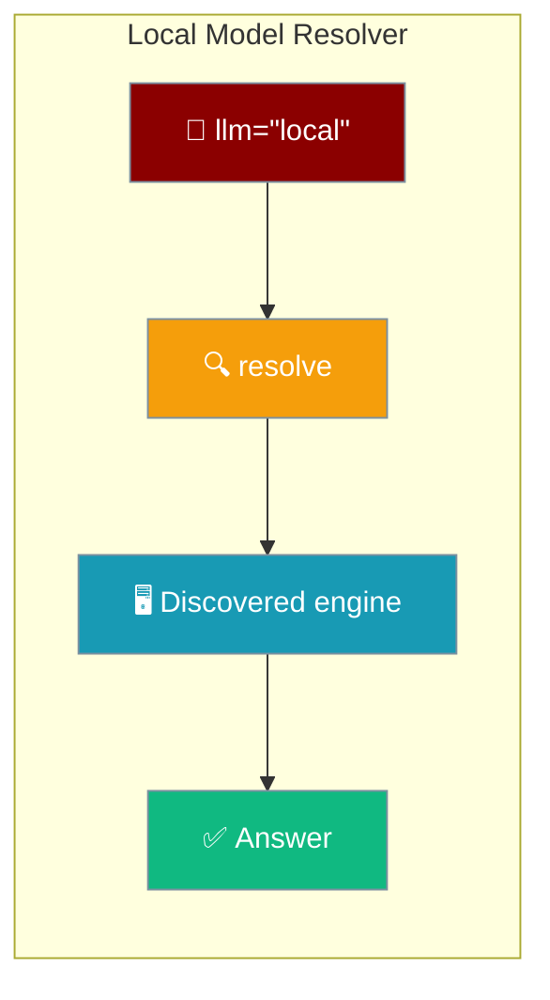
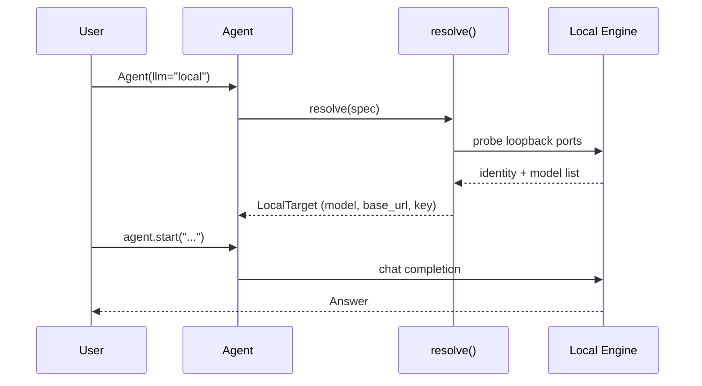
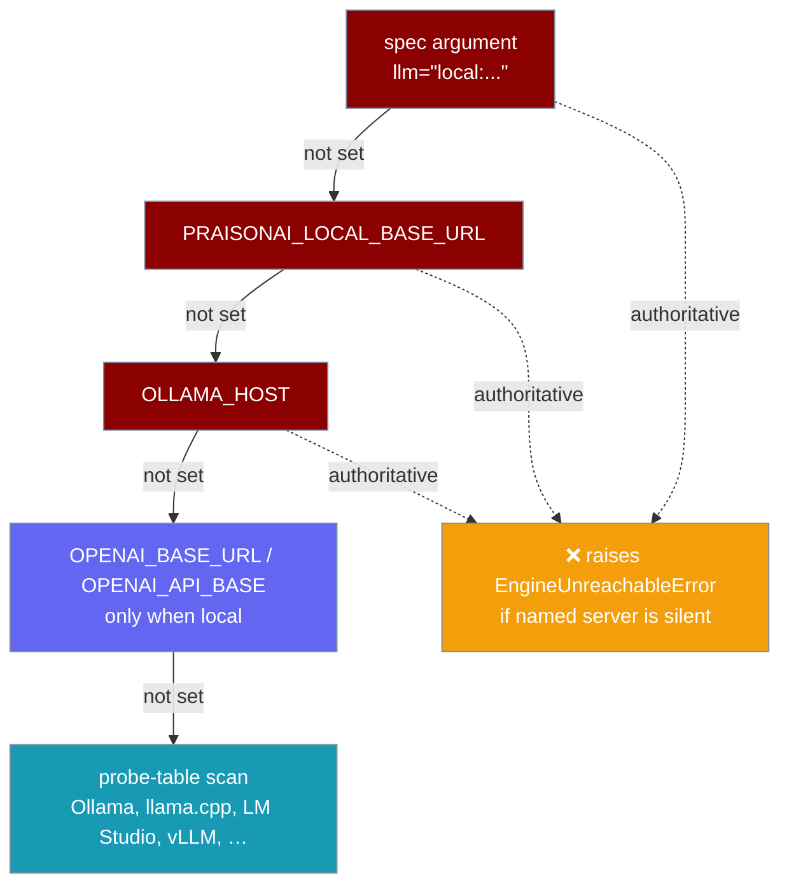
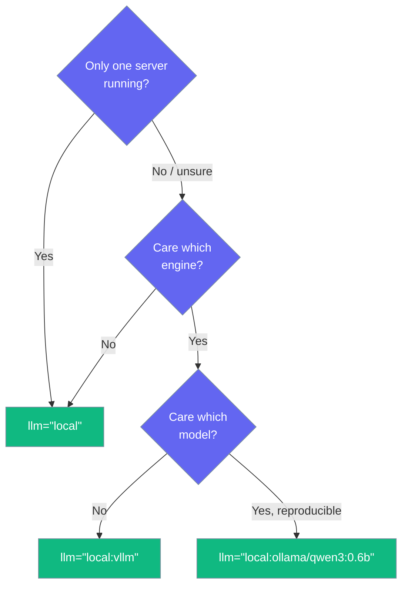

Set `llm="local"` and the agent finds a running local model server, picks the best model on it, and configures itself — no URL, no model name, no key.

```python
from praisonaiagents import Agent

agent = Agent(instructions="You are helpful", llm="local")
agent.start("Why is the sky blue?")
```



Discovery fires **only** when `llm="local"`. Passing `gpt-4o`, `ollama/llama3.2`, or `anthropic/…` runs **zero** probes.

## Quick Start

<Steps>
<Step title="Discover whatever is running">
Start any local server (Ollama, llama.cpp, LM Studio, vLLM), then run four lines.

```python
from praisonaiagents import Agent

agent = Agent(instructions="You are helpful", llm="local")
agent.start("Why is the sky blue?")
```

No `OPENAI_BASE_URL`, no `ollama/` prefix, no model name.
</Step>

<Step title="Pin an engine, let it pick the model">
Name the engine and the resolver chooses the best model on it.

```python
from praisonaiagents import Agent

agent = Agent(instructions="You are helpful", llm="local:ollama")
agent.start("Explain gravity in one sentence")
```

Swap `ollama` for `llama_cpp`, `lm_studio`, `vllm`, `mlx_lm`, or `transformers_serve`.
</Step>

<Step title="Pin engine and model">
Name both for reproducibility.

```python
from praisonaiagents import Agent

agent = Agent(instructions="You are helpful", llm="local:ollama/qwen3:0.6b")
agent.start("Summarize the water cycle")
```
</Step>
</Steps>

---

## How It Works

The agent calls the resolver, which probes loopback ports, identifies the engine, selects a model, and returns a target the normal LLM path uses unchanged.



The resolver never infers identity from a port — a server matches only when its probe rules hold. This prevents silently talking to the wrong server.

### Precedence ladder

The resolver checks sources in a fixed order. The **first three are authoritative**: if one names a server that does not answer, resolution **raises** instead of quietly probing another port.



---

## Which option should I pick?

Pick the shortest spec that gives you the certainty you need.



---

## Supported local engines

Identity is decided by probe rules, never by the port — several engines share `:8080` and `:8000`.

| Engine (`llm="local:<engine>"`) | Default port | Identity probe |
|---|---|---|
| `ollama` | `11434` | `GET /` returns `Ollama is running` |
| `llama_cpp` | `8080` | `GET /health` ok **and** `GET /props` has `build_info` |
| `mlx_lm` | `8080` | `GET /health` ok, `GET /props` **absent**, `GET /v1/models` has `data` |
| `lm_studio` | `1234` | `GET /api/v0/models` has `data` |
| `vllm` | `8000` | `GET /version` has `version` |
| `transformers_serve` | `8000` | `GET /version` **absent**, `GET /health` ok, `GET /v1/models` has `data` |

<Note>
`llama_cpp` and `mlx_lm` both default to `:8080`; `vllm` and `transformers_serve` both default to `:8000`. The "absent" rules (e.g. `/props` absent, `/version` absent) separate the co-tenants on each port.
</Note>

---

## Environment Variables

Every source is optional. The three authoritative sources raise when they name an unreachable server.

| Variable | Purpose | Default |
|---|---|---|
| `PRAISONAI_LOCAL_BASE_URL` | Authoritative base URL — if set and unreachable, resolution **raises** | *(none)* |
| `PRAISONAI_LOCAL_ENGINE` | Pin the expected engine (`ollama`, `llama_cpp`, `lm_studio`, `vllm`, …) | *(none)* |
| `PRAISONAI_LOCAL_MODEL` | Pin the model id | *(none)* |
| `PRAISONAI_LOCAL_TTL` | Positive-result cache seconds | `30` |
| `PRAISONAI_LOCAL_NEG_TTL` | Negative-result cache seconds | `5` |
| `PRAISONAI_LOCAL_TIMEOUT` | Total resolve budget in seconds (clamped `0.05`–`30`; per-probe is `0.4`) | `1.5` |
| `OLLAMA_HOST` | Authoritative Ollama host (see the port-80 gotcha below) | *(none)* |
| `OPENAI_BASE_URL` / `OPENAI_API_BASE` | Honoured **only** when the host is local (`127.0.0.1`, `localhost`, private) | *(none)* |

---

## How model selection works

When you do not name a model, the resolver ranks the server's models and picks the best one to chat with.

- **Tools-capable models rank first** — an agent that can call tools is preferred.
- **Embedding-only models rank last** — an embedder cannot hold a conversation, so it is never picked by accident.
- **Ties break by recency** — among equally-capable models, the newest wins.

**Worked example.** On a machine serving `qwen3:0.6b`, `all-minilm`, `nomic-embed-text`, and `mxbai-embed-large`, the resolver picks `qwen3:0.6b` — even when the embedders are newer — because the three embed-only models are ranked last.

<Note>
An explicitly named model must actually be served. `llm="local:ollama/does-not-exist"` raises `ModelNotAvailableError` and lists what is available, rather than sending a phantom model to the server.
</Note>

---

## Errors and gotchas

The resolver fails loudly and specifically instead of guessing.

<AccordionGroup>
<Accordion title="NoLocalEngineError — nothing answered">
No server responded on any probed port. Start one (`ollama serve`, then `ollama pull qwen3:0.6b`) or set `PRAISONAI_LOCAL_BASE_URL` to its address.
</Accordion>

<Accordion title="EngineUnreachableError — a named server is silent">
An authoritative source (the `spec`, `PRAISONAI_LOCAL_BASE_URL`, or `OLLAMA_HOST`) named a server that did not answer. Because it was named explicitly, the resolver does **not** fall through to another port — it raises so you fix the real target.
</Accordion>

<Accordion title="HostHeaderRejectedError — Ollama refused the Host header">
The server returned a bodyless HTTP 403. Ollama rejects any request whose `Host` header is not `localhost` or an IP address. Set `OLLAMA_HOST` on the server to allow the origin.
</Accordion>

<Accordion title="ModelNotAvailableError — that model is not served">
A specific model was requested but the engine does not have it. Pull it or name one from the list the error prints.
</Accordion>

<Accordion title="InvalidLocalSpecError — the spec could not be parsed">
The `llm="local:..."` string was malformed. Expected forms: `"local"`, `"local:<engine>"`, `"local:<engine>/<model>"`, a base URL, or `"<url>#<model>"`.
</Accordion>

<Accordion title="OLLAMA_HOST port-80 trap">
Setting `OLLAMA_HOST` to a scheme with no port means **port 80**, not 11434. The resolver names this exact trap in the error:

```
Local runtime at http://127.0.0.1:80 did not answer (refused). It was named
explicitly by OLLAMA_HOST='http://127.0.0.1', so no other port was probed.
Note that OLLAMA_HOST with an explicit http:// scheme and no port means port
80, not 11434.
```

Use `OLLAMA_HOST=127.0.0.1:11434` (bare host defaults to 11434) instead.
</Accordion>
</AccordionGroup>

---

## Performance notes

Resolution is opt-in and cheap.

- Discovery fires **only** for `llm="local"` — cloud models trigger zero probes.
- Importing `praisonaiagents` does not import the resolver, so import time is unchanged.
- A full resolve issues a handful of loopback HTTP requests and caches the result for 30 s (`PRAISONAI_LOCAL_TTL`).
- The whole scan is budgeted (`PRAISONAI_LOCAL_TIMEOUT`, default 1.5 s; per-probe 0.4 s), so nothing stalls when no server is listening.

---

## Explicit vs implicit local

`llm="local"` is the **explicit** request — you ask for a local model by name. The [keyless local-first fallback](/features/keyless-local-first-run) is the **implicit** form — it only kicks in when no cloud key is set and you named no model at all.

| | Explicit `llm="local"` | Implicit keyless fallback |
|---|---|---|
| Trigger | You pass `llm="local"` | No cloud key **and** no `--model` |
| Silent fallthrough | Never — authoritative sources raise | Falls back to `gpt-4o-mini` |
| Engine choice | Full probe table (Ollama, llama.cpp, LM Studio, vLLM, mlx_lm, transformers serve) | Ollama `/api/tags`, then `/v1/models` |

---

## Related

<CardGroup cols={2}>
  <Card title="Models" icon="brain" href="/models">
    Provider auto-detection and the full model-selection precedence.
  </Card>
  <Card title="Keyless Local-First Run" icon="server" href="/features/keyless-local-first-run">
    The implicit local fallback when no cloud key is set.
  </Card>
  <Card title="Local Models" icon="microchip" href="/features/local-models">
    Point PraisonAI at Ollama or any OpenAI-compatible server.
  </Card>
  <Card title="Ollama" icon="dragon" href="/models/ollama">
    Use Ollama models with PraisonAI.
  </Card>
</CardGroup>
