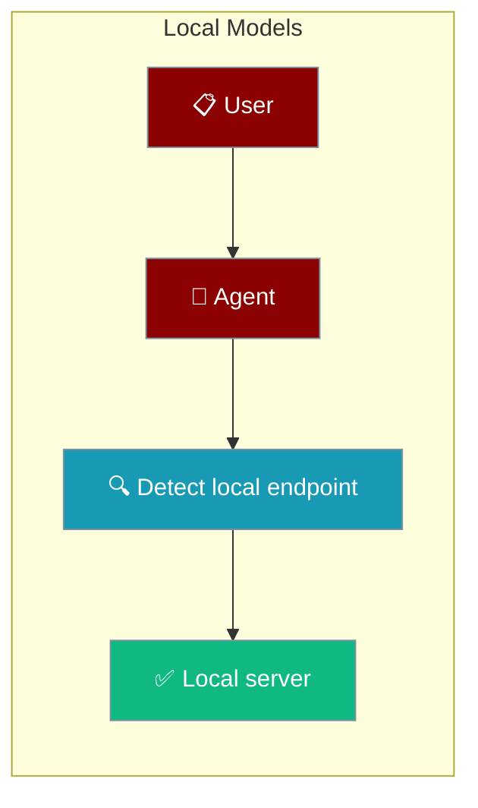

Point PraisonAI at Ollama, LM Studio, llama.cpp, or vLLM — no cloud key required.

```python
from praisonaiagents import Agent

agent = Agent(
    name="Local Assistant",
    instructions="Answer briefly",
    llm="ollama/llama3.2",
)
agent.start("Why is the sky blue?")
```



## Quick Start

<Steps>
<Step title="Zero-config with Ollama">
Start Ollama, pull a model, and run — PraisonAI detects the endpoint when no cloud key is set.

```bash
ollama serve
ollama pull llama3.2
praisonai run "hello"
# > No cloud key found; using local model ollama/llama3.2.
```
</Step>

<Step title="Point at any OpenAI-compatible server">
Set `OPENAI_BASE_URL` to target LM Studio, llama.cpp, or vLLM.

```bash
export OPENAI_BASE_URL=http://localhost:1234/v1
praisonai run "hello"
```
</Step>
</Steps>

---

## How It Works

PraisonAI probes for a reachable local server only when no cloud provider key is set, then adopts the first model it finds.

```mermaid
sequenceDiagram
    participant CLI
    participant Detect as detect_local_model
    participant Server as Local Server

    CLI->>Detect: no cloud key — probe?
    Detect->>Server: GET /api/tags
    Server-->>Detect: models[0].name → ollama/<name>
    Detect->>Server: GET /v1/models (fallback)
    Server-->>Detect: data[0].id → openai/<id>
    Detect-->>CLI: LocalModel(model, base_url)

    classDef cli fill:#8B0000,stroke:#7C90A0,color:#fff
    classDef process fill:#189AB4,stroke:#7C90A0,color:#fff
    classDef output fill:#10B981,stroke:#7C90A0,color:#fff

    class CLI cli
    class Detect process
    class Server output
```

| Server type | Probed path | Resolved model id |
|---|---|---|
| Ollama | `GET /api/tags` (at the root, not `/v1/api/tags`) | `ollama/<first-model-name>` |
| Generic OpenAI-compatible (llama.cpp, LM Studio, vLLM) | `GET /v1/models` | `openai/<first-id>` |

Detection is timeout-bounded (~150 ms) and caches negatives for 30 s, so the first-run hot path stays fast when nothing is listening.

---

## Configuration Options

| Env var | Meaning | Default |
|---|---|---|
| `OPENAI_BASE_URL` | Any OpenAI-compatible base URL (with or without `/v1`) | — |
| `OLLAMA_HOST` | Ollama root (`host:port` allowed — a scheme is added if missing) | — |
| (none set) | Probe `http://127.0.0.1:11434` | — |
| `PRAISONAI_HOME` | Where session / credential data lives | `~/.praisonai` |

Precedence (first match wins): `--model <name>` → any cloud provider key → reachable local endpoint (`OPENAI_BASE_URL` → `OLLAMA_HOST` → `127.0.0.1:11434`) → `gpt-4o-mini` fallback.

---

## Common Patterns

<CodeGroup>
```bash Ollama
ollama serve
ollama pull llama3.2
praisonai run "hello"
```

```bash LM Studio
export OPENAI_BASE_URL=http://localhost:1234/v1
praisonai run "hello"
```

```bash llama.cpp
export OPENAI_BASE_URL=http://localhost:8080/v1
praisonai run "hello"
```

```bash vLLM
export OPENAI_BASE_URL=http://localhost:8000/v1
praisonai run "hello"
```
</CodeGroup>

Pin a specific model explicitly with `--model`:

```bash
praisonai run "hello" --model ollama/llama3.2
```

---

## Best Practices

<AccordionGroup>
<Accordion title="Detection stays off the hot path">
The probe runs only when no cloud key is set, times out at ~150 ms, and caches negatives for 30 s — a first run with nothing listening is not slowed down.
</Accordion>

<Accordion title="Cloud keys always win">
Any cloud provider key (e.g. `OPENAI_API_KEY`, `ANTHROPIC_API_KEY`) skips the local probe entirely. `OLLAMA_HOST` is not a cloud key, so it participates in local detection instead.
</Accordion>

<Accordion title="Use --model to override detection">
Pass `--model ollama/llama3.2` (or any id) to bypass auto-detection and target an exact model.
</Accordion>

<Accordion title="Relocate state with PRAISONAI_HOME">
Set `PRAISONAI_HOME` to move sessions, credentials, and cache in one place — handy for Nix, Docker, or Snap packaging. Defaults to `~/.praisonai`.
</Accordion>
</AccordionGroup>

---

## Related

<CardGroup cols={2}>
  <Card title="Provider Auto-Detection" icon="brain" href="/docs/models#keyless-local-first-fallback-no-env-vars-set">
    The full precedence reference for model resolution.
  </Card>
  <Card title="First-run Onboarding" icon="key-round" href="/docs/features/first-run-onboarding">
    The complete credential resolution ladder.
  </Card>
</CardGroup>
