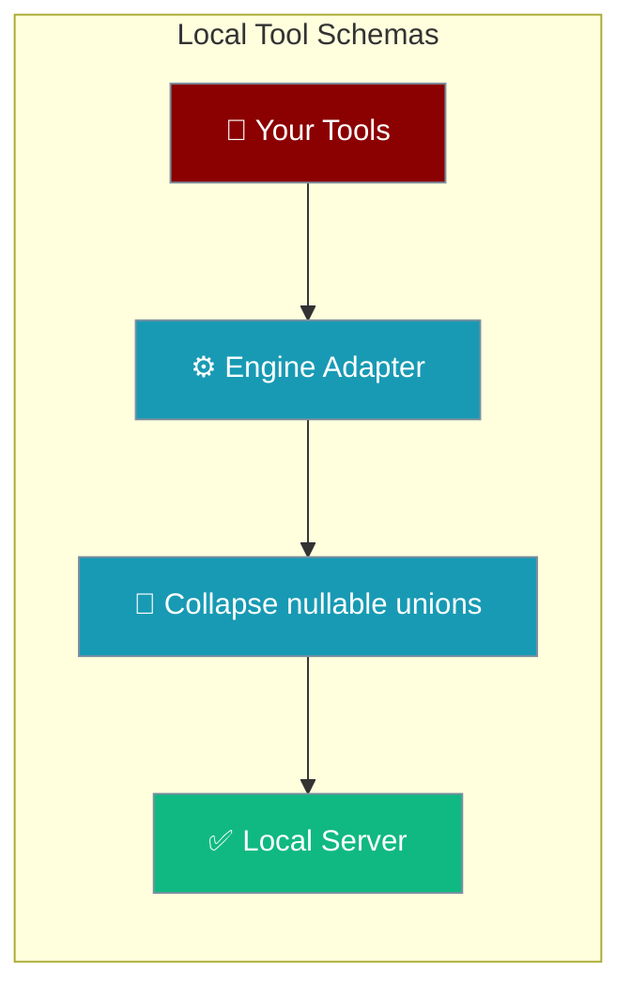
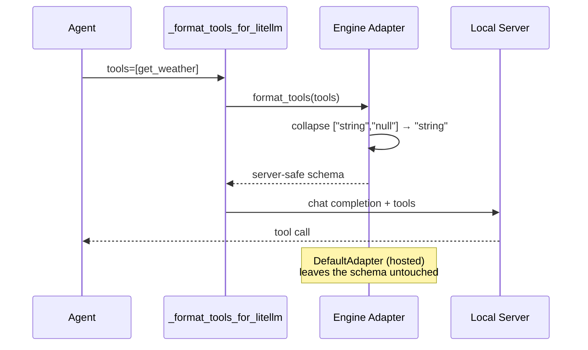
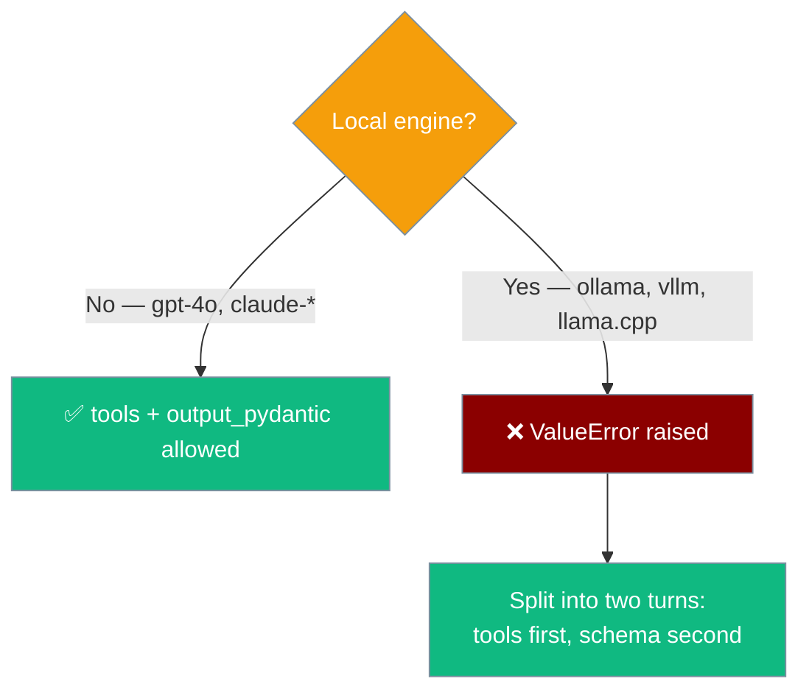

PraisonAI adapts your tool schemas so local servers can parse them — automatically, per engine.



Ollama, LM Studio, llama.cpp, and vLLM reject some tool schemas that hosted providers accept. Since [PR #4924](https://github.com/MervinPraison/PraisonAI/pull/4924), PraisonAI rewrites the affected parts per engine so your tools work on local servers unchanged.

## Quick Start

<Steps>
<Step title="Tools with Optional arguments now work on Ollama">
An `Optional[...]` argument no longer breaks the request on a local engine.

```python
from typing import Optional
from praisonaiagents import Agent

def get_weather(city: str, unit: Optional[str] = None) -> str:
    return f"Weather for {city} in {unit or 'C'}"

Agent(
    llm="ollama/qwen3:0.6b",
    tools=[get_weather],
    instructions="Answer weather questions",
).start("Weather in Paris?")
```

`unit` still accepts `None` in Python — it simply stops advertising itself as nullable to the model.
</Step>

<Step title="Hosted providers are untouched">
`gpt-4o` and `claude-*` keep the full schema — they support nullable unions.

```python
from typing import Optional
from praisonaiagents import Agent

def get_weather(city: str, unit: Optional[str] = None) -> str:
    return f"Weather for {city} in {unit or 'C'}"

Agent(llm="gpt-4o", tools=[get_weather]).start("Weather in Paris?")
```
</Step>
</Steps>

---

## How It Works

The LLM layer picks an adapter per engine, then calls `format_tools()` right before the request — only the local adapters collapse nullable unions.



An `Optional[str]` argument produces `{"type": ["string", "null"]}`. Ollama models `type` as a single string and cannot unmarshal that union — it returns HTTP 400 for the **whole** request, not just that tool. The local adapters collapse the nullable to its one concrete member so the request stays valid.

### What collapses vs what doesn't

Only the nullable case (`<type>` plus `"null"`) collapses. A genuine multi-type union is preserved — narrowing it would misrepresent the tool's accepted inputs.

| Schema | Ollama / vLLM / llama.cpp | Hosted (OpenAI / Anthropic) |
|---|---|---|
| `{"type": "string"}` | unchanged | unchanged |
| `{"type": ["string", "null"]}` | → `{"type": "string"}` | unchanged |
| `{"type": ["string", "integer"]}` | **preserved** | unchanged |

Your tool definitions are never mutated — `collapse_union_param_types` returns a new list.

---

## Structured output + tools on local models

Local engines cannot honour both a JSON grammar and a tool schema in the same request — the grammar makes the tool-call tag unemittable, so the model **fabricates an answer** instead of calling the tool. PraisonAI now refuses this combination up front.

```python
from pydantic import BaseModel
from praisonaiagents import Agent

class Weather(BaseModel):
    city: str
    temperature: float

def get_weather(city: str) -> str:
    return "sunny, 15C"

# Raises ValueError on a local engine — before the fix, the model
# invented a temperature having never run the tool.
Agent(
    llm="ollama/qwen3:0.6b",
    tools=[get_weather],
    output_pydantic=Weather,
).start("Weather in Paris?")
```

Before the guard, the same request returned `HTTP 200` with `tool_calls: null` and an invented answer under the JSON grammar. The model never ran the tool.

**Fix:** run the tool call first, then a second turn with `output_pydantic` on the summarising step.

```python
from pydantic import BaseModel
from praisonaiagents import Agent

class Weather(BaseModel):
    city: str
    temperature: float

def get_weather(city: str) -> str:
    return "sunny, 15C"

data_agent = Agent(llm="ollama/qwen3:0.6b", tools=[get_weather])
schema_agent = Agent(llm="ollama/qwen3:0.6b", output_pydantic=Weather)

raw = data_agent.start("Weather in Paris?")
result = schema_agent.start(f"Convert to schema: {raw}")
```

Hosted providers (OpenAI, Anthropic) are unaffected — they can combine the two.



---

## Best Practices

<AccordionGroup>
<Accordion title="Don't hand-write union types for local tools">
Avoid `{"type": ["string", "integer"]}` on arguments meant for local models — heterogeneous unions are preserved and the server may reject them. Pick one concrete type.
</Accordion>

<Accordion title="Prefer a sentinel over Optional when absence matters">
`Optional[str]` collapses to `str` for local models, so the model no longer sees nullability. If you need the model to explicitly signal "no value", use a plain `str` with a sentinel like `"none"` and handle it in the tool body.
</Accordion>

<Accordion title="Verify the collapsed schema in a REPL">
Inspect exactly what reaches litellm:

```python
from praisonaiagents.llm import LLM

llm = LLM(model="ollama/qwen3:0.6b")
print(llm._format_tools_for_litellm(tools))
```
</Accordion>

<Accordion title="Split structured output from tool calls on local engines">
Run tools in one turn, then apply `output_json` / `output_pydantic` on a second summarising turn. A local engine cannot do both at once.
</Accordion>
</AccordionGroup>

---

## Related

<CardGroup cols={2}>
  <Card title="Local Models" icon="microchip" href="/features/local-models">
    Point PraisonAI at Ollama or any OpenAI-compatible server.
  </Card>
  <Card title="Local Model Resolver" icon="server" href="/features/local-model-resolver">
    Set `llm="local"` to auto-discover a running local server.
  </Card>
</CardGroup>
