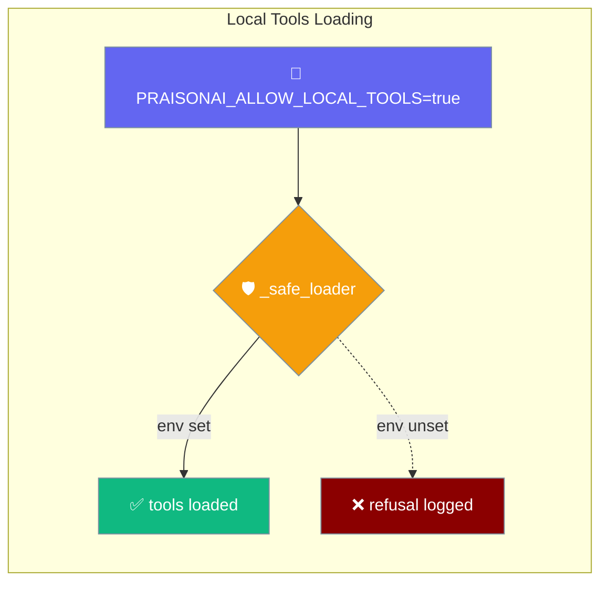
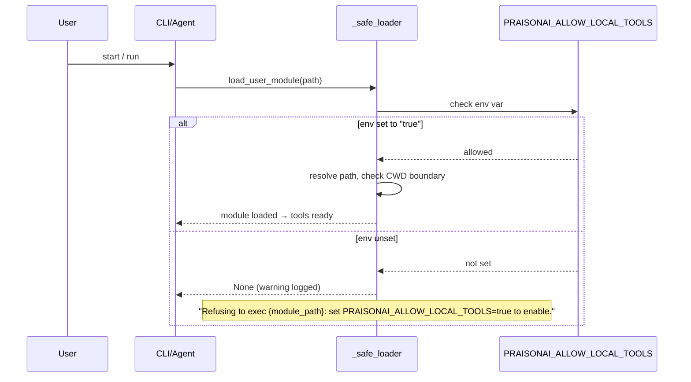

Point PraisonAI at your own `tools.py`, `tools/` folder, or explicit `--tools /path/to/file.py` — after you flip the `PRAISONAI_ALLOW_LOCAL_TOOLS=true` opt-in.

```python
from praisonaiagents import Agent

agent = Agent(
    name="Notes assistant",
    instructions="Answer questions using the user's notes.",
    tools=["read_notes"],
)
agent.start("What did I write about caching?")
```

The user enables local tools and asks a question; PraisonAI loads your module and exposes functions to the agent.



## Quick Start

<Steps>
<Step title="Add a tools.py next to your script">

Expose a plain Python function in `tools.py`:

```python
# tools.py
def read_notes(topic: str) -> str:
    """Return the user's notes on a topic."""
    return open(f"notes/{topic}.md").read()
```

Then use it from an `Agent`:

```python
# app.py
from praisonaiagents import Agent

agent = Agent(
    name="Notes assistant",
    instructions="Answer questions using the user's notes.",
    tools=["read_notes"],
)

agent.start("What did I write about caching?")
```

Run with the opt-in env var:

```bash
PRAISONAI_ALLOW_LOCAL_TOOLS=true python app.py
```

</Step>

<Step title="Use an explicit path from the CLI">

Pass an absolute path with `--tools` — useful for tools files outside your project directory:

```bash
PRAISONAI_ALLOW_LOCAL_TOOLS=true praisonai-code run \
  --tools /absolute/path/to/tools.py \
  "Summarise my notes on caching"
```

Explicit user-provided `--tools` paths bypass the CWD boundary check (`allow_outside_cwd=True`), so absolute paths outside the repo work under the opt-in flag. CWD-derived `tools.py` / `tools/` scanning stays strict against `..` traversal.

</Step>
</Steps>

---

## How It Works



The loader checks two conditions before executing your file:

1. `PRAISONAI_ALLOW_LOCAL_TOOLS` must be set to `true` (case-insensitive). If not, it logs:
   > `Refusing to exec {module_path}: set PRAISONAI_ALLOW_LOCAL_TOOLS=true to enable.`

2. The resolved path must be inside the current working directory (unless you pass an explicit `--tools` argument). If the path escapes the CWD boundary, it logs:
   > `Refusing to exec {path}: outside working directory.`

**CLI `--tools file.py` also warns via stdout.** When you pass a file path to `--tools`, `--rewrite-tools`, `--expand-tools`, or `research --tools`, the CLI additionally prints a yellow warning to stdout if the load produced zero functions:

> `Warning: No tools loaded from {path} (module has no public functions, or local tools loading is disabled — set PRAISONAI_ALLOW_LOCAL_TOOLS=true to enable).`

The dual-cause phrasing is deliberate (PR #2935) — the same empty result covers both "env-var unset" and "module has no public functions after `functions_only=True, skip_private=True` filtering". See [Security Environment Variables](/docs/features/security-environment-variables#praisonai_allow_local_tools) for the full message table.

---

## Discovery Order

When you reference a tool by name (e.g. `tools=["read_notes"]`), PraisonAI checks four places in this fixed order — first match wins:

1. **Local `tools.py`** — backward compatibility, custom tools, custom variables
2. **`praisonaiagents.tools.TOOL_MAPPINGS`** — built-in SDK tools
3. **`praisonai-tools` package** — external tools (optional install)
4. **Tool registry (plugins via `entry_points`)** — third-party plugin sources

See [Tool Discovery Order](/docs/features/tool-discovery-order) for the full breakdown.

`LocalManagedAgent` uses this same discovery order for its `tools=[...]` field. Tool names you drop in `tools.py` are picked up by both `Agent(tools=[...])` and `LocalManagedAgent(config=LocalManagedConfig(tools=[...]))`. See [Local Managed Agents](/docs/concepts/managed-agents-local#tool-name-resolution).

---

## `tools.py` vs `tools/` Folder

When an explicit `tools.py` is bound via `--tools` (or found at the CWD root), it takes priority over a sibling `tools/` folder. The resolver honours the bound path, so an explicit `--tools tools.py` no longer silently loses to a sibling `tools/` directory. CWD-derived scans still enforce `..`-traversal safety.

---

## `--tools` Outside Your Project

Only explicit user-provided paths — those you pass via `--tools /path/to/file.py` — opt out of the CWD boundary check. Anything the framework derives (recipe metadata, API-supplied names) stays strict. From the `_safe_loader` docstring:

> *"When True, skip the CWD boundary check. Only pass this for paths the user provided explicitly (e.g. a `--tools` CLI argument), never for API/network-derived paths."*

---

## Best Practices

<AccordionGroup>
<Accordion title="Keep tools.py at the top of your project">
Keep `tools.py` at the top of your project — the CWD boundary check will find it without any flag.
</Accordion>
<Accordion title="Only set the env var in trusted shells">
Only set `PRAISONAI_ALLOW_LOCAL_TOOLS=true` in trusted shells; a bare `pip install` will execute the file you point at.
</Accordion>
<Accordion title="Use absolute paths for tools outside your project">
For absolute paths outside your project, pass the full path via `--tools` — the resolver will honour it under the opt-in flag.
</Accordion>
</AccordionGroup>

---

## Related

<CardGroup cols={2}>
<Card title="Tool Discovery Order" icon="list-tree" href="/docs/features/tool-discovery-order">
The 4-tier pipeline that resolves tool names — local file, built-ins, praisonai-tools, or a plugin.
</Card>
<Card title="Approval Backends" icon="shield-check" href="/docs/features/approval-backends">
Choose who approves a tool call — terminal prompt, plan mode, or a chat channel.
</Card>
</CardGroup>
