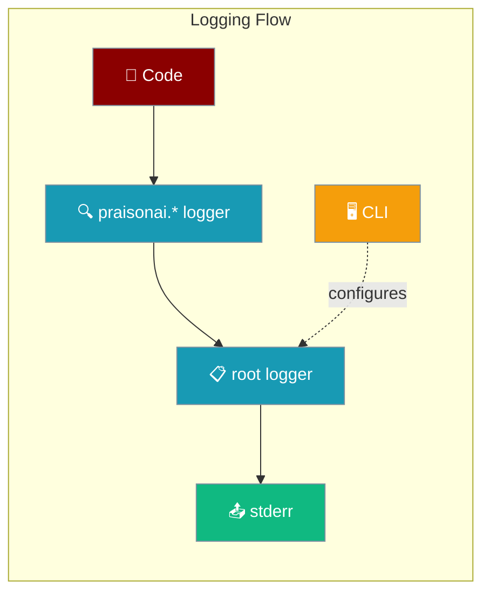
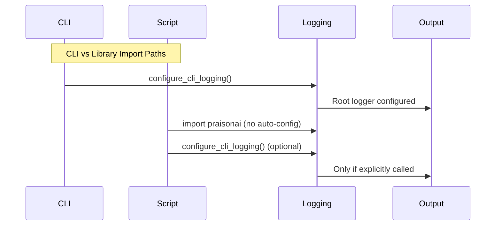

Control how PraisonAI logs run-time information from the CLI or your own Python scripts.



## Quick Start

<Steps>
<Step title="CLI Users">
Set `LOGLEVEL=INFO` (or `DEBUG`) before running PraisonAI commands to see more output.

```bash
export LOGLEVEL=INFO
praisonai agents.yaml
```
</Step>

<Step title="Script Users">
Call `configure_cli_logging("INFO")` once at app start, or wire your own `logging.basicConfig()`.

```python
from praisonai import PraisonAI
from praisonai._logging import configure_cli_logging

configure_cli_logging("INFO")  # opt in to root-logger setup
PraisonAI(agent_file="agents.yaml").run()
```
</Step>
</Steps>

---

## How It Works



| Import Type | Root Logger Configuration | Default Level |
|------------|---------------------------|---------------|
| CLI (`praisonai` command) | ✅ Automatic via `configure_cli_logging()` | `WARNING` |
| Library (`from praisonai import`) | ❌ No automatic configuration | N/A |

---

## Configuration Options

| Option | Type | Default | Description |
|--------|------|---------|-------------|
| `LOGLEVEL` env var | `str` | `WARNING` | Read by `configure_cli_logging()`. Accepts standard Python levels. |
| `configure_cli_logging(level)` | `str \| int \| None` | `None` (uses `LOGLEVEL` or `WARNING`) | Idempotent; only the first call configures the root logger. |
| `get_logger(name)` | `str \| None` | `None` (returns `praisonai`) | Returns a namespaced `praisonai.<name>` logger; **never** mutates root. |

---

## Common Patterns

### Quieting PraisonAI in a Larger App

```python
import logging
from praisonai import PraisonAI

# Set only the praisonai logger to WARNING
logging.getLogger("praisonai").setLevel(logging.WARNING)

# Your app's logging remains untouched
praisonai = PraisonAI(agent_file="agents.yaml")
praisonai.run()
```

### Routing PraisonAI Logs to a File

```python
import logging
from praisonai import PraisonAI

# Create file handler for praisonai logs only
handler = logging.FileHandler("praisonai.log")
handler.setFormatter(logging.Formatter("%(asctime)s - %(levelname)s - %(message)s"))

# Attach to praisonai logger tree
praisonai_logger = logging.getLogger("praisonai")
praisonai_logger.addHandler(handler)
praisonai_logger.setLevel(logging.INFO)

praisonai = PraisonAI(agent_file="agents.yaml")
praisonai.run()
```

### One-off CLI Debugging

```bash
# Debug a specific run
LOGLEVEL=DEBUG praisonai agents.yaml

# Back to quiet mode
praisonai agents.yaml
```

---

<Note>
**Migration note for users upgrading past PR #1561:**

Before this release, importing `praisonai` silently called `logging.basicConfig` and defaulted `LOGLEVEL` to `INFO`. From this release onward, only the CLI configures the root logger, and the default level is `WARNING`. If you embed PraisonAI in your own script and want the previous behaviour, call `from praisonai._logging import configure_cli_logging; configure_cli_logging("INFO")` at startup.
</Note>

---

## Best Practices

<AccordionGroup>

<Accordion title="Use namespaced loggers in library code">
Always use `get_logger("module")` instead of the root logger when writing library code.

```python
from praisonai._logging import get_logger

logger = get_logger("mymodule")  # Creates praisonai.mymodule logger
logger.info("This won't interfere with the user's logging")
```
</Accordion>

<Accordion title="Do not call basicConfig from libraries">
Libraries should never call `logging.basicConfig()` as it mutates global state. Let applications control their logging setup.

```python
# ❌ Bad - mutates global logger
import logging
logging.basicConfig(level=logging.INFO)

# ✅ Good - use namespaced logger
from praisonai._logging import get_logger
logger = get_logger("mylibrary")
```
</Accordion>

<Accordion title="Prefer LOGLEVEL for one-shot debugging">
Use the environment variable for temporary debugging instead of changing code.

```bash
# Quick debug session
LOGLEVEL=DEBUG praisonai agents.yaml

# Production run
praisonai agents.yaml
```
</Accordion>

<Accordion title="Attach handlers to praisonai not root">
When customizing PraisonAI logging, attach handlers to the `praisonai` logger tree rather than the root logger.

```python
import logging

# ✅ Good - only affects praisonai
praisonai_logger = logging.getLogger("praisonai")
praisonai_logger.addHandler(my_handler)

# ❌ Bad - affects all logging
root_logger = logging.getLogger()
root_logger.addHandler(my_handler)
```
</Accordion>

</AccordionGroup>

---

## Related

<CardGroup cols={2}>
<Card title="Thread Safety" icon="lock" href="/docs/features/thread-safety">
  Thread-safe agent state and wrapper-layer improvements
</Card>
<Card title="Debugging" icon="bug" href="/docs/best-practices/debugging">
  Best practices for troubleshooting PraisonAI issues
</Card>
</CardGroup>