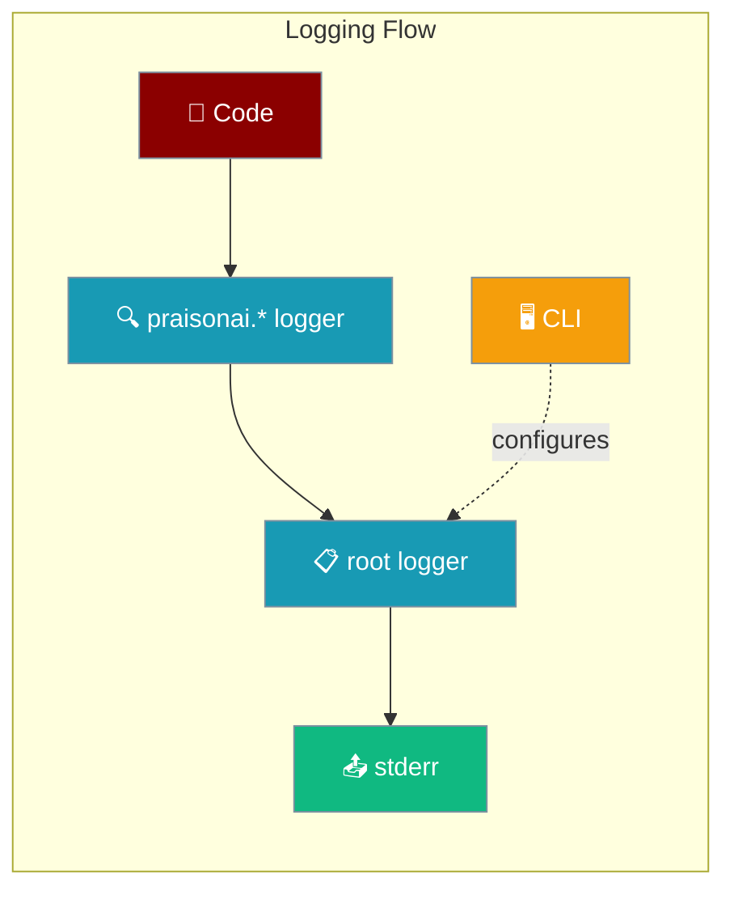
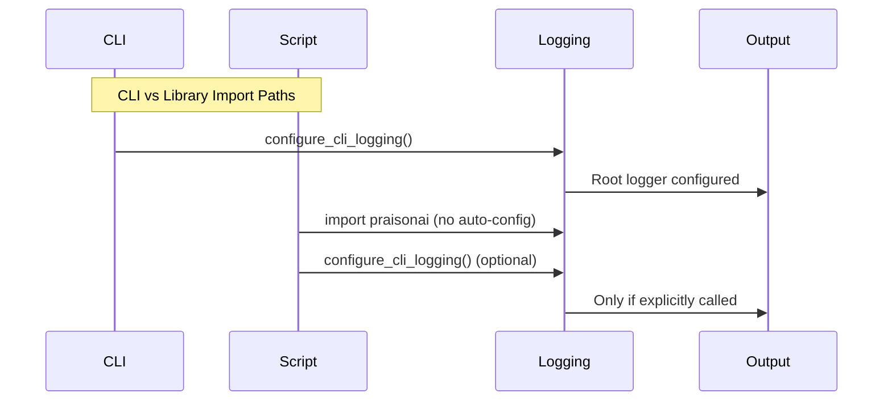

```python
from praisonaiagents import Agent

agent = Agent(
    name="logged-agent",
    instructions="Process tasks with full logging enabled.",
    output="verbose",
)
agent.start("Run this task with detailed logging.")
```

Control how PraisonAI logs run-time information from the CLI or your own Python scripts.

The user runs an agent with verbose logging; PraisonAI emits structured lines to stderr for debugging.


```mermaid
graph LR
    subgraph "Logging Flow"
        A[📝 Code] --> B[🔍 praisonai.* logger]
        B --> C[📋 root logger]
        C --> D[📤 stderr]
        E[🖥️ CLI] -.->|configures| C
    end
    
    classDef code fill:#8B0000,stroke:#7C90A0,color:#fff
    classDef logger fill:#189AB4,stroke:#7C90A0,color:#fff
    classDef output fill:#10B981,stroke:#7C90A0,color:#fff
    classDef cli fill:#F59E0B,stroke:#7C90A0,color:#fff
    
    class A code
    class B,C logger
    class D output
    class E cli
```

## Quick Start

<Steps>
<Step title="CLI Users">
Set `LOGLEVEL=INFO` (or `DEBUG`) before running PraisonAI commands to see more output.

```bash
export LOGLEVEL=INFO
praisonai agents.yaml
```
</Step>

<Step title="Script Users">
Call `configure_cli_logging("INFO")` once at app start, or wire your own `logging.basicConfig()`.

```python
from praisonai import PraisonAI
from praisonai._logging import configure_cli_logging

configure_cli_logging("INFO")  # opt in to root-logger setup
PraisonAI(agent_file="agents.yaml").run()
```
</Step>
</Steps>

---

## How It Works


```mermaid
sequenceDiagram
    participant CLI
    participant Script
    participant Logging
    participant Output
    
    Note over CLI,Script: CLI vs Library Import Paths
    
    CLI->>Logging: configure_cli_logging()
    Logging->>Output: Root logger configured
    
    Script->>Logging: import praisonai (no auto-config)
    Script->>Logging: configure_cli_logging() (optional)
    Logging->>Output: Only if explicitly called
```

| Import Type | Root Logger Configuration | Default Level |
|------------|---------------------------|---------------|
| CLI (`praisonai` command) | ✅ Automatic via `configure_cli_logging()` | `WARNING` |
| Library (`from praisonai import`) | ❌ No automatic configuration | N/A |

<Note>
As of PraisonAI v?.? (PR [#1867](https://github.com/MervinPraison/PraisonAI/pull/1867)), importing `praisonai.inc.models` (and any other internal module) no longer calls `logging.basicConfig()`. Library users keep full control of their own logging configuration; only `configure_cli_logging()` and `LOGLEVEL=` (via the CLI) touch the root logger.
</Note>

---

## Configuration Options

| Option | Type | Default | Description |
|--------|------|---------|-------------|
| `LOGLEVEL` env var | `str` | `WARNING` | Read by `configure_cli_logging()`. Accepts standard Python levels. |
| `configure_cli_logging(level)` | `str \| int \| None` | `None` (uses `LOGLEVEL` or `WARNING`) | Idempotent; only the first call configures the root logger. |
| `get_logger(name)` | `str \| None` | `None` (returns `praisonai`) | Returns a namespaced `praisonai.<name>` logger; **never** mutates root. |

---

## Common Patterns

### Quieting PraisonAI in a Larger App

```python
import logging
from praisonai import PraisonAI

# Set only the praisonai logger to WARNING
logging.getLogger("praisonai").setLevel(logging.WARNING)

# Your app's logging remains untouched
praisonai = PraisonAI(agent_file="agents.yaml")
praisonai.run()
```

### Routing PraisonAI Logs to a File

```python
import logging
from praisonai import PraisonAI

# Create file handler for praisonai logs only
handler = logging.FileHandler("praisonai.log")
handler.setFormatter(logging.Formatter("%(asctime)s - %(levelname)s - %(message)s"))

# Attach to praisonai logger tree
praisonai_logger = logging.getLogger("praisonai")
praisonai_logger.addHandler(handler)
praisonai_logger.setLevel(logging.INFO)

praisonai = PraisonAI(agent_file="agents.yaml")
praisonai.run()
```

### One-off CLI Debugging

```bash
# Debug a specific run
LOGLEVEL=DEBUG praisonai agents.yaml

# Back to quiet mode
praisonai agents.yaml
```

---

<Note>
**Migration note for users upgrading past PR #1561:**

Before this release, importing `praisonai` silently called `logging.basicConfig` and defaulted `LOGLEVEL` to `INFO`. From this release onward, only the CLI configures the root logger, and the default level is `WARNING`. If you embed PraisonAI in your own script and want the previous behaviour, call `from praisonai._logging import configure_cli_logging; configure_cli_logging("INFO")` at startup.
</Note>

---

## Import-time behaviour (PR #5219)

`import praisonaiagents` no longer overwrites host environment variables or silences the host's `asyncio` logger.

Reference: [PraisonAI PR #5219](https://github.com/MervinPraison/PraisonAI/pull/5219), fixes [#5162](https://github.com/MervinPraison/PraisonAI/issues/5162). For the full fork-safety story, see [Python Import Safety & Fork Behaviour](/features/python-import-safety).

### Environment variables: setdefault, not overwrite

`praisonaiagents._logging._configure_environment()` now uses `os.environ.setdefault(key, value)` instead of an unconditional assignment. A value the host exported before launch is preserved and no longer leaks a different value into any subprocess spawned afterwards.

<CodeGroup>
```bash Host exports its own value
# The host sets LITELLM_LOG before launching your script.
export LITELLM_LOG=DEBUG
python my_script.py     # imports praisonaiagents
```

```python After PR #5219 (preserved)
import os
import praisonaiagents  # calls _configure_environment() at import

# The host's DEBUG value is kept — setdefault does not overwrite it.
assert os.environ["LITELLM_LOG"] == "DEBUG"
```
</CodeGroup>

When the host has **not** set a value, the SDK still fills these in (verified against `_logging._configure_environment` at head):

| Variable | Default set when unset |
|---|---|
| `LITELLM_TELEMETRY` | `False` |
| `LITELLM_DROP_PARAMS` | `True` |
| `LITELLM_LOG` | `ERROR` |
| `LITELLM_DEBUG` | `False` |
| `LITELLM_SUPPRESS_DEBUG_INFO` | `True` |
| `LITELLM_VERBOSE` | `False` |
| `LITELLM_SET_VERBOSE` | `False` |
| `HTTPX_DISABLE_WARNINGS` | `True` |
| `HTTPX_LOG_LEVEL` | `ERROR` |
| `PYDANTIC_WARNINGS_ENABLED` | `False` |

### asyncio logger is no longer suppressed

`"asyncio"` has been removed from the SDK's noisy-logger list, so `import praisonaiagents` no longer forces `logging.getLogger("asyncio")` to `CRITICAL` or clears its handlers. Host application asyncio errors — `Task exception was never retrieved`, coroutine-scheduling failures, and similar — surface again as your own logging config intends.

If you relied on the old import-time behaviour to hide those messages, set the level yourself in your own code:

```python
import logging
import praisonaiagents  # no longer touches the asyncio logger

# Opt back into suppression explicitly if you want it.
logging.getLogger("asyncio").setLevel(logging.CRITICAL)
```

<Warning>
PR #5219 intentionally **kept** two other import-time behaviours — do not assume they were fixed:

- The root logger is still reconfigured via `logging.basicConfig(force=True)`. If your host configured logging **before** importing PraisonAI, its handler is still closed and replaced.
- `warnings.warn` / `warnings.warn_explicit` remain monkeypatched to suppress a hardcoded pattern list plus `UserWarning`s mentioning "pydantic".

See [Python Import Safety → What is still not safe on import](/features/python-import-safety#what-is-still-not-safe-on-import) for the workarounds.
</Warning>

---

## Best Practices

<AccordionGroup>

<Accordion title="Use namespaced loggers in library code">
Always use `get_logger("module")` instead of the root logger when writing library code.

```python
from praisonai._logging import get_logger

logger = get_logger("mymodule")  # Creates praisonai.mymodule logger
logger.info("This won't interfere with the user's logging")
```
</Accordion>

<Accordion title="Do not call basicConfig from libraries">
Libraries should never call `logging.basicConfig()` as it mutates global state. Let applications control their logging setup.

```python
# ❌ Bad - mutates global logger
import logging
logging.basicConfig(level=logging.INFO)

# ✅ Good - use namespaced logger
from praisonai._logging import get_logger
logger = get_logger("mylibrary")
```
</Accordion>

<Accordion title="Prefer LOGLEVEL for one-shot debugging">
Use the environment variable for temporary debugging instead of changing code.

```bash
# Quick debug session
LOGLEVEL=DEBUG praisonai agents.yaml

# Production run
praisonai agents.yaml
```
</Accordion>

<Accordion title="Attach handlers to praisonai not root">
When customizing PraisonAI logging, attach handlers to the `praisonai` logger tree rather than the root logger.

```python
import logging

# ✅ Good - only affects praisonai
praisonai_logger = logging.getLogger("praisonai")
praisonai_logger.addHandler(my_handler)

# ❌ Bad - affects all logging
root_logger = logging.getLogger()
root_logger.addHandler(my_handler)
```
</Accordion>

</AccordionGroup>

---

## Related

<CardGroup cols={2}>
<Card title="Import Safety (Python)" icon="shield-check" href="/features/python-import-safety">
  Fork-safe imports, setdefault env vars, and untouched asyncio logging
</Card>
<Card title="Thread Safety" icon="lock" href="/features/thread-safety">
  Thread-safe agent state and wrapper-layer improvements
</Card>
<Card title="Debugging" icon="bug" href="/best-practices/debugging">
  Best practices for troubleshooting PraisonAI issues
</Card>
</CardGroup>