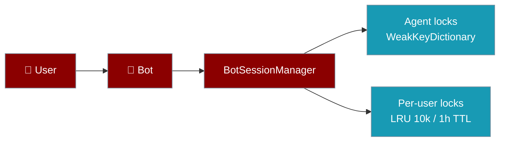
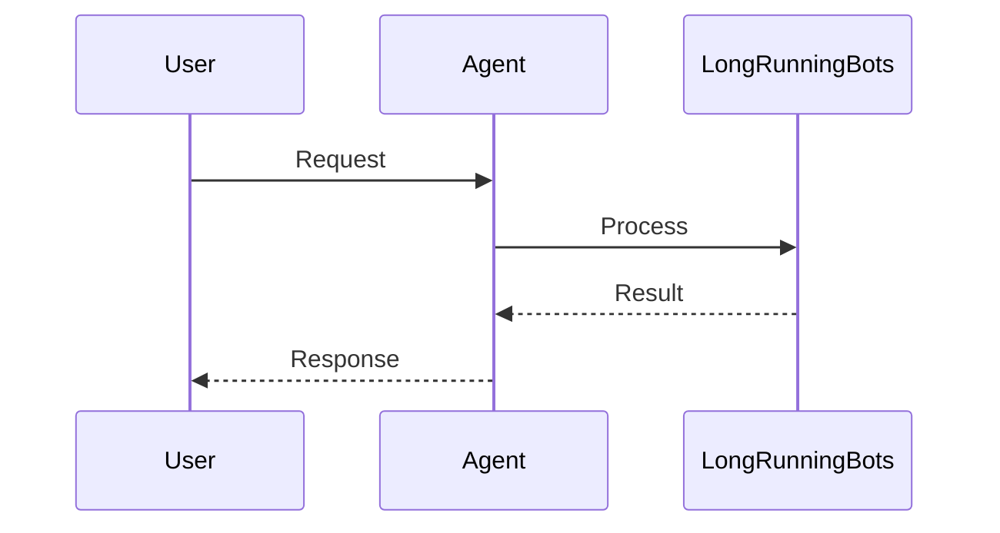

Run Telegram, Discord, Slack, and other bots for weeks — bounded lock caches and agent-scoped locks keep memory stable with no extra configuration.

```python
from praisonaiagents import Agent
from praisonai.bots import Bot

agent = Agent(name="assistant", instructions="Be helpful")
bot = Bot("telegram", agent=agent)
bot.run()
```

The user messages your bot channel; session locks stay bounded while the same agent handles concurrent chats.



## How It Works




## Quick Start

<Steps>

<Step title="Simple Usage">

```python
from praisonaiagents import Agent
from praisonai.bots import Bot

agent = Agent(name="assistant", instructions="Be helpful")
bot = Bot("telegram", agent=agent)
bot.run()  # Bounded locks are active by default
```

Nothing extra is required — debounce, session, and run-control paths share the same bounded per-user lock cache.

</Step>

<Step title="With Configuration">

```python
from praisonaiagents import Agent
from praisonaiagents import BotConfig
from praisonai.bots import Bot

agent = Agent(name="assistant", instructions="Be helpful")
config = BotConfig(session_ttl=86400)  # Reap idle sessions after 24h

bot = Bot("telegram", agent=agent, config=config)
bot.run()
```

</Step>

</Steps>

## What's Bounded by Default

| Resource | Default limit | When it cleans up |
|---|---|---|
| Per-user lock cache | 10,000 entries, 1 hour TTL | Idle, unlocked entries evict automatically |
| Agent locks | One per agent instance | Removed when the agent is garbage-collected |
| Session histories | Opt-in via `session_ttl` | See [Session Persistence](/features/session-persistence) |

<Note>
Recreating agents per request is safe. Agent locks no longer reuse stale `id(agent)` keys, so unrelated users cannot share locks or swap histories.
</Note>

## Operational Knobs

For mid-run cancellation and stale session cleanup, see [Bot Run Control](/features/bot-run-control) — `SessionRunControl.cleanup_stale_sessions(max_age_seconds=3600)` removes abandoned run-control state.

## Multi-Agent Safety

Earlier releases keyed agent locks on `id(agent)`. CPython may reuse that integer after garbage collection, so long-running gateways that recreated agents per request could silently mix up two users' histories. Agent locks now follow agent lifetime via `WeakKeyDictionary`; per-user locks stay bounded even if you never call cleanup helpers.

<Info>
**Released in PR #1972** — Upgrade to pick up the fix. See [Session Persistence → Bounded lock caches](/features/session-persistence#bounded-lock-caches) for details.
</Info>

## Best Practices

<AccordionGroup>

<Accordion title="Reuse one agent instance per bot">
Create the agent once at startup — agent locks follow instance lifetime via `WeakKeyDictionary`, so recreating agents per request is safe but wasteful.
</Accordion>

<Accordion title="Set session_ttl for busy channels">
Default lock caches evict after 1 hour; set `BotConfig(session_ttl=…)` when conversations stay idle longer than your support SLA.
</Accordion>

<Accordion title="Run cleanup_stale_sessions periodically">
Call `SessionRunControl.cleanup_stale_sessions` on a schedule in long-lived gateways to drop abandoned run-control state.
</Accordion>

<Accordion title="Upgrade after PR #1972">
Ensure you are on a release that includes bounded agent locks — earlier builds could mix histories when `id(agent)` was reused.
</Accordion>

</AccordionGroup>

## Related

<CardGroup cols={2}>
  <Card title="Session Persistence" icon="floppy-disk" href="/docs/features/session-persistence">
    Bot session storage and bounded lock behaviour
  </Card>
  <Card title="Messaging Bots" icon="message-circle" href="/docs/features/messaging-bots">
    Platform setup, debounce, and chunking
  </Card>
  <Card title="Inbound DLQ" icon="inbox" href="/docs/features/inbound-dlq">
    Persist failed messages for replay
  </Card>
  <Card title="Cross-Platform Mirror" icon="repeat" href="/docs/features/cross-platform-mirror">
    One conversation across every channel
  </Card>
</CardGroup>
