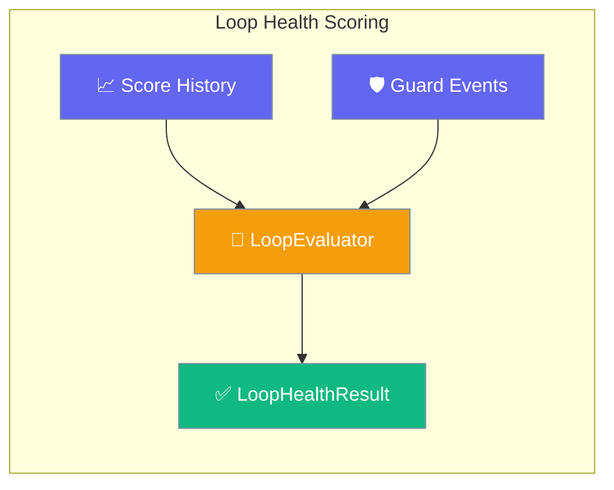
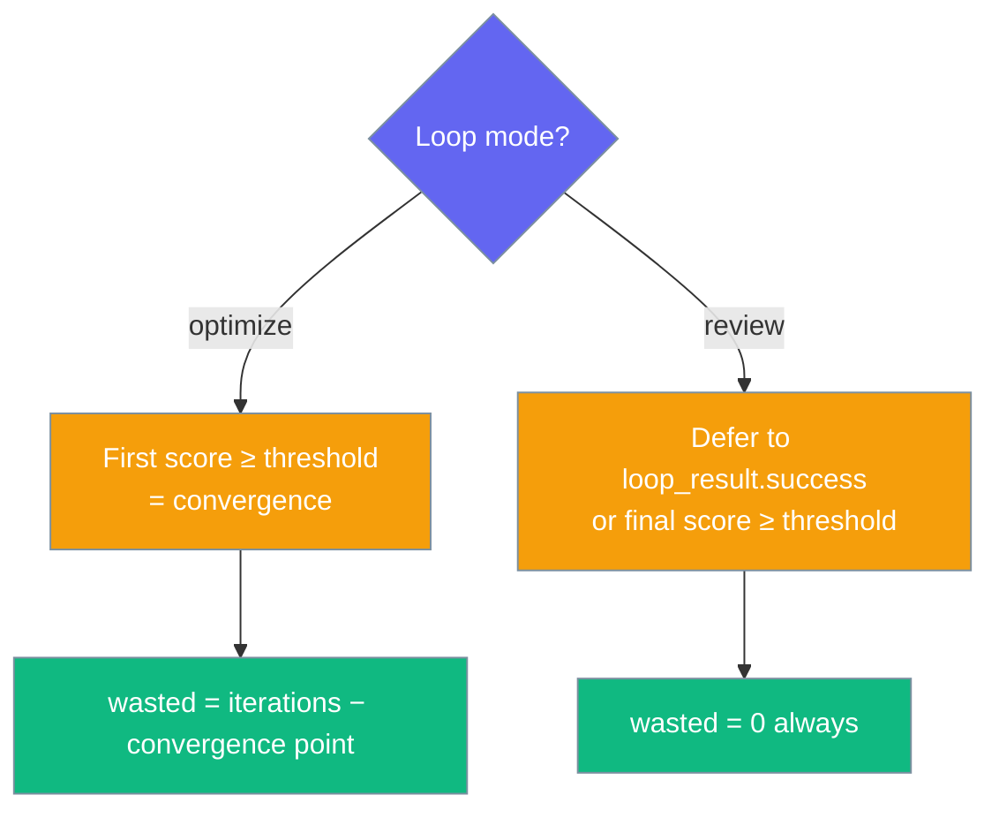

Loop Evaluator scores how healthy a loop run was — did it converge, were iterations wasted, and did a doom-loop guard fire — on top of `EvaluationLoop`'s output-quality score.



A loop can **succeed** (score ≥ 8.0) while burning max iterations, triggering doom-loop recovery, or costing 5× the expected tokens. `EvaluationLoop` scores output quality; `LoopEvaluator` scores loop health on top of it — no extra LLM calls.

## Quick Start

<Steps>
<Step title="Score an already-run loop">
Run an `EvaluationLoop`, then score its health.

```python
from praisonaiagents import Agent
from praisonaiagents.eval import EvaluationLoop, LoopEvaluator

agent = Agent(name="writer", instructions="Write clear explanations.")
loop = EvaluationLoop(agent=agent, criteria="Explanation is clear", threshold=8.0, max_iterations=5)

loop_result = loop.run("Explain how HTTPS works.")

health = LoopEvaluator().run(loop_result)
health.print_summary()   # ✅ HEALTHY / iterations / waste / doom-loop
```
</Step>

<Step title="Tolerate wasted iterations">
Set an explicit threshold and allow one wasted iteration.

```python
health = LoopEvaluator(threshold=8.0, max_wasted_iterations=1).run(loop_result)
assert health.passed
```
</Step>

<Step title="Pass structured guard events">
Feed doom-loop guard events. The evaluator is duck-typed — dicts or objects both work.

```python
# Any of these shapes is recognised:
guard_events = [
    {"type": "doom_loop", "reason": "repeated tool call"},   # generic marker
    # or a DoomLoopEvent-style object with a .loop_type
    # or a DoomLoopResult-style dict {"is_loop": True}
]

health = LoopEvaluator().run(loop_result, guard_events=guard_events)
assert health.doom_loop_fired is True
assert not health.passed
```
</Step>
</Steps>

---

## How It Works

`LoopEvaluator` **derives** health from a completed `EvaluationLoopResult` — it never re-runs the loop, so it makes zero LLM calls and is safe in CI.

```mermaid
sequenceDiagram
    participant Loop as EvaluationLoop
    participant Result as EvaluationLoopResult
    participant Eval as LoopEvaluator
    participant Health as LoopHealthResult

    Loop->>Result: run() → score_history, threshold, mode
    Result->>Eval: run(loop_result, guard_events)
    Eval->>Eval: Derive convergence + waste + doom-loop
    Eval-->>Health: iterations, waste, doom_loop_fired, passed
```

| Input | Source | Used For |
|-------|--------|----------|
| `score_history` | `EvaluationLoopResult` | Convergence, per-iteration deltas |
| `threshold` | Constructor or loop result | Convergence check |
| `mode` | `EvaluationLoopResult` | Optimize vs review convergence |
| `guard_events` | `doom_loop.py` / `loop_detection_plugin` | Doom-loop detection |

---

## Mode-Aware Convergence

Convergence is computed differently in `optimize` vs `review` mode — the health verdict never disagrees with the loop's own verdict.



- **`optimize` mode**: convergence = first iteration whose score ≥ threshold. `wasted_iterations = num_iterations − iterations_to_success`.
- **`review` mode**: `EvaluationLoop` runs every iteration and derives success from the *final* score, so a transient earlier high score is not treated as convergence. `LoopEvaluator` defers to `loop_result.success` (or `score_history[-1] >= threshold`). `wasted_iterations` is always `0`.

---

## Configuration Options

Constructor parameters for `LoopEvaluator`.

| Option | Type | Default | Description |
|--------|------|---------|-------------|
| `threshold` | `Optional[float]` | `None` | Score threshold for convergence. Falls back to the threshold on the `EvaluationLoopResult`. |
| `max_wasted_iterations` | `int` | `0` | Maximum wasted iterations tolerated before the loop is unhealthy. |
| `name` | `Optional[str]` | `None` | Optional name for this evaluation run. |
| `save_results_path` | `Optional[str]` | `None` | Optional path to persist the result JSON. |
| `verbose` | `bool` | `False` | Print a rich summary table after `run()`. |

`run(loop_result, guard_events=None)` takes a completed `EvaluationLoopResult` (or any object exposing `score_history`, `threshold`, `total_duration_seconds`, `mode`, `success`) and an optional list of guard events.

<Card title="Eval SDK Reference" icon="code" href="/docs/sdk/reference/praisonaiagents/modules/eval">
  Full auto-generated Python reference for the `eval` module
</Card>

---

## LoopHealthResult Fields

`run()` returns a `LoopHealthResult`. These are the fields returned by `to_dict()`.

| Field | Type | Description |
|-------|------|-------------|
| `iterations_to_success` | `int` | 1-based iteration at which threshold was first met; otherwise total iterations. |
| `wasted_iterations` | `int` | Iterations that ran after threshold was first met (always `0` in review mode). |
| `doom_loop_fired` | `bool` | Whether any guard event indicated a doom-loop. |
| `guard_interventions` | `int` | Total number of guard events observed. |
| `total_duration_s` | `float` | Total wall-clock duration in seconds. |
| `score_delta_per_iteration` | `List[float]` | Per-iteration delta (`len == num_iterations − 1`, rounded to 4dp). |
| `converged` | `bool` | Whether the loop reached its threshold. |
| `success` / `passed` | `bool` | `converged AND not doom_loop_fired AND wasted_iterations <= max_wasted_iterations`. `passed` aliases `success`. |
| `threshold` | `float` | The threshold used (constructor, else loop result, else `8.0`). |
| `reasoning` | `str` | Human-readable explanation of the verdict. |
| `metadata` | `Dict[str, Any]` | Includes `num_iterations`. |

`to_dict()`, `to_json()`, and `print_summary()` are all provided.

---

## Recognised Guard-Event Shapes

Guard events are duck-typed — the evaluator detects a doom-loop without coupling to any specific class.

| Shape | Trigger |
|-------|---------|
| `DoomLoopResult`-style | `is_loop` bool is truthy |
| `DoomLoopEvent`-style | presence of a `loop_type` (a `DoomLoopType` enum) |
| Explicit flag | `doom_loop` / `doom_loop_fired` boolean is truthy |
| Generic marker | `type` / `event` field matches a known string (below) |

Accepted `type` / `event` string values (case-insensitive): `doom_loop`, `doom-loop`, `doomloop`, `repetition`, `loop_detected`, `repeated_action`, `repeated_failure`, `no_progress`, `circular_plan`, `resource_exhaustion`, `repeated_output`.

---

## Common Patterns

### CI Gate on Loop Health

Fail the build when a loop wastes iterations or a doom-loop fires.

```python
import sys
from praisonaiagents.eval import LoopEvaluator

health = LoopEvaluator(max_wasted_iterations=0).run(loop_result)
if not health.passed:
    print(f"Loop unhealthy: {health.reasoning}")
    sys.exit(1)
```

### Combine Quality and Health

Score output quality (`EvaluationLoop`) and loop health (`LoopEvaluator`) on the same run — they are complementary.

```python
from praisonaiagents import Agent
from praisonaiagents.eval import EvaluationLoop, LoopEvaluator

agent = Agent(name="analyst", instructions="Analyze systems thoroughly.")
loop = EvaluationLoop(agent=agent, criteria="Analysis is thorough", threshold=8.0)

loop_result = loop.run("Analyze the auth flow")

print(f"Quality: {loop_result.final_score}/10, success={loop_result.success}")

health = LoopEvaluator().run(loop_result)
print(f"Health: passed={health.passed}, wasted={health.wasted_iterations}")
```

### Wire Real Doom-Loop Guards

Plug in structured `DoomLoopEvent`s (or `loop_detection_plugin` events) as `guard_events`.

```python
from praisonaiagents.escalation.doom_loop import DoomLoopEvent  # emits .loop_type
from praisonaiagents.eval import LoopEvaluator

# guard_events collected during the agent run
health = LoopEvaluator().run(loop_result, guard_events=guard_events)
if health.doom_loop_fired:
    print(f"Doom-loop fired: {health.reasoning}")
```

---

## Best Practices

<AccordionGroup>
<Accordion title="Use max_wasted_iterations=0 for optimize-mode CI gates">
`0` is the strictest setting — any post-threshold iteration marks the loop unhealthy. Use it for optimize-mode CI gates; use `≥1` for exploratory review-mode runs.
</Accordion>

<Accordion title="Review mode always reports wasted_iterations=0">
That is intentional, not a bug — review mode runs all iterations by design, so post-threshold iterations are not "waste".
</Accordion>

<Accordion title="Guard events are duck-typed">
A dict *or* an object works. `type`, `event`, `loop_type`, `is_loop`, and explicit `doom_loop` flags are all recognised — see the accepted string values above.
</Accordion>

<Accordion title="Zero LLM calls, safe offline">
The evaluator only consumes an existing `EvaluationLoopResult`. No external deps, no network — safe in offline CI.
</Accordion>
</AccordionGroup>

---

## Related

<CardGroup cols={2}>
<Card title="Evaluation Loop" icon="rotate" href="/docs/eval/evaluation-loop">
  The loop this evaluator scores
</Card>
<Card title="Loop Detection" icon="rotate" href="/docs/features/doom-loop-detection">
  The guard whose events feed this evaluator
</Card>
<Card title="Loop Guard" icon="shield-halved" href="/docs/features/loop-guard">
  Per-turn tool-call guard, complementary safety net
</Card>
<Card title="Judge" icon="gavel" href="/docs/eval/judge">
  The underlying judge used by EvaluationLoop
</Card>
</CardGroup>
