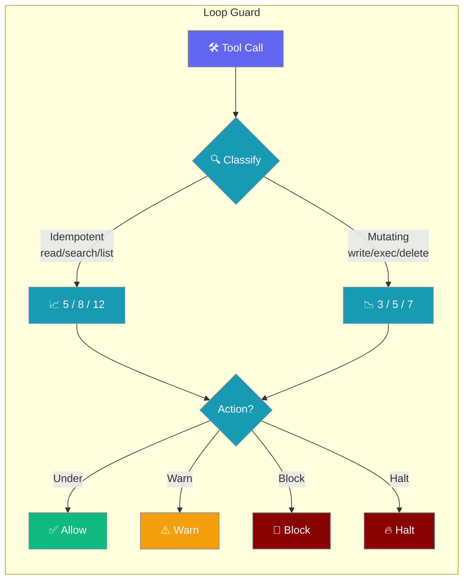
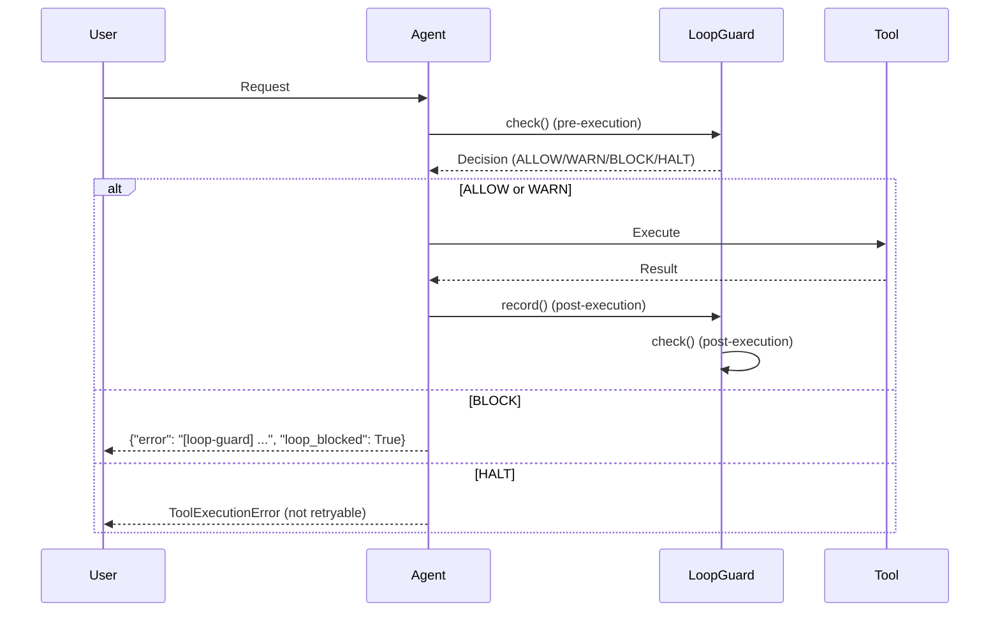
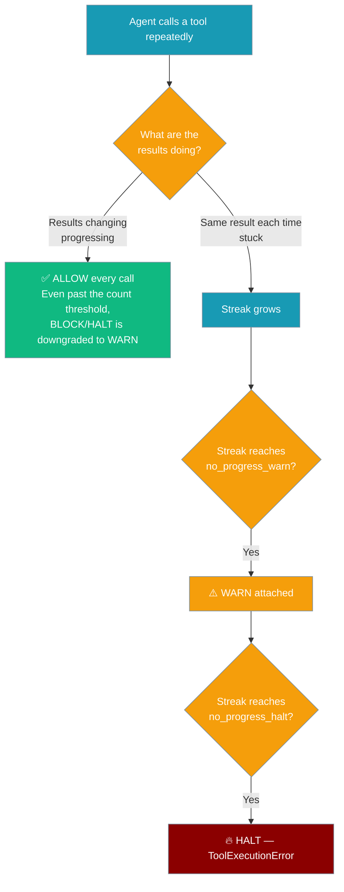
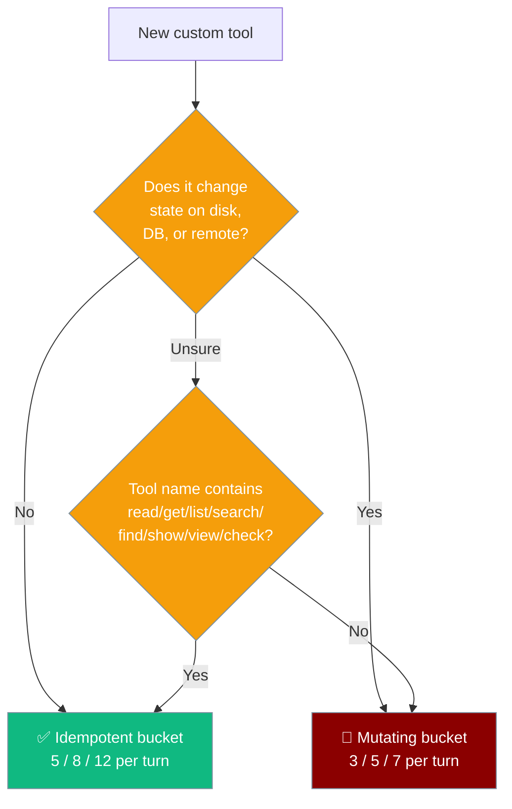
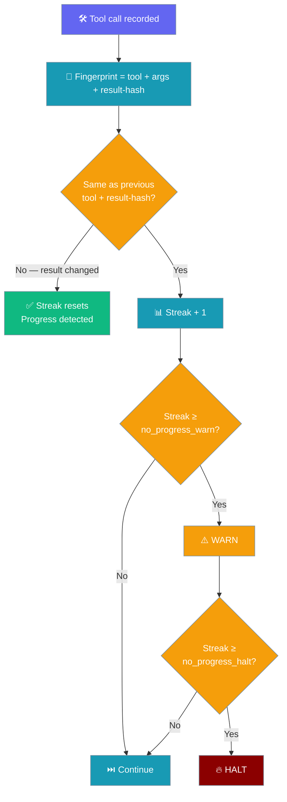

Loop Guard stops broken or misconfigured tools from burning tokens by counting per-turn calls and reacting differently to safe-to-repeat vs state-changing tools.

<Note>
Looking for **bot-to-bot** reply-loop protection? See [Bot-to-Bot Loop Protection](/docs/features/bot-loop-protection) — a separate gateway-layer primitive that caps how many exchanges a pair of bots can trade.
</Note>

```python
from praisonaiagents import Agent

agent = Agent(
    name="Safe Coder",
    instructions="Use tools carefully.",
)
agent.start("Fix the failing unit test in src/utils.py")
```

The user sends a task; Loop Guard tracks tool calls per turn and blocks runaway loops automatically.



<Note>
No-progress detection became **result-aware** in [PR #3080](https://github.com/MervinPraison/PraisonAI/pull/3080) (release after 2026-07-16, fixes [#3073](https://github.com/MervinPraison/PraisonAI/issues/3073)). Async / long-running tool workflows that return **changing** results (polling a job `IN_PROGRESS → COMPLETE`, pacing with a `wait` tool) are no longer falsely halted at 8 tool calls. Only a genuinely stuck loop of identical results still trips `no_progress_halt`. No config changes required to pick this up.
</Note>

## Quick Start

<Steps>
<Step title="It's already on">

```python
from praisonaiagents import Agent

agent = Agent(
    instructions="You are a helpful assistant."
)

# Loop Guard is initialised automatically.
# No flag needed — every Agent gets one.
agent.start("Summarise the README")
```

</Step>

<Step title="Tune the thresholds">

For power users, you can customize thresholds after agent creation:

```python
from praisonaiagents import Agent
from praisonaiagents.escalation.loop_guard import LoopGuard, LoopGuardConfig

agent = Agent(instructions="Polls a slow status endpoint")

agent._loop_guard = LoopGuard(LoopGuardConfig(
    idempotent_warn_threshold=10,
    idempotent_block_threshold=20,
    idempotent_halt_threshold=30,
    max_time_per_turn=300.0,
))
```

</Step>

<Step title="Turn it off">

<Warning>
Disabling Loop Guard removes the safety net for misbehaving tools.
</Warning>

```python
from praisonaiagents import Agent
from praisonaiagents.escalation.loop_guard import LoopGuard, LoopGuardConfig

agent = Agent(instructions="Agent without safety guard")

agent._loop_guard = LoopGuard(LoopGuardConfig(enabled=False))
```

</Step>
</Steps>

---

## How It Works



| Decision | Effect | User sees |
|----------|--------|-----------|
| `ALLOW` | Tool runs normally | Normal result |
| `WARN` | Tool runs; warning logged | Result + `_loop_guard` warning metadata |
| `BLOCK` | Tool execution replaced | `{"error": "[loop-guard] ...", "loop_blocked": True}` |
| `HALT` | Non-retryable exception raised | `ToolExecutionError` propagates out |

---

## User Interaction Flow

Here's what happens when an agent repeatedly calls the same tool:



Two signals now drive the outcome: how many times the tool has been called this turn, and whether the results are still changing. A busy-but-progressing tool sees at most a `WARN`; a stuck-with-identical-results tool escalates through `WARN` to `HALT`.

---

## Tool Classification

Loop Guard categorizes tools into two buckets with different thresholds:



**Idempotent tools** (safe to repeat): `read_file`, `list_files`, `search_files`, `web_search`, `get_memory`, `git_status`, `git_log`, `db_query`, etc.

**Mutating tools** (state-changing): `write_file`, `edit_file`, `delete_file`, `execute_code`, `shell`, `git_commit`, `git_push`, `sql_insert`, `install_package`, etc.

<Tip>
If you can't move your tool into the explicit set, **name it well** — Loop Guard's heuristic looks for substrings like `read`, `get`, `list`, `search`, `find`, `show`, `view`, `check` (case-insensitive) to classify tools as idempotent.
</Tip>

---

## Configuration Options

| Option | Type | Default | Description |
|--------|------|---------|-------------|
| `enabled` | `bool` | `True` | Enable/disable Loop Guard entirely |
| `idempotent_warn_threshold` | `int` | `5` | Warning threshold for idempotent tools |
| `idempotent_block_threshold` | `int` | `8` | Block threshold for idempotent tools |
| `idempotent_halt_threshold` | `int` | `12` | Halt threshold for idempotent tools |
| `mutating_warn_threshold` | `int` | `3` | Warning threshold for mutating tools |
| `mutating_block_threshold` | `int` | `5` | Block threshold for mutating tools |
| `mutating_halt_threshold` | `int` | `7` | Halt threshold for mutating tools |
| `max_time_per_turn` | `float` | `120.0` | Maximum seconds per turn before timeout |
| `no_progress_warn` | `int` | `4` | Warn once the trailing run of *identical* tool-result fingerprints reaches this length. Changing results reset the streak. |
| `no_progress_halt` | `int` | `8` | Halt once the trailing run of *identical* tool-result fingerprints reaches this length. Changing results reset the streak. |

**GuardAction values**: `ALLOW`, `WARN`, `BLOCK`, `HALT`

**LoopGuardDecision fields**: `action`, `code`, `message`, `metadata`

---

## No-Progress Detection

No-progress detection watches for *identical repeated results*, not raw tool-call counts.



**What counts as progress (resets the streak):**

- The **result changes** for the same tool + same args (e.g. `check_status(job=42)` returning `"IN_PROGRESS"` then `"COMPLETE"`).
- A **different tool** is called (streaks require the same tool, not just the same result value).
- `agent._loop_guard.mark_progress("...")` is called — marks the current position so only later tool calls can contribute to a future streak.

**What does NOT reset the streak:**

- The same tool returning the same result over and over — that *is* the "stuck" pattern the guard exists to catch.
- Falsy repeated results (`""`, `[]`, `{}`, `0`, `False`) — these are wrapped internally so they still fingerprint, closing a loophole that used to disable no-progress detection.

**Count thresholds are also stuck-aware.** The idempotent (`5 / 8 / 12`) and mutating (`3 / 5 / 7`) thresholds still count tool calls, but a `BLOCK` or `HALT` from those thresholds is downgraded to a `WARN` when the trailing identical-result run is below `no_progress_warn`. So a legitimately busy but *progressing* tool (many calls, changing output) will not be blocked purely on frequency.

### Example: polling that used to be halted, now allowed

```python
from praisonaiagents import Agent

agent = Agent(
    name="Deployment Watcher",
    instructions="Poll the deployment status until it finishes.",
)

# check_deploy(job='X') returns 'IN_PROGRESS', 'IN_PROGRESS', 'RUNNING', 'COMPLETE'.
# Each transition changes the result-hash, so the no-progress streak stays at 1.
agent.start("Watch deploy-42 until it is done.")
```

### Example: genuine stall, still halted

```python
from praisonaiagents import Agent

agent = Agent(
    name="Config Reader",
    instructions="Read a config file that never appears.",
)

# read_file('missing.yaml') returns the same error result every time.
# The streak grows to no_progress_halt=8 and the tool is halted with
# ToolExecutionError.
agent.start("Read missing.yaml.")
```

### Manually marking progress

If your agent completes a logical sub-step (a checkpoint, a milestone), call `mark_progress()` so any future no-progress streak starts fresh from that point:

```python
from praisonaiagents import Agent

agent = Agent(instructions="Multi-step data pipeline")

# ... run some tools ...
agent._loop_guard.mark_progress("stage-1-complete")
# Only tool calls made AFTER this marker can contribute to a future streak.
```

---

## What happens at each threshold

| Decision | Pre-execution effect | Post-execution effect | User sees |
|----------|---------------------|----------------------|-----------|
| `ALLOW` | Tool runs normally | Counter incremented | Normal result |
| `WARN` | Tool runs; warning logged | Warning appended/attached to result | `_loop_guard` key in dict result, or `[loop-guard] ...` suffix on string result |
| `BLOCK` | Tool **not** executed | Counter still incremented | Tool result replaced with `{"error": "[loop-guard] ...", "loop_blocked": True}` |
| `HALT` | `ToolExecutionError` raised, `is_retryable=False` | N/A | Exception propagates out of `agent.chat()` / `agent.start()` |

---

## Common Patterns

### Async polling with changing results

Polling tools whose output actually transitions state (e.g. `pending → running → done`) do **not** need any config change — the no-progress guard sees each transition as progress and never trips. Only the count-based idempotent thresholds (`5 / 8 / 12`) could otherwise fire on high call volume, and those are now downgraded to `WARN` while results keep changing.

```python
from praisonaiagents import Agent

agent = Agent(
    name="Job Poller",
    instructions="Call check_job_status until it returns COMPLETE.",
)

# Default LoopGuardConfig is fine — no tuning required.
agent.start("Wait for job-42 to complete.")
```

If your polling tool paces itself with a `wait` / `sleep` tool that returns the same value each call, wrap the pair (`check_job_status` + `wait`) with an explicit progress marker between transitions so `wait`'s identical returns do not build a stuck streak:

```python
from praisonaiagents import Agent

agent = Agent(instructions="Poll and pace")
# ... after each observed status change ...
agent._loop_guard.mark_progress("status-transition")
```

### Polling a slow status endpoint

```python
from praisonaiagents import Agent
from praisonaiagents.escalation.loop_guard import LoopGuard, LoopGuardConfig

agent = Agent(instructions="Monitor deployment status")

# Increase idempotent thresholds for polling scenarios
agent._loop_guard = LoopGuard(LoopGuardConfig(
    idempotent_warn_threshold=15,
    idempotent_block_threshold=25,
    idempotent_halt_threshold=40,
    max_time_per_turn=300.0,  # 5 minute timeout
))
```

### Strict mode for production database agents

```python
from praisonaiagents import Agent
from praisonaiagents.escalation.loop_guard import LoopGuard, LoopGuardConfig

agent = Agent(instructions="Manage user database")

# Lower mutating thresholds for safety
agent._loop_guard = LoopGuard(LoopGuardConfig(
    mutating_warn_threshold=2,
    mutating_block_threshold=3,
    mutating_halt_threshold=4,
))
```

### Observability with stats

```python
agent = Agent(instructions="Data processing agent")

# Get statistics for dashboards
stats = agent._loop_guard.get_stats()
print(f"Turn elapsed: {stats['turn_elapsed']}s")
print(f"Tool counts: {stats['tool_counts']}")
```

---

## Relationship to Loop Detection

Loop Detection is **also always-on** as of PR #3005 — every `Agent` runs result-aware `name + args + result-hash` detection in the same tool-execution path. The two are complementary: Loop Guard counts per-turn tool calls with idempotent-vs-mutating thresholds, while Loop Detection catches repeated identical fingerprints at any frequency and back-fills result hashes so polling with progress is not flagged. Both fire through the same `blocked_result` path, so trace spans, stream events, and `AFTER_TOOL` hooks stay consistent regardless of which one triggers.

---

## Best Practices

<AccordionGroup>

<Accordion title="Trust the defaults">
The default thresholds (5/8/12 for idempotent, 3/5/7 for mutating) work well for most agents. Only customize when you have specific use cases like status polling or strict production environments.
</Accordion>

<Accordion title="Tune thresholds, not the on/off switch">
Resist the urge to disable Loop Guard entirely. Instead, adjust thresholds to match your agent's workflow. A monitoring agent might need higher idempotent thresholds, but even monitoring agents can benefit from mutating tool limits.
</Accordion>

<Accordion title="Name custom tools so the heuristic works">
If your custom tool isn't in the explicit `IDEMPOTENT_TOOLS` or `MUTATING_TOOLS` sets, name it descriptively. Tools named `check_status`, `read_config`, or `search_logs` will be classified as idempotent automatically.
</Accordion>

<Accordion title="Use get_stats() for observability">
Monitor your agents' tool usage patterns with `agent._loop_guard.get_stats()`. High tool counts might indicate the agent is struggling with a task and needs different instructions or tools.
</Accordion>

<Accordion title="Reach for mark_progress() only at real checkpoints">
No-progress detection is result-aware, so a tool that keeps producing new output is trusted even past the count thresholds. Reach for `mark_progress()` only when your workflow has a natural checkpoint (a sub-step completed, a milestone reached) that the result-hash on its own would not reflect.
</Accordion>

</AccordionGroup>

---

## Related

<CardGroup cols={2}>
<Card icon="triangle-exclamation" href="/docs/features/doom-loop-detection">
  Loop Detection
</Card>
<Card icon="robot" href="/docs/features/escalation-pipeline">
  Agent Autonomy
</Card>
</CardGroup>