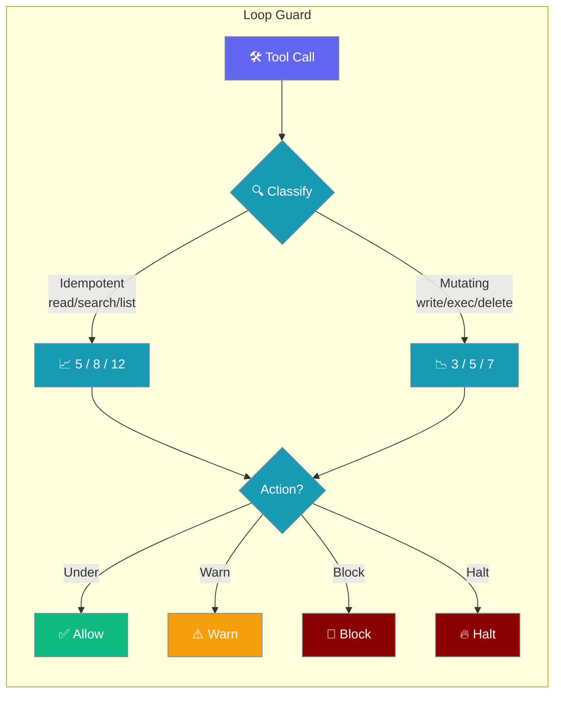
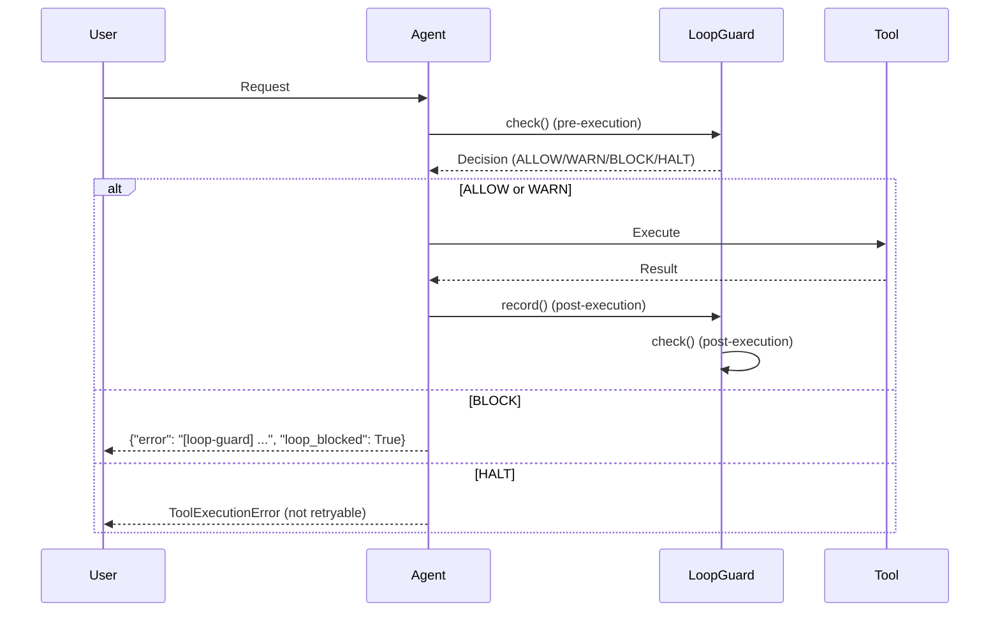
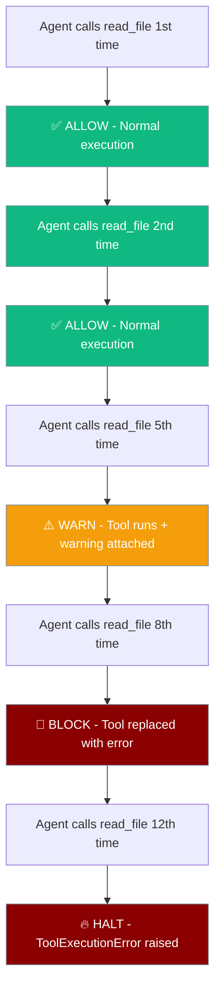
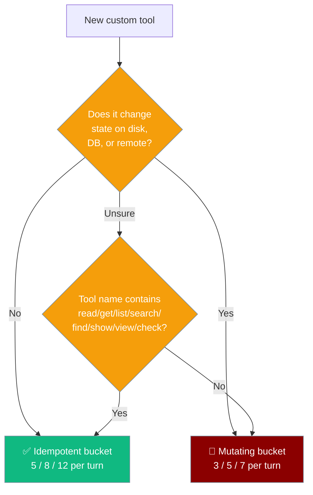

Loop Guard stops broken or misconfigured tools from burning tokens by counting per-turn calls and reacting differently to safe-to-repeat vs state-changing tools.

<Note>
Looking for **bot-to-bot** reply-loop protection? See [Bot-to-Bot Loop Protection](/docs/features/bot-loop-protection) — a separate gateway-layer primitive that caps how many exchanges a pair of bots can trade.
</Note>

```python
from praisonaiagents import Agent

agent = Agent(
    name="Safe Coder",
    instructions="Use tools carefully.",
)
agent.start("Fix the failing unit test in src/utils.py")
```

The user sends a task; Loop Guard tracks tool calls per turn and blocks runaway loops automatically.



## Quick Start

<Steps>
<Step title="It's already on">

```python
from praisonaiagents import Agent

agent = Agent(
    instructions="You are a helpful assistant."
)

# Loop Guard is initialised automatically.
# No flag needed — every Agent gets one.
agent.start("Summarise the README")
```

</Step>

<Step title="Tune the thresholds">

For power users, you can customize thresholds after agent creation:

```python
from praisonaiagents import Agent
from praisonaiagents.escalation.loop_guard import LoopGuard, LoopGuardConfig

agent = Agent(instructions="Polls a slow status endpoint")

agent._loop_guard = LoopGuard(LoopGuardConfig(
    idempotent_warn_threshold=10,
    idempotent_block_threshold=20,
    idempotent_halt_threshold=30,
    max_time_per_turn=300.0,
))
```

</Step>

<Step title="Turn it off">

<Warning>
Disabling Loop Guard removes the safety net for misbehaving tools.
</Warning>

```python
from praisonaiagents import Agent
from praisonaiagents.escalation.loop_guard import LoopGuard, LoopGuardConfig

agent = Agent(instructions="Agent without safety guard")

agent._loop_guard = LoopGuard(LoopGuardConfig(enabled=False))
```

</Step>
</Steps>

---

## How It Works



| Decision | Effect | User sees |
|----------|--------|-----------|
| `ALLOW` | Tool runs normally | Normal result |
| `WARN` | Tool runs; warning logged | Result + `_loop_guard` warning metadata |
| `BLOCK` | Tool execution replaced | `{"error": "[loop-guard] ...", "loop_blocked": True}` |
| `HALT` | Non-retryable exception raised | `ToolExecutionError` propagates out |

---

## User Interaction Flow

Here's what happens when an agent repeatedly calls the same tool:



The agent experiences escalating resistance: warnings first, then blocked execution, then complete halt.

---

## Tool Classification

Loop Guard categorizes tools into two buckets with different thresholds:



**Idempotent tools** (safe to repeat): `read_file`, `list_files`, `search_files`, `web_search`, `get_memory`, `git_status`, `git_log`, `db_query`, etc.

**Mutating tools** (state-changing): `write_file`, `edit_file`, `delete_file`, `execute_code`, `shell`, `git_commit`, `git_push`, `sql_insert`, `install_package`, etc.

<Tip>
If you can't move your tool into the explicit set, **name it well** — Loop Guard's heuristic looks for substrings like `read`, `get`, `list`, `search`, `find`, `show`, `view`, `check` (case-insensitive) to classify tools as idempotent.
</Tip>

---

## Configuration Options

| Option | Type | Default | Description |
|--------|------|---------|-------------|
| `enabled` | `bool` | `True` | Enable/disable Loop Guard entirely |
| `idempotent_warn_threshold` | `int` | `5` | Warning threshold for idempotent tools |
| `idempotent_block_threshold` | `int` | `8` | Block threshold for idempotent tools |
| `idempotent_halt_threshold` | `int` | `12` | Halt threshold for idempotent tools |
| `mutating_warn_threshold` | `int` | `3` | Warning threshold for mutating tools |
| `mutating_block_threshold` | `int` | `5` | Block threshold for mutating tools |
| `mutating_halt_threshold` | `int` | `7` | Halt threshold for mutating tools |
| `max_time_per_turn` | `float` | `120.0` | Maximum seconds per turn before timeout |
| `no_progress_warn` | `int` | `4` | Warning threshold for no-progress detection |
| `no_progress_halt` | `int` | `8` | Halt threshold for no-progress detection |

**GuardAction values**: `ALLOW`, `WARN`, `BLOCK`, `HALT`

**LoopGuardDecision fields**: `action`, `code`, `message`, `metadata`

---

## What happens at each threshold

| Decision | Pre-execution effect | Post-execution effect | User sees |
|----------|---------------------|----------------------|-----------|
| `ALLOW` | Tool runs normally | Counter incremented | Normal result |
| `WARN` | Tool runs; warning logged | Warning appended/attached to result | `_loop_guard` key in dict result, or `[loop-guard] ...` suffix on string result |
| `BLOCK` | Tool **not** executed | Counter still incremented | Tool result replaced with `{"error": "[loop-guard] ...", "loop_blocked": True}` |
| `HALT` | `ToolExecutionError` raised, `is_retryable=False` | N/A | Exception propagates out of `agent.chat()` / `agent.start()` |

---

## Common Patterns

### Polling a slow status endpoint

```python
from praisonaiagents import Agent
from praisonaiagents.escalation.loop_guard import LoopGuard, LoopGuardConfig

agent = Agent(instructions="Monitor deployment status")

# Increase idempotent thresholds for polling scenarios
agent._loop_guard = LoopGuard(LoopGuardConfig(
    idempotent_warn_threshold=15,
    idempotent_block_threshold=25,
    idempotent_halt_threshold=40,
    max_time_per_turn=300.0,  # 5 minute timeout
))
```

### Strict mode for production database agents

```python
from praisonaiagents import Agent
from praisonaiagents.escalation.loop_guard import LoopGuard, LoopGuardConfig

agent = Agent(instructions="Manage user database")

# Lower mutating thresholds for safety
agent._loop_guard = LoopGuard(LoopGuardConfig(
    mutating_warn_threshold=2,
    mutating_block_threshold=3,
    mutating_halt_threshold=4,
))
```

### Observability with stats

```python
agent = Agent(instructions="Data processing agent")

# Get statistics for dashboards
stats = agent._loop_guard.get_stats()
print(f"Turn elapsed: {stats['turn_elapsed']}s")
print(f"Tool counts: {stats['tool_counts']}")
```

---

## Relationship to Loop Detection

Loop Guard and Loop Detection are **complementary features** with different purposes:

| Feature | Opt-in? | Where | What it catches |
|---------|---------|-------|----------------|
| [Loop Detection](/docs/features/doom-loop-detection) | **Yes** — `loop_detection=True` | Identical-call, no-progress poll, ping-pong patterns |
| **Loop Guard** | **No — always-on for every Agent** | Per-turn tool-call counts with idempotent-vs-mutating classification and graduated `warn`→`block`→`halt` responses |

Loop Detection (opt-in) catches identical-argument / no-progress patterns at any frequency, while Loop Guard (always-on) catches high-frequency tool calls within a single turn regardless of argument variation. Use both for comprehensive protection.

---

## Best Practices

<AccordionGroup>

<Accordion title="Trust the defaults">
The default thresholds (5/8/12 for idempotent, 3/5/7 for mutating) work well for most agents. Only customize when you have specific use cases like status polling or strict production environments.
</Accordion>

<Accordion title="Tune thresholds, not the on/off switch">
Resist the urge to disable Loop Guard entirely. Instead, adjust thresholds to match your agent's workflow. A monitoring agent might need higher idempotent thresholds, but even monitoring agents can benefit from mutating tool limits.
</Accordion>

<Accordion title="Name custom tools so the heuristic works">
If your custom tool isn't in the explicit `IDEMPOTENT_TOOLS` or `MUTATING_TOOLS` sets, name it descriptively. Tools named `check_status`, `read_config`, or `search_logs` will be classified as idempotent automatically.
</Accordion>

<Accordion title="Use get_stats() for observability">
Monitor your agents' tool usage patterns with `agent._loop_guard.get_stats()`. High tool counts might indicate the agent is struggling with a task and needs different instructions or tools.
</Accordion>

</AccordionGroup>

---

## Related

<CardGroup cols={2}>
<Card icon="triangle-exclamation" href="/docs/features/doom-loop-detection">
  Loop Detection
</Card>
<Card icon="robot" href="/docs/features/escalation-pipeline">
  Agent Autonomy
</Card>
</CardGroup>