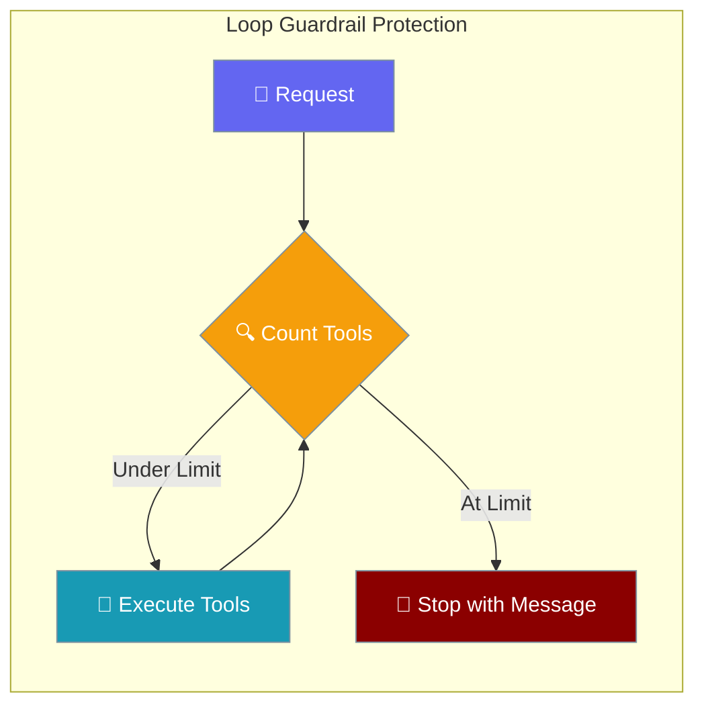
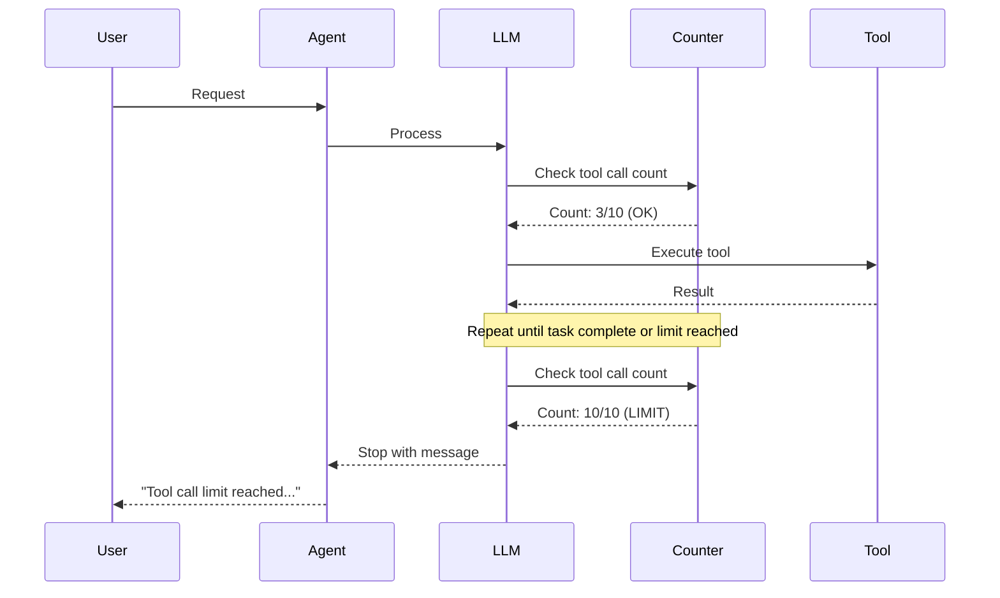
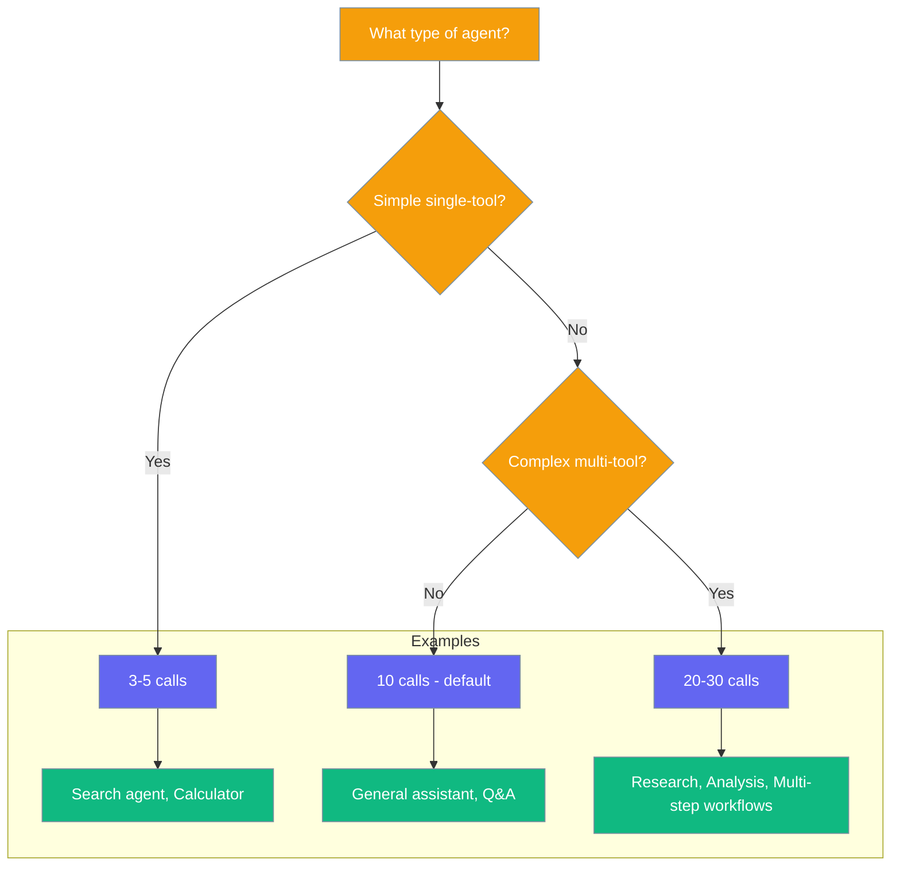

Loop guardrails cap how many tool calls an agent can make in a single turn, stopping runaway loops from broken or chatty tools.



## Quick Start

<Steps>
<Step title="Default Protection">

Every agent gets automatic loop protection:

```python
from praisonaiagents import Agent

# Default protection (10 tool calls per turn)
agent = Agent(
    name="Protected Agent",
    instructions="Safe from infinite loops",
    tools=[my_tool]
)

agent.start("Your request")
```

The user starts a workflow loop; guardrails cap iterations and stop runaway tool calls.

</Step>

<Step title="Custom Limit">

Adjust the limit for your use case:

```python
from praisonaiagents import Agent, ExecutionConfig

agent = Agent(
    name="Custom Protected Agent",
    instructions="Custom loop protection",
    tools=[experimental_tool],
    execution=ExecutionConfig(max_tool_calls_per_turn=5)
)
```

</Step>
</Steps>

---

## How It Works



The agent tracks `tool_call_count` across iterations within a single chat turn:

1. **Before each batch**: Checks if `tool_call_count >= max_tool_calls_per_turn`
2. **At limit**: Stops execution with clear message
3. **Batch trimming**: If batch would exceed limit, trims to remaining calls
4. **Reset**: Counter resets for each new chat turn

---

## When the limit is hit

```python
# When the limit is reached, you'll see this message:
"Tool call limit reached (10 calls). Task may be too complex or there may be a broken tool causing repeated calls."
```

The agent stops cleanly instead of burning tokens indefinitely.

---

## Choosing a limit



| Scenario | Suggested value | Reasoning |
|----------|-----------------|-----------|
| Single-tool simple agent | 3–5 | Most tasks need 1-2 calls |
| Default agent | 10 (default) | Balanced for most use cases |
| Multi-tool research agent | 20–30 | Complex workflows need more steps |
| Long-running autonomous workflow | Use autonomy mode instead | Different protection mechanism |

---

## Common Patterns

### Pattern 1: Protecting Experimental Tools

```python
from praisonaiagents import Agent, ExecutionConfig

agent = Agent(
    name="Experimental Agent",
    instructions="Testing new tools safely",
    tools=[experimental_api_tool],
    execution=ExecutionConfig(max_tool_calls_per_turn=3)
)
```

### Pattern 2: Complex Research Agent

```python
from praisonaiagents import Agent, ExecutionConfig

agent = Agent(
    name="Research Agent",
    instructions="Multi-step analysis and research",
    tools=[search_tool, analyze_tool, summarize_tool],
    execution=ExecutionConfig(max_tool_calls_per_turn=25)
)
```

---

## Best Practices

<AccordionGroup>
<Accordion title="Start with Default">
Use the default limit (10) unless you have a specific reason to change it. It handles most use cases well.
</Accordion>

<Accordion title="Lower for Experimental Tools">
Set 3-5 calls when testing new or potentially buggy tools to prevent token waste.
</Accordion>

<Accordion title="Higher for Legitimate Workflows">
Increase to 20-30 for agents that need multiple tool calls for complex, multi-step tasks.
</Accordion>

<Accordion title="Monitor and Adjust">
If agents hit the limit frequently on legitimate tasks, increase it. If they waste tokens on broken tools, decrease it.
</Accordion>
</AccordionGroup>

---

## Related

<CardGroup cols={2}>
<Card title="ExecutionConfig" icon="gauge-high" href="/docs/configuration/execution-config">
  Configure all execution limits
</Card>
<Card title="Autonomy Mode" icon="robot" href="/docs/features/autonomy-loop">
  DoomLoop protection for autonomous agents
</Card>
</CardGroup>