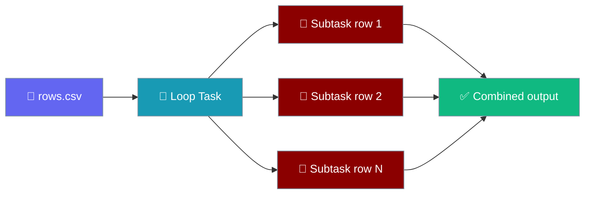
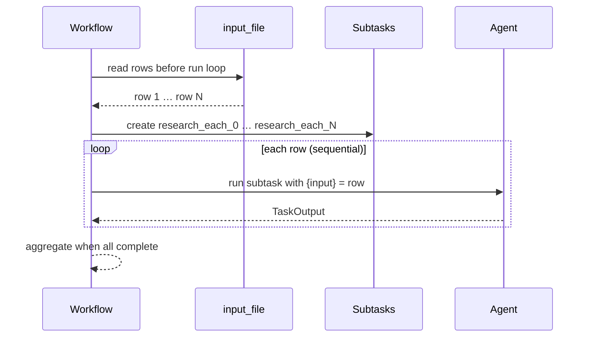
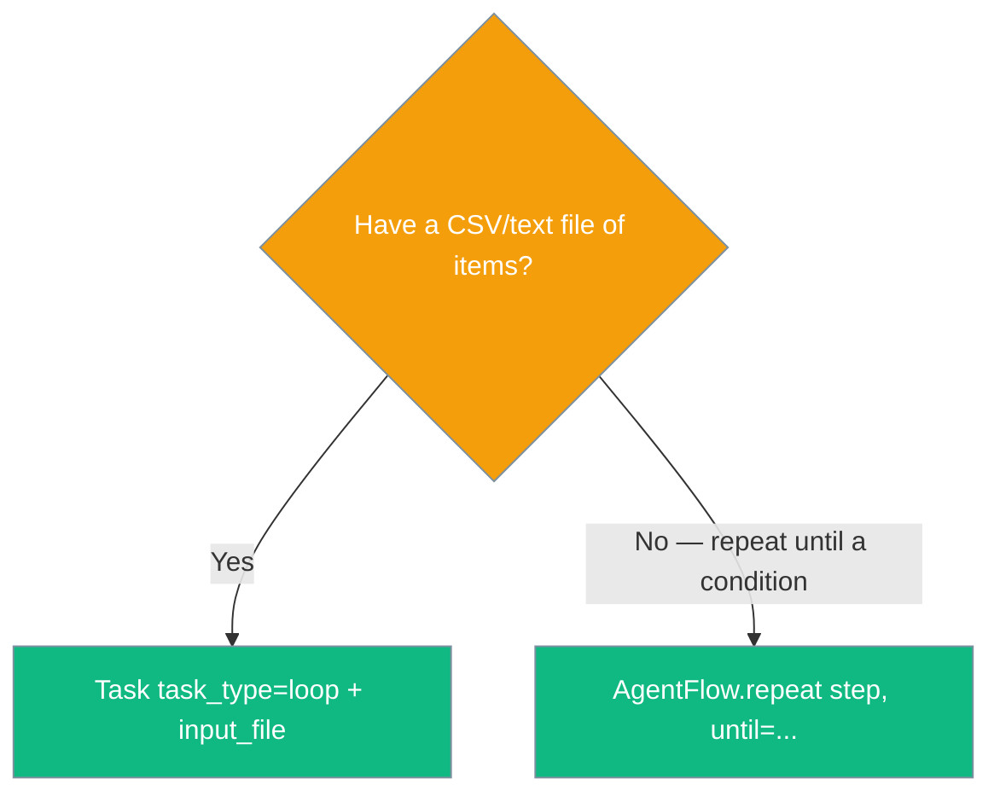

Loop tasks turn a single task into one subtask per row of a CSV or text file — no manual iteration.



## Quick Start

<Steps>
<Step title="Loop a task over a CSV">
```python
from praisonaiagents import Agent, Task, PraisonAIAgents

researcher = Agent(name="Researcher", instructions="Summarise the topic in one line")

loop_task = Task(
    name="research_each",
    description="Research: {input}",   # {input} substitutes per row
    expected_output="One-line summary",
    agent=researcher,
    task_type="loop",
    input_file="topics.csv",
    is_start=True,
)

workflow = PraisonAIAgents(agents=[researcher], tasks=[loop_task], process="workflow")
workflow.start()
```
</Step>

<Step title="Same task, async entry point">
```python
import asyncio

asyncio.run(workflow.astart())   # per-row expansion works here too (SDK ≥ 2026-07-27)
```
</Step>
</Steps>

---

## How It Works

The workflow reads `input_file` before the run loop begins and expands the loop task into one subtask per row.



| Step | What happens |
|------|--------------|
| Read file | Workflow reads `input_file` once, before the first task runs |
| Expand | Each row becomes a subtask named `<original_name>_<row_index>` |
| Run | Subtasks execute sequentially, each seeing its row as `{input}` |
| Aggregate | Result returned when all subtasks complete |

---

## Choose the Right Loop

| Use | When | Import |
|-----|------|--------|
| `Task(task_type="loop", input_file=...)` | Fixed CSV/text file, workflow process, one row per subtask | `from praisonaiagents import Task, PraisonAIAgents` |
| `AgentFlow(steps=[loop(from_csv=...)])` | Deterministic step pipeline with loops as a step | `from praisonaiagents import AgentFlow, loop` |
| `AgentFlow(steps=[repeat(step, until=...)])` | Repeat a step until a condition is met (no file needed) | `from praisonaiagents import AgentFlow, repeat` |



---

## Sync vs Async

<Note>
Loop pre-expansion runs identically for `workflow.start()` and `await workflow.astart()`. Prior to SDK versions from 2026-07-27 the async path ran the loop task once as an ordinary task and ignored `input_file`. If you were using async workflows with `task_type="loop"`, upgrade to pick up the fix.
</Note>

---

## Common Patterns

### Summarise a list of URLs

```python
from praisonaiagents import Agent, Task, PraisonAIAgents

summariser = Agent(name="Summariser", instructions="Summarise the page at the given URL in one line")

loop_task = Task(
    name="summarise_url",
    description="Summarise this URL: {input}",
    expected_output="One-line summary",
    agent=summariser,
    task_type="loop",
    input_file="urls.csv",
    is_start=True,
)

workflow = PraisonAIAgents(agents=[summariser], tasks=[loop_task], process="workflow")
workflow.start()
```

### Loop then post-process each row

```python
from praisonaiagents import Agent, Task, PraisonAIAgents

extractor = Agent(name="Extractor", instructions="Extract the key fact from the row")
formatter = Agent(name="Formatter", instructions="Format the fact as a bullet point")

extract = Task(
    name="extract_row",
    description="Extract the key fact: {input}",
    expected_output="A single fact",
    agent=extractor,
    task_type="loop",
    input_file="scraped.csv",
    is_start=True,
    next_tasks=["format_row"],
)

format_row = Task(
    name="format_row",
    description="Format as a bullet point",
    expected_output="A markdown bullet",
    agent=formatter,
)

workflow = PraisonAIAgents(agents=[extractor, formatter], tasks=[extract, format_row], process="workflow")
workflow.start()
```

---

## Best Practices

<AccordionGroup>

<Accordion title="Omit input_file to default to tasks.csv">
When `task_type="loop"` and no `input_file` is set, the workflow reads `tasks.csv` from the working directory.

```python
Task(name="loop_it", description="Process: {input}", agent=agent, task_type="loop", is_start=True)
# reads tasks.csv
```
</Accordion>

<Accordion title="One row = one string — use JSON for structured fields">
Each row is passed to `{input}` as a single string. Put structured data in JSON inside the row and parse it in the agent instructions.
</Accordion>

<Accordion title="Loop subtasks run sequentially by design">
Subtasks execute one after another. Use `AgentFlow.parallel` when you want fan-out across rows.
</Accordion>

<Accordion title="A single failing row doesn't abort the workflow">
Other rows still run. Check per-subtask `TaskOutput` to find which rows failed.
</Accordion>

</AccordionGroup>

---

## Related

<CardGroup cols={2}>
<Card title="Workflow Loop" icon="repeat" href="/docs/features/workflow-loop">
AgentFlow-level loops over a CSV as a pipeline step
</Card>

<Card title="Workflow Repeat" icon="rotate" href="/docs/features/workflow-repeat">
Repeat a step until a condition is met — no file needed
</Card>
</CardGroup>
