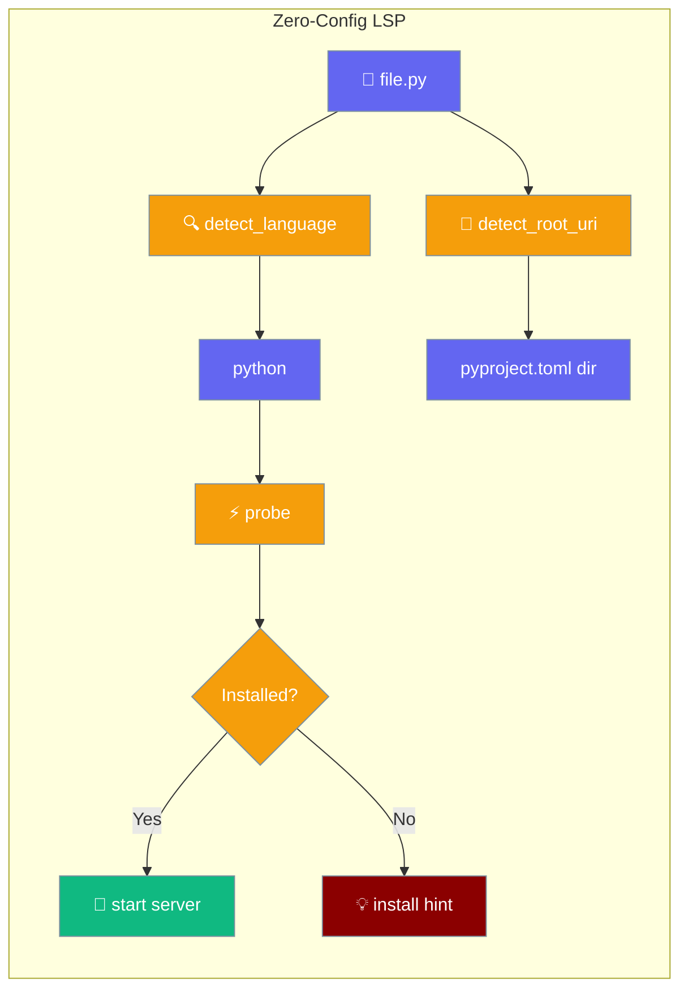
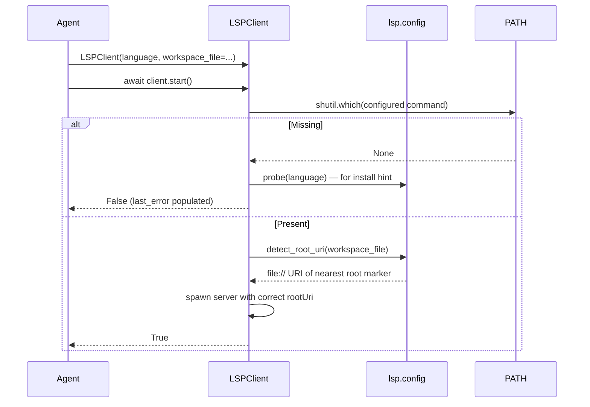
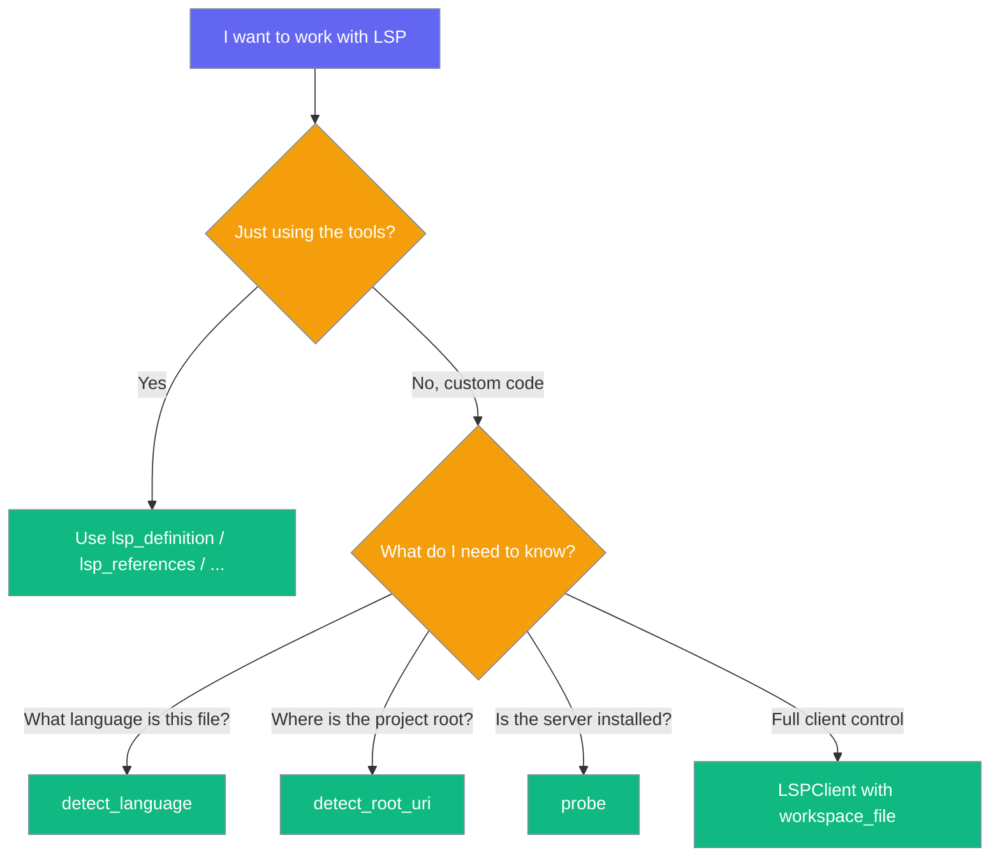

Zero-config helpers that pick the right language server, its real project root, and tell you plainly when it isn't installed.

```python
from praisonaiagents import Agent
from praisonaiagents.tools import lsp_definition

agent = Agent(
    name="Coder",
    instructions="Navigate the codebase with LSP accuracy.",
    tools=[lsp_definition],
)

agent.start("Where is `authenticate` defined in this monorepo?")
# The LSP client now finds the nearest pyproject.toml / go.mod / Cargo.toml
# on its own; no rootUri configuration needed.
```



## Quick Start

<Steps>
<Step title="Let the agent do it (nothing to configure)">

```python
from praisonaiagents import Agent
from praisonaiagents.tools import lsp_definition, lsp_references

agent = Agent(
    name="Coder",
    instructions="Find definitions and references before editing.",
    tools=[lsp_definition, lsp_references],
)
agent.start("What calls `parse_config`?")
```

</Step>

<Step title="Detect language and root yourself (advanced)">

```python
from praisonaiagents.lsp import detect_language, detect_root_uri

detect_language("services/auth/main.go")     # → "go"
detect_root_uri("services/auth/main.go")      # → "file:///abs/path/to/repo"  (nearest go.mod)
```

</Step>

<Step title="Probe availability before you use LSP">

```python
from praisonaiagents.lsp import probe

available, command, install_hint = probe("rust")
# → (False, "rust-analyzer", "rustup component add rust-analyzer")
if not available:
    print(f"Install `{command}` first: {install_hint}")
```

</Step>

<Step title="Talk to the client directly with a workspace-aware root">

```python
import asyncio
from praisonaiagents.lsp import LSPClient

client = LSPClient(language="python", workspace_file="services/api/mod.py")
started = asyncio.run(client.start())
if not started:
    print(client.last_error)
    # "language server `pylsp` not found on PATH; install with `pip install python-lsp-server`"
```

</Step>
</Steps>

---

## How It Works



Each language maps to a default server, its file extensions, and the root markers that pin a project root — the nearest marker wins.

| Language | Extensions | Root markers (nearest wins) | Command | Install hint |
|---|---|---|---|---|
| `python` | `.py`, `.pyi` | `pyproject.toml`, `setup.py`, `setup.cfg`, `requirements.txt`, `.git` | `pylsp` | `pip install python-lsp-server` |
| `javascript` | `.js`, `.jsx`, `.mjs`, `.cjs` | `package.json`, `tsconfig.json`, `jsconfig.json`, `.git` | `typescript-language-server` | `npm install -g typescript-language-server typescript` |
| `typescript` | `.ts`, `.tsx` | `tsconfig.json`, `package.json`, `jsconfig.json`, `.git` | `typescript-language-server` | `npm install -g typescript-language-server typescript` |
| `rust` | `.rs` | `Cargo.toml`, `Cargo.lock`, `.git` | `rust-analyzer` | `rustup component add rust-analyzer` |
| `go` | `.go` | `go.mod`, `go.sum`, `.git` | `gopls` | `go install golang.org/x/tools/gopls@latest` |

---

## Which Helper Should I Use?



---

## Public API Surface

These are pure helpers plus one new keyword and one new attribute on `LSPClient`.

| Symbol | Kind | Import path | Returns | Notes |
|---|---|---|---|---|
| `detect_language(file_path)` | function | `from praisonaiagents.lsp import detect_language` | `Optional[str]` | Case-insensitive extension lookup; `None` for unknown extensions |
| `detect_root_uri(file_path, language=None)` | function | `from praisonaiagents.lsp import detect_root_uri` | `Optional[str]` | Walks up from the file; nearest matching marker wins; `None` if none found |
| `probe(language)` | function | `from praisonaiagents.lsp import probe` | `Tuple[bool, Optional[str], Optional[str]]` | `(available, command, install_hint)` |
| `path_to_uri(path)` | function | `from praisonaiagents.lsp.config import path_to_uri` | `str` | Percent-encodes spaces, `#`, and other reserved characters |
| `DEFAULT_SERVERS` | constant | `from praisonaiagents.lsp import DEFAULT_SERVERS` | `Dict[str, Dict]` | Rows contain `command`, `args`, `extensions`, `root_markers`, `install_hint` |
| `LSPClient(..., workspace_file=None)` | class | `from praisonaiagents.lsp import LSPClient` | — | When `root_uri` is not given, root is auto-detected from `workspace_file` |
| `LSPClient.last_error` | attribute | (on any client) | `Optional[str]` | Structured "not found on PATH" message; `None` on success |

---

## Common Patterns

**Guarded startup logging** — log what the LSP layer would do for each language:

```python
from praisonaiagents.lsp import probe

for lang in ("python", "typescript", "go", "rust"):
    ok, cmd, hint = probe(lang)
    print(f"{lang}: {'ok' if ok else 'missing'} ({cmd or 'no server'})")
```

**Monorepo-aware navigation** — prove you're pointing at the right project root:

```python
from praisonaiagents.lsp import detect_root_uri

assert detect_root_uri("services/api/mod.py").endswith("/services/api")
```

**Fallback to grep with a real reason** — surface `client.last_error` so the model picks a fallback intelligently:

```python
import asyncio
from praisonaiagents.lsp import LSPClient

client = LSPClient(language="go", workspace_file="services/auth/main.go")
if not asyncio.run(client.start()):
    print(f"LSP unavailable — {client.last_error}. Falling back to grep.")
```

---

## Best Practices

<AccordionGroup>
<Accordion title="Prefer probe() over try/except">

`LSPClient.start()` no longer raises on a missing binary — it sets `last_error` and returns `False`. Reserve `try/except` for real IO failures.

</Accordion>
<Accordion title="Pass workspace_file= to LSPClient in monorepos">

Without it, the client falls back to `os.getcwd()`, which is almost never the file's real project root. `workspace_file` lets `detect_root_uri` initialise the server against the nearest root marker.

</Accordion>
<Accordion title="Do not parse the phrases">

Error text like `install with \`...\`` is for humans. For machine-readable data, call `probe(language)` and read the `(available, command, install_hint)` tuple.

</Accordion>
<Accordion title="Treat the 'not found on PATH' note as a call to action">

The `edit_tools` note appears once per language per run. When you see it, install the server rather than ignore the diagnostic signal for the rest of the session.

</Accordion>
</AccordionGroup>

---

## Related

<CardGroup cols={2}>
  <Card title="LSP Navigation Tools" icon="magnifying-glass-code" href="/features/lsp-navigation-tools">
    Go-to-definition, find-references, hover, and symbol search
  </Card>
  <Card title="LSP Tools (reference)" icon="compass" href="/tools/lsp_tools">
    Per-tool parameters and output format
  </Card>
  <Card title="Post-Edit Formatter" icon="wand-magic-sparkles" href="/features/post-edit-formatter">
    Produces the new "diagnostics unavailable" note
  </Card>
  <Card title="Built-in Tool Registry" icon="wrench" href="/features/tools">
    How `Agent(tools=[…])` resolves tool names
  </Card>
</CardGroup>
