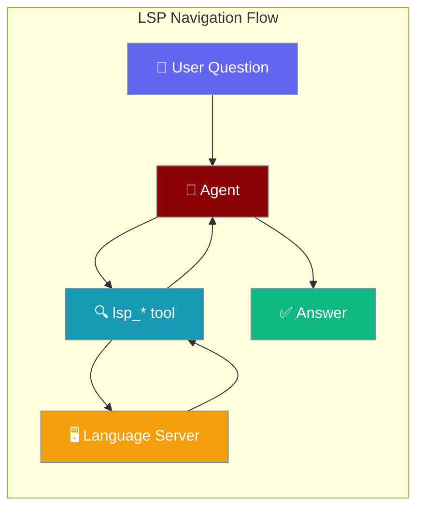
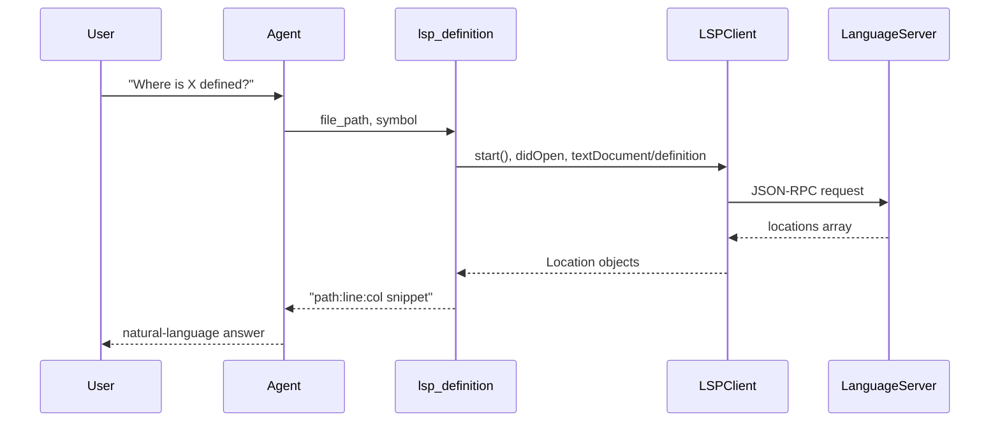
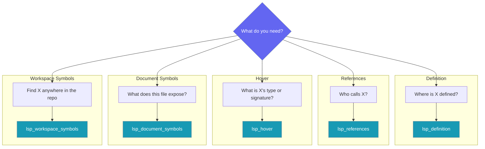

Give your agent language-server-accurate go-to-definition, find-references, and symbol search so it navigates code the way an IDE does — not the way `grep` does.



## Quick Start

<Steps>
<Step title="Simple Usage">

Pass tool names as strings — the agent resolves them from the built-in registry:

```python
from praisonaiagents import Agent

agent = Agent(
    name="Coder",
    instructions="Navigate the codebase using LSP-accurate tools before editing.",
    tools=["lsp_definition", "lsp_references", "lsp_hover",
           "lsp_document_symbols", "lsp_workspace_symbols"],
)

agent.start("Where is `resolve_within_root` defined and who calls it?")
```

</Step>

<Step title="Pass Tools Directly">

Import the functions and pass them to `Agent`:

```python
from praisonaiagents import Agent
from praisonaiagents.tools import lsp_definition, lsp_references

agent = Agent(name="coder", tools=[lsp_definition, lsp_references])
agent.start("Find the definition of `compute` and every call site.")
```

</Step>

<Step title="Direct Call (No Agent)">

Call tools directly without an agent:

```python
from praisonaiagents.tools import lsp_references

print(lsp_references("src/mod.py", symbol="compute"))
```

</Step>
</Steps>

---

## How It Works



Each tool call spawns a fresh `LSPClient`, opens the document (`didOpen`), runs the query, and closes cleanly. There is no shared long-lived server process — every call is self-contained.

---

## Choose the Right Tool



| Tool | Signature | Purpose | LSP Method |
|------|-----------|---------|-----------|
| `lsp_definition` | `(file_path, line=None, character=None, symbol=None)` | Go to definition of a symbol | `textDocument/definition` |
| `lsp_references` | `(file_path, line=None, character=None, symbol=None, include_declaration=True)` | Find all references to a symbol | `textDocument/references` |
| `lsp_hover` | `(file_path, line, character)` | Type / signature / doc at a position | `textDocument/hover` |
| `lsp_document_symbols` | `(file_path)` | List symbols defined in a file | `textDocument/documentSymbol` |
| `lsp_workspace_symbols` | `(query, file_path=None)` | Search symbols across the workspace | `workspace/symbol` |

---

## Supported Languages

| Language | File Extensions | Default Server Binary |
|----------|-----------------|-----------------------|
| Python | `.py`, `.pyi` | `pylsp` (from `python-lsp-server`) |
| JavaScript | `.js`, `.jsx`, `.mjs`, `.cjs` | `typescript-language-server` |
| TypeScript | `.ts`, `.tsx` | `typescript-language-server` |
| Rust | `.rs` | `rust-analyzer` |
| Go | `.go` | `gopls` |

The server binary must be installed and on your `PATH`. `lsp_workspace_symbols` without a `file_path` defaults to the Python language server.

---

## Addressing: Position or Symbol

Position-taking tools (`lsp_definition`, `lsp_references`, `lsp_hover`) accept two addressing styles:

- **Explicit position** — pass `line` and `character` as 0-indexed integers (LSP convention). The output uses 1-indexed numbers so results are human-readable.
- **Symbol name** — pass `symbol="my_func"` and the tool locates the first word-boundary occurrence of that name in the file, converting it to a position automatically.

`lsp_hover` requires an explicit `(line, character)` — it does not accept a `symbol` name.

---

## Configuration Options

<CardGroup cols={2}>
  <Card icon="code" href="/docs/sdk/reference/praisonaiagents/modules/lsp">
    Python reference for the underlying LSP client
  </Card>
  <Card icon="wrench" href="/docs/features/tools">
    How `Agent(tools=[…])` resolves tool names
  </Card>
</CardGroup>

---

## Common Patterns

**Investigate a symbol before refactoring**

Use `lsp_definition` to find where something is defined, then `lsp_references` to see every call site before changing anything:

```python
from praisonaiagents.tools import lsp_definition, lsp_references

print(lsp_definition("src/utils.py", symbol="compute"))
print(lsp_references("src/utils.py", symbol="compute"))
```

**Explore an unfamiliar file**

List what a file exports, then hover over interesting names to understand their signatures:

```python
from praisonaiagents.tools import lsp_document_symbols, lsp_hover

print(lsp_document_symbols("src/parser.py"))
print(lsp_hover("src/parser.py", line=42, character=8))
```

**Locate a function whose name you half-remember**

Search the whole workspace with a partial name:

```python
from praisonaiagents.tools import lsp_workspace_symbols

print(lsp_workspace_symbols("parse_conf"))
```

---

## Best Practices

<AccordionGroup>
<Accordion title="Install the language server first">

Each language needs its server binary on `PATH` before the tools will work:

```bash
# Python
pip install python-lsp-server

# JavaScript / TypeScript
npm install -g typescript-language-server typescript

# Rust
rustup component add rust-analyzer

# Go
go install golang.org/x/tools/gopls@latest
```

If a server is missing the tool returns `Error: <lang> language server not installed; install it to use lsp navigation (falling back to grep is advised)` — it never raises an exception.

</Accordion>
<Accordion title="Prefer symbol= over line/character when position is unknown">

If you don't already know the exact line number, pass `symbol="my_func"` instead of guessing a position. The tool locates the first word-boundary occurrence for you, so results are always accurate.

</Accordion>
<Accordion title="Narrow workspace-symbol queries">

`lsp_workspace_symbols` caps output at 100 results and prints `... (N more; narrow your query)` when the cap is hit. Use specific substrings — `"parse_config"` rather than `"parse"` — to stay inside the limit.

</Accordion>
<Accordion title="Graceful degradation is by design">

When a language server is not installed the tools return a clear error string rather than raising. Check the return value for `Error: … not installed` and fall back to grep-based tools (`ast_grep`, shell search) when needed.

</Accordion>
</AccordionGroup>

---

## Related

<CardGroup cols={2}>
  <Card title="Built-in Tool Registry" icon="wrench" href="/docs/features/tools">
    How to register and resolve tools with `Agent(tools=[…])`
  </Card>
  <Card title="LSP Service Command" icon="terminal" href="/docs/cli/lsp">
    The `praisonai lsp` CLI command for managing the LSP service
  </Card>
</CardGroup>
