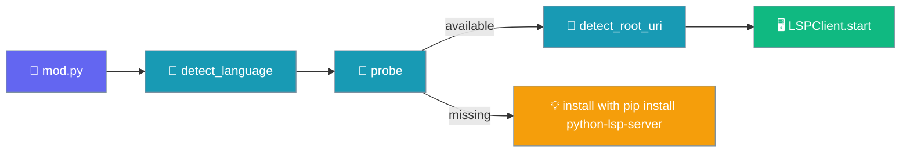
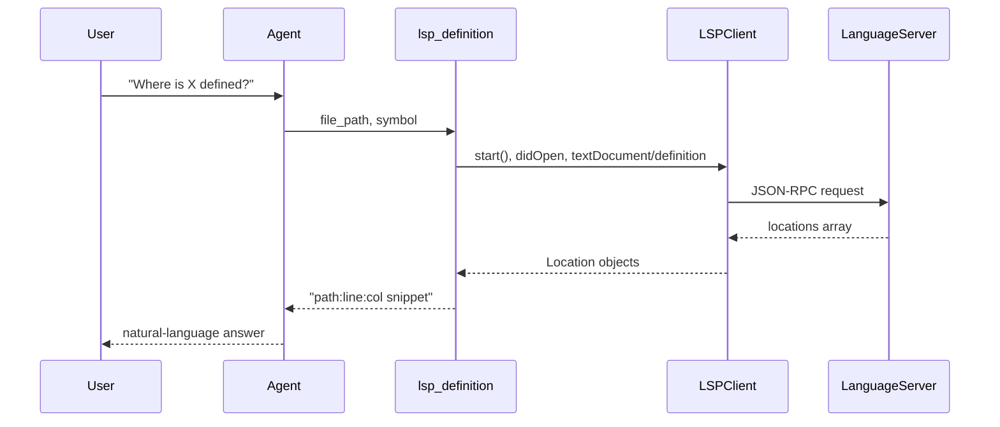
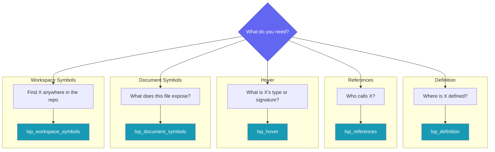
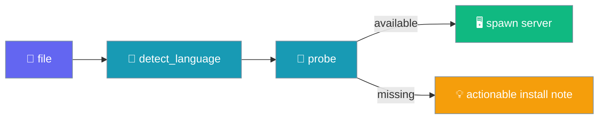

Give your agent language-server-accurate go-to-definition, find-references, and symbol search that works out of the box — the right server is picked from the file extension, and a missing server degrades to an actionable install hint instead of a silent no-op.


```mermaid
graph LR
    File[📄 mod.py] --> Detect[🔎 detect_language]
    Detect --> Probe[🧪 probe]
    Probe -->|available| Root[📍 detect_root_uri]
    Root --> Spawn[🖥️ LSPClient.start]
    Probe -->|missing| Note[💡 install with pip install python-lsp-server]

    classDef input fill:#6366F1,stroke:#7C90A0,color:#fff
    classDef process fill:#189AB4,stroke:#7C90A0,color:#fff
    classDef result fill:#10B981,stroke:#7C90A0,color:#fff
    classDef warn fill:#F59E0B,stroke:#7C90A0,color:#fff

    class File input
    class Detect,Probe,Root process
    class Spawn result
    class Note warn
```

## Quick Start

<Steps>
<Step title="Simple Usage">

Pass tool names as strings — the agent resolves them from the built-in registry:

```python
from praisonaiagents import Agent

agent = Agent(
    name="Coder",
    instructions="Navigate the codebase using LSP-accurate tools before editing.",
    tools=["lsp_definition", "lsp_references", "lsp_hover",
           "lsp_document_symbols", "lsp_workspace_symbols"],
)

agent.start("Where is `resolve_within_root` defined and who calls it?")
```

</Step>

<Step title="Pass Tools Directly">

Import the functions and pass them to `Agent`:

```python
from praisonaiagents import Agent
from praisonaiagents.tools import lsp_definition, lsp_references

agent = Agent(name="coder", tools=[lsp_definition, lsp_references])
agent.start("Find the definition of `compute` and every call site.")
```

</Step>

<Step title="Direct Call (No Agent)">

Call tools directly without an agent:

```python
from praisonaiagents.tools import lsp_references

print(lsp_references("src/mod.py", symbol="compute"))
```

</Step>
</Steps>

---

## How It Works


```mermaid
sequenceDiagram
    participant User
    participant Agent
    participant lsp_definition
    participant LSPClient
    participant LanguageServer

    User->>Agent: "Where is X defined?"
    Agent->>lsp_definition: file_path, symbol
    lsp_definition->>LSPClient: start(), didOpen, textDocument/definition
    LSPClient->>LanguageServer: JSON-RPC request
    LanguageServer-->>LSPClient: locations array
    LSPClient-->>lsp_definition: Location objects
    lsp_definition-->>Agent: "path:line:col  snippet"
    Agent-->>User: natural-language answer
```

Each tool call spawns a fresh `LSPClient`, opens the document (`didOpen`), runs the query, and closes cleanly. There is no shared long-lived server process — every call is self-contained.

### Monorepos

When a `file_path` is passed, the client initialises the language server against the nearest **root marker** (`pyproject.toml`, `go.mod`, `Cargo.toml`, `tsconfig.json`, `.git`, …) rather than the current working directory. Nested-project searches resolve against the file's real project root. See [LSP Auto-Detect](/features/lsp-auto-detect) for the full marker table and the helpers you can call yourself.

---

## Choose the Right Tool


```mermaid
graph TB
    Q{What do you need?} --> D["Where is X defined?"]
    Q --> R["Who calls X?"]
    Q --> H["What is X's type or signature?"]
    Q --> F["What does this file expose?"]
    Q --> W["Find X anywhere in the repo"]

    subgraph "Definition"
        D --> lsp_def[lsp_definition]
    end

    subgraph "References"
        R --> lsp_ref[lsp_references]
    end

    subgraph "Hover"
        H --> lsp_hov[lsp_hover]
    end

    subgraph "Document Symbols"
        F --> lsp_doc[lsp_document_symbols]
    end

    subgraph "Workspace Symbols"
        W --> lsp_wks[lsp_workspace_symbols]
    end

    classDef question fill:#6366F1,stroke:#7C90A0,color:#fff
    classDef tool fill:#189AB4,stroke:#7C90A0,color:#fff

    class Q question
    class lsp_def,lsp_ref,lsp_hov,lsp_doc,lsp_wks tool
```

| Tool | Signature | Purpose | LSP Method |
|------|-----------|---------|-----------|
| `lsp_definition` | `(file_path, line=None, character=None, symbol=None)` | Go to definition of a symbol | `textDocument/definition` |
| `lsp_references` | `(file_path, line=None, character=None, symbol=None, include_declaration=True)` | Find all references to a symbol | `textDocument/references` |
| `lsp_hover` | `(file_path, line, character)` | Type / signature / doc at a position | `textDocument/hover` |
| `lsp_document_symbols` | `(file_path)` | List symbols defined in a file | `textDocument/documentSymbol` |
| `lsp_workspace_symbols` | `(query, file_path=None)` | Search symbols across the workspace | `workspace/symbol` |

---

## Supported Languages

The language server is chosen automatically from the file extension — you never wire up a server yourself.

| Language | File Extensions | Default Server Binary | Install Hint |
|----------|-----------------|-----------------------|--------------|
| Python | `.py`, `.pyi` | `pylsp` | `pip install python-lsp-server` |
| JavaScript | `.js`, `.jsx`, `.mjs`, `.cjs` | `typescript-language-server` | `npm install -g typescript-language-server typescript` |
| TypeScript | `.ts`, `.tsx` | `typescript-language-server` | `npm install -g typescript-language-server typescript` |
| Rust | `.rs` | `rust-analyzer` | `rustup component add rust-analyzer` |
| Go | `.go` | `gopls` | `go install golang.org/x/tools/gopls@latest` |

The server binary must be on your `PATH`; when it is missing the tools return the install hint above instead of failing silently. `lsp_workspace_symbols` without a `file_path` defaults to the Python language server.

---

## Zero-config: pick a server automatically

`detect_language` maps a file to its language by extension, so the correct server is spawned with no setup.


```mermaid
graph LR
    File[📄 file] --> Detect[🔎 detect_language]
    Detect --> Probe[🧪 probe]
    Probe -->|available| Spawn[🖥️ spawn server]
    Probe -->|missing| Note[💡 actionable install note]

    classDef input fill:#6366F1,stroke:#7C90A0,color:#fff
    classDef process fill:#189AB4,stroke:#7C90A0,color:#fff
    classDef result fill:#10B981,stroke:#7C90A0,color:#fff
    classDef warn fill:#F59E0B,stroke:#7C90A0,color:#fff

    class File input
    class Detect,Probe process
    class Spawn result
    class Note warn
```

```python
from praisonaiagents.lsp import detect_language

detect_language("src/mod.py")   # "python"
detect_language("app.tsx")      # "typescript"
detect_language("main.go")      # "go"
detect_language("lib.rs")       # "rust"
detect_language("index.jsx")    # "javascript"
detect_language("notes.txt")    # None
```

Unsupported extensions return `None`, and the tools degrade explicitly.

---

## When the server is missing

A missing language server produces an actionable message telling you exactly what to install — never a silent no-op.

Check availability before spawning with `probe`, which returns `(available, command, install_hint)`:

```python
from praisonaiagents.lsp import probe

available, command, install_hint = probe("go")
# (False, "gopls", "go install golang.org/x/tools/gopls@latest")
```

The five `lsp_*` navigation tools embed the hint in their error string:

```text
Error: go language server `gopls` not installed (install with `go install golang.org/x/tools/gopls@latest`); install it to use lsp navigation (falling back to grep is advised)
```

Post-edit diagnostics surface a one-time-per-language note when a known server is absent:

```text
Diagnostics (lsp:python): unavailable — language server `pylsp` not found on PATH; install with `pip install python-lsp-server`
```

---

## Monorepos and multi-root workspaces

`detect_root_uri` walks up from the file to the nearest root marker, so the server initialises against the real project root instead of the current working directory.

| Language | Root markers (nearest wins) |
|----------|------------------------------|
| `python` | `pyproject.toml`, `setup.py`, `setup.cfg`, `requirements.txt`, `.git` |
| `javascript` | `package.json`, `tsconfig.json`, `jsconfig.json`, `.git` |
| `typescript` | `tsconfig.json`, `package.json`, `jsconfig.json`, `.git` |
| `rust` | `Cargo.toml`, `Cargo.lock`, `.git` |
| `go` | `go.mod`, `go.sum`, `.git` |

```python
from praisonaiagents.lsp import detect_root_uri

detect_root_uri("packages/api/src/mod.py")
# "file:///abs/path/to/monorepo/packages/api"   (nearest pyproject.toml)
```

Nested-project workspace-symbol searches now return results from the file's own project, not the outer repo.

---

## Helpers Reference

Import these directly from `praisonaiagents.lsp` for zero-config detection and availability checks.

| Helper | Signature | Returns | Example |
|--------|-----------|---------|---------|
| `detect_language` | `detect_language(file_path)` | `str \| None` | `detect_language("m.py") → "python"` |
| `detect_root_uri` | `detect_root_uri(file_path, language=None)` | `str \| None` | `detect_root_uri("api/m.py") → "file:///…/api"` |
| `probe` | `probe(language)` | `(bool, str \| None, str \| None)` | `probe("go") → (False, "gopls", "go install …")` |
| `path_to_uri` | `path_to_uri(path)` | `str` | `path_to_uri("/tmp/a b#1/m.py") → "file:///tmp/a%20b%231/m.py"` |

```python
from praisonaiagents.lsp import detect_language, detect_root_uri, probe
from praisonaiagents.lsp.config import path_to_uri

detect_language("app.tsx")                 # "typescript"
detect_root_uri("packages/api/src/m.py")   # "file:///…/packages/api"
probe("python")                            # (True, "pylsp", "pip install python-lsp-server")
path_to_uri("/tmp/my project#1/mod.py")    # "file:///tmp/my%20project%231/mod.py"
```

`path_to_uri` percent-encodes reserved characters (spaces, `#`), so projects whose paths contain them no longer break — the old failure mode where URIs truncated at those characters is gone.

---

## LSPClient Updates

`LSPClient` now auto-detects the workspace root and degrades gracefully instead of raising.

| Change | What it does |
|--------|--------------|
| `workspace_file=` kwarg | Detects the workspace root from the file's nearest root marker when `root_uri` is not given |
| `last_error` attribute | Holds a structured, actionable message when the server binary is missing |
| `start()` no longer raises | Returns `False` on a missing binary after a `PATH` pre-flight, instead of `FileNotFoundError` |

```python
from praisonaiagents.lsp import LSPClient

client = LSPClient(language="go")
ok = await client.start()   # False, no exception
print(client.last_error)
# language server `gopls` not found on PATH; install with `go install golang.org/x/tools/gopls@latest`
```

Pass `workspace_file=` so a monorepo file initialises against its own project root:

```python
client = LSPClient(language="python", workspace_file="packages/api/src/mod.py")
await client.start()   # rootUri = packages/api, not os.getcwd()
```

---

## Addressing: Position or Symbol

Position-taking tools (`lsp_definition`, `lsp_references`, `lsp_hover`) accept two addressing styles:

- **Explicit position** — pass `line` and `character` as 0-indexed integers (LSP convention). The output uses 1-indexed numbers so results are human-readable.
- **Symbol name** — pass `symbol="my_func"` and the tool locates the first word-boundary occurrence of that name in the file, converting it to a position automatically.

`lsp_hover` requires an explicit `(line, character)` — it does not accept a `symbol` name.

---

## Configuration Options

<CardGroup cols={2}>
  <Card icon="code" href="/sdk/reference/praisonaiagents/modules/lsp">
    Python reference for the underlying LSP client
  </Card>
  <Card icon="wrench" href="/features/tools">
    How `Agent(tools=[…])` resolves tool names
  </Card>
</CardGroup>

---

## Common Patterns

**Investigate a symbol before refactoring**

Use `lsp_definition` to find where something is defined, then `lsp_references` to see every call site before changing anything:

```python
from praisonaiagents.tools import lsp_definition, lsp_references

print(lsp_definition("src/utils.py", symbol="compute"))
print(lsp_references("src/utils.py", symbol="compute"))
```

**Explore an unfamiliar file**

List what a file exports, then hover over interesting names to understand their signatures:

```python
from praisonaiagents.tools import lsp_document_symbols, lsp_hover

print(lsp_document_symbols("src/parser.py"))
print(lsp_hover("src/parser.py", line=42, character=8))
```

**Locate a function whose name you half-remember**

Search the whole workspace with a partial name:

```python
from praisonaiagents.tools import lsp_workspace_symbols

print(lsp_workspace_symbols("parse_conf"))
```

---

## Best Practices

<AccordionGroup>
<Accordion title="Install the language server when prompted">

Detection is automatic, but the server binary still needs to be on `PATH`. When one is missing, the tools tell you exactly what to install:

```bash
# Python
pip install python-lsp-server

# JavaScript / TypeScript
npm install -g typescript-language-server typescript

# Rust
rustup component add rust-analyzer

# Go
go install golang.org/x/tools/gopls@latest
```

If a server is missing the tool returns `Error: <lang> language server \`<command>\` not installed (install with \`<install_hint>\`); install it to use lsp navigation (falling back to grep is advised)` — it never raises an exception. The exact error names the missing binary and the install command so you can copy-paste it.

</Accordion>
<Accordion title="Prefer symbol= over line/character when position is unknown">

If you don't already know the exact line number, pass `symbol="my_func"` instead of guessing a position. The tool locates the first word-boundary occurrence for you, so results are always accurate.

</Accordion>
<Accordion title="Narrow workspace-symbol queries">

`lsp_workspace_symbols` caps output at 100 results and prints `... (N more; narrow your query)` when the cap is hit. Use specific substrings — `"parse_config"` rather than `"parse"` — to stay inside the limit.

</Accordion>
<Accordion title="Graceful degradation is by design">

When a language server is not installed the tools return a clear error string rather than raising. The error names the missing binary and its install command — e.g. `Error: python language server \`pylsp\` not installed (install with \`pip install python-lsp-server\`); …`. Check the return value for `not installed` and fall back to grep-based tools (`ast_grep`, shell search) when needed.

</Accordion>
<Accordion title="Paths with spaces or # just work">

Files whose paths contain reserved characters (spaces, `#`) are handled correctly — `path_to_uri` percent-encodes them into valid `file://` URIs, and results are decoded back on the way in, so no more truncation at those characters.

</Accordion>
</AccordionGroup>

---

## Related

<CardGroup cols={2}>
  <Card title="LSP Auto-Detect" icon="radar" href="/features/lsp-auto-detect">
    Zero-config language, root, and availability detection
  </Card>
  <Card title="Built-in Tool Registry" icon="wrench" href="/features/tools">
    How to register and resolve tools with `Agent(tools=[…])`
  </Card>
  <Card title="LSP Service Command" icon="terminal" href="/cli/lsp">
    The `praisonai lsp` CLI command for managing the LSP service
  </Card>
</CardGroup>
