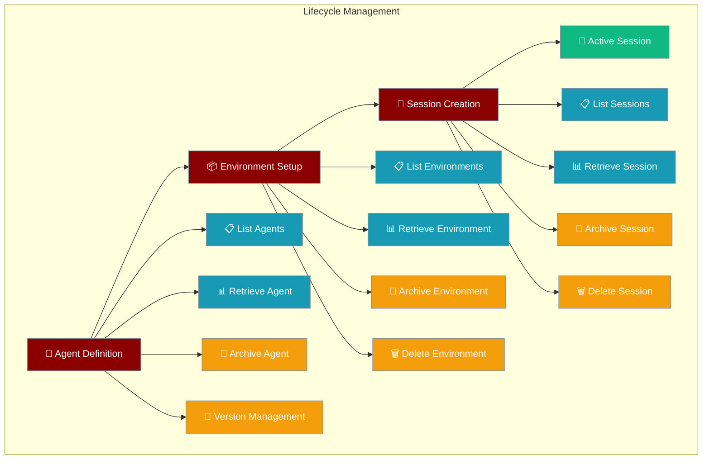
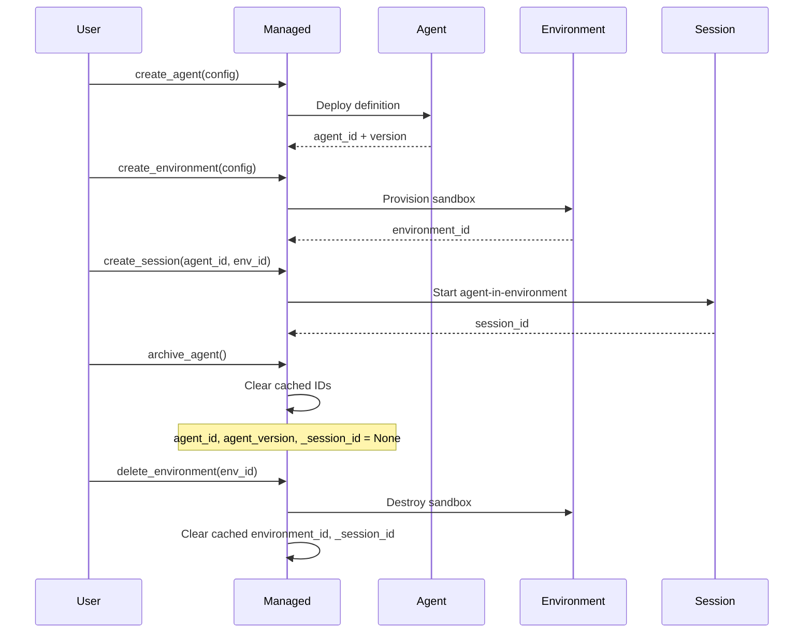

Managed agent lifecycle provides full control over agent definitions, environments, and running sessions with comprehensive CRUD operations.



## Quick Start

<Steps>
<Step title="Basic Agent Lifecycle">
Create, use, and manage a simple agent.

```python
from praisonai import AnthropicManagedAgent, ManagedConfig

managed = AnthropicManagedAgent(config=ManagedConfig(
    model="claude-sonnet-4-6",
    system="You are a helpful coding assistant.",
))

# Create agent and environment
agent_id = await managed.create_agent(managed._cfg)
env_id = await managed.create_environment(managed._cfg)

# Create session
session_id = await managed.create_session(agent_id, env_id)

# Use session...
await managed.send_event(session_id, {"type": "user.message", "content": [{"type": "text", "text": "Hello!"}]})

# Clean up when done
await managed.archive_session(session_id)
await managed.archive_agent()  # Clears cached IDs
```
</Step>

<Step title="Agent Version Pinning">
Pin agents to specific versions for consistent behavior.

```python
# Create agent and set version preference
managed = AnthropicManagedAgent(config=config)
agent_id = await managed.create_agent(config)

# Pin to specific version
managed.agent_version = 3

# Sessions will use version 3
session_id = await managed.create_session(agent_id, env_id)

# List all versions of this agent
versions = await managed.list_agent_versions()
# [{"version": 1, "created_at": "..."}, {"version": 2, "..."}, {"version": 3, "..."}]
```
</Step>
</Steps>

---

## How It Works



---

## Agent Management

### Agent CRUD Operations

| Method | Purpose | State Changes |
|--------|---------|---------------|
| `create_agent(config)` | Deploy agent definition | Sets `agent_id`, `agent_version` |
| `retrieve_agent()` | Get agent metadata | None |
| `list_agents(**kwargs)` | List all agents | None |
| `archive_agent()` | Mark agent inactive | Clears `agent_id`, `agent_version`, `_session_id` |
| `list_agent_versions()` | Get version history | None |

### Agent Version Management

```python
# Create agent (version 1)
agent_id = await managed.create_agent(config)
print(f"Created agent {agent_id} v{managed.agent_version}")

# Update agent (creates version 2)
updated_config = ManagedConfig(
    model="claude-haiku-4-5",  # Changed model
    system="Updated system prompt"
)
agent_id = await managed.create_agent(updated_config)
print(f"Updated agent {agent_id} v{managed.agent_version}")

# Pin to specific version
managed.agent_version = 1
session_id = await managed.create_session(agent_id, env_id)  # Uses version 1

# List all versions
versions = await managed.list_agent_versions()
for v in versions:
    print(f"Version {v['version']} created at {v['created_at']}")
```

### Agent Metadata Retrieval

```python
# Get current agent details
agent_info = await managed.retrieve_agent()
print(f"Agent: {agent_info['name']} ({agent_info['model']})")
print(f"System: {agent_info['system'][:50]}...")
print(f"Created: {agent_info['created_at']}")

# List agents with filtering
agents = await managed.list_agents(limit=10, name_contains="coding")
for agent in agents:
    print(f"{agent['name']}: {agent['id']} (v{agent['version']})")
```

---

## Environment Management

### Environment CRUD Operations

| Method | Purpose | State Changes |
|--------|---------|---------------|
| `create_environment(config)` | Provision sandbox | Sets `environment_id` |
| `retrieve_environment()` | Get environment metadata | None |
| `list_environments(**kwargs)` | List all environments | None |
| `archive_environment()` | Mark environment inactive | Clears `environment_id`, `_session_id` |
| `delete_environment()` | Destroy environment permanently | Clears `environment_id`, `_session_id` |

### Environment Lifecycle

```python
# Create environment
env_id = await managed.create_environment(ManagedConfig(
    packages={"pip": ["pandas", "numpy"]},
    networking={"type": "limited", "allowed_hosts": ["api.openai.com"]}
))

# Check environment status
env_info = await managed.retrieve_environment()
print(f"Environment {env_info['id']} status: {env_info['status']}")
print(f"Packages: {env_info.get('packages', {})}")

# List environments
environments = await managed.list_environments(status="active")
for env in environments:
    print(f"Environment {env['name']}: {env['id']}")

# Archive vs Delete
await managed.archive_environment()  # Preserves data, marks inactive
# OR
await managed.delete_environment()   # Destroys environment completely
```

---

## Session Management

### Session CRUD Operations

| Method | Purpose | Returns |
|--------|---------|---------|
| `create_session(agent_id, env_id)` | Start agent session | `session_id: str` |
| `retrieve_session(session_id?)` | Get session metadata | `Dict[str, Any]` |
| `list_sessions(**filters)` | List sessions with filtering | `List[Dict[str, Any]]` |
| `archive_session(session_id?)` | Mark session inactive | `None` |
| `delete_session(session_id?)` | Delete session permanently | `None` |

### Session Lifecycle

```python
# Create session with agent version pinning
managed.agent_version = 2  # Pin to version 2
session_id = await managed.create_session(agent_id, env_id)

# Check session status
session_info = await managed.retrieve_session(session_id)
print(f"Session {session_info['id']} status: {session_info['status']}")
print(f"Agent version: {session_info.get('agent_version')}")
print(f"Usage: {session_info.get('usage', {})}")

# List sessions with filtering
active_sessions = await managed.list_sessions(status="active", limit=10)
for session in active_sessions:
    print(f"Session {session['title']}: {session['id']}")

# Session cleanup
await managed.archive_session(session_id)  # Preserves conversation history
# OR  
await managed.delete_session(session_id)   # Removes all data permanently
```

---

## Common Patterns

### Multi-Agent System

```python
class MultiAgentSystem:
    def __init__(self):
        self.agents = {}
        self.environments = {}
        self.sessions = {}
    
    async def create_coding_agent(self):
        """Create specialized coding agent."""
        managed = AnthropicManagedAgent(config=ManagedConfig(
            name="coder",
            model="claude-sonnet-4-6",
            system="You are an expert Python developer.",
            tools=[{"type": "agent_toolset_20260401"}]
        ))
        
        agent_id = await managed.create_agent(managed._cfg)
        env_id = await managed.create_environment(ManagedConfig(
            env_name="python-dev",
            packages={"pip": ["pandas", "numpy", "pytest"]}
        ))
        
        self.agents["coder"] = {"managed": managed, "agent_id": agent_id}
        self.environments["python-dev"] = env_id
        
        return managed, agent_id, env_id
    
    async def create_research_agent(self):
        """Create specialized research agent."""
        managed = AnthropicManagedAgent(config=ManagedConfig(
            name="researcher", 
            model="claude-sonnet-4-6",
            system="You are a research assistant.",
            tools=[{"type": "web_search_20260401"}]
        ))
        
        agent_id = await managed.create_agent(managed._cfg)
        env_id = await managed.create_environment(ManagedConfig(
            env_name="research",
            networking={"type": "unrestricted"}
        ))
        
        self.agents["researcher"] = {"managed": managed, "agent_id": agent_id}
        self.environments["research"] = env_id
        
        return managed, agent_id, env_id
```

### Session Pool Management

```python
class SessionPool:
    def __init__(self, managed_agent, max_sessions=5):
        self.managed = managed_agent
        self.max_sessions = max_sessions
        self.active_sessions = []
    
    async def get_session(self):
        """Get available session or create new one."""
        # Clean up idle sessions
        await self._cleanup_idle_sessions()
        
        if len(self.active_sessions) < self.max_sessions:
            # Create new session
            session_id = await self.managed.create_session(
                self.managed.agent_id, 
                self.managed.environment_id
            )
            self.active_sessions.append({
                "id": session_id,
                "created_at": time.time(),
                "last_used": time.time()
            })
            return session_id
        else:
            # Reuse oldest session
            oldest = min(self.active_sessions, key=lambda s: s["last_used"])
            oldest["last_used"] = time.time()
            return oldest["id"]
    
    async def _cleanup_idle_sessions(self):
        """Archive sessions idle for >30 minutes."""
        cutoff = time.time() - 1800  # 30 minutes
        idle_sessions = [s for s in self.active_sessions if s["last_used"] < cutoff]
        
        for session in idle_sessions:
            await self.managed.archive_session(session["id"])
            self.active_sessions.remove(session)
```

### Resource Monitoring

```python
async def monitor_resources(managed: AnthropicManagedAgent):
    """Monitor and report resource usage."""
    # List all resources
    agents = await managed.list_agents()
    environments = await managed.list_environments()
    sessions = await managed.list_sessions()
    
    print(f"📊 Resource Usage Summary")
    print(f"Agents: {len(agents)} total")
    print(f"Environments: {len(environments)} total") 
    print(f"Sessions: {len(sessions)} total")
    
    # Active sessions breakdown
    active_sessions = [s for s in sessions if s["status"] == "active"]
    archived_sessions = [s for s in sessions if s["status"] == "archived"]
    
    print(f"\nSession Status:")
    print(f"  Active: {len(active_sessions)}")
    print(f"  Archived: {len(archived_sessions)}")
    
    # Environment status
    for env in environments:
        print(f"\nEnvironment {env['name']}:")
        print(f"  Status: {env['status']}")
        print(f"  Packages: {len(env.get('packages', {}))}")
```

---

## Best Practices

<AccordionGroup>
<Accordion title="Resource Management">
Always clean up resources to avoid billing and quota issues:

```python
# Good: Explicit cleanup
try:
    session_id = await managed.create_session(agent_id, env_id)
    # Use session...
finally:
    await managed.archive_session(session_id)
    await managed.archive_agent()  # Clears cached IDs

# Good: Context manager pattern
class ManagedAgentContext:
    def __init__(self, managed_agent):
        self.managed = managed_agent
        
    async def __aenter__(self):
        self.agent_id = await self.managed.create_agent(self.managed._cfg)
        self.env_id = await self.managed.create_environment(self.managed._cfg)
        self.session_id = await self.managed.create_session(self.agent_id, self.env_id)
        return self
        
    async def __aexit__(self, exc_type, exc_val, exc_tb):
        await self.managed.archive_session(self.session_id)
        await self.managed.archive_agent()
```
</Accordion>

<Accordion title="Version Management">
Use agent versioning for reliable deployments:

```python
# Pin to specific versions in production
production_agent_version = 5
managed.agent_version = production_agent_version

# Test new versions in staging
staging_managed = AnthropicManagedAgent(config=new_config)
test_agent_id = await staging_managed.create_agent(staging_managed._cfg)
# If tests pass, promote to production
```
</Accordion>

<Accordion title="State Management">
Understand state clearing behavior:

```python
# archive_agent() clears ALL cached IDs
await managed.archive_agent()
# Now: agent_id=None, agent_version=None, _session_id=None

# archive_environment() clears environment + session IDs
await managed.archive_environment() 
# Now: environment_id=None, _session_id=None (agent_id preserved)

# delete_environment() clears environment + session IDs  
await managed.delete_environment()
# Now: environment_id=None, _session_id=None (agent_id preserved)
```
</Accordion>

<Accordion title="Error Recovery">
Handle failures gracefully with proper resource tracking:

```python
try:
    agent_id = await managed.create_agent(config)
    env_id = await managed.create_environment(config)
    session_id = await managed.create_session(agent_id, env_id)
except Exception as e:
    # Clean up any partially created resources
    if hasattr(managed, 'agent_id') and managed.agent_id:
        await managed.archive_agent()
    if hasattr(managed, 'environment_id') and managed.environment_id:
        await managed.delete_environment()
    raise e
```
</Accordion>
</AccordionGroup>

---

## Related

<CardGroup cols={2}>
<Card title="Managed Runtime Protocol" icon="cloud" href="/docs/features/managed-runtime-protocol">
  Core protocol defining agent lifecycle operations
</Card>
<Card title="Managed Vault" icon="key" href="/docs/features/managed-vault">
  Secure credential storage for agent integrations
</Card>
</CardGroup>