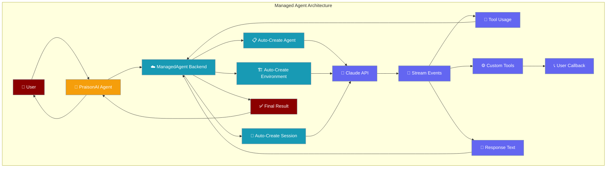

This complete example demonstrates all managed agent features in a single script that you can run end-to-end.


## Quick Start

<Steps>
<Step title="Install Dependencies">

```bash
pip install praisonai anthropic
export ANTHROPIC_API_KEY="your_api_key_here"
```

</Step>

<Step title="Save the Complete App">

Save the full script below as `app.py` to see all managed agent features in action.

</Step>

<Step title="Run the Demo">

```bash
python app.py
```

Watch as the script demonstrates 19 different managed agent features sequentially.

</Step>
</Steps>

---

## Complete Application Code

<Tabs>

<Tab title="app.py">

```python
import json
import pathlib
from praisonai import Agent, ManagedAgent, ManagedConfig

# 1. Create an agent

managed = ManagedAgent()
agent = Agent(name="teacher", backend=managed)
result = agent.start("Say hello briefly", stream=True)

print(f"[1] Agent created: {managed.agent_id} (v{managed.agent_version})")

# 2. Update the agent

managed.update_agent(
    name="Teaching Agent v2",
    system="You are a senior Python developer. Write clean, production-quality code.",
)

print(f"[2] Agent updated: Teaching Agent v2 (v{managed.agent_version})")

# 3-4. Environment + Session are created automatically (already done in step 1)

print(f"[3] Environment created: {managed.environment_id}")
print(f"[4] Session created: {managed.session_id}")

# 5. Stream a response

print("\n[5] Streaming response...")

result = agent.start("Write a Python script that prints 'Hello from Managed Agents!' and run it", stream=True)

# 6. Multi-turn conversation (same session remembers context)

print("\n[6] Multi-turn: sending follow-up...")

result = agent.start("Now modify that script to accept a name argument and greet that person", stream=True)

# 7. Track usage

info = managed.retrieve_session()
print("\n[7] Usage report:")
if info.get("usage"):
    print(f"    Input tokens:  {info['usage']['input_tokens']}")
    print(f"    Output tokens: {info['usage']['output_tokens']}")
else:
    print(f"    Input tokens:  {managed.total_input_tokens}")
    print(f"    Output tokens: {managed.total_output_tokens}")

# 8. List sessions

sessions = managed.list_sessions()
print(f"\n[8] Total sessions: {len(sessions)}")
for s in sessions[:3]:
    print(f"    {s['id']} | {s['status']} | {s['title']}")

# 9. Selective tools (only bash + read + write)

bash_managed = ManagedAgent(
    config=ManagedConfig(
        name="Bash Only Agent",
        model="claude-haiku-4-5",
        system="You can only use bash, read, and write tools.",
        tools=[
            {
                "type": "agent_toolset_20260401",
                "default_config": {"enabled": False},
                "configs": [
                    {"name": "bash", "enabled": True},
                    {"name": "read", "enabled": True},
                    {"name": "write", "enabled": True},
                ],
            },
        ],
    ),
)

bash_agent = Agent(name="bash-only", backend=bash_managed)

print("\n[9] Bash-only agent streaming...")
result = bash_agent.start("Show the current date and Python version using bash", stream=True)

# 10. Disable specific tools (web disabled, everything else on)

no_web_managed = ManagedAgent(
    config=ManagedConfig(
        name="No Web Agent",
        model="claude-haiku-4-5",
        system="You are a coding assistant. You cannot access the web.",
        tools=[
            {
                "type": "agent_toolset_20260401",
                "configs": [
                    {"name": "web_fetch", "enabled": False},
                    {"name": "web_search", "enabled": False},
                ],
            },
        ],
    ),
)

no_web_agent = Agent(name="no-web", backend=no_web_managed)

print("\n[10] No-web agent streaming...")
result = no_web_agent.start("Write a Python one-liner that calculates 2**100 and print the result", stream=True)

# 11. Custom tools (you define the tool, PraisonAI calls your callback)

def handle_weather(tool_name, tool_input):
    print(f"\n  [Custom tool: {tool_name} | Input: {json.dumps(tool_input)}]")
    return "Tokyo: 22°C, sunny, humidity 55%"

custom_managed = ManagedAgent(
    config=ManagedConfig(
        name="Weather Agent",
        model="claude-haiku-4-5",
        system="You are a weather assistant. Use the get_weather tool to check weather.",
        tools=[
            {"type": "agent_toolset_20260401"},
            {
                "type": "custom",
                "name": "get_weather",
                "description": "Get current weather for a location",
                "input_schema": {
                    "type": "object",
                    "properties": {
                        "location": {"type": "string", "description": "City name"},
                    },
                    "required": ["location"],
                },
            },
        ],
    ),
    on_custom_tool=handle_weather,
)

custom_agent = Agent(name="weather", backend=custom_managed)

print("\n[11] Custom tool agent streaming...")
result = custom_agent.start("What is the weather in Tokyo?", stream=True)

# 12. Web search agent

search_managed = ManagedAgent(
    config=ManagedConfig(
        name="Search Agent",
        model="claude-haiku-4-5",
        system="You are a research assistant. Search the web and summarize.",
    ),
)

search_agent = Agent(name="searcher", backend=search_managed)

print("\n[12] Web search agent streaming...")
result = search_agent.start("Search the web for Python 3.13 new features and give me 3 bullet points", stream=True)

# 13. Environment with pre-installed packages

data_managed = ManagedAgent(
    config=ManagedConfig(
        name="Data Science Agent",
        model="claude-haiku-4-5",
        system="You are a data science assistant.",
        packages={"pip": ["pandas", "numpy"]},
    ),
)

data_agent = Agent(name="data-scientist", backend=data_managed)

print("\n[13] Data science environment streaming...")
result = data_agent.start("Use pandas to create a small DataFrame with 3 rows of sample data and print it", stream=True)

# 14. Interrupt a session

interrupt_managed = ManagedAgent(
    config=ManagedConfig(
        name="Interruptable Agent",
        model="claude-haiku-4-5",
        system="You are a helpful coding assistant.",
    ),
)

interrupt_agent = Agent(name="interruptable", backend=interrupt_managed)

print("\n[14] Interrupt demo...")
result = interrupt_agent.start("Write a Python script that prints numbers 1 to 10", stream=True)
interrupt_managed.interrupt()
print("  [Interrupt sent]")

# 15. Session resume — save IDs, create a fresh ManagedAgent, resume, and verify context

print("\n[15] Session resume demo...")

# Tell the original agent a memorable fact
result = agent.start("Remember this: my favourite number is 42", stream=True)

# Save IDs to disk
ids = managed.save_ids()
ids_file = pathlib.Path("managed_ids.json")
ids_file.write_text(json.dumps(ids, indent=2))
print(f"  Saved IDs to {ids_file}: {ids}")

# Create a completely new ManagedAgent and resume the saved session
resume_managed = ManagedAgent()
resume_managed.resume_session(ids["session_id"])
resume_agent = Agent(name="resumed", backend=resume_managed)

# Ask about the fact — proves the session memory was preserved
result = resume_agent.start("What is my favourite number?", stream=True)
print(f"  Resumed session: {resume_managed.session_id}")

# Clean up
ids_file.unlink(missing_ok=True)

# 16. Multi-package managers — pip + npm installed before agent starts

print("\n[16] Multi-package managers...")

multi_pkg_managed = ManagedAgent(
    config=ManagedConfig(
        name="Full Stack Agent",
        model="claude-haiku-4-5",
        system="You are a full stack developer.",
        packages={
            "pip": ["pandas", "numpy", "scikit-learn"],
            "npm": ["express"],
        },
    ),
)

multi_pkg_agent = Agent(name="fullstack", backend=multi_pkg_managed)
result = multi_pkg_agent.start(
    "Verify pandas and express are installed: run python3 -c 'import pandas; print(pandas.__version__)' and node -e 'console.log(require.resolve(\"express\"))'",
    stream=True,
)

# 17. Limited networking — restrict container to specific hosts

print("\n[17] Limited networking...")

limited_net_managed = ManagedAgent(
    config=ManagedConfig(
        name="Restricted Network Agent",
        model="claude-haiku-4-5",
        system="You are a helpful assistant with restricted network access.",
        networking={
            "type": "limited",
            "allowed_hosts": ["api.github.com"],
            "allow_mcp_servers": False,
            "allow_package_managers": True,
        },
    ),
)

limited_net_agent = Agent(name="restricted", backend=limited_net_managed)
result = limited_net_agent.start("Fetch https://api.github.com and report the status", stream=True)

# 18. Environment management — list, retrieve, archive

print("\n[18] Environment management...")

env_client = managed._get_client()

# List all environments
environments = env_client.beta.environments.list()
print(f"  Total environments: {len(environments.data)}")
for env in environments.data[:3]:
    print(f"    {env.id} | {env.name}")

# Retrieve a specific environment
env = env_client.beta.environments.retrieve(managed.environment_id)
print(f"  Retrieved: {env.id} | {env.name}")

# 19. MCP servers — configure agent with remote MCP tool servers

print("\n[19] MCP servers...")

mcp_managed = ManagedAgent(
    config=ManagedConfig(
        name="MCP Agent",
        model="claude-haiku-4-5",
        system="You are a helpful assistant with access to MCP servers.",
        tools=[
            {"type": "agent_toolset_20260401"},
            {"type": "mcp_toolset", "mcp_server_name": "deepwiki"},
        ],
        mcp_servers=[
            {
                "type": "url",
                "url": "https://mcp.deepwiki.com/sse",
                "name": "deepwiki",
            },
        ],
        networking={
            "type": "limited",
            "allow_mcp_servers": True,
            "allow_package_managers": True,
        },
    ),
)

mcp_agent = Agent(name="mcp-agent", backend=mcp_managed)
result = mcp_agent.start(
    "Use the deepwiki MCP to read the wiki page for the anthropics/anthropic-cookbook github repo and give a one sentence summary",
    stream=True,
)

# Final usage summary

print("\n" + "=" * 60)
print("FINAL USAGE SUMMARY")
print("=" * 60)

all_backends = [
    ("Teaching Agent v2", managed),
    ("Bash Only Agent", bash_managed),
    ("No Web Agent", no_web_managed),
    ("Weather Agent", custom_managed),
    ("Search Agent", search_managed),
    ("Data Science Agent", data_managed),
    ("Interruptable Agent", interrupt_managed),
    ("Resumed Session", resume_managed),
    ("Full Stack Agent", multi_pkg_managed),
    ("Restricted Network", limited_net_managed),
    ("MCP Agent", mcp_managed),
]

total_input = 0
total_output = 0

for name, backend in all_backends:
    info = backend.retrieve_session()
    usage = info.get("usage", {})
    inp = usage.get("input_tokens", backend.total_input_tokens)
    out = usage.get("output_tokens", backend.total_output_tokens)
    total_input += inp
    total_output += out
    print(f"  {name:30s} | in: {inp:6d} | out: {out:6d}")

print(f"  {'TOTAL':30s} | in: {total_input:6d} | out: {total_output:6d}")
print("=" * 60)
```

</Tab>

<Tab title="Expected Output">

```
[1] Agent created: agt_01AbCdEf... (v1)
[2] Agent updated: Teaching Agent v2 (v2)
[3] Environment created: env_01GhIjKl...
[4] Session created: sesn_01MnOpQr...

[5] Streaming response...
I'll create a Python script that prints 'Hello from Managed Agents!' and run it.

```python
print("Hello from Managed Agents!")
```

Let me save this to a file and run it:
Hello from Managed Agents!

[6] Multi-turn: sending follow-up...
I'll modify the script to accept a name argument and greet that person.

```python
import sys
if len(sys.argv) > 1:
    name = sys.argv[1]
    print(f"Hello, {name}, from Managed Agents!")
else:
    print("Hello from Managed Agents!")
```

Running with argument:
Hello, Alice, from Managed Agents!

[7] Usage report:
    Input tokens:  2547
    Output tokens: 489

[8] Total sessions: 12
    sesn_01MnOpQr... | active | PraisonAI session
    sesn_01StUvWx... | completed | Previous session
    sesn_01YzAbCd... | archived | Old session

... [continues through all 19 steps]

============================================================
FINAL USAGE SUMMARY
============================================================
  Teaching Agent v2              | in:   2547 | out:    489
  Bash Only Agent                | in:    245 | out:     87
  No Web Agent                   | in:    198 | out:     56
  Weather Agent                  | in:    156 | out:     43
  Search Agent                   | in:    234 | out:    178
  Data Science Agent             | in:    189 | out:    123
  Interruptable Agent            | in:    167 | out:     89
  Resumed Session                | in:   2547 | out:    489
  Full Stack Agent               | in:    298 | out:    134
  Restricted Network             | in:    203 | out:    098
  MCP Agent                      | in:    267 | out:    156
  TOTAL                          | in:   7051 | out:   1942
============================================================
```

</Tab>

</Tabs>

---

## Feature Breakdown

| Step | Feature | Key Code | Description |
|------|---------|----------|-------------|
| 1 | Create Agent | `ManagedAgent()` | Zero-config agent creation |
| 2 | Update Agent | `managed.update_agent(...)` | Modify existing agent |
| 3-4 | Auto Environment + Session | Created on first `agent.start()` | Automatic resource creation |
| 5 | Stream Response | `stream=True` | Real-time token streaming |
| 6 | Multi-Turn | Same backend instance | Context preserved across calls |
| 7 | Track Usage | `managed.retrieve_session()` | Token consumption monitoring |
| 8 | List Sessions | `managed.list_sessions()` | View all agent sessions |
| 9 | Select Tools | `default_config: {"enabled": False}` | Enable only specific tools |
| 10 | Disable Tools | `configs: [{"name": "web_fetch", "enabled": False}]` | Disable specific tools |
| 11 | Custom Tools | `on_custom_tool=callback` | User-defined tool functions |
| 12 | Web Search | Enabled by default | Built-in web search capability |
| 13 | Package Install | `packages={"pip": [...]}` | Pre-install dependencies |
| 14 | Interrupt | `managed.interrupt()` | Stop execution mid-stream |
| 15 | Session Resume | `save_ids()` / `resume_session()` | Persist session state |
| 16 | Multi-Packages | `packages={"pip": [...], "npm": [...]}` | Multiple package managers |
| 17 | Limited Network | `networking={"type": "limited", ...}` | Restricted network access |
| 18 | Environment Mgmt | `client.beta.environments.*` | List, retrieve, manage envs |
| 19 | MCP Servers | `mcp_servers=[...]` + `mcp_toolset` | External MCP integration |

---

## Architecture Flow



---

## Best Practices

<AccordionGroup>

<Accordion title="Running the Full Demo">
- Ensure you have sufficient API credits before running all 19 steps
- The complete demo typically consumes 7,000-10,000 input tokens and 2,000-3,000 output tokens
- Each step demonstrates a specific feature in isolation for clarity
- Save the session IDs from step 15 to test session resumption
</Accordion>

<Accordion title="Customizing the Demo">
- Modify the `packages` list in step 13 and 16 to include your preferred libraries
- Update the `allowed_hosts` in step 17 to test your specific network restrictions
- Change the custom tool implementation in step 11 to test your own functions
- Adjust model selection throughout (`claude-haiku-4-5` vs `claude-sonnet-4-6`) based on needs
</Accordion>

<Accordion title="Production Considerations">
- Implement proper error handling around each managed agent call
- Use environment variables for API keys instead of hardcoding
- Add logging for production debugging and monitoring
- Consider implementing retry logic for network failures
- Save session IDs to persistent storage for real session resumption
</Accordion>

</AccordionGroup>

---

## Related

<CardGroup cols={2}>

<Card title="Managed Agents Guide" icon="cloud" href="/docs/features/managed-agents">
  Complete guide to managed agents with individual examples
</Card>

<Card title="Agent Configuration" icon="settings" href="/docs/concepts/configuration">
  Understand all agent configuration options and patterns
</Card>

</CardGroup>