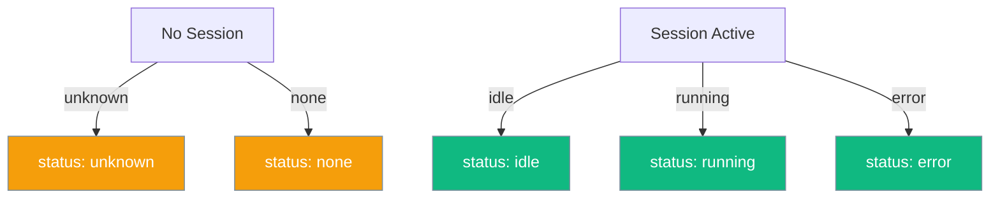

<Note>
The unified `retrieve_session()` schema applies to **both** `HostedAgent` and `LocalAgent` (the new canonical classes), as well as the deprecated `ManagedAgent` factory.
</Note>

`retrieve_session()` returns the same shape on every managed agent backend so you can write code once and switch providers freely.

```mermaid
graph LR
    subgraph "Unified SessionInfo"
        A[📝 retrieve_session] --> B{🧠 Backend}
        B -->|Anthropic| C[SessionInfo dict]
        B -->|Local| C
        C --> D[id]
        C --> E[status]
        C --> F[title]
        C --> G[usage]
    end

    classDef call fill:#6366F1,stroke:#7C90A0,color:#fff
    classDef backend fill:#F59E0B,stroke:#7C90A0,color:#fff
    classDef result fill:#10B981,stroke:#7C90A0,color:#fff
    classDef field fill:#189AB4,stroke:#7C90A0,color:#fff

    class A call
    class B backend
    class C result
    class D,E,F,G field
```

## Quick Start

<Steps>
<Step title="HostedAgent Usage">
```python
from praisonaiagents import Agent
from praisonai import HostedAgent, HostedAgentConfig

hosted = HostedAgent(config=HostedAgentConfig(model="claude-sonnet-4-6"))
agent = Agent(name="assistant", backend=hosted)
agent.start("Hello!")

info = hosted.retrieve_session()
print(info["id"], info["status"], info["title"])
print(info["usage"]["input_tokens"], info["usage"]["output_tokens"])
```
</Step>

<Step title="LocalAgent Usage">
```python
from praisonai import LocalAgent, LocalAgentConfig

local = LocalAgent(config=LocalAgentConfig(model="gpt-4o-mini"))
info = local.retrieve_session()
# Same 4 keys — id, status, title, usage — every time
```
</Step>
</Steps>

---

## Schema

All four fields are **always present** with sensible defaults:

| Field | Type | Default | Values |
|-------|------|---------|--------|
| `id` | `str` | `""` | Session ID, empty if none |
| `status` | `str` | `"unknown"` | `idle`, `running`, `error`, `unknown`, `none` |
| `title` | `str` | `""` | Session title (Anthropic only sets this) |
| `usage` | `Dict[str, int]` | `{"input_tokens": 0, "output_tokens": 0}` | Always has both keys |

## Status Values



| Status | Meaning |
|--------|---------|
| `idle` | Session exists and ready for input |
| `running` | Session actively processing (Anthropic) |
| `error` | Session hit an error (Anthropic) |
| `unknown` | No session / status unavailable |
| `none` | Local backend with no session ID |

## Empty Session Defaults

Before starting any turn you still get a valid dict — no `KeyError`, no `.get()` guards:

```python
managed = ManagedAgent(config=ManagedConfig())
info = managed.retrieve_session()
# {"id": "", "status": "unknown", "title": "", "usage": {"input_tokens": 0, "output_tokens": 0}}
```

## Building a Custom Backend

Import the protocol directly from `praisonaiagents.managed`:

```python
from praisonaiagents.managed import ManagedBackendProtocol
from typing import Dict, Any

class MyBackend:
    def retrieve_session(self) -> Dict[str, Any]:
        # Return the unified shape
        return {
            "id": "my-session",
            "status": "idle",
            "title": "My Session",
            "usage": {"input_tokens": 0, "output_tokens": 0},
        }
    # ... implement execute(), stream(), reset_session(), reset_all()
```

## Common Patterns

### Cost monitoring

```python
info = managed.retrieve_session()
cost = info["usage"]["input_tokens"] * 3e-6 + info["usage"]["output_tokens"] * 15e-6
print(f"Session {info['id']} spent ${cost:.4f}")
```

### Provider-agnostic logging

```python
def log_session(backend):
    info = backend.retrieve_session()
    print(f"[{info['status']}] {info['title'] or info['id']}")

log_session(anthropic_backend)
log_session(local_backend)  # Same code — both return identical shape
```

---

## Best Practices

<AccordionGroup>
<Accordion title="Don't guard with .get()">
Every key is always present. `info["usage"]["input_tokens"]` is always safe.
</Accordion>

<Accordion title="Check status before sending">
Use `status == "idle"` before sending a new message to avoid overlapping turns.
</Accordion>

<Accordion title="Handle backend differences">
`LocalManagedAgent` always returns `title=""`. Only `AnthropicManagedAgent` sets it.
</Accordion>

<Accordion title="Use stable import path">
`from praisonaiagents.managed import ManagedBackendProtocol` is the stable, recommended path.
</Accordion>
</AccordionGroup>

---

## Related

<CardGroup cols={2}>
<Card title="Hosted Agent" icon="cloud" href="/docs/features/hosted-agent">
  Run entire agent loops on Anthropic's managed runtime
</Card>
<Card title="Local Agent" icon="desktop" href="/docs/features/local-agent">
  Run agent loops locally with any LLM
</Card>
</CardGroup>