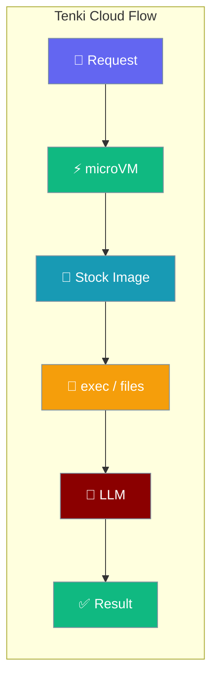
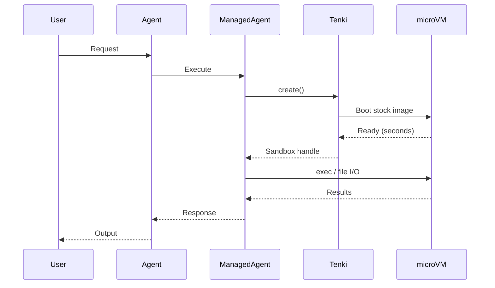

Tenki Cloud agents run in disposable Linux microVMs — provisioned in seconds, torn down when done.



## Quick Start

<Steps>
<Step title="Set the API key">
```bash
export TENKI_API_KEY="your-tenki-api-key"
```

`TENKI_AUTH_TOKEN` works too. Install the extra with `pip install "praisonai[tenki]"`.
</Step>

<Step title="Simplest agent">
```python
from praisonaiagents import Agent
from praisonai.integrations.managed_agents import ManagedAgent, ManagedConfig

managed = ManagedAgent(
    provider="local",
    config=ManagedConfig(model="gpt-4o-mini", name="TenkiAgent"),
    tools_run_on="tenki",  # requires TENKI_API_KEY
)
agent = Agent(name="tenki-agent", backend=managed)

agent.start("Run `python3 -c 'print(2**10)'` and tell me the answer.")
```
</Step>

<Step title="With pip packages pre-installed">
```python
import asyncio
from praisonai.integrations.managed_agents import ManagedAgent, ManagedConfig

managed = ManagedAgent(
    provider="local",
    config=ManagedConfig(model="gpt-4o-mini"),
    tools_run_on="tenki",
    compute_config={"packages": {"pip": ["pandas"]}},
)

info = asyncio.run(managed.provision_compute())
result = asyncio.run(managed.execute_in_compute(
    "python3 -c 'import pandas; print(pandas.__version__)'"
))
print(result["stdout"])
asyncio.run(managed.shutdown_compute())
```
</Step>
</Steps>

---

## How It Works



Tenki boots a fresh Linux microVM per sandbox. Commands run through ephemeral `exec`; files move as base64 over the same channel. The stock image ships `python3` — everything else installs on demand.

---

## Configuration Options

Authenticate with an API key. One of the two token variables is required.

| Env var | Purpose | Required |
|---|---|---|
| `TENKI_API_KEY` or `TENKI_AUTH_TOKEN` | Auth against Tenki Cloud | Yes (one of) |
| `TENKI_WORKSPACE_ID` | Pin sandboxes to a specific workspace | No (auto-picks first) |

`ComputeConfig` fields honoured by Tenki:

| Field | Type | Default | Effect on Tenki |
|---|---|---|---|
| `cpu` | `float` | `1.0` | microVM CPU cores (`cpu_cores`) |
| `memory_mb` | `int` | `512` | microVM RAM |
| `env` | `dict \| None` | `None` | Environment variables inside the VM |
| `networking` | `dict` | `{"type": "unrestricted"}` | Only `"unrestricted"` allows outbound; anything else (e.g. `"limited"`) disables it entirely |
| `image` | `str` | *(SDK default)* | Used only if you override the default. Tenki's registry is a snapshot store (no Docker pull-through) — an unchanged default means "boot Tenki's stock image." |
| `metadata["tenki_image"]` | `str` | — | Takes precedence over `image`. Boots a prebaked Tenki snapshot. |
| `auto_shutdown` | `bool` | `True` | Enables idle timeout |
| `idle_timeout_s` | `int` | `300` | Converted to `idle_timeout_minutes` (min 1) |
| `packages["pip"]` | `list[str]` | `[]` | Installed at provision (`pip3` bootstrapped if missing) |
| `packages["npm"]` | `list[str]` | `[]` | Installed at provision (`npm` bootstrapped if missing) |

<Note>
Only stable Tenki primitives are used: ephemeral `exec` and base64 file I/O. No volumes, snapshot creation, or template management from PraisonAI.
</Note>

<Note>
If package install fails during provision, the sandbox is terminated before the local handle is dropped. A failed teardown keeps the sandbox tracked, so it may still appear in `list_instances()` and a later `shutdown_compute()` can retry — the microVM is never silently leaked.
</Note>

---

## Common Patterns

### Data analysis with pandas

```python
import asyncio
from praisonai.integrations.managed_agents import ManagedAgent, ManagedConfig

managed = ManagedAgent(
    provider="local",
    config=ManagedConfig(model="gpt-4o-mini"),
    tools_run_on="tenki",
    compute_config={"packages": {"pip": ["pandas"]}},
)

info = asyncio.run(managed.provision_compute())
result = asyncio.run(managed.execute_in_compute(
    "python3 -c 'import pandas as pd; print(pd.Series([1,2,3,4,5]).mean())'"
))
print(result["stdout"])
asyncio.run(managed.shutdown_compute())
```

### Web scraping

```python
import asyncio
from praisonai.integrations.managed_agents import ManagedAgent, ManagedConfig

managed = ManagedAgent(
    provider="local",
    config=ManagedConfig(model="gpt-4o-mini"),
    tools_run_on="tenki",
    compute_config={"packages": {"pip": ["requests", "beautifulsoup4"]}},
)

info = asyncio.run(managed.provision_compute())
result = asyncio.run(managed.execute_in_compute(
    "python3 -c \"import requests; print(requests.get('https://httpbin.org/get').status_code)\""
))
print(result["stdout"])
asyncio.run(managed.shutdown_compute())
```

### Custom Tenki image

```python
import asyncio
from praisonai.integrations.managed_agents import ManagedAgent, ManagedConfig

managed = ManagedAgent(
    provider="local",
    config=ManagedConfig(model="gpt-4o-mini"),
    tools_run_on="tenki",
    compute_config={"metadata": {"tenki_image": "my-prebaked-snapshot"}},
)

info = asyncio.run(managed.provision_compute())
result = asyncio.run(managed.execute_in_compute("python3 --version"))
print(result["stdout"])
asyncio.run(managed.shutdown_compute())
```

### Disable outbound networking

```python
import asyncio
from praisonai.integrations.managed_agents import ManagedAgent, ManagedConfig

managed = ManagedAgent(
    provider="local",
    config=ManagedConfig(model="gpt-4o-mini"),
    tools_run_on="tenki",
    compute_config={"networking": {"type": "limited"}},  # any non-"unrestricted" turns outbound OFF
)

info = asyncio.run(managed.provision_compute())
result = asyncio.run(managed.execute_in_compute("python3 -c 'print(1 + 1)'"))
print(result["stdout"])
asyncio.run(managed.shutdown_compute())
```

---

## Best Practices

<AccordionGroup>
<Accordion title="Pick the right provider">
Tenki gives ephemeral microVMs with no template registry — ideal for short, disposable runs. Use E2B for instant pre-built templates, or Docker for local, reproducible containers.
</Accordion>

<Accordion title="Package installs happen at provision">
A failed install tears the sandbox down. Don't rely on the `pip` field for large dependency sets — bake them into a prebaked snapshot and boot it via `metadata["tenki_image"]` instead.
</Accordion>

<Accordion title="Sandboxes bill while alive">
Always call `shutdown_compute()` when done, and set `idle_timeout_s` so an idle microVM self-terminates.
</Accordion>

<Accordion title="Network policy is boolean">
Tenki cannot express per-host allowlists. `networking={"type": "unrestricted"}` allows outbound; anything else (including `"limited"`) disables it entirely.
</Accordion>
</AccordionGroup>

---

## Use across a whole team

Give a whole team or workflow one shared Tenki microVM by setting `tools_run_on="tenki"` on the flow or team.

```python
from praisonaiagents import AgentFlow

flow = AgentFlow(tools_run_on="tenki", steps=[...])
```

See [Shared Sandbox](/features/shared-sandbox) and [Placement](/features/placement) for the full `tools_run_on=` behaviour.

---

## Related

<CardGroup cols={2}>
<Card title="Managed Agents" icon="cloud" href="/concepts/managed-agents">
  Overview of managed agent providers
</Card>
<Card title="E2B Cloud" icon="cloud-bolt" href="/concepts/managed-agents-e2b">
  Compare with the E2B sandbox provider
</Card>
<Card title="Shared Sandbox" icon="share-nodes" href="/features/shared-sandbox">
  Share one microVM across a team or workflow with `tools_run_on=`
</Card>
</CardGroup>
