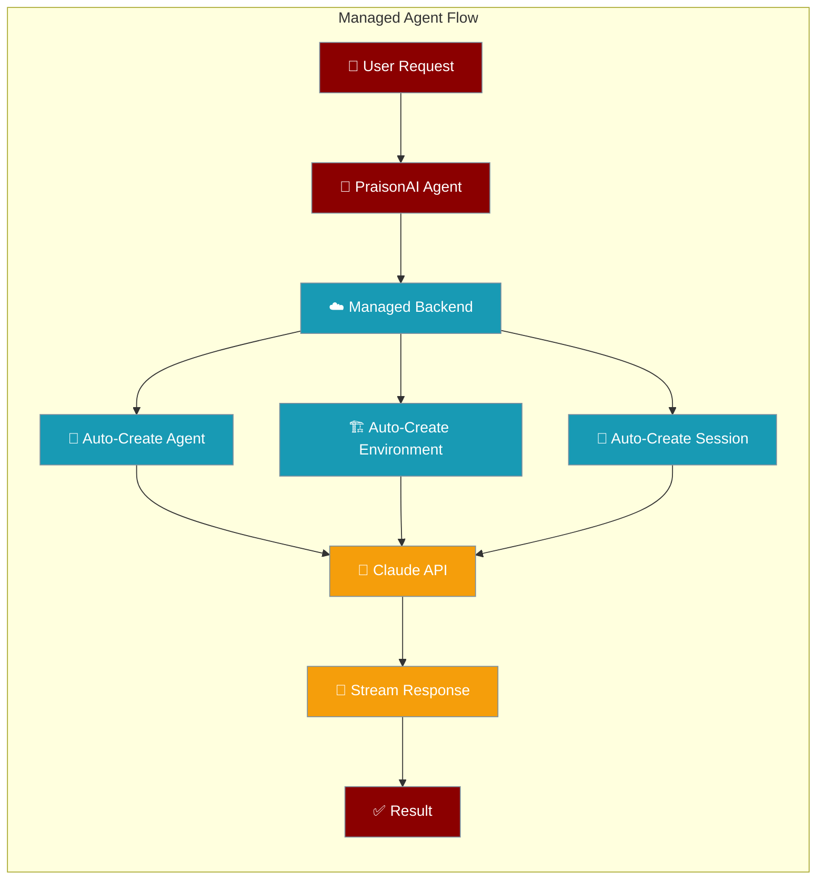
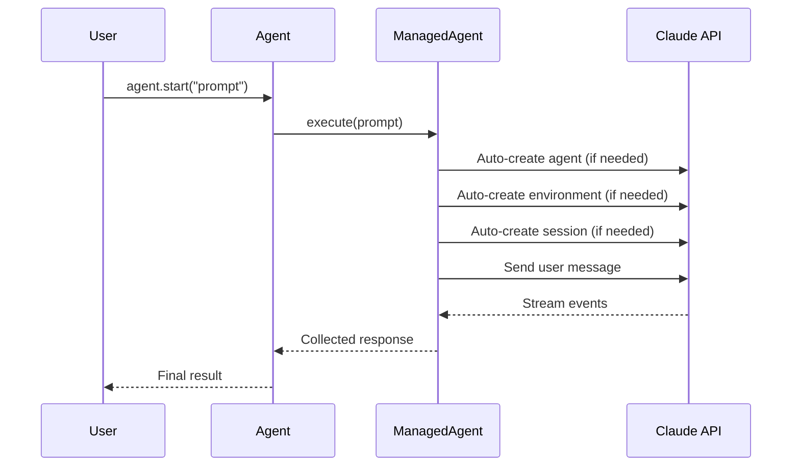

PraisonAI's ManagedAgent backend runs Claude agents in secure cloud sandboxes with zero setup overhead.



## Quick Start

<Steps>
<Step title="Install and Setup">

```bash
pip install praisonai
export ANTHROPIC_API_KEY="your_api_key_here"
```

</Step>

<Step title="Basic Usage">

```python
from praisonai import Agent, ManagedAgent

agent = Agent(name="teacher", backend=ManagedAgent())
result = agent.start("Write a Python script that prints 'Hello from Managed Agents!' and run it")
print(result)
```

</Step>

<Step title="With Configuration">

```python
from praisonai import Agent, ManagedAgent, ManagedConfig

managed = ManagedAgent(
    config=ManagedConfig(
        name="Coding Assistant",
        model="claude-haiku-4-5",
        system="You are a helpful coding assistant.",
        packages={"pip": ["pandas", "numpy"]},
        networking={"type": "unrestricted"},
    ),
)

agent = Agent(name="coder", backend=managed)
result = agent.start("Create a pandas DataFrame with sample data", stream=True)
```

</Step>
</Steps>

---

## How It Works



| Component | Purpose |
|-----------|---------|
| **Agent** | Anthropic agent definition with model, system prompt, tools |
| **Environment** | Secure cloud sandbox with packages and networking |
| **Session** | Running conversation with memory and context |
| **Streaming** | Real-time token-by-token responses |

---

## Configuration Options

<Card title="ManagedAgent API Reference" icon="code" href="/docs/sdk/reference/python/classes/ManagedAgent">
  Complete Python configuration options
</Card>

<Card title="ManagedConfig Reference" icon="code" href="/docs/sdk/reference/python/classes/ManagedConfig">
  Configuration dataclass options
</Card>

---

## Examples

<AccordionGroup>

<Accordion title="Create Agent">

Zero config — defaults to name="Agent", model="claude-haiku-4-5"

```python
from praisonai import Agent, ManagedAgent

managed = ManagedAgent()
agent = Agent(name="coder", backend=managed)
result = agent.start("Say hello")

print(f"Agent ID: {managed.agent_id}")
print(f"Version: {managed.agent_version}")
```

</Accordion>

<Accordion title="Create Environment">

Environment created automatically — specify packages/networking in config

```python
from praisonai import Agent, ManagedAgent, ManagedConfig

managed = ManagedAgent(
    config=ManagedConfig(
        name="Coding Assistant",
        model="claude-haiku-4-5",
        system="You are a helpful coding assistant.",
        networking={"type": "unrestricted"},
    ),
)

agent = Agent(name="coder", backend=managed)
result = agent.start("Say hello")

print(f"Environment ID: {managed.environment_id}")
```

</Accordion>

<Accordion title="Create Session">

Agent, environment, and session created automatically on first use

```python
from praisonai import Agent, ManagedAgent, ManagedConfig

managed = ManagedAgent(
    config=ManagedConfig(
        name="Coding Assistant",
        model="claude-haiku-4-5",
        system="You are a helpful coding assistant.",
        session_title="Quickstart session",
    ),
)

agent = Agent(name="coder", backend=managed)
result = agent.start("Say hello")

print(f"Session ID: {managed.session_id}")
```

</Accordion>

<Accordion title="Stream Response">

Use `stream=True` for real-time token streaming

```python
from praisonai import Agent, ManagedAgent, ManagedConfig

managed = ManagedAgent(
    config=ManagedConfig(
        name="Streaming Agent",
        model="claude-haiku-4-5",
        system="You are a helpful coding assistant.",
    ),
)

agent = Agent(name="streamer", backend=managed)
result = agent.start(
    "Create a Python script that generates Fibonacci numbers and run it",
    stream=True,
)
```

</Accordion>

<Accordion title="Select Specific Tools">

Disable all tools by default, enable only specific ones

```python
from praisonai import Agent, ManagedAgent, ManagedConfig

managed = ManagedAgent(
    config=ManagedConfig(
        name="Bash Only Agent",
        model="claude-haiku-4-5",
        system="You can only use bash, read, and write tools.",
        tools=[
            {
                "type": "agent_toolset_20260401",
                "default_config": {"enabled": False},
                "configs": [
                    {"name": "bash", "enabled": True},
                    {"name": "read", "enabled": True},
                    {"name": "write", "enabled": True},
                ],
            },
        ],
    ),
)

agent = Agent(name="bash-only", backend=managed)
result = agent.start("Show system info using uname -a", stream=True)
```

</Accordion>

<Accordion title="Disable Specific Tools">

All tools enabled by default except specified ones

```python
from praisonai import Agent, ManagedAgent, ManagedConfig

managed = ManagedAgent(
    config=ManagedConfig(
        name="No Web Agent",
        model="claude-haiku-4-5",
        system="You are a coding assistant without web access.",
        tools=[
            {
                "type": "agent_toolset_20260401",
                "configs": [
                    {"name": "web_fetch", "enabled": False},
                    {"name": "web_search", "enabled": False},
                ],
            },
        ],
    ),
)

agent = Agent(name="no-web", backend=managed)
result = agent.start("Calculate 2**100 and print the result", stream=True)
```

</Accordion>

<Accordion title="Custom Tools">

Define custom tools with callback functions

```python
import json
from praisonai import Agent, ManagedAgent, ManagedConfig

def handle_weather(tool_name, tool_input):
    location = tool_input.get("location", "Unknown")
    print(f"[Custom tool: {tool_name}] Input: {json.dumps(tool_input)}")
    return f"Weather in {location}: 22°C, sunny, humidity 55%"

managed = ManagedAgent(
    config=ManagedConfig(
        name="Weather Agent",
        model="claude-haiku-4-5",
        system="You are a weather assistant. Use get_weather for locations.",
        tools=[
            {"type": "agent_toolset_20260401"},
            {
                "type": "custom",
                "name": "get_weather",
                "description": "Get current weather for a location",
                "input_schema": {
                    "type": "object",
                    "properties": {
                        "location": {"type": "string", "description": "City name"},
                    },
                    "required": ["location"],
                },
            },
        ],
    ),
    on_custom_tool=handle_weather,
)

agent = Agent(name="weather", backend=managed)
result = agent.start("What is the weather in Tokyo?", stream=True)
```

</Accordion>

<Accordion title="Update Agent">

Modify agent configuration without recreating

```python
from praisonai import Agent, ManagedAgent, ManagedConfig

managed = ManagedAgent(
    config=ManagedConfig(
        name="Basic Agent",
        model="claude-haiku-4-5",
        system="You are a helpful assistant.",
    ),
)

agent = Agent(name="updatable", backend=managed)
result = agent.start("Say hello", stream=True)

# Update the agent
managed.update_agent(
    name="Advanced Coder",
    system="You are a senior Python developer. Write production-quality code.",
)

print(f"Updated to version: {managed.agent_version}")
result = agent.start("Write a binary search tree class", stream=True)
```

</Accordion>

<Accordion title="List Sessions">

View all sessions for the current agent

```python
from praisonai import Agent, ManagedAgent, ManagedConfig

managed = ManagedAgent(
    config=ManagedConfig(
        name="Session Lister",
        model="claude-haiku-4-5",
        system="You are a helpful assistant.",
    ),
)

agent = Agent(name="lister", backend=managed)
agent.start("Say hello")

sessions = managed.list_sessions()
print(f"Total sessions: {len(sessions)}")
for s in sessions[:5]:
    print(f"  {s['id']} | {s['status']} | {s['title']}")
```

</Accordion>

<Accordion title="Web Search">

Built-in web search capability

```python
from praisonai import Agent, ManagedAgent, ManagedConfig

managed = ManagedAgent(
    config=ManagedConfig(
        name="Search Agent",
        model="claude-haiku-4-5",
        system="You are a research assistant.",
    ),
)

agent = Agent(name="searcher", backend=managed)
result = agent.start(
    "Search for Python 3.13 new features and summarize in 3 points",
    stream=True,
)
```

</Accordion>

<Accordion title="Multi-Turn Conversation">

Same session remembers context across calls

```python
from praisonai import Agent, ManagedAgent, ManagedConfig

managed = ManagedAgent(
    config=ManagedConfig(
        name="Multi-Turn Agent",
        model="claude-haiku-4-5",
        system="You are a helpful coding assistant.",
    ),
)

agent = Agent(name="coder", backend=managed)

# Turn 1
result = agent.start("Write a hello world script", stream=True)

# Turn 2 - remembers previous context
result = agent.start("Now modify it to accept a name argument", stream=True)
```

</Accordion>

<Accordion title="Environment with Packages">

Pre-install packages before agent starts

```python
from praisonai import Agent, ManagedAgent, ManagedConfig

managed = ManagedAgent(
    config=ManagedConfig(
        name="Data Science Agent",
        model="claude-haiku-4-5",
        system="You are a data science assistant.",
        packages={"pip": ["pandas", "numpy"]},
    ),
)

agent = Agent(name="data-scientist", backend=managed)
result = agent.start(
    "Create a DataFrame with sample data and show summary stats",
    stream=True,
)
```

</Accordion>

<Accordion title="Interrupt Session">

Stop agent mid-execution

```python
from praisonai import Agent, ManagedAgent, ManagedConfig

managed = ManagedAgent(
    config=ManagedConfig(
        name="Interruptable Agent",
        model="claude-haiku-4-5",
        system="You are a helpful coding assistant.",
    ),
)

agent = Agent(name="interruptable", backend=managed)
result = agent.start("Write a long tutorial about Python decorators", stream=True)

# Interrupt mid-stream
managed.interrupt()
print("[Agent stopped]")
```

</Accordion>

<Accordion title="Track Usage">

Monitor token consumption

```python
from praisonai import Agent, ManagedAgent, ManagedConfig

managed = ManagedAgent(
    config=ManagedConfig(
        name="Usage Tracker",
        model="claude-haiku-4-5",
        system="You are a helpful assistant.",
    ),
)

agent = Agent(name="tracker", backend=managed)
agent.start("Explain Python generators briefly", stream=True)

# Check usage
info = managed.retrieve_session()
if info.get("usage"):
    print(f"Input tokens: {info['usage']['input_tokens']}")
    print(f"Output tokens: {info['usage']['output_tokens']}")

print(f"Accumulated input: {managed.total_input_tokens}")
print(f"Accumulated output: {managed.total_output_tokens}")
```

</Accordion>

<Accordion title="Resume Session">

Save and restore session state across runs

```python
import json
import pathlib
from praisonai import Agent, ManagedAgent, ManagedConfig

IDS_FILE = pathlib.Path("managed_ids.json")

if IDS_FILE.exists():
    # Resume existing session
    saved = json.loads(IDS_FILE.read_text())
    managed = ManagedAgent()
    managed.resume_session(saved["session_id"])
    
    agent = Agent(name="coder", backend=managed)
    result = agent.start("What was my favorite number?", stream=True)
else:
    # Create new session and save IDs
    managed = ManagedAgent(
        config=ManagedConfig(
            name="Persistent Coder",
            model="claude-haiku-4-5",
            system="You are a helpful coding assistant.",
        ),
    )
    agent = Agent(name="coder", backend=managed)
    result = agent.start("Remember: my favorite number is 42.", stream=True)
    
    ids = managed.save_ids()
    IDS_FILE.write_text(json.dumps(ids, indent=2))
    print("Run script again to resume session.")
```

</Accordion>

<Accordion title="Multi-Package Managers">

Install packages from multiple sources

```python
from praisonai import Agent, ManagedAgent, ManagedConfig

managed = ManagedAgent(
    config=ManagedConfig(
        name="Full Stack Agent",
        model="claude-haiku-4-5",
        system="You are a full stack developer.",
        packages={
            "pip": ["pandas", "numpy"],
            "npm": ["express"],
            "apt": ["ffmpeg"],
        },
    ),
)

agent = Agent(name="fullstack", backend=managed)
result = agent.start(
    "Verify pandas and express are installed",
    stream=True,
)
```

</Accordion>

<Accordion title="Limited Networking">

Restrict network access to specific hosts

```python
from praisonai import Agent, ManagedAgent, ManagedConfig

managed = ManagedAgent(
    config=ManagedConfig(
        name="Restricted Agent",
        model="claude-haiku-4-5",
        system="You have limited network access.",
        networking={
            "type": "limited",
            "allowed_hosts": ["api.github.com"],
            "allow_mcp_servers": False,
            "allow_package_managers": True,
        },
    ),
)

agent = Agent(name="restricted", backend=managed)
result = agent.start(
    "Try fetching https://api.github.com (should work) and https://example.com (should fail)",
    stream=True,
)
```

</Accordion>

</AccordionGroup>

---

## Best Practices

<AccordionGroup>

<Accordion title="Session Management">
- Save session IDs using `managed.save_ids()` for persistence across runs
- Use `managed.resume_session(id)` to continue previous conversations
- Reset sessions with `managed.reset_session()` for fresh context
- Monitor usage with `managed.retrieve_session()` for cost tracking
</Accordion>

<Accordion title="Tool Configuration">
- Enable only necessary tools to reduce costs and improve focus
- Use `default_config: {"enabled": False}` then enable specific tools
- Disable web tools for air-gapped environments
- Implement custom tools with proper error handling
</Accordion>

<Accordion title="Environment Setup">
- Pre-install packages in environment config rather than during execution
- Use appropriate networking policies for security requirements
- Choose the right model for your use case (`claude-haiku-4-5` for speed, `claude-sonnet-4-6` for complex tasks)
- Set meaningful names and system prompts for better agent behavior
</Accordion>

<Accordion title="Performance Optimization">
- Use streaming for long-running tasks to provide immediate feedback
- Implement interrupts for user control over long executions
- Cache agent/environment IDs to avoid recreation overhead
- Monitor token usage to optimize prompts and responses
</Accordion>

</AccordionGroup>

---

## Related

<CardGroup cols={2}>

<Card title="Agent Basics" icon="robot" href="/docs/concepts/agents">
  Learn about PraisonAI agents and their capabilities
</Card>

<Card title="Configuration" icon="settings" href="/docs/concepts/configuration">
  Understand agent configuration options and patterns
</Card>

</CardGroup>