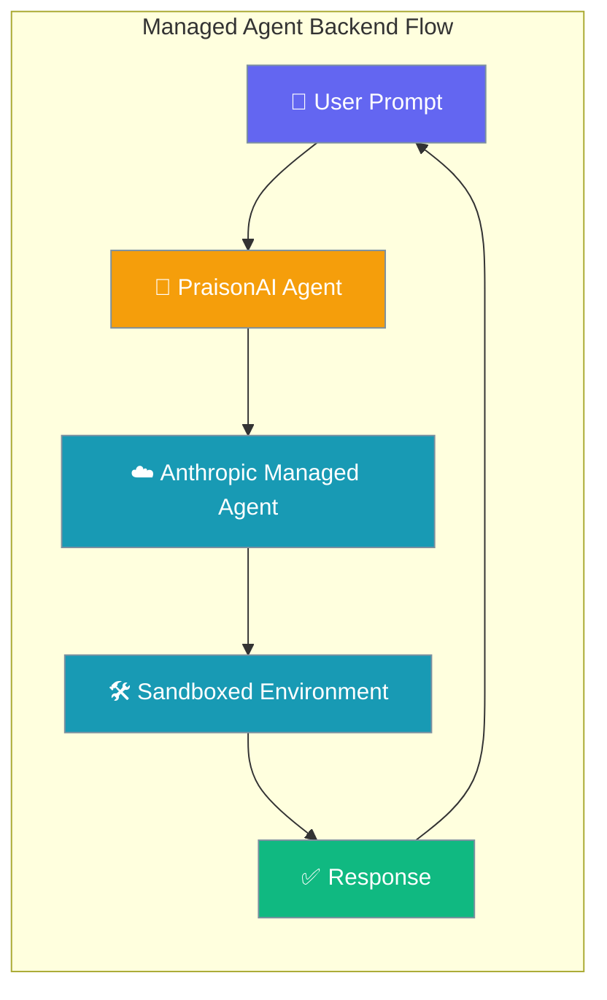
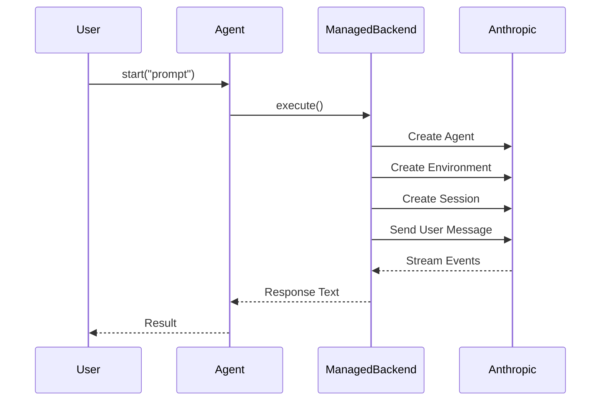
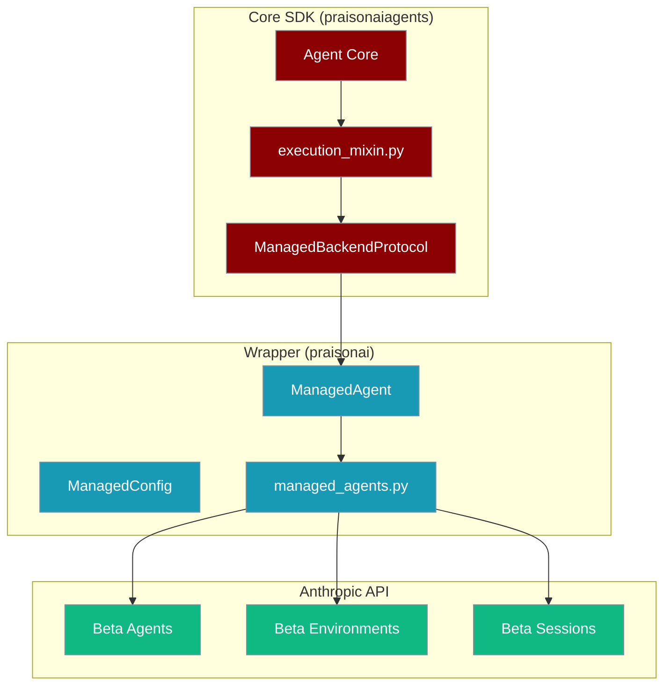

Managed Agent Backend delegates agent execution to Anthropic's Managed Agents API, running agents in sandboxed cloud environments with built-in tools and package management.



## Quick Start

<Steps>
<Step title="Simple Usage">
```python
from praisonaiagents import Agent
from praisonai.integrations.managed_agents import ManagedAgent

agent = Agent(
    name="coder", 
    backend=ManagedAgent()
)
result = agent.start("Write a Python hello world script")
```
</Step>

<Step title="With Configuration">
```python
from praisonaiagents import Agent
from praisonai.integrations.managed_agents import ManagedAgent, ManagedConfig

managed = ManagedAgent(
    config=ManagedConfig(
        model="claude-sonnet-4-6",
        system="You are a coding assistant.",
        packages={"pip": ["pandas", "numpy"]},
        tools=[{"type": "agent_toolset_20260401"}]
    )
)

agent = Agent(name="data-agent", backend=managed)
result = agent.start("Create a pandas DataFrame with sample data")
```
</Step>
</Steps>

---

## How It Works



| Component | Purpose |
|-----------|---------|
| **PraisonAI Agent** | Familiar interface with `backend=` parameter |
| **ManagedAgent** | Anthropic-specific backend implementation |
| **ManagedConfig** | Configuration for agent, environment, and session |
| **Anthropic API** | Cloud-hosted agent with tools and packages |

---

## Configuration Options

### ManagedConfig Parameters

| Parameter | Type | Default | Description |
|-----------|------|---------|-------------|
| `name` | `str` | `"Agent"` | Display name for the agent |
| `model` | `str` | `"claude-haiku-4-5"` | Claude model to use |
| `system` | `str` | `"You are a helpful coding assistant."` | System prompt |
| `tools` | `List[Dict]` | `[{"type": "agent_toolset_20260401"}]` | Built-in tools (bash, file ops) |
| `mcp_servers` | `List[Dict]` | `[]` | MCP server connections |
| `skills` | `List[Dict]` | `[]` | Anthropic skills (e.g., computer_use) |
| `callable_agents` | `List[Dict]` | `[]` | Other agents this agent can call |
| `metadata` | `Dict` | `{}` | Custom metadata |
| `env_name` | `str` | `"praisonai-env"` | Environment name |
| `packages` | `Dict[str, List[str]]` | `None` | Packages to install: `{"pip": ["pandas"], "npm": ["lodash"]}` |
| `networking` | `Dict` | `{"type": "unrestricted"}` | Network access configuration |
| `session_title` | `str` | `"PraisonAI session"` | Session display title |
| `resources` | `List[Dict]` | `[]` | File resources to attach |
| `vault_ids` | `List[str]` | `[]` | Vault IDs for secure data |

### ManagedAgent Parameters

| Parameter | Type | Default | Description |
|-----------|------|---------|-------------|
| `provider` | `str` | `"anthropic"` | Backend provider (currently only "anthropic") |
| `api_key` | `str` | `None` | API key (falls back to env var) |
| `config` | `ManagedConfig/dict` | `None` | Configuration object or dict |
| `timeout` | `int` | `600` | Request timeout in seconds |
| `instructions` | `str` | `"You are a helpful coding assistant."` | Fallback system prompt |
| `on_tool_confirmation` | `Callable` | `None` | Tool confirmation callback |
| `on_custom_tool` | `Callable` | `None` | Custom tool callback |

---

## Common Patterns

<Tabs>
<Tab title="Zero Configuration">
```python
from praisonaiagents import Agent
from praisonai.integrations.managed_agents import ManagedAgent

# Simplest possible usage
agent = Agent(name="assistant", backend=ManagedAgent())
result = agent.start("What is 2 + 2?")
```
</Tab>

<Tab title="Custom Packages">
```python
from praisonaiagents import Agent
from praisonai.integrations.managed_agents import ManagedAgent, ManagedConfig

managed = ManagedAgent(
    config=ManagedConfig(
        packages={
            "pip": ["pandas", "numpy", "matplotlib"],
            "npm": ["lodash", "axios"],
        }
    )
)

agent = Agent(name="data-scientist", backend=managed)
result = agent.start("Create a bar chart with matplotlib")
```
</Tab>

<Tab title="Multi-Turn Sessions">
```python
from praisonaiagents import Agent
from praisonai.integrations.managed_agents import ManagedAgent

managed = ManagedAgent()
agent = Agent(name="chat", backend=managed)

# Turn 1
agent.start("My name is Alice")

# Turn 2 - same session, remembers context
result = agent.start("What is my name?")
print(result)  # "Your name is Alice"
```
</Tab>

<Tab title="Session Management">
```python
from praisonai.integrations.managed_agents import ManagedAgent

managed = ManagedAgent()

# Execute some turns
managed._execute_sync("Hello")

# Get session info
info = managed.retrieve_session()
print(f"Session: {info['id']}, Status: {info['status']}")

# List all sessions
sessions = managed.list_sessions(limit=5)

# Reset session for fresh conversation
managed.reset_session()
```
</Tab>
</Tabs>

---

## Advanced Features

<AccordionGroup>
<Accordion title="Custom Tool Callbacks">
Handle custom tool invocations in your agent:

```python
from praisonai.integrations.managed_agents import ManagedAgent

def handle_custom_tool(tool_name: str, tool_input: dict):
    if tool_name == "lookup_database":
        return f"Database result for: {tool_input.get('query', '')}"
    return "Unknown tool"

managed = ManagedAgent(on_custom_tool=handle_custom_tool)
```
</Accordion>

<Accordion title="Tool Confirmation">
Review tool usage before execution:

```python
def confirm_tool(info: dict) -> bool:
    print(f"Tool: {info['name']}, Input: {info['input']}")
    return input("Allow? (y/n): ").lower() == "y"

managed = ManagedAgent(on_tool_confirmation=confirm_tool)
```
</Accordion>

<Accordion title="Network Restrictions">
Limit network access for security:

```python
from praisonai.integrations.managed_agents import ManagedConfig

config = ManagedConfig(
    networking={
        "type": "limited",
        "allowed_hosts": ["api.github.com", "pypi.org"]
    }
)
```
</Accordion>

<Accordion title="MCP Server Integration">
Connect to Model Context Protocol servers:

```python
config = ManagedConfig(
    mcp_servers=[
        {"type": "url", "url": "https://mcp.example.com/sse"}
    ]
)
```
</Accordion>

<Accordion title="ID Persistence">
Save and restore agent IDs across sessions:

```python
managed = ManagedAgent()
managed._execute_sync("Hello")

# Save IDs to file
import json
ids = managed.save_ids()
with open("managed_ids.json", "w") as f:
    json.dump(ids, f)

# Later, restore IDs
with open("managed_ids.json", "r") as f:
    ids = json.load(f)
new_managed = ManagedAgent()
new_managed.restore_ids(ids)
```
</Accordion>
</AccordionGroup>

---

## Best Practices

<AccordionGroup>
<Accordion title="Choose the Right Model">
- Use `claude-haiku-4-5` for simple tasks and cost efficiency
- Use `claude-sonnet-4-6` for complex reasoning and tool use
- Consider token limits for your specific use case
</Accordion>

<Accordion title="Package Management">
- Only install packages you need to keep environments lightweight
- Use specific versions when possible: `{"pip": ["pandas==2.0.0"]}`
- Group related packages in the same environment for reuse
</Accordion>

<Accordion title="Session Lifecycle">
- Use `reset_session()` between different tasks for isolation
- Use `reset_all()` only when changing agent configuration
- Monitor token usage with `total_input_tokens` and `total_output_tokens`
</Accordion>

<Accordion title="Error Handling">
- Set appropriate timeouts for long-running tasks
- Implement custom tool error handling in callbacks
- Use session management to recover from failures
</Accordion>
</AccordionGroup>

---

## Tool Mapping

The integration maps Anthropic tool names to PraisonAI equivalents:

| Managed Agent Tool | PraisonAI Tool | Description |
|-------------------|----------------|-------------|
| `bash` | `execute_command` | Execute shell commands |
| `read` | `read_file` | Read file contents |
| `write` | `write_file` | Write files |
| `edit` | `apply_diff` | Edit existing files |
| `glob` | `list_files` | List files by pattern |
| `grep` | `search_file` | Search file contents |
| `web_fetch` | `web_fetch` | Fetch web content |
| `search` | `search_web` | Search the web |

Use the helper function to map tools:
```python
from praisonai.integrations.managed_agents import map_managed_tools
praisonai_tools = map_managed_tools(["bash", "read", "write"])
```

---

## Architecture



The two-layer design keeps the Core SDK lightweight while providing full Anthropic integration in the wrapper layer.

---

## Environment Variables

| Variable | Description |
|----------|-------------|
| `ANTHROPIC_API_KEY` | Primary API key for Anthropic (required) |
| `CLAUDE_API_KEY` | Alternative API key (fallback) |

Set your API key before using managed agents:
```bash
export ANTHROPIC_API_KEY="your-api-key-here"
```

---

## Related

<CardGroup cols={2}>
<Card title="Agent Fundamentals" icon="robot" href="/docs/concepts/agents">
Learn about PraisonAI Agent basics and configuration
</Card>
<Card title="Tools & Execution" icon="wrench" href="/docs/features/tools">
Understand PraisonAI's tool system and execution patterns
</Card>
</CardGroup>