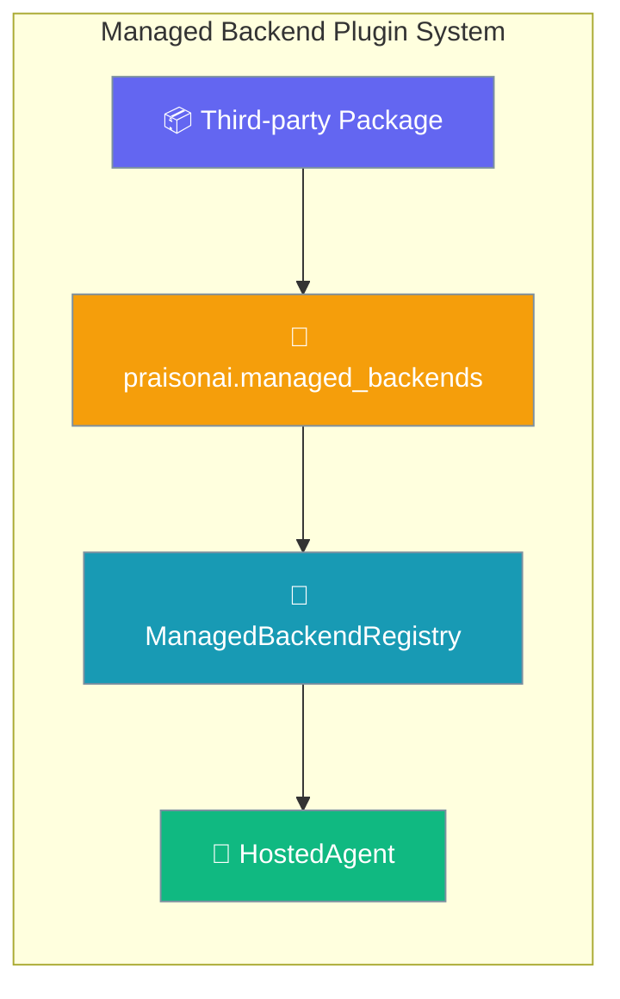
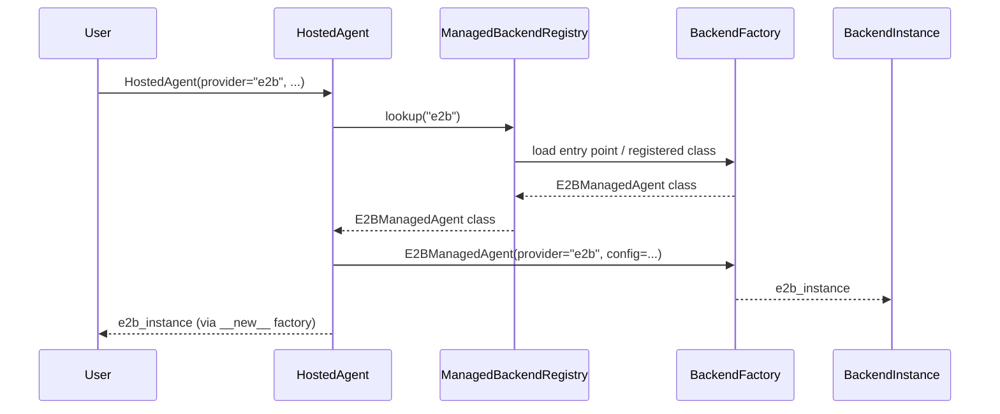

Managed backend plugins let third-party packages register new `HostedAgent(provider=...)` runtimes — like `e2b`, `modal`, or `flyio` — without editing PraisonAI core.



## Quick Start

```python
from praisonaiagents import Agent
from praisonai import HostedAgent, HostedAgentConfig

# A third-party "e2b" plugin is installed via pip.
# HostedAgent resolves it through the registry — no core change.
hosted = HostedAgent(
    provider="e2b",
    config=HostedAgentConfig(model="claude-haiku-4-5"),
)

agent = Agent(name="Researcher", instructions="Research and summarise.", llm=hosted)
agent.start("Find three sources on agentic RAG.")
```

<Steps>
<Step title="Simple — Programmatic Registration">

Register a backend class directly at runtime (ideal for testing or single-project use):

```python
from praisonaiagents import Agent
from praisonai import HostedAgent, HostedAgentConfig
from praisonai.integrations.backend_registry import get_backend_registry

class E2BManagedAgent:
    def __init__(self, provider, config=None, **kwargs):
        self.provider = provider
        self.config = config

    def is_available(self):
        try:
            import e2b
            return True
        except ImportError:
            return False

    def run(self, prompt, **kwargs):
        import e2b
        return e2b.run(prompt)

registry = get_backend_registry()
registry.register("e2b", E2BManagedAgent)

hosted = HostedAgent(provider="e2b", config=HostedAgentConfig(model="claude-haiku-4-5"))
agent = Agent(name="Coder", instructions="Write Python code.", llm=hosted)
agent.start("Write a function to reverse a string.")
```

</Step>

<Step title="With Entry Point — pip-installable Plugin">

Create a Python package with a `praisonai.managed_backends` entry point so your backend is automatically available after `pip install`:

```toml
# pyproject.toml
[project]
name = "e2b-praisonai"
version = "1.0.0"
dependencies = ["e2b", "praisonai"]

[project.entry-points."praisonai.managed_backends"]
e2b = "e2b_praisonai.backend:E2BManagedAgent"
```

```python
# e2b_praisonai/backend.py
import os

class E2BManagedAgent:
    def __init__(self, provider="e2b", config=None, **kwargs):
        self.provider = provider
        self.config = config

    def is_available(self):
        try:
            import e2b
            return True
        except ImportError:
            return False

    def run(self, prompt, **kwargs):
        import e2b
        sandbox = e2b.Sandbox()
        return sandbox.run_code(prompt)
```

After installation:

```bash
pip install e2b-praisonai
```

```python
from praisonaiagents import Agent
from praisonai import HostedAgent, HostedAgentConfig

# e2b is now available automatically
hosted = HostedAgent(provider="e2b", config=HostedAgentConfig(model="claude-haiku-4-5"))
agent = Agent(name="Researcher", instructions="Research topics.", llm=hosted)
agent.start("Summarise the key papers on agentic RAG.")
```

</Step>
</Steps>

---

## How It Works



`HostedAgent.__new__` acts as a **factory** for non-Anthropic backends. When the resolved backend class is different from `HostedAgent`, Python's `__new__` returns the backend instance directly — `__init__` is skipped. Callers receive the real backend's methods without any `AnthropicManagedAgent`-inherited state:

```python
hosted = HostedAgent(provider="e2b", config=HostedAgentConfig(model="claude-haiku-4-5"))
type(hosted)  # <class 'e2b_praisonai.backend.E2BManagedAgent'>
```

The builtin `anthropic` backend is pre-registered in `ManagedBackendRegistry` — it resolves to `AnthropicManagedAgent`.

---

## Configuration Options

<Card title="ManagedBackendRegistry API Reference" icon="code" href="/docs/sdk/reference/praisonai/classes/ManagedBackendRegistry">
  Complete API reference for ManagedBackendRegistry
</Card>

| Entry-point group | `praisonai.managed_backends` |
|---|---|
| Built-in backends | `anthropic` → `AnthropicManagedAgent` |
| Discovery | Auto-discovered on first registry access |

---

## Common Patterns

### Custom Hosted Runtime

```python
from praisonaiagents import Agent
from praisonai import HostedAgent, HostedAgentConfig
from praisonai.integrations.backend_registry import get_backend_registry
import os

class ModalManagedAgent:
    def __init__(self, provider="modal", config=None, **kwargs):
        self.provider = provider
        self.config = config

    def is_available(self):
        try:
            import modal
            return True
        except ImportError:
            return False

    def run(self, prompt, **kwargs):
        import modal
        f = modal.Function.lookup("my-app", "run_agent")
        return f.remote(prompt)

get_backend_registry().register("modal", ModalManagedAgent)

hosted = HostedAgent(
    provider="modal",
    config=HostedAgentConfig(model="claude-haiku-4-5"),
)
agent = Agent(name="Cloud Runner", instructions="Run tasks on Modal.", llm=hosted)
agent.start("Process this dataset in parallel.")
```

### Selecting Between Multiple Registered Backends

```python
from praisonai import HostedAgent, HostedAgentConfig
from praisonai.integrations.backend_registry import get_backend_registry
from praisonaiagents import Agent
import os

registry = get_backend_registry()
available = registry.list_all_names()
print(f"Available backends: {available}")

provider = os.getenv("AGENT_BACKEND", "anthropic")
if provider not in available:
    raise ValueError(f"Backend '{provider}' not installed. Available: {sorted(available)}")

hosted = HostedAgent(provider=provider, config=HostedAgentConfig(model="claude-haiku-4-5"))
agent = Agent(name="Flexible Agent", instructions="Complete tasks.", llm=hosted)
agent.start("What is 2 + 2?")
```

### Graceful Unavailable-Backend Handling

```python
from praisonai import HostedAgent, HostedAgentConfig
from praisonai.integrations.backend_registry import get_backend_registry
from praisonaiagents import Agent

def create_agent(preferred_backend: str) -> Agent:
    registry = get_backend_registry()
    try:
        hosted = HostedAgent(
            provider=preferred_backend,
            config=HostedAgentConfig(model="claude-haiku-4-5"),
        )
    except ValueError:
        available = sorted(registry.list_all_names())
        print(f"Backend '{preferred_backend}' unavailable. Using 'anthropic'. Available: {available}")
        hosted = HostedAgent(
            provider="anthropic",
            config=HostedAgentConfig(model="claude-haiku-4-5"),
        )
    return Agent(name="Resilient Agent", instructions="Complete tasks.", llm=hosted)

agent = create_agent("e2b")
agent.start("Write a hello world script.")
```

---

## Best Practices

<AccordionGroup>

<Accordion title="Entry-point naming conventions">
Use the provider name as the entry-point key — lowercase, no hyphens. The key becomes the value passed to `provider=`:

```toml
[project.entry-points."praisonai.managed_backends"]
e2b    = "e2b_praisonai.backend:E2BManagedAgent"     # HostedAgent(provider="e2b")
modal  = "modal_praisonai.backend:ModalManagedAgent"  # HostedAgent(provider="modal")
flyio  = "flyio_praisonai.backend:FlyioManagedAgent"  # HostedAgent(provider="flyio")
```
</Accordion>

<Accordion title="is_available() discipline">
Always implement `is_available()` with a fast, cached check. The registry calls it during startup probing:

```python
from praisonai._framework_availability import is_available as check_availability

class E2BManagedAgent:
    def is_available(self) -> bool:
        return check_availability("e2b")  # cached importlib.util.find_spec
```

Never do heavy imports inside `is_available()` — it is called on every registry probe.
</Accordion>

<Accordion title="Error-message hints">
Include helpful hints in your error messages so users know what to install:

```python
def run(self, prompt, **kwargs):
    if not self.is_available():
        raise RuntimeError(
            "e2b backend requires 'e2b' package. Install with: pip install e2b"
        )
    import e2b
    ...
```
</Accordion>

<Accordion title="Cleanup hooks">
Implement resource cleanup if your backend opens connections or sandbox environments:

```python
class E2BManagedAgent:
    def __init__(self, provider="e2b", config=None, **kwargs):
        self._sandbox = None

    def run(self, prompt, **kwargs):
        import e2b
        self._sandbox = e2b.Sandbox()
        return self._sandbox.run_code(prompt)

    def cleanup(self):
        if self._sandbox:
            self._sandbox.close()
            self._sandbox = None
```
</Accordion>

</AccordionGroup>

---

## Related

<CardGroup cols={2}>
<Card title="Framework Adapter Plugins" icon="puzzle-piece" href="/docs/features/framework-adapter-plugins">
  Add new execution frameworks via entry points
</Card>
<Card title="Hosted Agent" icon="cloud" href="/docs/features/hosted-agent">
  Run agent loops on managed cloud runtimes
</Card>
</CardGroup>
