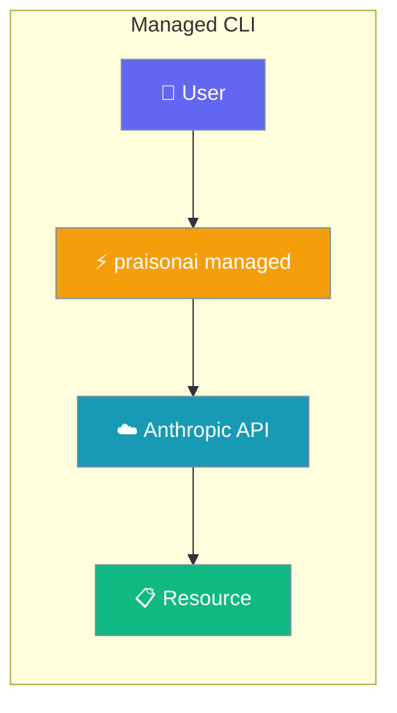
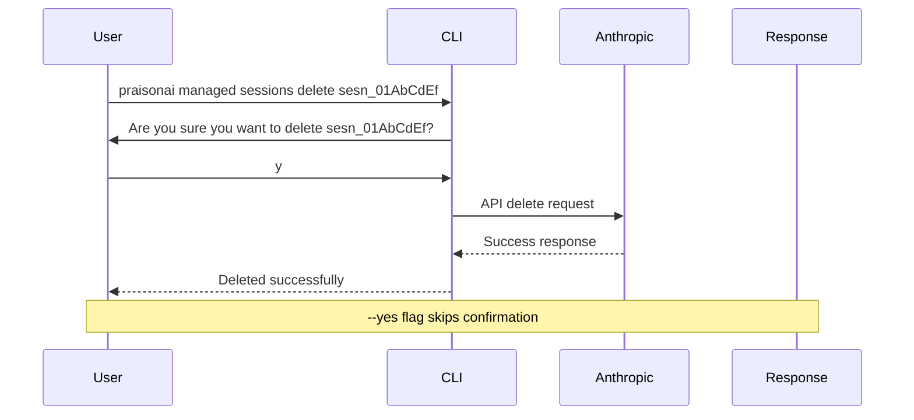

The `praisonai managed` command group provides terminal-based management of Anthropic-hosted sessions, agents, and environments.



## Quick Start

<Steps>
<Step title="Set API Key">
Export your Anthropic API key:

```bash
export ANTHROPIC_API_KEY=sk-ant-...
```
</Step>

<Step title="List Sessions">
View sessions for an agent:

```bash
praisonai managed sessions list agent_01AbCdEf
```
</Step>

<Step title="Delete with Confirmation">
Clean up resources safely:

```bash
praisonai managed sessions delete sesn_01AbCdEf --yes
```
</Step>
</Steps>

---

## How It Works



---

## Commands

### Sessions

Manage Anthropic-hosted agent sessions:

| Command | Purpose | Example |
|---------|---------|---------|
| `sessions list <agent_id>` | List sessions for an agent | `praisonai managed sessions list agent_01AbCdEf` |
| `sessions get <session_id>` | Get session details and usage | `praisonai managed sessions get sesn_01AbCdEf` |
| `sessions resume <session_id> "<prompt>"` | Resume session with new prompt | `praisonai managed sessions resume sesn_01AbCdEf "Continue the task"` |
| `sessions delete <session_id>` | Delete a session (with confirmation) | `praisonai managed sessions delete sesn_01AbCdEf --yes` |

```bash
# List recent sessions
praisonai managed sessions list agent_01AbCdEf --limit 5

# Get detailed session info
praisonai managed sessions get sesn_01AbCdEf

# Resume previous conversation
praisonai managed sessions resume sesn_01AbCdEf "What did we discuss?"

# Clean up old sessions
praisonai managed sessions delete sesn_01AbCdEf --yes
```

### Agents

Manage your Anthropic-hosted agents:

| Command | Purpose | Example |
|---------|---------|---------|
| `agents list` | List all your agents | `praisonai managed agents list` |
| `agents get <agent_id>` | Get agent configuration | `praisonai managed agents get agent_01AbCdEf` |
| `agents create` | Create new agent (via Python SDK) | See HostedAgent docs |
| `agents update <agent_id>` | Update agent name, system, or model | `praisonai managed agents update agent_01AbCdEf --name "New Name" --version 1` |
| `agents delete <agent_id>` | Delete an agent (with confirmation) | `praisonai managed agents delete agent_01AbCdEf --yes` |

```bash
# List your agents
praisonai managed agents list

# View agent details
praisonai managed agents get agent_01AbCdEf

# Update agent configuration  
praisonai managed agents update agent_01AbCdEf --system "You are a data analyst." --version 2

# Remove unused agent
praisonai managed agents delete agent_01AbCdEf --yes
```

### Environments

Manage sandbox environments for code execution:

| Command | Purpose | Example |
|---------|---------|---------|
| `envs list` | List your environments | `praisonai managed envs list` |
| `envs get <env_id>` | Get environment details | `praisonai managed envs get env_01AbCdEf` |
| `envs update <env_id>` | Update packages or networking | `praisonai managed envs update env_01AbCdEf --packages "pandas,numpy" --networking full` |
| `envs delete <env_id>` | Delete an environment (with confirmation) | `praisonai managed envs delete env_01AbCdEf --yes` |

```bash
# List environments
praisonai managed envs list

# Install packages
praisonai managed envs update env_01AbCdEf --packages "requests,beautifulsoup4"

# Change networking mode
praisonai managed envs update env_01AbCdEf --networking limited

# Clean up environment
praisonai managed envs delete env_01AbCdEf --yes
```

**Environment Update Options:**
- `--packages`: Comma-separated pip packages (whitespace is trimmed, empty entries filtered)
- `--networking`: Either `full` or `limited` (case-sensitive)

### IDs Helper

Save and restore Anthropic-assigned resource IDs locally:

| Command | Purpose | Example |
|---------|---------|---------|
| `ids save <agent_id> <env_id> <session_id>` | Save IDs to JSON file | `praisonai managed ids save agent_01... env_01... sesn_01... --version 1` |
| `ids restore "<prompt>"` | Restore IDs and run prompt | `praisonai managed ids restore "Continue previous task"` |
| `ids show` | Display saved IDs | `praisonai managed ids show` |

```bash
# Save current resource IDs
praisonai managed ids save agent_01AbCdEf env_01AbCdEf sesn_01AbCdEf --version 1

# View saved IDs
praisonai managed ids show

# Resume with saved state
praisonai managed ids restore "What was I working on?"
```

---

## Choosing a Subcommand

```mermaid
graph TB
    Start[Which resource?] --> Sessions{Sessions}
    Start --> Agents{Agents}
    Start --> Envs{Environments}
    Start --> IDs{ID Management}
    
    Sessions --> ListS[list - View agent sessions]
    Sessions --> GetS[get - Session details]
    Sessions --> ResS[resume - Continue conversation]
    Sessions --> DelS[delete - Remove session]
    
    Agents --> ListA[list - View your agents]
    Agents --> GetA[get - Agent details]
    Agents --> UpdA[update - Modify agent]
    Agents --> DelA[delete - Remove agent]
    
    Envs --> ListE[list - View environments]
    Envs --> GetE[get - Environment details]
    Envs --> UpdE[update - Install packages/change networking]
    Envs --> DelE[delete - Remove environment]
    
    IDs --> Save[save - Store IDs locally]
    IDs --> Show[show - View saved IDs]
    IDs --> Restore[restore - Resume with saved IDs]
    
    classDef resource fill:#6366F1,stroke:#7C90A0,color:#fff
    classDef action fill:#F59E0B,stroke:#7C90A0,color:#fff
    
    class Start,Sessions,Agents,Envs,IDs resource
    class ListS,GetS,ResS,DelS,ListA,GetA,UpdA,DelA,ListE,GetE,UpdE,DelE,Save,Show,Restore action
```



---

## Safety: Confirmation Prompts

<Warning>
All delete commands prompt for confirmation unless `--yes` is provided:

```bash
# Shows prompt: "Are you sure you want to delete sesn_01AbCdEf?"
praisonai managed sessions delete sesn_01AbCdEf

# Skips prompt
praisonai managed sessions delete sesn_01AbCdEf --yes
```

Typing anything non-affirmative prints `Deletion cancelled.` and exits with code 0.
</Warning>

---

## Authentication

The CLI requires the `anthropic` Python package and one of these environment variables:

```bash
# Primary (checked first)
export ANTHROPIC_API_KEY=sk-ant-api-...

# Fallback
export CLAUDE_API_KEY=sk-ant-api-...
```

**Installation:**
```bash
pip install 'anthropic>=0.94.0'
```

Without the package or API key, commands exit with code 1 and an error message.

---

## Common Patterns

### Cleanup Script
Remove old sessions and unused resources:

```bash
#!/bin/bash
# cleanup-resources.sh

AGENT_ID="agent_01AbCdEf"

# List and delete old sessions
echo "Cleaning sessions for $AGENT_ID..."
praisonai managed sessions list $AGENT_ID --limit 20 | tail -n +3 | while read id status title; do
  if [[ $status == "completed" ]]; then
    praisonai managed sessions delete $id --yes
    echo "Deleted session: $id"
  fi
done

# List and delete unused environments  
echo "Cleaning environments..."
praisonai managed envs list | tail -n +3 | while read id status name; do
  if [[ $status == "inactive" ]]; then
    praisonai managed envs delete $id --yes
    echo "Deleted environment: $id"
  fi
done
```

### Environment Setup
Install packages and configure networking:

```bash
# Update development environment
ENV_ID="env_01AbCdEf"
praisonai managed envs update $ENV_ID \
  --packages "pandas,numpy,matplotlib,jupyter" \
  --networking full

# Verify installation
praisonai managed envs get $ENV_ID
```

### Session Backup
Save session state before major changes:

```bash
# Backup current session state
praisonai managed ids save agent_01AbCdEf env_01AbCdEf sesn_01AbCdEf \
  --version 1 --file backup-$(date +%Y%m%d).json

# Show what was backed up
praisonai managed ids show --file backup-$(date +%Y%m%d).json
```

---

## Best Practices

<AccordionGroup>
<Accordion title="Resource Management">
- Use `--yes` in scripts to avoid interactive prompts
- Regularly clean up completed sessions to manage costs
- Save important session IDs before deleting resources
- Monitor environment status before making updates
</Accordion>

<Accordion title="Error Handling">
- Check exit codes in scripts (0 = success, 1 = error)
- Handle API timeouts with retry logic
- Verify API key is set before running commands
- Use `--limit` to prevent large resource listings
</Accordion>

<Accordion title="Environment Updates">
- Test package installations in development environments first
- Use `--networking limited` for security-sensitive workloads
- Keep package lists minimal to reduce startup time
- Update packages gradually to identify compatibility issues
</Accordion>

<Accordion title="Session Continuity">
- Use `sessions resume` instead of creating new sessions
- Save session IDs for important conversations
- Monitor session usage with `sessions get` 
- Implement session rotation for long-running applications
</Accordion>
</AccordionGroup>

---

## Related

<CardGroup cols={2}>
<Card title="Hosted Agent" icon="cloud" href="/docs/features/hosted-agent">
  Python SDK for Anthropic-hosted agents
</Card>
<Card title="HostedAgent + DB persistence" icon="cloud-database" href="/docs/features/managed-agent-persistence">
  Library-level persistence with database backends
</Card>
<Card title="Sessions" icon="clock" href="/docs/features/sessions">
  Advanced session management concepts
</Card>
</CardGroup>