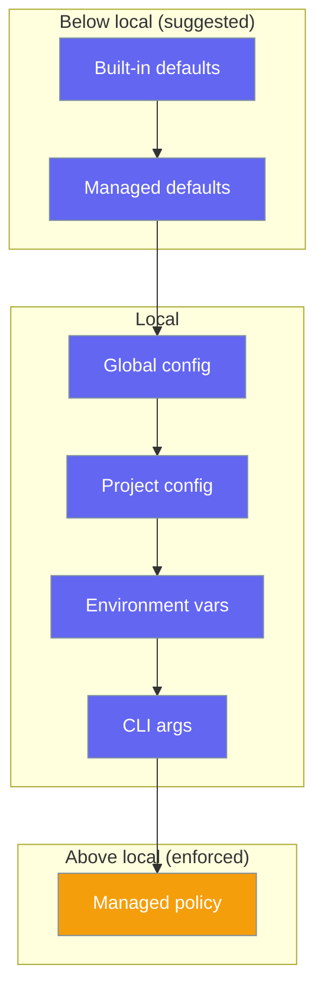
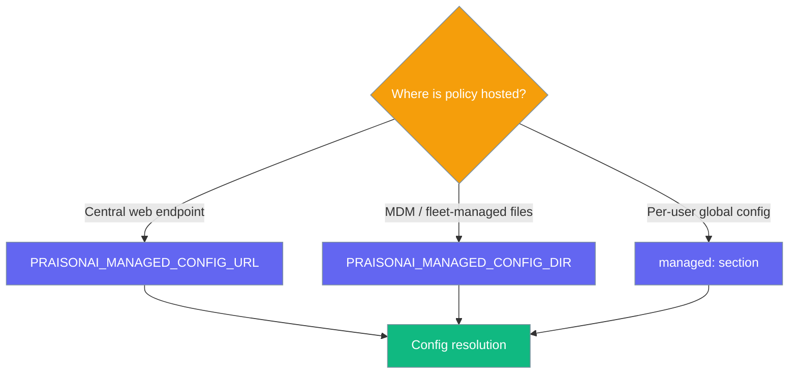

Distribute defaults and enforce policy — permission rules, model allow-lists, base URLs — across every developer's PraisonAI install from one central source.

<Note>
This is a **config resolution layer** for org-wide defaults and policy. It is unrelated to [ManagedAgent](/docs/features/managed-typed-configs), which is a hosted-agent runtime feature. This page is about *how config values are resolved*, not about running hosted agents.
</Note>



Managed **defaults** sit *below* your local config so teams suggest without clobbering. Managed **policy** (`permissions`, `model_allowlist`) sits *above* local config so an org can enforce, not just suggest.

## Quick Start

<Steps>
<Step title="Point at a remote policy URL">
Set one environment variable and run normally. The managed config is fetched (fail-soft, cached) and layered into resolution.

```bash
export PRAISONAI_MANAGED_CONFIG_URL=https://policy.acme.corp/praisonai.yaml
praisonai run "Summarise the repo"
```
</Step>

<Step title="Or use a managed directory">
For MDM/config-managed fleets, point at an on-disk directory containing `config.yaml` (or `.yml` / `.json`).

```bash
export PRAISONAI_MANAGED_CONFIG_DIR=/etc/praisonai/managed
praisonai run "Summarise the repo"
```
</Step>

<Step title="Or declare it in global config">
As a last-resort source, add a `managed:` section to `~/.praisonai/config.yaml`. Environment variables override this section.

```yaml ~/.praisonai/config.yaml
managed:
  url: https://policy.acme.corp/praisonai.yaml
  timeout: 3.0
```
</Step>
</Steps>

---

## Precedence Ladder

Resolution walks these layers in order; later layers win, except that managed policy is enforced above everything local.

| # | Layer | Position |
|---|-------|----------|
| 1 | Built-in defaults | lowest |
| 2 | **Managed non-policy defaults** | below local (suggested) |
| 3 | Global user config | local |
| 4 | Project config (walk-up) | local |
| 5 | Environment variables | local |
| 6 | CLI args | local |
| 7 | **Managed policy** (`permissions`, `model_allowlist`) | above local (enforced) |

The managed layer is fully opt-in: with no URL, directory, or `managed:` section configured, resolution behaves exactly as before.

---

## Policy Enforcement

Policy keys **replace** (they do not merge with) any local counterpart, so an org policy cannot be silently overridden.

Suppose a developer's project config sets a model, but the managed policy restricts the allow-list:

```yaml
# Local project config
model: gpt-4o

# Managed policy (from PRAISONAI_MANAGED_CONFIG_URL)
model_allowlist:
  - "claude-*"
  - "gpt-4o-mini"
enforce: true
```

The resolved `model_allowlist` is the policy's list — the local setting cannot widen it. Provenance marks the enforced key so it's obvious the org policy won.

<Note>
Enforcement is **replace, not merge**: a local override of an enforced key is ignored, including nested local sub-keys the managed policy does not itself mention.
</Note>

---

## Fail-Soft Behaviour

The managed layer never blocks a run on the network.

- **Short timeout** — the URL fetch uses a `3.0`-second default (override with `PRAISONAI_MANAGED_CONFIG_TIMEOUT`).
- **On-disk cache** — the last good copy is cached under `~/.praisonai/state/` (honours `PRAISONAI_HOME`). On any fetch failure the cached copy is used; if there's none, the layer is skipped and resolution is local-only.
- **SSRF guard** — only `https` (or explicit loopback `http`) URLs resolving to a public host are fetched; anything else is ignored fail-soft.

---

## `enforce: false`

Setting `enforce: false` in the managed config demotes the **whole** managed source to advisory — every key, including policy keys, becomes an overridable default below local config.

```yaml
# Advisory managed config: teams may override any of this locally
enforce: false
model: gpt-4o-mini
permissions:
  bash: ask
```

Use this for a gentle rollout: distribute suggested defaults first, then flip `enforce: true` once teams are ready for hard policy.

---

## Provenance

`resolve_with_provenance` labels where each resolved value came from. Enforced policy keys carry `enforced: true`.

```python
from praisonai_code.cli.configuration.resolver import ConfigResolver

resolver = ConfigResolver()
provenance = resolver.resolve_with_provenance()

print(provenance["model_allowlist"])
# {
#   "value": ["claude-*", "gpt-4o-mini"],
#   "layer": "managed-policy:https://policy.acme.corp/praisonai.yaml",
#   "source": "https://policy.acme.corp/praisonai.yaml",
#   "enforced": True,
# }
```

---

## Environment Variables

| Variable | Purpose | Default |
|----------|---------|---------|
| `PRAISONAI_MANAGED_CONFIG_URL` | Remote policy URL (https, fail-soft, cached) | unset |
| `PRAISONAI_MANAGED_CONFIG_DIR` | On-disk managed/enterprise directory | unset |
| `PRAISONAI_MANAGED_CONFIG_TIMEOUT` | Fetch timeout in seconds | `3.0` |

Environment variables override the `managed:` section in global config. When both a directory and a URL are configured, the URL is layered on top of the directory.

---

## Choose the Right Source



---

## Best Practices

<AccordionGroup>
<Accordion title="Set both a URL and a directory for resilience">
The managed directory loads first and the URL layers on top. Pair an MDM-distributed directory with a remote URL so fleets stay covered even when one source is unavailable.
</Accordion>

<Accordion title="Use enforce: false during rollout">
Ship suggested defaults advisory-first, confirm they work across teams, then flip `enforce: true` to make policy binding.
</Accordion>

<Accordion title="Scope permissions narrowly">
Because policy keys replace local counterparts, keep `permissions` and `model_allowlist` as tight as the org actually needs — an over-broad allow-list is harder to tighten later.
</Accordion>

<Accordion title="Rely on the cache for offline installs">
The last-good copy under `~/.praisonai/state/` keeps policy in effect offline. Fetch failures never block a run.
</Accordion>
</AccordionGroup>

---

## Related

<CardGroup cols={2}>
<Card title="Permission Modes" icon="lock" href="/docs/features/permission-modes">
The approval modes managed policy can enforce across a fleet.
</Card>
<Card title="Hierarchical Config" icon="layer-group" href="/docs/features/hierarchical-config">
How global, project, env, and CLI config layers combine.
</Card>
</CardGroup>
