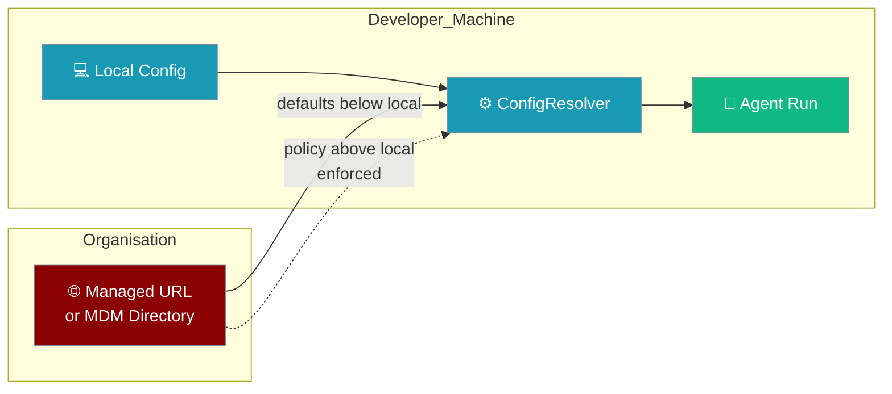
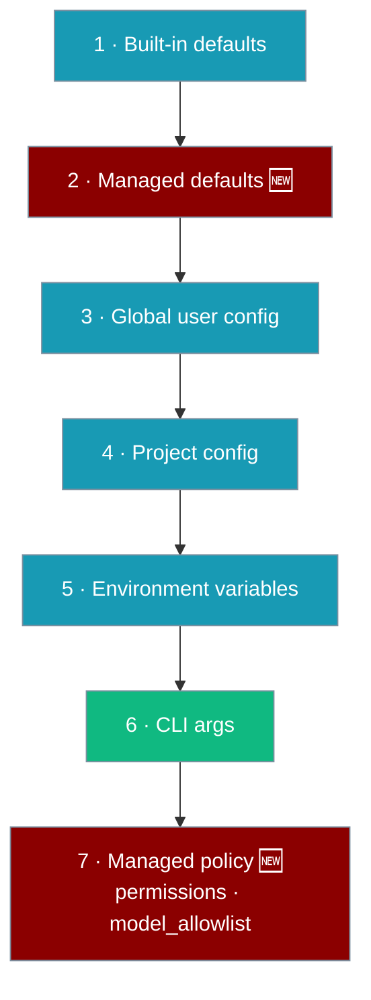

Managed config hands every `praisonai` CLI a shared baseline: suggested defaults teams can override, plus enforced policy (permissions, allowed models) they cannot.

<Note>
This page is about **CLI configuration distribution**. It is unrelated to the [Managed CLI](/docs/features/managed-cli) and other `ManagedAgent` runtime pages, which document Anthropic-hosted agents.
</Note>



The feature is fully opt-in. With no managed source configured, resolution behaves exactly as before.

## Quick Start

<Steps>
<Step title="Drop one file on the machine">
Place `config.yaml` in `/etc/praisonai/managed/` (MDM or config-management does this for you), then point the CLI at it.

```yaml
model_allowlist:
  - gpt-4o
```

```bash
export PRAISONAI_MANAGED_CONFIG_DIR="/etc/praisonai/managed"
```

Every `praisonai` run on that machine now allows only `gpt-4o`.
</Step>

<Step title="Or fetch from a URL">
```bash
export PRAISONAI_MANAGED_CONFIG_URL="https://config.myorg.com/praisonai.yaml"
```

Fetched once, cached under `~/.praison/state/`, refreshed on the next run — and never blocks a run if the network is down.
</Step>
</Steps>

---

## Agent-perspective example

Org policy shapes what any `Agent(...)` run can do — no code change needed on the developer's side.

```python
from praisonaiagents import Agent

# Org policy at /etc/praisonai/managed/config.yaml says:
#   model_allowlist: [gpt-4o]
#   permissions.bash.auto: false

agent = Agent(name="Analyst", instructions="Analyse the sales data.")
agent.start("Summarise Q3 revenue")
# ✓ uses gpt-4o (the only allowed model)
# ✓ bash tools require confirmation (org policy overrides any local `auto: true`)
```

---

## How precedence works

Managed **defaults** sit below local config, so teams *suggest*. Managed **policy** sits above local config, so an org *enforces*.



A layer lower in the list wins over the ones above it. The two managed layers (2 and 7) are the new bits: defaults slot in below your local config, policy slots in above it.

<Note>
A managed non-policy default (like `agent.model`) is a *suggestion*: a deliberate local choice always wins. A managed policy key (`permissions`, `model_allowlist`) is *enforced*: a local override is ignored.
</Note>

---

## Configure a source

Three equivalent ways to point the CLI at a managed source. Environment variables override the global config's `managed:` section.

<Tabs>
<Tab title="Environment variables">
Per machine, typically pushed by MDM.

```bash
export PRAISONAI_MANAGED_CONFIG_URL="https://config.myorg.com/praisonai.yaml"
export PRAISONAI_MANAGED_CONFIG_DIR="/etc/praisonai/managed"
export PRAISONAI_MANAGED_CONFIG_TIMEOUT=3
```
</Tab>

<Tab title="Global user config">
In `~/.praisonai/config.yaml`.

```yaml
managed:
  url: https://config.myorg.com/praisonai.yaml
  dir: /etc/praisonai/managed
  timeout: 3        # seconds, default 3
  enforce: true     # default true; false makes the whole layer advisory
```
</Tab>

<Tab title="Managed directory">
MDM drops one of `config.yaml`, `config.yml`, or `config.json` on disk.

```
/etc/praisonai/managed/config.yaml
```

```yaml
model_allowlist:
  - gpt-4o
```
</Tab>
</Tabs>

### Options

| Option | Type | Default | Description |
|--------|------|---------|-------------|
| `managed.url` | `string` | — | Remote URL to fetch config from (cached, fail-soft) |
| `managed.dir` | `string` | — | Managed directory holding `config.yaml`/`.yml`/`.json` |
| `managed.timeout` | `number` | `3` | Fetch timeout in seconds |
| `managed.enforce` | `boolean` | `true` | When `false`, the whole managed source is advisory |

---

## What a managed config looks like

```yaml
# Non-policy defaults — below local config, overridable by any local layer
agent:
  model: org-default-model
  provider: org-provider

# Enforced policy — above local config, replaces local wholesale
permissions:
  bash:
    auto: false          # local `auto: true` is IGNORED
model_allowlist:
  - gpt-4o
  - claude-sonnet-4-6    # local additions are IGNORED

# Opt out of enforcement — makes the whole managed source advisory
# enforce: false
```

---

## What can be enforced

| Key | Behaviour |
|-----|-----------|
| `permissions` | Enforced — replaces local `permissions` **wholesale** (no nested key leaks through) |
| `model_allowlist` | Enforced — replaces the local list (no concatenation) |
| everything else | Advisory default — sits below local config, overridable |

<Warning>
Enforcement is a **wholesale replace**, not a merge. A managed `permissions.bash.auto: false` completely replaces any local `permissions.default: allow` or `permissions.rules: [...]` — none of the local sub-keys survive. This is easy to get wrong when reasoning about deep merges.
</Warning>

Set `enforce: false` in the managed source to make the whole layer advisory. Policy keys then drop to non-policy defaults below local config (they list-concatenate instead of replace).

---

## Offline & fail-soft

Network hiccups never block a `praisonai` run.

<AccordionGroup>
<Accordion title="Short, configurable timeout">
The URL fetch uses a 3-second timeout by default. Change it with `PRAISONAI_MANAGED_CONFIG_TIMEOUT` or `managed.timeout`.
</Accordion>

<Accordion title="Last-good cache">
On any fetch failure, the CLI falls back to the last successful copy cached at `~/.praison/state/managed-config-<sha256[:16]>.json`.
</Accordion>

<Accordion title="Cache miss = skip">
Offline with no cache means the managed layer is silently skipped and resolution proceeds without it — identical to having no managed source at all.
</Accordion>
</AccordionGroup>

---

## SSRF guard (security)

Only safe URLs are ever fetched.

- Only `https://` is fetched — or `http://` when it points at an explicit loopback dev server.
- The host must resolve to a public/global IP. Private, loopback (for https), link-local, and cloud-metadata hosts (e.g. `169.254.169.254`) are refused.
- `file://`, `gopher://`, and other non-http(s) schemes are refused.
- A rejected URL fails soft to the cache and is never fetched.

---

## Inspecting what won

`resolve_with_provenance()` reports, per key, which layer set it. Enforced keys are marked `enforced: True`.

```python
from praisonai_code.cli.configuration.resolver import ConfigResolver

prov = ConfigResolver(cwd=".").resolve_with_provenance()
print(prov["model_allowlist"])
# {"value": ["gpt-4o"],
#  "layer": "managed-policy:/etc/praisonai/managed/config.yaml",
#  "source": "/etc/praisonai/managed/config.yaml",
#  "enforced": True}
```

Managed-origin keys carry a `layer` of `managed:<source>` (defaults) or `managed-policy:<source>` (enforced policy).

---

## Best Practices

<AccordionGroup>
<Accordion title="Suggest defaults, enforce only what matters">
Put team preferences (`agent.model`, `agent.provider`) in the managed source as defaults so projects can still override them. Reserve `permissions` and `model_allowlist` for what the org must guarantee.
</Accordion>

<Accordion title="Prefer a managed directory for MDM">
A directory drop (`/etc/praisonai/managed/config.yaml`) needs no network and is the simplest path for config-management tools to push.
</Accordion>

<Accordion title="Serve URLs over HTTPS from a public host">
The SSRF guard only fetches `https://` URLs resolving to public IPs. Host the managed config on a public HTTPS endpoint so it is never silently refused.
</Accordion>

<Accordion title="Verify enforcement with provenance">
After a rollout, run `resolve_with_provenance()` and confirm the policy keys show `layer: managed-policy:...` and `enforced: True`.
</Accordion>
</AccordionGroup>

---

## Related

<CardGroup cols={2}>
  <Card title="Configuration" icon="sliders" href="/docs/configuration">
    Local config-resolution basics and the precedence ladder.
  </Card>
  <Card title="Security" icon="shield" href="/docs/security">
    Organisation security posture and hardening.
  </Card>
</CardGroup>
