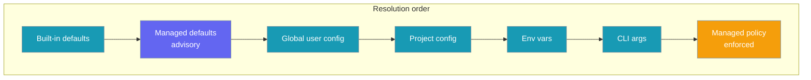
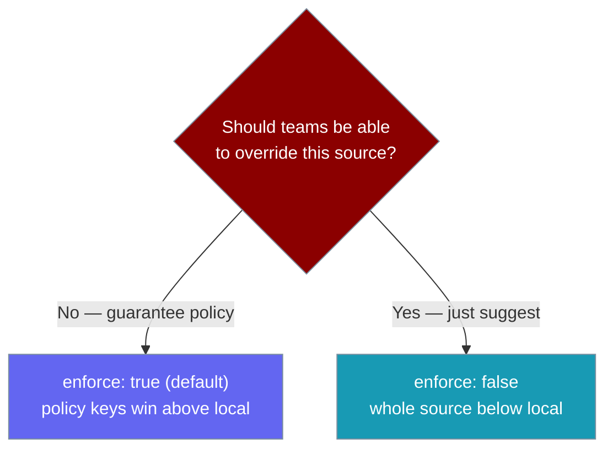
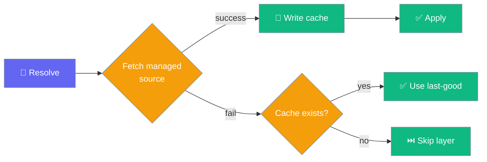

Point PraisonAI at a URL or directory your organisation controls to distribute team defaults and enforce policy from one source of truth.

<Note>
**Not the same as [Managed CLI](/docs/features/managed-cli).** That page covers CLI runtime management. This page is about **managed configuration** — org-distributed defaults and policy for the CLI config resolver.
</Note>

<Info>
Fully **opt-in**. With no managed source configured, resolution behaves exactly as before.
</Info>



## Quick Start

<Steps>
<Step title="Point at a managed source">
The shortest opt-in — one environment variable:

```bash
export PRAISONAI_MANAGED_CONFIG_URL="https://config.company.internal/praisonai.yaml"
```

PraisonAI now pulls team defaults from that URL. If it is unreachable, PraisonAI uses the last-good cached copy or skips the layer — it never blocks a run.
</Step>

<Step title="Or use a managed directory">
For MDM / config-management tooling, drop `config.yaml` in a directory and point the CLI at it:

```bash
export PRAISONAI_MANAGED_CONFIG_DIR=/etc/praisonai/managed
```

Every `praisonai` run on that machine reads from `/etc/praisonai/managed/config.yaml`. No network required.
</Step>
</Steps>

A managed config file looks like any other PraisonAI config, with optional policy keys:

```yaml
# team.yml
agent:
  temperature: 0.3        # a suggested default (below local)
model_allowlist:          # enforced policy (above local)
  - gpt-4o
  - gpt-4o-mini
enforce: true             # default; set false to make the whole source advisory
```

---

## Precedence Ladder

The managed layer splits into two: enforced **policy** sits above your local config, while managed **defaults** sit below it — so teams can *suggest* without clobbering deliberate local choices.

| Order (highest wins) | Layer |
|---|---|
| 7 | **Managed policy** (`permissions`, `model_allowlist`) — enforced above local |
| 6 | CLI args |
| 5 | Environment variables |
| 4 | Project config (walk-up) |
| 3 | Global user config |
| 2 | **Managed non-policy defaults** — below local so teams suggest, not clobber |
| 1 | Built-in defaults |

---

## Enforcement vs. Advisory



Only two keys are treated as **policy**: `permissions` and `model_allowlist`. When enforced they **replace** (not merge or concat) their local counterpart wholesale — a local override of an enforced key is ignored, including nested local sub-keys the policy does not mention. Set `enforce: false` to make the **entire** managed source advisory.

<Warning>
Enforcement is a **wholesale replace**, not a merge. A managed `permissions.bash.auto: false` completely replaces any local `permissions` — none of the local sub-keys survive. This is easy to get wrong when reasoning about deep merges.
</Warning>

---

## Agent-Perspective Example

Org policy shapes what any `Agent(...)` run can do — no code change needed on the developer's side.

```python
from praisonaiagents import Agent

# Org policy at /etc/praisonai/config.yaml says:
#   model_allowlist: [gpt-4o]
#   permissions.bash.auto: false

agent = Agent(name="Analyst", instructions="Analyse the sales data.")
agent.start("Summarise Q3 revenue")
# ✓ uses gpt-4o (the only allowed model)
# ✓ bash tools require confirmation (org policy overrides any local `auto: true`)
```

---

## How to Configure

Three ways to set a managed source. Environment variables override the global `managed:` block.

<Tabs>
<Tab title="Env vars">
| Env var | Purpose |
|---------|---------|
| `PRAISONAI_MANAGED_CONFIG_URL` | Remote URL to fetch config from |
| `PRAISONAI_MANAGED_CONFIG_DIR` | Managed/enterprise directory (MDM / config-management) |
| `PRAISONAI_MANAGED_CONFIG_TIMEOUT` | Short fetch timeout in seconds |

```bash
export PRAISONAI_MANAGED_CONFIG_URL="https://config.company.internal/praisonai.yaml"
export PRAISONAI_MANAGED_CONFIG_TIMEOUT=3
```
</Tab>

<Tab title="Global config block">
Declare a `managed:` section in `~/.praisonai/config.yaml`:

```yaml
# ~/.praisonai/config.yaml
managed:
  url: "https://config.company.internal/praisonai.yaml"
  dir: /etc/praisonai/managed
  timeout: 3
  enforce: true       # false → whole managed source is advisory
```

| Key | Type | Default | Description |
|-----|------|---------|-------------|
| `url` | `str` | `None` | Remote URL to fetch the managed config from |
| `dir` | `str` | `None` | Managed/enterprise directory holding `config.yaml` |
| `timeout` | `number` | `3.0` | Short fetch timeout in seconds |
| `enforce` | `bool` | `true` | `false` makes every managed key advisory (layer #2 only) |
</Tab>

<Tab title="Managed source content">
What the managed file itself looks like:

```yaml
# Served at PRAISONAI_MANAGED_CONFIG_URL or in the managed directory

# Non-policy defaults — below local config, overridable by any local layer
agent:
  model: org-default-model
  provider: org-provider

permissions:           # policy — enforced above local
  bash:
    auto: false
  allow_shell: false

model_allowlist:       # policy — enforced above local
  - "gpt-4o"
  - "gpt-4o-mini"
```

`permissions` and `model_allowlist` are **policy** keys. Everything else is an advisory default.
</Tab>
</Tabs>

---

## Fail-Soft Behaviour

The managed layer never blocks a run on network I/O.



- Short timeout via `PRAISONAI_MANAGED_CONFIG_TIMEOUT` (default 3 seconds).
- On-disk cache under `~/.praisonai/state/` (honours `PRAISONAI_HOME`).
- On failure: use the last-good cached copy, else skip the managed layer entirely.
- Only `https://` URLs resolving to public IPs are fetched — an SSRF guard blocks `http://` (except explicit loopback), private/link-local ranges, and cloud-metadata endpoints (e.g. `169.254.169.254`).

---

## Enforcement Semantics

Policy keys are **replaced**, not merged — a local override of an enforced key is ignored.

<AccordionGroup>
<Accordion title="Policy replaces, never merges">
Enforced keys (`permissions`, `model_allowlist`) swap out their local counterpart wholesale. A local `permissions.default: allow` or extra `rules` does not survive when the managed policy sets a different `permissions` block.

```yaml
# Managed policy
permissions:
  bash:
    auto: false
```

```yaml
# Local project .praisonai/config.yaml — ignored for enforced keys
permissions:
  default: allow
  rules:
    - allow-everything
```

Resolved result: `permissions == {"bash": {"auto": False}}` — the local `default` and `rules` are dropped.
</Accordion>

<Accordion title="enforce: false → everything advisory">
Set `enforce: false` on the managed source and the entire source becomes advisory: all keys go to layer #2 (below local), none to layer #7. A local `model_allowlist` then concatenates with the managed default instead of being replaced.
</Accordion>

<Accordion title="Advisory below, policy above">
Advisory defaults sit *below* local config so teams **suggest** starting points a developer can override. Policy sits *above* local config so admins **enforce** rules that must not be overridden.
</Accordion>
</AccordionGroup>

---

## Provenance

`resolve_with_provenance` labels every resolved key with the layer that set it, so you can see exactly where a value came from.

```python
from praisonai_code.cli.configuration.resolver import ConfigResolver

resolver = ConfigResolver(cwd=".")
provenance = resolver.resolve_with_provenance()

print(provenance["agent.provider"])
# {'value': 'org-provider', 'layer': 'managed:/etc/praisonai/managed/config.yaml',
#  'source': '/etc/praisonai/managed/config.yaml'}

print(provenance["model_allowlist"])
# {'value': ['gpt-4o'], 'layer': 'managed-policy:/etc/praisonai/managed/config.yaml',
#  'source': '/etc/praisonai/managed/config.yaml', 'enforced': True}

print(provenance["agent.temperature"])
# {'value': 0.3, 'layer': 'managed:https://example.com/team.yml',
#  'source': 'https://example.com/team.yml'}
```

| Label | Meaning |
|-------|---------|
| `managed:` | Value came from the advisory layer (below local) |
| `managed-policy:` | Value came from the enforced policy layer (above local) |
| `enforced: true` | Marks that a policy override took effect |

---

## Best Practices

<AccordionGroup>
<Accordion title="Suggest defaults, enforce only what matters">
Put team preferences (`agent.model`, `agent.provider`) in the managed source as advisory defaults so projects can still override them. Reserve `permissions` and `model_allowlist` for what the org must guarantee.
</Accordion>

<Accordion title="Prefer a managed directory for MDM">
A directory drop (`/etc/praisonai/managed/config.yaml`) needs no network and is the simplest path for config-management tools to push. It accepts `config.yaml`, `config.yml`, or `config.json`.
</Accordion>

<Accordion title="Serve URLs over HTTPS from a public host">
The SSRF guard only fetches `https://` URLs resolving to public IPs. Host the managed config on a public HTTPS endpoint so it is never silently refused.
</Accordion>

<Accordion title="Verify enforcement with provenance">
After a rollout, run `resolve_with_provenance()` and confirm the policy keys show `layer: managed-policy:...` and `enforced: True`.
</Accordion>
</AccordionGroup>

---

## Related

<CardGroup cols={2}>
<Card title="Configuration" icon="sliders" href="/docs/configuration">
Local config-resolution basics and the precedence ladder.
</Card>
<Card title="Security" icon="shield" href="/docs/security">
Organisation security posture and hardening.
</Card>
<Card title="Single Source Config" icon="file-code" href="/docs/features/single-source-config">
One project config file for model, tools, and RAG defaults.
</Card>
<Card title="Permissions" icon="shield-halved" href="/docs/features/permissions">
Pattern-based allow / deny / ask rules for tool calls.
</Card>
<Card title="Hierarchical Config" icon="layer-group" href="/docs/features/hierarchical-config">
How global, project, and env layers merge.
</Card>
<Card title="Declarative Permissions" icon="list-check" href="/docs/features/declarative-permissions">
Declare permission policy in project config.
</Card>
</CardGroup>
