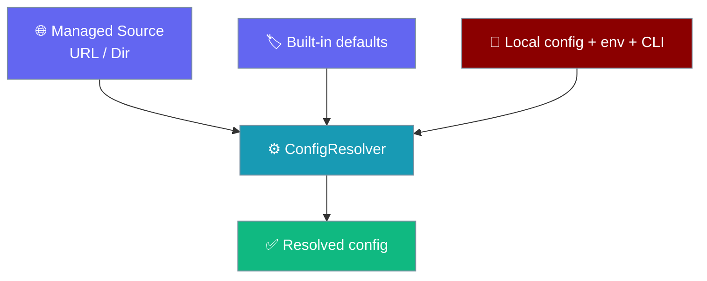
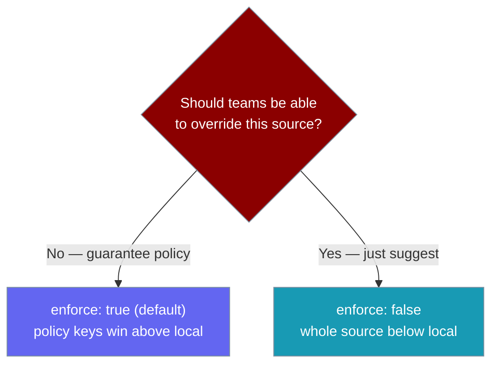

Managed configuration lets a team or organisation supply shared defaults and enforceable policy from a remote URL or an on-disk managed directory — without changing how a single user's config works.

<Note>
This page is about **CLI configuration distribution**. It is unrelated to `ManagedAgent` runtime pages, which document Anthropic-hosted agents.
</Note>

```bash
# Point the CLI at a team config and run as usual
export PRAISONAI_MANAGED_CONFIG_URL=https://example.com/team.yml
praisonai run "Summarise today's incidents"
```



<Note>
**Fully opt-in.** With no managed source configured, resolution behaves **byte-for-byte identical** to before — no managed layer is added.
</Note>

## Quick Start

<Steps>
<Step title="Point at a remote URL">

```bash
export PRAISONAI_MANAGED_CONFIG_URL=https://example.com/team.yml
```

The file is fetched with a short timeout and cached on disk. Offline runs use the last-good cache.

</Step>

<Step title="Or point at a managed directory">

For MDM / enterprise config management, drop a `config.yaml` (or `.yml` / `.json`) into a directory:

```bash
export PRAISONAI_MANAGED_CONFIG_DIR=/etc/praisonai
```

</Step>
</Steps>

A managed config file looks like any other PraisonAI config, with optional policy keys:

```yaml
# team.yml
agent:
  temperature: 0.3        # a suggested default (below local)
model_allowlist:          # enforced policy (above local)
  - gpt-4o
  - gpt-4o-mini
enforce: true             # default; set false to make the whole source advisory
```

---

## Precedence Ladder

The managed layer splits into two: enforced **policy** sits above your local config, while managed **defaults** sit below it — so teams can *suggest* without clobbering deliberate local choices.

| Order (highest wins) | Layer |
|---|---|
| 7 | **Managed policy** (`permissions`, `model_allowlist`) — enforced above local |
| 6 | CLI args |
| 5 | Environment variables |
| 4 | Project config (walk-up) |
| 3 | Global user config |
| 2 | **Managed non-policy defaults** — below local so teams suggest, not clobber |
| 1 | Built-in defaults |

---

## Enforcement vs. Advisory



Only two keys are treated as **policy**: `permissions` and `model_allowlist`. When enforced they **replace** (not merge or concat) their local counterpart wholesale — a local override of an enforced key is ignored, including nested local sub-keys the policy does not mention. Set `enforce: false` to make the **entire** managed source advisory.

<Warning>
Enforcement is a **wholesale replace**, not a merge. A managed `permissions.bash.auto: false` completely replaces any local `permissions` — none of the local sub-keys survive. This is easy to get wrong when reasoning about deep merges.
</Warning>

---

## Agent-Perspective Example

Org policy shapes what any `Agent(...)` run can do — no code change needed on the developer's side.

```python
from praisonaiagents import Agent

# Org policy at /etc/praisonai/config.yaml says:
#   model_allowlist: [gpt-4o]
#   permissions.bash.auto: false

agent = Agent(name="Analyst", instructions="Analyse the sales data.")
agent.start("Summarise Q3 revenue")
# ✓ uses gpt-4o (the only allowed model)
# ✓ bash tools require confirmation (org policy overrides any local `auto: true`)
```

---

## Configuration Keys

Set these under a `managed:` section in your **global** config, or via environment variables (env overrides the global section):

| Key | Type | Default | Description |
|-----|------|---------|-------------|
| `managed.url` | `str` | `None` | Remote URL to fetch (https, or loopback http) |
| `managed.dir` | `str` | `None` | Managed/enterprise directory (`config.yaml`/`.yml`/`.json`) |
| `managed.timeout` | `float` | `3.0` | Fetch timeout in seconds |
| `managed.enforce` | `bool` | `True` | `false` makes the whole source advisory |
| `model_allowlist` | `list[str]` | `None` | Allowed models (enforceable policy key) |
| `permissions` | `dict` | `{}` | Permission policy shape (enforceable policy key) |

**Environment variables** (override the global `managed:` section):

| Variable | Maps to |
|---|---|
| `PRAISONAI_MANAGED_CONFIG_URL` | `managed.url` |
| `PRAISONAI_MANAGED_CONFIG_DIR` | `managed.dir` |
| `PRAISONAI_MANAGED_CONFIG_TIMEOUT` | `managed.timeout` |

---

## Provenance

`ConfigResolver.resolve_with_provenance()` reports, per key, which layer set it. Enforced keys are marked `enforced: True`.

```python
from praisonai_code.cli.configuration.resolver import ConfigResolver

resolver = ConfigResolver()
provenance = resolver.resolve_with_provenance()

print(provenance["model_allowlist"])
# {'value': ['gpt-4o', 'gpt-4o-mini'],
#  'layer': 'managed-policy:https://example.com/team.yml',
#  'source': 'https://example.com/team.yml',
#  'enforced': True}

print(provenance["agent.temperature"])
# {'value': 0.3, 'layer': 'managed:https://example.com/team.yml',
#  'source': 'https://example.com/team.yml'}
```

Layers are labelled `managed:` for defaults and `managed-policy:` for enforced keys.

---

## Failure Modes

<Warning>
**Fail-soft by design.** The managed URL is fetched with a short timeout. On any failure the resolver uses the last-good cached copy under `~/.praison/state/`, or — if there is none — simply skips the managed layer. A run is **never** blocked on the network.
</Warning>

<AccordionGroup>
<Accordion title="Offline behaviour">
No network? The cached copy at `~/.praison/state/managed-config-<hash>.json` is used. With no cache, resolution proceeds as local-only.
</Accordion>

<Accordion title="SSRF guard (security)">
Only `https` (or explicit loopback `http`) URLs resolving to a public host are fetched. Private, loopback, link-local, and cloud-metadata hosts (e.g. `169.254.169.254`) are refused. `file://` and other non-http(s) schemes are refused. A rejected URL fails soft to the cache and is never fetched.
</Accordion>

<Accordion title="Directory + URL together">
If both `dir` and `url` are set, the managed directory loads first and the remote URL layers on top of it.
</Accordion>
</AccordionGroup>

---

## Best Practices

<AccordionGroup>
<Accordion title="Suggest defaults, enforce only what matters">
Put team preferences (`agent.model`, `agent.provider`) in the managed source as defaults so projects can still override them. Reserve `permissions` and `model_allowlist` for what the org must guarantee.
</Accordion>

<Accordion title="Prefer a managed directory for MDM">
A directory drop (`/etc/praisonai/config.yaml`) needs no network and is the simplest path for config-management tools to push.
</Accordion>

<Accordion title="Serve URLs over HTTPS from a public host">
The SSRF guard only fetches `https://` URLs resolving to public IPs. Host the managed config on a public HTTPS endpoint so it is never silently refused.
</Accordion>

<Accordion title="Verify enforcement with provenance">
After a rollout, run `resolve_with_provenance()` and confirm the policy keys show `layer: managed-policy:...` and `enforced: True`.
</Accordion>
</AccordionGroup>

---

## Related

<CardGroup cols={2}>
  <Card title="Hierarchical Config" icon="layer-group" href="/docs/features/hierarchical-config">
    Project-aware config walk-up and deep merge
  </Card>
  <Card title="Permissions" icon="lock" href="/docs/features/permissions">
    The permission policy shape enforced by managed config
  </Card>
  <Card title="Config CLI" icon="sliders" href="/docs/cli/config">
    Inspect and edit resolved config
  </Card>
  <Card title="Policy CLI" icon="scale-balanced" href="/docs/cli/policy">
    Team policy controls
  </Card>
</CardGroup>
