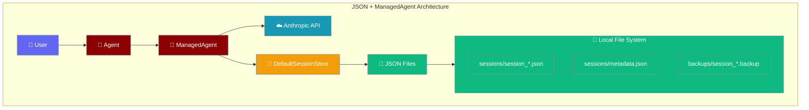

JSON file persistence provides the simplest setup for ManagedAgent with zero external dependencies, using built-in DefaultSessionStore for local development and testing.



## Quick Start

<Steps>
<Step title="Install Dependencies">
```bash
pip install praisonai anthropic
# No additional dependencies needed - uses built-in JSON
```
</Step>

<Step title="Basic Example">
```python
from praisonai import Agent, ManagedAgent, ManagedConfig
import json
import os

# Create managed agent with JSON persistence
managed = ManagedAgent(
    config=ManagedConfig(
        name="JSON File Agent",
        model="claude-4o-mini",
        system="You are a note keeper with file-based memory.",
        tools=[{"type": "agent_toolset_20260401"}]
    ),
    # Uses DefaultSessionStore with JSON files
    session_store_type="json",
    session_store_path="./agent_sessions"
)

# Create agent
agent = Agent(name="note_keeper", backend=managed)

# First interaction
result = agent.start("Remember: My favorite book is '1984' by George Orwell")
print(f"Agent: {result}")

session_id = managed.session_id
print(f"Session ID: {session_id}")
```
</Step>

<Step title="Verify Files Created">
```python
# Check that JSON files were created
sessions_dir = "./agent_sessions"
session_file = os.path.join(sessions_dir, f"{session_id}.json")

if os.path.exists(session_file):
    with open(session_file, 'r') as f:
        session_data = json.load(f)
    
    print(f"✅ Session file created: {session_file}")
    print(f"📝 Messages stored: {len(session_data.get('messages', []))}")
    print(f"📊 File size: {os.path.getsize(session_file)} bytes")
else:
    print(f"❌ Session file not found: {session_file}")
```
</Step>

<Step title="Session Resume">
```python
# Destroy current instance
del managed, agent

# Create new instance and resume
managed2 = ManagedAgent(
    config=ManagedConfig(
        model="claude-4o-mini",
        system="You are a note keeper with file-based memory."
    ),
    session_store_type="json",
    session_store_path="./agent_sessions"
)

# Resume the session
managed2.resume_session(session_id)
agent2 = Agent(name="note_keeper", backend=managed2)

# Test memory
result = agent2.start("What's my favorite book?")
print(f"Agent: {result}")
# Should respond with "Your favorite book is '1984' by George Orwell"
```
</Step>
</Steps>

## Complete Example

```python
import json
import os
import shutil
from datetime import datetime
from pathlib import Path
from praisonai import Agent, ManagedAgent, ManagedConfig

class JSONManagedExample:
    def __init__(self, sessions_dir="managed_agent_sessions"):
        self.sessions_dir = Path(sessions_dir)
        self.sessions_dir.mkdir(exist_ok=True)
        self.managed = None
        self.agent = None
        
    def setup_agent(self):
        """Initialize ManagedAgent with JSON file persistence."""
        self.managed = ManagedAgent(
            config=ManagedConfig(
                name="JSON Notes Agent",
                model="claude-4o-mini", 
                system="You are a personal note keeper who remembers everything in organized files.",
                tools=[{"type": "agent_toolset_20260401"}]
            ),
            session_store_type="json",
            session_store_path=str(self.sessions_dir)
        )
        
        self.agent = Agent(
            name="note_keeper",
            backend=self.managed
        )
        
        print(f"✅ Agent created with JSON storage: {self.sessions_dir}")
        return self.managed.session_id
    
    def teach_personal_notes(self):
        """Teach the agent personal notes and facts."""
        notes = [
            "My daily schedule: Wake up 6 AM, work 9-5, gym 6-7 PM, dinner 7:30 PM",
            "Important contacts: Dr. Smith (555-0123), Lawyer Jane (555-0456), Mom (555-0789)",
            "Project deadlines: Website redesign (March 15), Tax filing (April 15), Vacation planning (May 1)",
            "Shopping list: Groceries (milk, bread, eggs), Office supplies (printer ink, notebooks)",
            "Health goals: 10k steps daily, 8 hours sleep, 3 workouts per week"
        ]
        
        print("\n📝 Teaching personal notes:")
        for i, note in enumerate(notes, 1):
            result = self.agent.start(f"Remember this note #{i}: {note}")
            print(f"  {i}. Note: {note[:50]}...")
            print(f"     Response: {result[:40]}...")
    
    def verify_json_files(self):
        """Verify JSON files were created and contain data."""
        print(f"\n🔍 Verifying JSON file storage:")
        
        session_id = self.managed.session_id
        session_file = self.sessions_dir / f"{session_id}.json"
        
        if not session_file.exists():
            print(f"❌ Session file not found: {session_file}")
            return False
            
        # Load and analyze session data
        with open(session_file, 'r') as f:
            session_data = json.load(f)
            
        messages = session_data.get('messages', [])
        metadata = session_data.get('metadata', {})
        
        print(f"📄 Session file: {session_file.name}")
        print(f"💬 Total messages: {len(messages)}")
        print(f"📊 File size: {session_file.stat().st_size} bytes")
        print(f"⏰ Created: {metadata.get('created_at', 'unknown')}")
        print(f"🔄 Last updated: {metadata.get('updated_at', 'unknown')}")
        
        # Show sample messages
        print(f"\n📝 Sample messages:")
        for i, msg in enumerate(messages[-3:], 1):  # Last 3 messages
            role = msg.get('role', 'unknown')
            content = msg.get('content', '')[:50]
            timestamp = msg.get('timestamp', 'no timestamp')
            print(f"  {i}. [{role}] {content}... ({timestamp})")
            
        # Check file structure
        expected_fields = ['messages', 'metadata', 'session_id']
        missing_fields = [field for field in expected_fields if field not in session_data]
        if missing_fields:
            print(f"⚠️ Missing fields: {missing_fields}")
        else:
            print("✅ All required fields present")
            
        return len(messages) > 0
    
    def list_all_sessions(self):
        """List all JSON session files."""
        print(f"\n📁 All session files in {self.sessions_dir}:")
        
        json_files = list(self.sessions_dir.glob("*.json"))
        
        if not json_files:
            print("  (No session files found)")
            return []
            
        session_info = []
        for json_file in sorted(json_files):
            try:
                with open(json_file, 'r') as f:
                    data = json.load(f)
                
                info = {
                    'file': json_file.name,
                    'session_id': data.get('session_id', 'unknown'),
                    'messages': len(data.get('messages', [])),
                    'size': json_file.stat().st_size,
                    'modified': datetime.fromtimestamp(json_file.stat().st_mtime)
                }
                
                session_info.append(info)
                print(f"  📄 {info['file']}: {info['messages']} msgs, {info['size']} bytes")
                
            except Exception as e:
                print(f"  ❌ Error reading {json_file.name}: {e}")
                
        return session_info
    
    def test_session_resume(self, session_id):
        """Test session resume from JSON files."""
        print(f"\n🔄 Testing session resume from JSON files:")
        
        # Destroy current instance
        del self.managed, self.agent
        
        # Create new instance
        managed2 = ManagedAgent(
            config=ManagedConfig(
                model="claude-4o-mini",
                system="You are a personal note keeper who remembers everything in organized files."
            ),
            session_store_type="json",
            session_store_path=str(self.sessions_dir)
        )
        
        # Resume session from JSON file
        managed2.resume_session(session_id)
        agent2 = Agent(name="note_keeper", backend=managed2)
        
        # Test memory recall
        recall_questions = [
            "What's my daily schedule?",
            "Who are my important contacts?",
            "What are my project deadlines?",
            "What's on my shopping list?",
            "What are my health goals?"
        ]
        
        print(f"❓ Testing note recall:")
        for i, question in enumerate(recall_questions, 1):
            result = agent2.start(question)
            print(f"  {i}. Q: {question}")
            print(f"     A: {result[:70]}...")
            
        return managed2, agent2
    
    def backup_sessions(self, backup_dir="session_backups"):
        """Create backup of all session JSON files."""
        backup_path = Path(backup_dir)
        backup_path.mkdir(exist_ok=True)
        
        timestamp = datetime.now().strftime("%Y%m%d_%H%M%S")
        backup_subdir = backup_path / f"backup_{timestamp}"
        backup_subdir.mkdir(exist_ok=True)
        
        json_files = list(self.sessions_dir.glob("*.json"))
        
        print(f"\n💾 Creating backup of {len(json_files)} session files:")
        
        for json_file in json_files:
            backup_file = backup_subdir / json_file.name
            shutil.copy2(json_file, backup_file)
            print(f"  ✅ Backed up: {json_file.name}")
            
        print(f"📁 Backup created: {backup_subdir}")
        return backup_subdir
    
    def search_sessions(self, search_term):
        """Search across all session JSON files for content."""
        print(f"\n🔍 Searching for '{search_term}' in all sessions:")
        
        json_files = list(self.sessions_dir.glob("*.json"))
        results = []
        
        for json_file in json_files:
            try:
                with open(json_file, 'r') as f:
                    data = json.load(f)
                    
                messages = data.get('messages', [])
                for msg in messages:
                    content = msg.get('content', '')
                    if search_term.lower() in content.lower():
                        results.append({
                            'file': json_file.name,
                            'session_id': data.get('session_id'),
                            'role': msg.get('role'),
                            'content': content[:100],
                            'timestamp': msg.get('timestamp')
                        })
                        
            except Exception as e:
                print(f"  ❌ Error searching {json_file.name}: {e}")
                
        if results:
            print(f"📋 Found {len(results)} matches:")
            for result in results:
                print(f"  📄 {result['file']}: [{result['role']}] {result['content']}...")
        else:
            print(f"  No matches found for '{search_term}'")
            
        return results
    
    def cleanup_old_sessions(self, days_old=7):
        """Clean up session files older than specified days."""
        from datetime import timedelta
        
        cutoff_date = datetime.now() - timedelta(days=days_old)
        json_files = list(self.sessions_dir.glob("*.json"))
        
        old_files = []
        for json_file in json_files:
            file_time = datetime.fromtimestamp(json_file.stat().st_mtime)
            if file_time < cutoff_date:
                old_files.append(json_file)
                
        if old_files:
            print(f"\n🗑️ Cleaning up {len(old_files)} files older than {days_old} days:")
            for old_file in old_files:
                old_file.unlink()
                print(f"  ✅ Deleted: {old_file.name}")
        else:
            print(f"\n✨ No files older than {days_old} days found")
            
        return len(old_files)
    
    def run_example(self):
        """Run complete JSON file + ManagedAgent example."""
        print("📄 Starting JSON File + ManagedAgent Persistence Example")
        print("=" * 65)
        
        try:
            # Phase 1: Setup and teach
            session_id = self.setup_agent()
            self.teach_personal_notes()
            
            # Phase 2: Verify file storage
            storage_ok = self.verify_json_files()
            assert storage_ok, "❌ JSON file storage verification failed"
            
            # Phase 3: List and analyze sessions
            session_info = self.list_all_sessions()
            
            # Phase 4: Test session resume
            managed2, agent2 = self.test_session_resume(session_id)
            
            # Phase 5: Demonstrate utilities
            backup_dir = self.backup_sessions()
            search_results = self.search_sessions("schedule")
            
            print(f"\n✅ JSON file example completed successfully!")
            print(f"📁 Sessions directory: {self.sessions_dir}")
            print(f"📄 Session files: {len(session_info)}")
            print(f"📊 Session ID: {session_id}")
            print(f"💾 Backup created: {backup_dir}")
            
            return managed2, agent2
            
        except Exception as e:
            print(f"❌ Example failed: {e}")
            raise

if __name__ == "__main__":
    example = JSONManagedExample()
    managed, agent = example.run_example()
```

## File Structure

```bash
agent_sessions/
├── session_abc123def456.json      # Main session file
├── session_xyz789uvw123.json      # Another session
├── metadata.json                  # Optional global metadata
└── .gitkeep                      # Keep directory in git

session_backups/
└── backup_20240412_143022/       # Timestamped backup
    ├── session_abc123def456.json
    └── session_xyz789uvw123.json
```

### Session File Format

```json
{
  "session_id": "session_abc123def456",
  "metadata": {
    "created_at": "2024-04-12T14:30:22.123456Z",
    "updated_at": "2024-04-12T14:35:45.789012Z",
    "agent_name": "note_keeper",
    "model": "claude-4o-mini",
    "version": "1.0"
  },
  "messages": [
    {
      "role": "user",
      "content": "Remember this note: My favorite book is 1984",
      "timestamp": "2024-04-12T14:30:22.123456Z",
      "message_id": "msg_001"
    },
    {
      "role": "assistant", 
      "content": "I'll remember that your favorite book is '1984' by George Orwell.",
      "timestamp": "2024-04-12T14:30:23.456789Z",
      "message_id": "msg_002"
    }
  ],
  "state": {
    "interaction_count": 5,
    "last_active": "2024-04-12T14:35:45.789012Z"
  }
}
```

## Configuration Options

```python
# Basic JSON configuration
managed = ManagedAgent(
    config=ManagedConfig(model="claude-4o-mini"),
    session_store_type="json",
    session_store_path="./sessions"           # Directory for JSON files
)

# Advanced JSON configuration
managed = ManagedAgent(
    config=ManagedConfig(model="claude-4o-mini"),
    session_store_type="json",
    session_store_path="./sessions",
    session_store_config={
        "auto_backup": True,                  # Auto-backup on changes
        "backup_interval": 10,                # Backup every 10 messages
        "max_file_size": 10485760,           # 10MB max file size
        "pretty_json": True,                  # Format JSON for readability
        "compression": False,                 # Enable gzip compression
        "file_permissions": 0o600             # Restrict file access
    }
)
```

## Utilities and Tools

### Session Manager
```python
class JSONSessionManager:
    def __init__(self, sessions_dir="./sessions"):
        self.sessions_dir = Path(sessions_dir)
        
    def list_sessions(self):
        """List all available sessions with metadata."""
        sessions = []
        for json_file in self.sessions_dir.glob("*.json"):
            try:
                with open(json_file, 'r') as f:
                    data = json.load(f)
                sessions.append({
                    'id': data.get('session_id'),
                    'file': json_file.name,
                    'created': data.get('metadata', {}).get('created_at'),
                    'messages': len(data.get('messages', [])),
                    'size': json_file.stat().st_size
                })
            except Exception as e:
                print(f"Error reading {json_file}: {e}")
        return sessions
    
    def export_session(self, session_id, format='txt'):
        """Export session to different formats."""
        session_file = self.sessions_dir / f"{session_id}.json"
        
        with open(session_file, 'r') as f:
            data = json.load(f)
            
        if format == 'txt':
            lines = []
            for msg in data.get('messages', []):
                role = msg.get('role', 'unknown')
                content = msg.get('content', '')
                timestamp = msg.get('timestamp', '')
                lines.append(f"[{timestamp}] {role}: {content}\n")
            return ''.join(lines)
            
        elif format == 'csv':
            import csv
            import io
            
            output = io.StringIO()
            writer = csv.writer(output)
            writer.writerow(['timestamp', 'role', 'content'])
            
            for msg in data.get('messages', []):
                writer.writerow([
                    msg.get('timestamp', ''),
                    msg.get('role', ''),
                    msg.get('content', '')
                ])
            return output.getvalue()
            
        return json.dumps(data, indent=2)

# Usage
manager = JSONSessionManager()
sessions = manager.list_sessions()
txt_export = manager.export_session("session_123", "txt")
```

### File Monitoring
```python
import time
from watchdog.observers import Observer
from watchdog.events import FileSystemEventHandler

class SessionFileHandler(FileSystemEventHandler):
    def on_modified(self, event):
        if event.is_directory or not event.src_path.endswith('.json'):
            return
            
        print(f"📝 Session file updated: {os.path.basename(event.src_path)}")
        
        # Optional: trigger backup or sync
        self.backup_file(event.src_path)
    
    def backup_file(self, file_path):
        """Create timestamped backup of modified file."""
        timestamp = datetime.now().strftime("%Y%m%d_%H%M%S")
        backup_name = f"{file_path}.{timestamp}.backup"
        shutil.copy2(file_path, backup_name)

# Monitor sessions directory
def monitor_sessions(sessions_dir):
    event_handler = SessionFileHandler()
    observer = Observer()
    observer.schedule(event_handler, sessions_dir, recursive=False)
    observer.start()
    
    try:
        while True:
            time.sleep(1)
    except KeyboardInterrupt:
        observer.stop()
    observer.join()
```

## Best Practices

<AccordionGroup>
<Accordion title="File Organization">
```python
# Organize sessions by date/category
def organize_sessions_by_date(sessions_dir):
    """Organize session files into date-based subdirectories."""
    sessions_path = Path(sessions_dir)
    
    for json_file in sessions_path.glob("*.json"):
        try:
            with open(json_file, 'r') as f:
                data = json.load(f)
            
            created_at = data.get('metadata', {}).get('created_at', '')
            if created_at:
                date_str = created_at[:10]  # YYYY-MM-DD
                date_dir = sessions_path / date_str
                date_dir.mkdir(exist_ok=True)
                
                new_path = date_dir / json_file.name
                json_file.rename(new_path)
                print(f"Moved {json_file.name} to {date_str}/")
                
        except Exception as e:
            print(f"Error organizing {json_file}: {e}")
```
</Accordion>

<Accordion title="Backup Strategy">
```python
def automated_backup_strategy(sessions_dir):
    """Implement automated backup with retention."""
    backup_dir = Path(f"{sessions_dir}_backups")
    backup_dir.mkdir(exist_ok=True)
    
    # Create daily backup
    today = datetime.now().strftime("%Y-%m-%d")
    daily_backup = backup_dir / today
    
    if not daily_backup.exists():
        daily_backup.mkdir(exist_ok=True)
        
        # Copy all session files
        for json_file in Path(sessions_dir).glob("*.json"):
            shutil.copy2(json_file, daily_backup / json_file.name)
        
        print(f"✅ Daily backup created: {daily_backup}")
    
    # Cleanup old backups (keep last 30 days)
    cutoff_date = datetime.now() - timedelta(days=30)
    for backup_subdir in backup_dir.iterdir():
        if backup_subdir.is_dir():
            try:
                backup_date = datetime.strptime(backup_subdir.name, "%Y-%m-%d")
                if backup_date < cutoff_date:
                    shutil.rmtree(backup_subdir)
                    print(f"🗑️ Removed old backup: {backup_subdir}")
            except ValueError:
                pass  # Skip non-date directories
```
</Accordion>

<Accordion title="Data Validation">
```python
def validate_session_file(file_path):
    """Validate JSON session file integrity."""
    try:
        with open(file_path, 'r') as f:
            data = json.load(f)
        
        # Check required fields
        required_fields = ['session_id', 'messages', 'metadata']
        missing_fields = [field for field in required_fields if field not in data]
        
        if missing_fields:
            return False, f"Missing fields: {missing_fields}"
        
        # Validate messages structure
        messages = data.get('messages', [])
        for i, msg in enumerate(messages):
            msg_required = ['role', 'content', 'timestamp']
            msg_missing = [field for field in msg_required if field not in msg]
            
            if msg_missing:
                return False, f"Message {i} missing fields: {msg_missing}"
        
        return True, "Valid session file"
        
    except json.JSONDecodeError as e:
        return False, f"Invalid JSON: {e}"
    except Exception as e:
        return False, f"Error: {e}"

# Usage
is_valid, message = validate_session_file("sessions/session_123.json")
print(f"Validation result: {message}")
```
</Accordion>
</AccordionGroup>