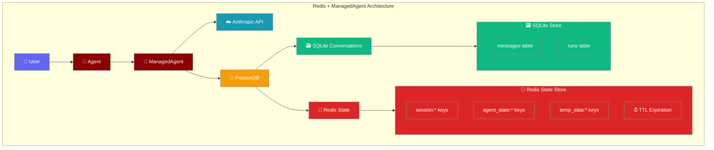

Redis provides high-speed state management for ManagedAgent, typically combined with SQLite for conversation storage, offering millisecond access times and built-in expiration.



## Prerequisites

<Steps>
<Step title="Install Dependencies">
```bash
pip install praisonai anthropic redis
```
</Step>

<Step title="Redis Setup">
```bash
# Option 1: Docker (Recommended)
docker run -d \
  --name praison-redis \
  -p 6379:6379 \
  redis:7-alpine redis-server --appendonly yes

# Option 2: Local installation (macOS)
brew install redis
redis-server

# Option 3: Ubuntu/Debian
sudo apt-get install redis-server
sudo systemctl start redis-server
```
</Step>

<Step title="Verify Redis Connection">
```bash
# Test Redis connectivity
redis-cli ping
# Should return: PONG
```
</Step>
</Steps>

## Complete Example

```python
import redis
import json
from datetime import datetime, timedelta
from praisonai import Agent, ManagedAgent, ManagedConfig
from praisonaiagents import db

class RedisManagedExample:
    def __init__(self, redis_url="redis://localhost:6379", sqlite_path="conversations.db"):
        self.redis_url = redis_url
        self.sqlite_path = sqlite_path
        self.managed = None
        self.agent = None
        self.redis_client = None
        
    def setup_redis_client(self):
        """Initialize Redis client for direct verification."""
        self.redis_client = redis.from_url(
            self.redis_url,
            decode_responses=True,
            socket_connect_timeout=5,
            socket_timeout=5
        )
        
        # Test connection
        self.redis_client.ping()
        print(f"✅ Redis connection established: {self.redis_url}")
        
    def setup_agent(self):
        """Initialize ManagedAgent with Redis state + SQLite conversations."""
        self.managed = ManagedAgent(
            config=ManagedConfig(
                name="Redis State Agent",
                model="claude-4o-mini",
                system="You are a session manager with fast state access and persistent conversations.",
                tools=[{"type": "agent_toolset_20260401"}]
            ),
            db=db(
                database_url=f"sqlite:///{self.sqlite_path}",  # Conversations
                state_url=self.redis_url                        # State management
            )
        )
        
        self.agent = Agent(
            name="session_manager", 
            backend=self.managed
        )
        
        print(f"✅ ManagedAgent with Redis state + SQLite conversations")
        return self.managed.session_id
    
    def teach_session_facts(self):
        """Teach agent facts with session state tracking."""
        session_facts = [
            "Current user session started at 2:30 PM with premium tier access",
            "User preferences: notifications enabled, dark mode, language=English",
            "Active features: real-time sync, collaborative editing, advanced analytics",
            "Session context: working on Q4 planning document with 3 collaborators"
        ]
        
        print("\n🔄 Teaching session state facts:")
        for i, fact in enumerate(session_facts, 1):
            result = self.agent.start(f"Remember this session state: {fact}")
            print(f"  {i}. Session fact: {fact[:50]}...")
            print(f"     Agent response: {result[:40]}...")
            
            # Store additional state in Redis directly
            state_key = f"session_state:{self.managed.session_id}:fact_{i}"
            self.redis_client.setex(
                state_key,
                timedelta(hours=24),  # 24-hour expiration
                json.dumps({
                    "fact": fact,
                    "timestamp": datetime.now().isoformat(),
                    "acknowledged": True
                })
            )
    
    def verify_redis_state(self):
        """Verify state persistence in Redis."""
        print(f"\n🔍 Verifying Redis state storage:")
        
        session_id = self.managed.session_id
        
        # Check session-specific keys
        session_keys = self.redis_client.keys(f"session_state:{session_id}:*")
        print(f"📊 Session state keys: {len(session_keys)}")
        
        for key in session_keys[:3]:  # Show first 3
            value = self.redis_client.get(key)
            data = json.loads(value)
            ttl = self.redis_client.ttl(key)
            print(f"  🔑 {key}: {data['fact'][:30]}... (TTL: {ttl}s)")
        
        # Check overall Redis stats
        info = self.redis_client.info()
        print(f"💾 Redis memory usage: {info['used_memory_human']}")
        print(f"🔗 Connected clients: {info['connected_clients']}")
        
        return len(session_keys) > 0
    
    def verify_sqlite_conversations(self):
        """Verify conversation persistence in SQLite."""
        import sqlite3
        
        print(f"\n🗃️ Verifying SQLite conversation storage:")
        
        conn = sqlite3.connect(self.sqlite_path)
        cursor = conn.cursor()
        
        # Check message persistence
        cursor.execute("SELECT COUNT(*) FROM messages")
        message_count = cursor.fetchone()[0]
        print(f"💬 Conversation messages: {message_count}")
        
        # Show recent conversations
        cursor.execute("""
            SELECT session_id, role, content, created_at
            FROM messages 
            WHERE session_id = ?
            ORDER BY created_at DESC 
            LIMIT 3
        """, (self.managed.session_id,))
        
        messages = cursor.fetchall()
        print(f"📝 Recent session messages:")
        for session_id, role, content, created_at in messages:
            print(f"  [{role}] {content[:40]}...")
            
        conn.close()
        return message_count > 0
    
    def test_fast_state_access(self):
        """Demonstrate fast state access via Redis."""
        print(f"\n⚡ Testing fast state access:")
        
        session_id = self.managed.session_id
        
        # Store temporary computation results
        computation_key = f"temp_computation:{session_id}"
        computation_data = {
            "result": "Q4 projections calculated",
            "confidence": 0.95,
            "computed_at": datetime.now().isoformat(),
            "expires_in": "15 minutes"
        }
        
        # Store with 15-minute expiration
        self.redis_client.setex(
            computation_key,
            timedelta(minutes=15),
            json.dumps(computation_data)
        )
        
        # Retrieve with millisecond timing
        import time
        start_time = time.time()
        retrieved = self.redis_client.get(computation_key)
        access_time = (time.time() - start_time) * 1000
        
        data = json.loads(retrieved)
        print(f"⚡ Fast access time: {access_time:.2f}ms")
        print(f"📊 Retrieved: {data['result']}")
        
        return access_time < 10  # Should be under 10ms
    
    def test_session_resume(self, session_id):
        """Test session resume with Redis state restoration."""
        print(f"\n🔄 Testing session resume with Redis state:")
        
        # Destroy current instance
        del self.managed, self.agent
        
        # Create new instance
        managed2 = ManagedAgent(
            config=ManagedConfig(
                model="claude-4o-mini",
                system="You are a session manager with fast state access and persistent conversations."
            ),
            db=db(
                database_url=f"sqlite:///{self.sqlite_path}",
                state_url=self.redis_url
            )
        )
        
        # Resume session
        managed2.resume_session(session_id)
        agent2 = Agent(name="session_manager", backend=managed2)
        
        # Test state and conversation recall
        test_questions = [
            "What are my current user preferences?",
            "What session context am I working in?", 
            "What active features do I have enabled?"
        ]
        
        print(f"❓ Testing state recall:")
        for i, question in enumerate(test_questions, 1):
            result = agent2.start(question)
            print(f"  {i}. Q: {question}")
            print(f"     A: {result[:60]}...")
        
        # Verify Redis state is still accessible
        state_keys = self.redis_client.keys(f"session_state:{session_id}:*")
        print(f"🔑 State keys still available: {len(state_keys)}")
        
        return managed2, agent2
    
    def demonstrate_redis_patterns(self):
        """Demonstrate common Redis patterns for agent state."""
        session_id = self.managed.session_id
        
        print(f"\n🔄 Demonstrating Redis patterns:")
        
        # Pattern 1: Atomic counters
        interaction_key = f"interactions:{session_id}"
        count = self.redis_client.incr(interaction_key)
        self.redis_client.expire(interaction_key, 86400)  # 24 hours
        print(f"📊 Interaction count: {count}")
        
        # Pattern 2: Session metadata with hash
        meta_key = f"session_meta:{session_id}"
        session_metadata = {
            "created": datetime.now().isoformat(),
            "user_tier": "premium",
            "features_enabled": "sync,collab,analytics",
            "last_active": datetime.now().isoformat()
        }
        self.redis_client.hset(meta_key, mapping=session_metadata)
        self.redis_client.expire(meta_key, 86400)
        
        # Retrieve metadata
        stored_meta = self.redis_client.hgetall(meta_key)
        print(f"📋 Session metadata: {stored_meta}")
        
        # Pattern 3: Leaderboard/scoring
        leaderboard_key = "user_engagement_scores"
        self.redis_client.zadd(leaderboard_key, {session_id: count * 10})
        
        # Get top sessions
        top_sessions = self.redis_client.zrevrange(leaderboard_key, 0, 4, withscores=True)
        print(f"🏆 Top engaged sessions: {top_sessions}")
        
        return True
    
    def cleanup(self):
        """Clean up Redis keys for the session."""
        if self.managed and self.redis_client:
            session_id = self.managed.session_id
            
            # Delete session-specific keys
            session_keys = self.redis_client.keys(f"*:{session_id}*")
            if session_keys:
                deleted = self.redis_client.delete(*session_keys)
                print(f"🗑️ Cleaned up {deleted} Redis keys")
    
    def run_example(self):
        """Run complete Redis + ManagedAgent example."""
        print("🔴 Starting Redis + ManagedAgent State Management Example")
        print("=" * 65)
        
        try:
            # Phase 1: Setup
            self.setup_redis_client()
            session_id = self.setup_agent()
            
            # Phase 2: Teach and store state
            self.teach_session_facts()
            
            # Phase 3: Verify dual storage
            redis_ok = self.verify_redis_state()
            sqlite_ok = self.verify_sqlite_conversations()
            assert redis_ok and sqlite_ok, "❌ Dual storage verification failed"
            
            # Phase 4: Test fast access
            fast_access_ok = self.test_fast_state_access()
            assert fast_access_ok, "❌ Fast access test failed"
            
            # Phase 5: Demonstrate Redis patterns
            patterns_ok = self.demonstrate_redis_patterns()
            
            # Phase 6: Test session resume
            managed2, agent2 = self.test_session_resume(session_id)
            
            print(f"\n✅ Redis example completed successfully!")
            print(f"🔴 Redis URL: {self.redis_url}")
            print(f"🗃️ SQLite DB: {self.sqlite_path}")
            print(f"📊 Session ID: {session_id}")
            
            return managed2, agent2
            
        except Exception as e:
            print(f"❌ Example failed: {e}")
            raise
        finally:
            # Optional: cleanup for demo
            # self.cleanup()
            pass

if __name__ == "__main__":
    example = RedisManagedExample()
    managed, agent = example.run_example()
```

## Redis Configuration Patterns

### Basic Configuration
```python
# Simple Redis state storage
managed = ManagedAgent(
    config=ManagedConfig(model="claude-4o-mini"),
    db=db(
        database_url="sqlite:///conversations.db",  # Persistent conversations
        state_url="redis://localhost:6379"          # Fast state access
    )
)
```

### Production Configuration
```python
# Production Redis with authentication and clustering
managed = ManagedAgent(
    config=ManagedConfig(model="claude-4o-mini"),
    db=db(
        database_url="postgresql://prod-host/agents",
        state_url="redis://:password@redis-cluster:6379/0?ssl=true"
    )
)
```

### Redis Sentinel (High Availability)
```python
import redis.sentinel

# Setup Redis Sentinel for HA
sentinels = [('sentinel1', 26379), ('sentinel2', 26379), ('sentinel3', 26379)]
sentinel = redis.sentinel.Sentinel(sentinels)

managed = ManagedAgent(
    config=ManagedConfig(model="claude-4o-mini"),
    db=db(
        database_url="postgresql://prod-host/agents",
        redis_sentinel=sentinel,
        redis_service_name="mymaster"
    )
)
```

## Performance Optimizations

### Connection Pooling
```python
import redis

# Create Redis connection pool
redis_pool = redis.ConnectionPool(
    host='localhost',
    port=6379,
    db=0,
    max_connections=20,
    socket_connect_timeout=5,
    socket_timeout=5
)

redis_client = redis.Redis(connection_pool=redis_pool)

# Use with ManagedAgent
managed = ManagedAgent(
    config=ManagedConfig(model="claude-4o-mini"),
    db=db(
        database_url="sqlite:///conversations.db",
        redis_client=redis_client  # Use existing client
    )
)
```

### Memory Optimization
```python
def optimize_redis_memory():
    """Redis configuration for memory optimization."""
    redis_config = {
        # Use memory-efficient encodings
        "hash-max-ziplist-entries": "512",
        "hash-max-ziplist-value": "64",
        "list-max-ziplist-size": "-2",
        "set-max-intset-entries": "512",
        "zset-max-ziplist-entries": "128",
        "zset-max-ziplist-value": "64",
        
        # Enable key expiration
        "maxmemory-policy": "allkeys-lru",
        "maxmemory": "256mb"
    }
    
    return redis_config
```

## Monitoring and Metrics

```python
def monitor_redis_performance(redis_client):
    """Monitor Redis performance metrics."""
    info = redis_client.info()
    
    metrics = {
        "memory_used": info.get("used_memory_human"),
        "memory_peak": info.get("used_memory_peak_human"),
        "connected_clients": info.get("connected_clients"),
        "total_commands": info.get("total_commands_processed"),
        "keyspace_hits": info.get("keyspace_hits", 0),
        "keyspace_misses": info.get("keyspace_misses", 0),
        "expired_keys": info.get("expired_keys", 0)
    }
    
    # Calculate hit rate
    hits = metrics["keyspace_hits"]
    misses = metrics["keyspace_misses"] 
    hit_rate = hits / (hits + misses) * 100 if (hits + misses) > 0 else 0
    metrics["hit_rate_percent"] = round(hit_rate, 2)
    
    print("🔴 Redis Performance Metrics:")
    for key, value in metrics.items():
        print(f"  {key}: {value}")
        
    return metrics

# Usage
redis_client = redis.from_url("redis://localhost:6379")
metrics = monitor_redis_performance(redis_client)
```

## State Management Patterns

### Session State with TTL
```python
def manage_session_state(redis_client, session_id):
    """Advanced session state management with Redis."""
    
    # User activity tracking with sliding window
    activity_key = f"activity:{session_id}"
    redis_client.zadd(activity_key, {datetime.now().timestamp(): "interaction"})
    redis_client.expire(activity_key, 3600)  # 1 hour window
    
    # Remove old activities (keep last hour only) 
    cutoff = datetime.now().timestamp() - 3600
    redis_client.zremrangebyscore(activity_key, 0, cutoff)
    
    # Get activity count
    activity_count = redis_client.zcard(activity_key)
    print(f"Recent activity events: {activity_count}")
    
    # Feature flags with JSON
    features_key = f"features:{session_id}"
    features = {
        "advanced_analytics": True,
        "real_time_sync": True,
        "collaborative_editing": False,
        "updated_at": datetime.now().isoformat()
    }
    redis_client.setex(features_key, 86400, json.dumps(features))
    
    # Retrieve and parse
    stored_features = json.loads(redis_client.get(features_key))
    return stored_features
```

### Distributed Locking
```python
import time
import uuid

def acquire_session_lock(redis_client, session_id, timeout=10):
    """Acquire distributed lock for session operations."""
    lock_key = f"lock:session:{session_id}"
    lock_value = str(uuid.uuid4())
    
    # Try to acquire lock with timeout
    if redis_client.set(lock_key, lock_value, nx=True, ex=timeout):
        return lock_value
    return None

def release_session_lock(redis_client, session_id, lock_value):
    """Release distributed lock safely."""
    lock_key = f"lock:session:{session_id}"
    
    # Lua script for atomic check-and-delete
    lua_script = """
    if redis.call("GET", KEYS[1]) == ARGV[1] then
        return redis.call("DEL", KEYS[1])
    else
        return 0
    end
    """
    
    return redis_client.eval(lua_script, 1, lock_key, lock_value)
```

## Troubleshooting

<AccordionGroup>
<Accordion title="Connection Issues">
```python
def diagnose_redis_connection(redis_url):
    """Diagnose Redis connection problems."""
    try:
        client = redis.from_url(redis_url, socket_connect_timeout=5)
        
        # Test basic connectivity
        response = client.ping()
        print(f"✅ Ping successful: {response}")
        
        # Test read/write
        test_key = "connection_test"
        client.set(test_key, "test_value", ex=60)
        value = client.get(test_key)
        print(f"✅ Read/write test: {value}")
        client.delete(test_key)
        
        # Check Redis info
        info = client.info("server")
        print(f"✅ Redis version: {info.get('redis_version')}")
        
    except redis.ConnectionError as e:
        print(f"❌ Connection failed: {e}")
    except redis.TimeoutError as e:
        print(f"❌ Connection timeout: {e}")
    except Exception as e:
        print(f"❌ Unexpected error: {e}")
```
</Accordion>

<Accordion title="Memory Management">
```python
def manage_redis_memory(redis_client):
    """Monitor and manage Redis memory usage."""
    info = redis_client.info("memory")
    
    used_memory = info.get("used_memory")
    max_memory = info.get("maxmemory", 0)
    
    if max_memory > 0:
        usage_percent = (used_memory / max_memory) * 100
        print(f"Memory usage: {usage_percent:.1f}%")
        
        if usage_percent > 80:
            print("⚠️ High memory usage, cleaning up expired keys")
            # Force cleanup of expired keys
            redis_client.eval("return redis.call('scan', 0, 'count', 1000)", 0)
    
    # Show largest keys
    largest_keys = redis_client.execute_command("MEMORY", "USAGE", "sample", "5")
    print(f"Sample key memory usage: {largest_keys}")
```
</Accordion>

<Accordion title="Performance Tuning">
```python
def tune_redis_performance(redis_client):
    """Apply performance tuning configurations."""
    
    # Check slow log
    slow_queries = redis_client.slowlog_get(10)
    if slow_queries:
        print("⚠️ Slow queries detected:")
        for query in slow_queries:
            print(f"  {query['command']} took {query['duration']}μs")
    
    # Optimize based on usage patterns
    config_updates = {
        "tcp-keepalive": "60",           # Keep connections alive
        "timeout": "300",                # Client timeout
        "tcp-backlog": "511",            # Connection backlog
        "databases": "1"                 # Reduce if using single DB
    }
    
    for key, value in config_updates.items():
        try:
            redis_client.config_set(key, value)
            print(f"✅ Updated {key} = {value}")
        except Exception as e:
            print(f"❌ Failed to update {key}: {e}")
```
</Accordion>
</AccordionGroup>